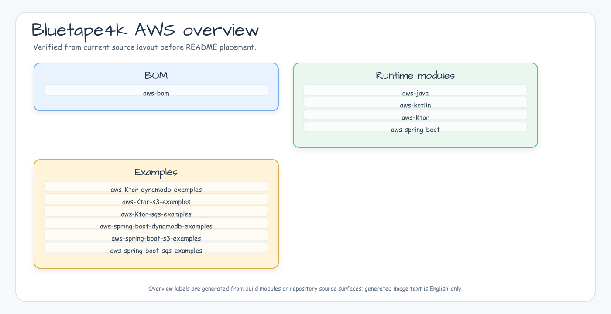
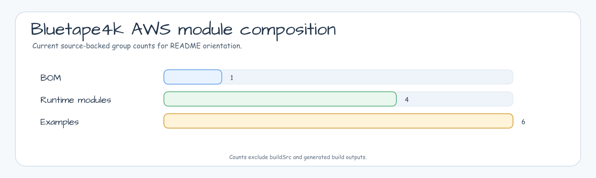
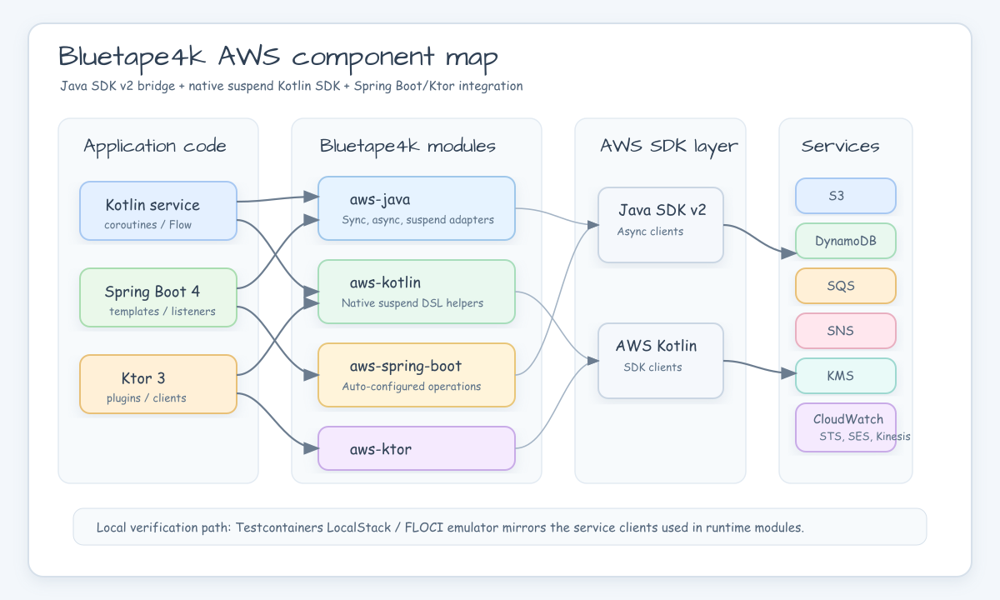
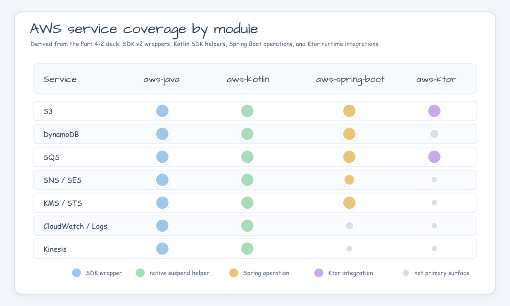
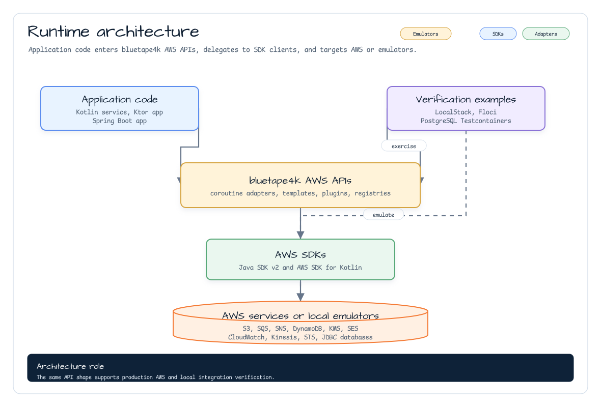
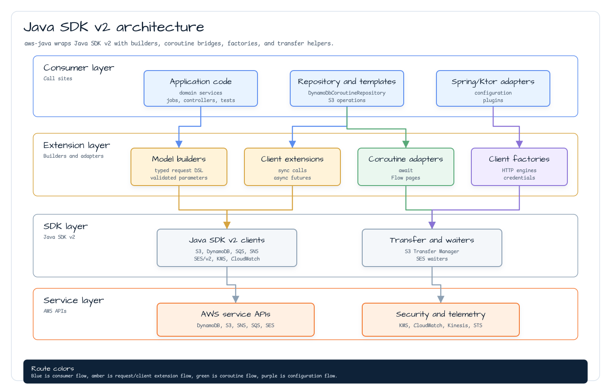
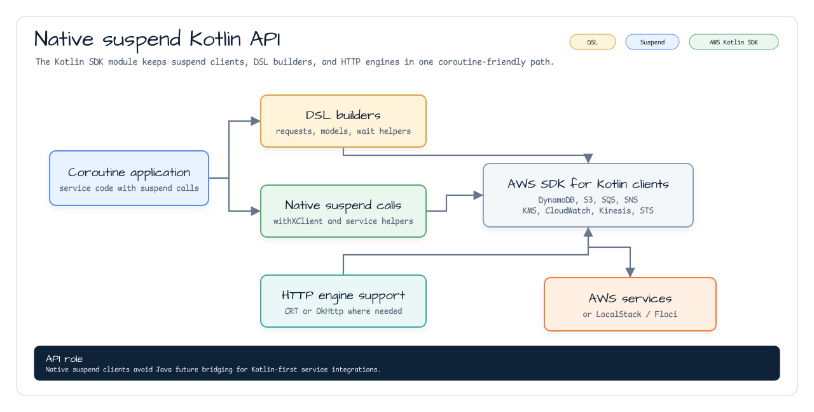
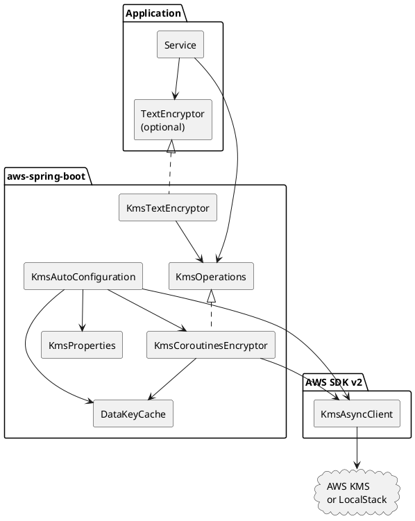
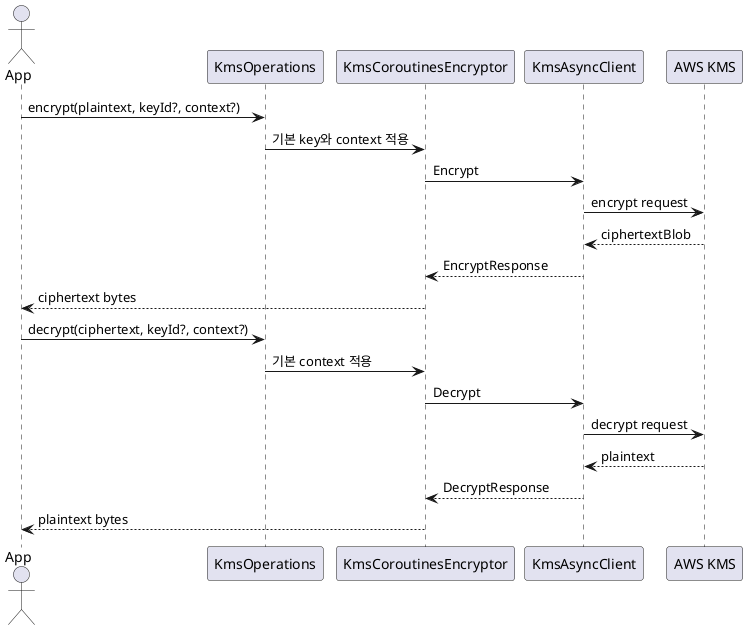

# bluetape4k-aws

[](https://github.com/bluetape4k/bluetape4k-aws/actions/workflows/ci.yml)
[](https://kotlinlang.org)
[](https://openjdk.org)
[](LICENSE)

[English](./README.md) | 한국어


**AWS Java SDK v2** 및 **AWS Kotlin SDK** 를 위한 Kotlin/JVM 래퍼 라이브러리입니다.
Kotlin Coroutines 지원, Spring Boot 4 자동설정, Ktor 3 통합을 제공합니다.
[bluetape4k](https://github.com/bluetape4k) 에코시스템의 일부입니다.

---

## 프로젝트 목적

`bluetape4k-aws`는 Kotlin 서비스에서 AWS SDK를 더 자연스럽게 사용하도록 돕습니다.
Java SDK v2의 async 모델, AWS Kotlin SDK의 suspend 모델, Spring Boot 4 자동 설정,
Ktor 3 HTTP 통합을 하나의 선택지로 강제하지 않고 함께 제공합니다.

## 제공 기능

- **Kotlin-first AWS 클라이언트** — Java SDK v2 coroutine adapter와 AWS Kotlin SDK DSL/헬퍼
- **서비스 범위** — DynamoDB, S3, SES/SESv2, SNS, SQS, KMS, CloudWatch, CloudWatch Logs, Kinesis, STS
- **Spring Boot 4 operations** — awspring 없이 coroutine 중심 template, repository, listener, auto-configuration 제공
- **Ktor 3 통합** — SigV4 signing, coroutine S3 client, SQS consumer runtime, DynamoDB server repository, Ktor server/client 예제
- **로컬 통합 테스트** — Testcontainers 기반 LocalStack/FLOCI emulator와 Nightly 예제 검증

<!-- README_VISUAL_OVERVIEW:START -->
## Overview Diagram



## Module Composition Chart


<!-- README_VISUAL_OVERVIEW:END -->

## 모듈

| 모듈 | 아티팩트 | 설명 |
|---|---|---|
| `bluetape4k-aws-java` | `io.github.bluetape4k.aws:bluetape4k-aws-java` | AWS Java SDK v2 래퍼. DynamoDB, S3, SES/v2, SNS, SQS, KMS, CloudWatch, CloudWatch Logs, Kinesis, STS에 대한 동기, 비동기(`CompletableFuture`), Coroutines 확장 제공 |
| `bluetape4k-aws-kotlin` | `io.github.bluetape4k.aws:bluetape4k-aws-kotlin` | AWS Kotlin SDK 래퍼. DynamoDB, S3, SES/v2, SNS, SQS, KMS, CloudWatch, CloudWatch Logs, Kinesis, STS에 대한 네이티브 `suspend` 함수 + DSL 빌더 제공 |
| `bluetape4k-aws-spring-boot` | `io.github.bluetape4k.aws:bluetape4k-aws-spring-boot` | AWS 서비스용 Spring Boot 4 자동설정. Coroutines 네이티브, awspring 미사용. S3 Transfer Manager(`S3TransferTemplate`), SNS HTTP 엔드포인트 알림 파싱(`SnsHttpMessageParser`), SQS listener, DynamoDB, KMS, Secrets Manager, Parameter Store 지원 |
| `bluetape4k-aws-ktor` | `io.github.bluetape4k.aws:bluetape4k-aws-ktor` | Ktor 3 SigV4 client plugin, coroutine 친화적 S3 REST client, SQS consumer runtime, DynamoDB server repository plugin |
| `aws-ktor-s3-examples` | 배포 안 함 | `S3KtorClient`용 LocalStack 중심 예제. Nightly에서 컴파일 및 테스트 |
| `aws-spring-boot-s3-examples` | 배포 안 함 | `S3Operations`/`S3CoroutinesTemplate`용 Spring Boot 4 WebFlux 예제. 컴파일/테스트 및 Spring AOT 태스크 검증 |
| `aws-spring-boot-sqs-examples` | 배포 안 함 | `SqsOperations`, `@SqsListener`, LocalStack SNS subscription fanout 을 다루는 Spring Boot 4 SQS/SNS 예제. 컴파일/테스트 및 Spring AOT 태스크 검증 |

### 구성요소 맵



### 서비스 커버리지 차트



---

## 아키텍처

### 전체 구조



### 3단계 API (`bluetape4k-aws-java` 모듈 — Java SDK v2)



### 네이티브 Suspend (`bluetape4k-aws-kotlin` 모듈 — Kotlin SDK)



---

## 요구사항

- **JDK**: 21 이상
- **Kotlin**: 2.3 이상
- **Gradle**: 9.5 이상

---

## 설치

이 라이브러리는 AWS 서비스 SDK를 `compileOnly`로 선언합니다. 실제로 사용하는 서비스의
런타임 의존성은 직접 추가해야 합니다.

### `bluetape4k-aws-java` 사용 (Java SDK v2 래퍼)

```kotlin
dependencies {
    implementation("io.github.bluetape4k.aws:bluetape4k-aws-java:0.1.0-SNAPSHOT")

    // 사용할 AWS Java SDK v2 서비스 추가
    implementation(platform("software.amazon.awssdk:bom:${awsSdkVersion}"))
    implementation("software.amazon.awssdk:dynamodb-enhanced")
    implementation("software.amazon.awssdk:s3")
    implementation("software.amazon.awssdk:s3-transfer-manager")
    implementation("software.amazon.awssdk:secretsmanager")
    implementation("software.amazon.awssdk:sqs")
    implementation("software.amazon.awssdk:ssm")
    implementation("software.amazon.awssdk:sns")
    implementation("software.amazon.awssdk:kms")
    implementation("software.amazon.awssdk:cloudwatch")
    implementation("software.amazon.awssdk:cloudwatchlogs")
    implementation("software.amazon.awssdk:kinesis")
    implementation("software.amazon.awssdk:sts")
}
```

> Maven Central Snapshots를 사용하는 경우 다음 리포지토리를 추가하세요:
> ```kotlin
> repositories {
>     maven("https://central.sonatype.com/repository/maven-snapshots/")
> }
> ```

### `bluetape4k-aws-kotlin` 사용 (Kotlin SDK 래퍼)

```kotlin
dependencies {
    implementation("io.github.bluetape4k.aws:bluetape4k-aws-kotlin:0.1.0-SNAPSHOT")

    // 사용할 AWS Kotlin SDK 서비스 추가
    implementation("aws.sdk.kotlin:dynamodb:${awsKotlinSdkVersion}")
    implementation("aws.sdk.kotlin:s3:${awsKotlinSdkVersion}")
    implementation("aws.sdk.kotlin:sqs:${awsKotlinSdkVersion}")
    implementation("aws.sdk.kotlin:sns:${awsKotlinSdkVersion}")
    implementation("aws.sdk.kotlin:kms:${awsKotlinSdkVersion}")
    implementation("aws.sdk.kotlin:cloudwatch:${awsKotlinSdkVersion}")
    implementation("aws.sdk.kotlin:kinesis:${awsKotlinSdkVersion}")
    implementation("aws.sdk.kotlin:sts:${awsKotlinSdkVersion}")
}
```

### `bluetape4k-aws-spring-boot` 사용 (Spring Boot 4 자동설정)

```kotlin
dependencies {
    implementation("io.github.bluetape4k.aws:bluetape4k-aws-spring-boot:0.1.0-SNAPSHOT")

    // 사용할 AWS Java SDK v2 서비스는 런타임 의존성으로 직접 추가합니다.
    implementation(platform("software.amazon.awssdk:bom:${awsSdkVersion}"))
    implementation("software.amazon.awssdk:dynamodb-enhanced")
    implementation("software.amazon.awssdk:kms")
    implementation("software.amazon.awssdk:s3")
    implementation("software.amazon.awssdk:secretsmanager")
    implementation("software.amazon.awssdk:sns")
    implementation("software.amazon.awssdk:sqs")

    // 선택: Spring Security TextEncryptor 어댑터가 필요할 때만 추가합니다.
    implementation("org.springframework.security:spring-security-crypto")
    implementation("software.amazon.awssdk:ssm")
}
```

이 모듈은 Spring이 관리하는 AWS client와 coroutine 친화적인 서비스 helper가 필요할 때
사용합니다. 모든 AWS SDK 서비스를 런타임으로 끌고 오지 않으므로 실제로 쓰는 서비스
SDK만 직접 추가해야 합니다. KMS를 쓰려면 `software.amazon.awssdk:kms`를 추가하고,
Spring Security의 동기식 `TextEncryptor`를 주입받고 싶을 때만 `spring-security-crypto`를
추가합니다.

```yaml
bluetape4k:
  aws:
    kms:
      region: ap-northeast-2
      endpoint-override: http://localhost:4566
      key-id: alias/app-secrets
      encryption-context:
        service: order-api
      data-key-cache:
        enabled: true
        max-size: 64
        ttl: PT5M
    s3:
      region: ap-northeast-2
      endpoint-override: http://localhost:4566
      path-style-access-enabled: true
      presign:
        duration: PT15M
    dynamodb:
      region: ap-northeast-2
      endpoint-override: http://localhost:4566
      table-prefix: local-
    sqs:
      region: ap-northeast-2
      endpoint-override: http://localhost:4566
      listener:
        max-messages: 10
        wait-time-seconds: 20
        concurrency: 2
    secrets-manager:
      region: ap-northeast-2
      endpoint-override: http://localhost:4566
      sources:
        - name: app-secret
          secret-id: local/app
          prefix: app
    parameter-store:
      region: ap-northeast-2
      endpoint-override: http://localhost:4566
      sources:
        - name: app-parameters
          path: /config/app
          prefix: app
          recursive: true
          with-decryption: true
    sns:
      region: ap-northeast-2
      endpoint-override: http://localhost:4566
      topics:
        orders.fifo:
          fifo: true
          content-based-deduplication: true
          fifo-throughput-scope: message-group
```

KMS는 대용량 payload 암호화가 아니라 작은 secret과 key 관리를 위한 서비스입니다.
token, credential, 설정 secret처럼 짧은 값은 `KmsOperations.encrypt`를 바로 사용하세요.
큰 payload는 `generateDataKey`로 data key를 발급받아 로컬에서 payload를 암호화하고,
암호화된 data key를 payload metadata와 함께 저장하는 envelope encryption 방식이 적합합니다.
기본 `DataKeyCache`는 plaintext data key를 짧게 재사용할 수 있지만, 프로세스 메모리에
민감한 key material을 보관하는 것이므로 TTL과 cache size를 작게 유지하세요.

#### KMS Spring Boot 구성요소



#### KMS 암호화 / 복호화 흐름



---

## 사용 예시

### S3 — Spring Boot Coroutines Template

```kotlin
import io.bluetape4k.aws.spring.s3.S3Operations
import io.bluetape4k.aws.spring.s3.S3TransferOperations
import java.nio.file.Path

class DocumentStorage(
    private val s3: S3Operations,
    private val transfer: S3TransferOperations,
) {
    suspend fun save(bucket: String, key: String, contents: String) {
        s3.upload(bucket, key, contents, contentType = "text/plain")
    }

    suspend fun read(bucket: String, key: String): String =
        s3.downloadText(bucket, key)

    suspend fun saveLargeFile(bucket: String, key: String, source: Path) {
        transfer.uploadFile(bucket, key, source)
    }
}
```

`S3Operations` 는 작은/일반 객체 작업, resource, list, presigned URL 을 담당한다.
`S3TransferOperations` 는 `software.amazon.awssdk:s3-transfer-manager` 가
classpath 에 있을 때만 자동 구성되며, 대용량 파일, multipart transfer, transfer
listener 용이다. CRT 기반 throughput 튜닝이 필요하면 AWS CRT runtime dependency 를
추가하고 CRT-backed `S3AsyncClient` bean 을 제공한다. Spring auto-configuration 은
그 client 를 재사용해 transfer manager 를 만든다.

### DynamoDB — Spring Boot Coroutine Repository

```kotlin
import io.bluetape4k.aws.spring.dynamodb.AbstractCoroutinesDynamoDbRepository
import io.bluetape4k.aws.spring.dynamodb.DynamoDbTableNameResolver
import software.amazon.awssdk.enhanced.dynamodb.DynamoDbEnhancedAsyncClient
import software.amazon.awssdk.enhanced.dynamodb.Key

class OrderRepository(
    enhancedClient: DynamoDbEnhancedAsyncClient,
    tableNameResolver: DynamoDbTableNameResolver,
) : AbstractCoroutinesDynamoDbRepository<OrderDocument, OrderId>(
    enhancedClient = enhancedClient,
    tableNameResolver = tableNameResolver,
    entityClass = OrderDocument::class.java,
) {
    override val tableName: String = "orders"

    override fun keyFromId(id: OrderId): Key =
        Key.builder().partitionValue(id.orderId).sortValue(id.createdAt).build()
}
```

`aws-spring-boot`는 DynamoDB 테이블을 자동 생성하지 않습니다. 테이블 생성은
migration, 배포 자동화, 또는 테스트 setup에서 명시적으로 수행합니다.

### Secrets Manager와 Parameter Store — Environment Source

Secrets Manager와 SSM Parameter Store source는 Spring Environment
post-processing 단계에서 로드되므로 일반 `@ConfigurationProperties` 바인딩 전에
사용할 수 있습니다. source가 하나 이상 설정된 경우에만 원격 조회를 수행합니다.

```kotlin
import org.springframework.boot.context.properties.ConfigurationProperties

@ConfigurationProperties("app.db")
data class DatabaseSettings(
    val username: String,
    val password: String,
)
```

`prefix: app`으로 `{"db":{"username":"scott","password":"tiger"}}` JSON
secret을 로드하면 `app.db.username`, `app.db.password` 속성이 됩니다.
Parameter Store의 `/config/app/db/password`는 `path: /config/app`,
`prefix: app` 설정에서 `app.db.password` 속성이 됩니다.

### SQS — Spring Boot Coroutines Template과 Listener

```kotlin
import io.bluetape4k.aws.spring.sqs.SqsListener
import io.bluetape4k.aws.spring.sqs.SqsOperations

class OrderQueue(
    private val sqs: SqsOperations,
) {
    suspend fun send(queueUrl: String, payload: String) {
        sqs.send(queueUrl, payload)
    }

    @SqsListener("\${orders.queue-url}")
    suspend fun handle(body: String) {
        // 실패한 메시지는 자동 삭제되지 않으므로 핸들러는 idempotent하게 작성합니다.
        process(body)
    }
}
```

### KMS — Spring Boot Coroutines Encryptor

```kotlin
import io.bluetape4k.aws.spring.kms.KmsOperations
import java.util.Base64

class SecretVault(
    private val kms: KmsOperations,
) {
    suspend fun protectToken(token: String): String {
        val ciphertext = kms.encrypt(
            plaintext = token.encodeToByteArray(),
            encryptionContext = mapOf("purpose" to "api-token"),
        )
        return Base64.getEncoder().encodeToString(ciphertext)
    }

    suspend fun revealToken(encodedCiphertext: String): String {
        val plaintext = kms.decrypt(
            ciphertext = Base64.getDecoder().decode(encodedCiphertext),
            encryptionContext = mapOf("purpose" to "api-token"),
        )
        return plaintext.decodeToString()
    }
}
```

encryption context는 인증되는 metadata입니다. 암호화할 때 사용한 context와 같은 값을
복호화에도 전달해야 하며, `service`, `tenant`, `purpose`처럼 안정적인 식별자를 넣는
용도로 사용하세요. AWS 로그나 policy에서 노출될 수 있으므로 secret 자체를 context에
넣으면 안 됩니다.

### KMS — Spring Security `TextEncryptor`

```kotlin
import org.springframework.security.crypto.encrypt.TextEncryptor

class PropertyProtector(
    private val textEncryptor: TextEncryptor,
) {
    fun encrypt(value: String): String =
        textEncryptor.encrypt(value)

    fun decrypt(value: String): String =
        textEncryptor.decrypt(value)
}
```

`TextEncryptor`는 동기식 인터페이스이므로 짧은 관리 흐름이나 startup 시점 secret 처리에
적합합니다. Coroutine service 안에서는 `KmsOperations`를 우선 사용하세요.

### SNS — Spring Boot Coroutines 템플릿

```kotlin
import io.bluetape4k.aws.spring.sns.SnsHttpMessageParser
import io.bluetape4k.aws.spring.sns.SnsHttpMessageType
import io.bluetape4k.aws.spring.sns.SnsOperations
import io.bluetape4k.aws.spring.sns.SnsPublishRequest
import io.bluetape4k.aws.spring.sns.SnsSmsRequest
import io.bluetape4k.aws.spring.sns.SnsSmsType

class OrderTopic(
    private val sns: SnsOperations,
) {
    suspend fun publish(topicArn: String, payload: String): String {
        val response = sns.publish(
            SnsPublishRequest(
                topicArn = topicArn,
                message = payload,
            )
        )
        return response.messageId()
    }

    suspend fun sendSms(phoneNumber: String, text: String): String =
        sns.publishSms(
            SnsSmsRequest(
                phoneNumber = phoneNumber,
                message = text,
                smsType = SnsSmsType.TRANSACTIONAL,
                senderId = "BLUETAPE",
            )
        ).messageId()

    suspend fun handleHttpEndpoint(body: String, messageTypeHeader: String?) {
        val message = SnsHttpMessageParser.parse(body, messageTypeHeader)
        // 여기서 Signature, SigningCertURL, SignatureVersion, expected TopicArn 검증.
        when (message.type) {
            SnsHttpMessageType.SUBSCRIPTION_CONFIRMATION,
            SnsHttpMessageType.UNSUBSCRIBE_CONFIRMATION -> sns.confirmSubscription(message)
            SnsHttpMessageType.NOTIFICATION -> processNotification(message.message)
        }
    }

    private fun processNotification(message: String) = Unit
}
```

SNS 는 queue policy 가 topic ARN 의 `sqs:SendMessage` 를 허용하면 SQS subscription 으로
fanout 할 수 있습니다. `aws-spring-boot-sqs-examples` 모듈은 LocalStack 중심 SQS/SNS
fanout 흐름을 포함합니다. `SnsHttpMessageParser` 는 SNS HTTP JSON 과 선택적
`x-amz-sns-message-type` header 를 매핑하고, HTTPS가 아니거나 SNS host가 아닌
`SigningCertURL` 은 거부합니다. 다만 signature 검증은 수행하지 않습니다. Notification
처리나 subscription confirmation 전에 certificate chain, `Signature`,
`SignatureVersion`, 기대한 `TopicArn` 을 검증하세요.

### S3 업로드 — Coroutines (`aws-java` 모듈)

```kotlin
import io.bluetape4k.aws.s3.coroutines.*
import software.amazon.awssdk.services.s3.S3AsyncClient

val s3: S3AsyncClient = S3AsyncClient.create()

suspend fun uploadObject(bucket: String, key: String, bytes: ByteArray) =
    s3.putObjectSuspend(bucket, key) {
        it.contentLength(bytes.size.toLong())
    }
```

### SQS 송수신 — Coroutines (`aws-java` 모듈)

```kotlin
import io.bluetape4k.aws.sqs.coroutines.*

suspend fun sendMessage(client: SqsAsyncClient, queueUrl: String, body: String) =
    client.sendMessageSuspend {
        it.queueUrl(queueUrl).messageBody(body)
    }

suspend fun receiveMessages(client: SqsAsyncClient, queueUrl: String) =
    client.receiveMessageSuspend {
        it.queueUrl(queueUrl).maxNumberOfMessages(10)
    }.messages()
```

### DynamoDB — 네이티브 Suspend (`bluetape4k-aws-kotlin` 모듈)

```kotlin
import aws.sdk.kotlin.services.dynamodb.DynamoDbClient
import io.bluetape4k.aws.kotlin.dynamodb.*

// One-shot: 블록 종료 시 자동 close
suspend fun getItem(tableName: String, key: Map<String, AttributeValue>) =
    withDynamoDbClient(region = "ap-northeast-2") { client ->
        client.getItem {
            this.tableName = tableName
            this.key = key
        }
    }
```

### CloudWatch 메트릭 — DSL (`bluetape4k-aws-kotlin` 모듈)

```kotlin
import io.bluetape4k.aws.kotlin.cloudwatch.*
import aws.sdk.kotlin.services.cloudwatch.CloudWatchClient

val cw = CloudWatchClient { region = "ap-northeast-2" }

suspend fun publishMetric(namespace: String, value: Double) {
    cw.putMetricData {
        this.namespace = namespace
        metricData = listOf(
            metricDatum {                // bluetape4k DSL
                metricName = "RequestCount"
                this.value = value
                unit = StandardUnit.Count
            }
        )
    }
}
```

---

## 테스트 환경

통합 테스트는 Testcontainers를 통해 자동으로 시작되는 **LocalStack** (기본값) 또는
**Floci** 를 로컬 AWS 에뮬레이터로 사용합니다.

```bash
# LocalStack으로 실행 (기본값)
./gradlew :bluetape4k-aws-java:test
./gradlew :bluetape4k-aws-kotlin:test

# Floci 에뮬레이터로 실행
./gradlew :bluetape4k-aws-java:test -Dbluetape4k.aws.emulator=floci
./gradlew :bluetape4k-aws-kotlin:test -Dbluetape4k.aws.emulator=floci
```

---

## 라이선스

MIT License — [LICENSE](LICENSE) 참조.
