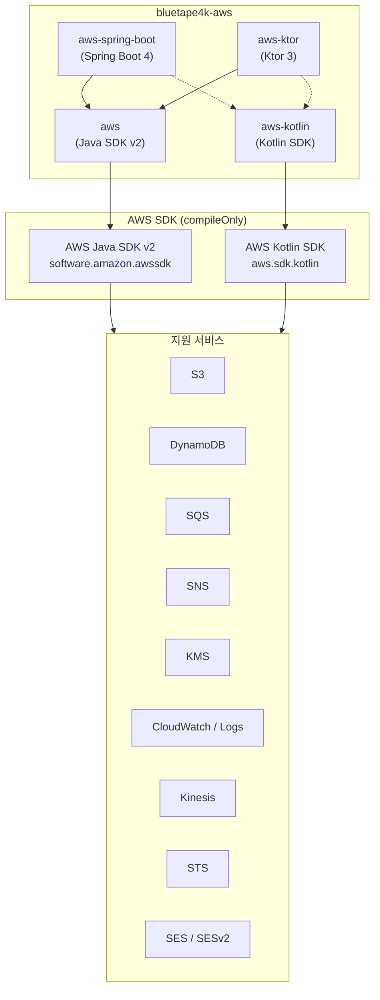
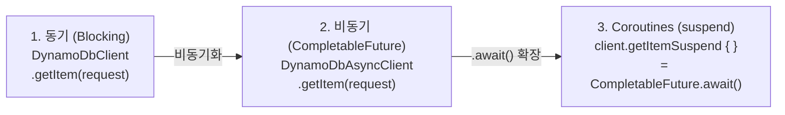
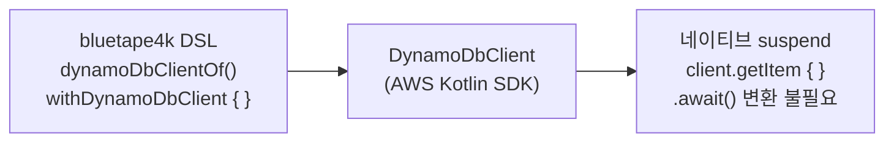

# bluetape4k-aws

[](https://github.com/bluetape4k/bluetape4k-aws/actions/workflows/ci.yml)
[](https://kotlinlang.org)
[](https://openjdk.org)
[](LICENSE)

[English](./README.md) | 한국어

**AWS Java SDK v2** 및 **AWS Kotlin SDK** 를 위한 Kotlin/JVM 래퍼 라이브러리입니다.
Kotlin Coroutines 지원, Spring Boot 4 자동설정, Ktor 3 통합을 제공합니다.
[bluetape4k](https://github.com/bluetape4k) 에코시스템의 일부입니다.

---

## 모듈

| 모듈 | 아티팩트 | 설명 |
|---|---|---|
| `aws` | `io.github.bluetape4k.aws:aws` | AWS Java SDK v2 래퍼. DynamoDB, S3, SES/v2, SNS, SQS, KMS, CloudWatch, CloudWatch Logs, Kinesis, STS에 대한 동기, 비동기(`CompletableFuture`), Coroutines 확장 제공 |
| `aws-kotlin` | `io.github.bluetape4k.aws:aws-kotlin` | AWS Kotlin SDK 래퍼. DynamoDB, S3, SES/v2, SNS, SQS, KMS, CloudWatch, CloudWatch Logs, Kinesis, STS에 대한 네이티브 `suspend` 함수 + DSL 빌더 제공 |
| `aws-spring-boot` | `io.github.bluetape4k.aws:aws-spring-boot` | AWS 서비스용 Spring Boot 4 자동설정. Coroutines 기반 S3 작업과 Presigned URL 지원 |
| `aws-ktor` | `io.github.bluetape4k.aws:aws-ktor` | AWS 서비스용 Ktor 3 클라이언트/서버 통합 (개발 중 — 스켈레톤) |

---

## 아키텍처

### 전체 구조



### 3단계 API (`aws` 모듈 — Java SDK v2)



### 네이티브 Suspend (`aws-kotlin` 모듈 — Kotlin SDK)



---

## 요구사항

- **JDK**: 21 이상
- **Kotlin**: 2.3 이상
- **Gradle**: 8.x

---

## 설치

이 라이브러리는 AWS 서비스 SDK를 `compileOnly`로 선언합니다. 실제로 사용하는 서비스의
런타임 의존성은 직접 추가해야 합니다.

### `aws` 사용 (Java SDK v2 래퍼)

```kotlin
dependencies {
    implementation("io.github.bluetape4k.aws:aws:0.1.0-SNAPSHOT")

    // 사용할 AWS Java SDK v2 서비스 추가
    implementation(platform("software.amazon.awssdk:bom:${awsSdkVersion}"))
    implementation("software.amazon.awssdk:dynamodb-enhanced")
    implementation("software.amazon.awssdk:s3")
    implementation("software.amazon.awssdk:s3-transfer-manager")
    implementation("software.amazon.awssdk:sqs")
    implementation("software.amazon.awssdk:sns")
    implementation("software.amazon.awssdk:kms")
    implementation("software.amazon.awssdk:cloudwatch")
    implementation("software.amazon.awssdk:cloudwatchlogs")
    implementation("software.amazon.awssdk:kinesis")
    implementation("software.amazon.awssdk:sts")
}
```

> Maven Central Snapshots를 사용하는 경우 다음 리포지토리를 추가하세요:
> ```kotlin
> repositories {
>     maven("https://central.sonatype.com/repository/maven-snapshots/")
> }
> ```

### `aws-kotlin` 사용 (Kotlin SDK 래퍼)

```kotlin
dependencies {
    implementation("io.github.bluetape4k.aws:aws-kotlin:0.1.0-SNAPSHOT")

    // 사용할 AWS Kotlin SDK 서비스 추가
    implementation("aws.sdk.kotlin:dynamodb:${awsKotlinSdkVersion}")
    implementation("aws.sdk.kotlin:s3:${awsKotlinSdkVersion}")
    implementation("aws.sdk.kotlin:sqs:${awsKotlinSdkVersion}")
    implementation("aws.sdk.kotlin:sns:${awsKotlinSdkVersion}")
    implementation("aws.sdk.kotlin:kms:${awsKotlinSdkVersion}")
    implementation("aws.sdk.kotlin:cloudwatch:${awsKotlinSdkVersion}")
    implementation("aws.sdk.kotlin:kinesis:${awsKotlinSdkVersion}")
    implementation("aws.sdk.kotlin:sts:${awsKotlinSdkVersion}")
}
```

### `aws-spring-boot` 사용 (Spring Boot 4 자동설정)

```kotlin
dependencies {
    implementation("io.github.bluetape4k.aws:aws-spring-boot:0.1.0-SNAPSHOT")

    // 사용할 AWS Java SDK v2 서비스는 런타임 의존성으로 직접 추가합니다.
    implementation(platform("software.amazon.awssdk:bom:${awsSdkVersion}"))
    implementation("software.amazon.awssdk:s3")
}
```

```yaml
bluetape4k:
  aws:
    s3:
      region: ap-northeast-2
      endpoint-override: http://localhost:4566
      path-style-access-enabled: true
      presign:
        duration: PT15M
```

---

## 사용 예시

### S3 — Spring Boot Coroutines Template

```kotlin
import io.bluetape4k.aws.spring.s3.S3Operations

class DocumentStorage(
    private val s3: S3Operations,
) {
    suspend fun save(bucket: String, key: String, contents: String) {
        s3.upload(bucket, key, contents, contentType = "text/plain")
    }

    suspend fun read(bucket: String, key: String): String =
        s3.downloadText(bucket, key)
}
```

### S3 업로드 — Coroutines (`aws` 모듈)

```kotlin
import io.bluetape4k.aws.s3.coroutines.*
import software.amazon.awssdk.services.s3.S3AsyncClient

val s3: S3AsyncClient = S3AsyncClient.create()

suspend fun uploadObject(bucket: String, key: String, bytes: ByteArray) =
    s3.putObjectSuspend(bucket, key) {
        it.contentLength(bytes.size.toLong())
    }
```

### SQS 송수신 — Coroutines (`aws` 모듈)

```kotlin
import io.bluetape4k.aws.sqs.coroutines.*

suspend fun sendMessage(client: SqsAsyncClient, queueUrl: String, body: String) =
    client.sendMessageSuspend {
        it.queueUrl(queueUrl).messageBody(body)
    }

suspend fun receiveMessages(client: SqsAsyncClient, queueUrl: String) =
    client.receiveMessageSuspend {
        it.queueUrl(queueUrl).maxNumberOfMessages(10)
    }.messages()
```

### DynamoDB — 네이티브 Suspend (`aws-kotlin` 모듈)

```kotlin
import aws.sdk.kotlin.services.dynamodb.DynamoDbClient
import io.bluetape4k.aws.kotlin.dynamodb.*

// One-shot: 블록 종료 시 자동 close
suspend fun getItem(tableName: String, key: Map<String, AttributeValue>) =
    withDynamoDbClient(region = "ap-northeast-2") { client ->
        client.getItem {
            this.tableName = tableName
            this.key = key
        }
    }
```

### CloudWatch 메트릭 — DSL (`aws-kotlin` 모듈)

```kotlin
import io.bluetape4k.aws.kotlin.cloudwatch.*
import aws.sdk.kotlin.services.cloudwatch.CloudWatchClient

val cw = CloudWatchClient { region = "ap-northeast-2" }

suspend fun publishMetric(namespace: String, value: Double) {
    cw.putMetricData {
        this.namespace = namespace
        metricData = listOf(
            metricDatum {                // bluetape4k DSL
                metricName = "RequestCount"
                this.value = value
                unit = StandardUnit.Count
            }
        )
    }
}
```

---

## 테스트 환경

통합 테스트는 Testcontainers를 통해 자동으로 시작되는 **LocalStack** (기본값) 또는
**Floci** 를 로컬 AWS 에뮬레이터로 사용합니다.

```bash
# LocalStack으로 실행 (기본값)
./gradlew :aws:test
./gradlew :aws-kotlin:test

# Floci 에뮬레이터로 실행
./gradlew :aws:test -Dbluetape4k.aws.emulator=floci
./gradlew :aws-kotlin:test -Dbluetape4k.aws.emulator=floci
```

---

## 라이선스

Apache License 2.0 — [LICENSE](https://www.apache.org/licenses/LICENSE-2.0) 참조.
