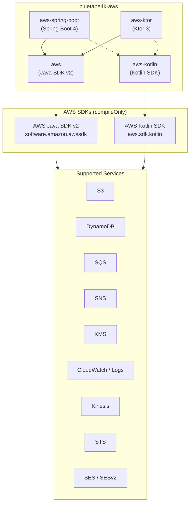
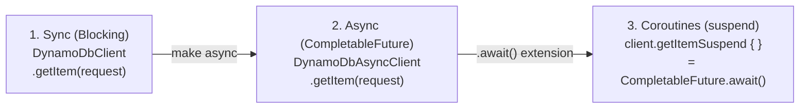
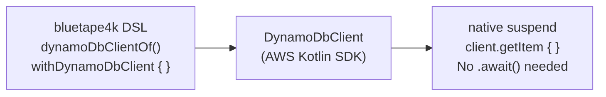

# bluetape4k-aws

[](https://github.com/bluetape4k/bluetape4k-aws/actions/workflows/ci.yml)
[](https://kotlinlang.org)
[](https://openjdk.org)
[](LICENSE)

English | [한국어](./README.ko.md)

Kotlin/JVM wrappers for **AWS Java SDK v2** and the **AWS Kotlin SDK**, with Kotlin Coroutines
support, Spring Boot 4 auto-configuration, and Ktor 3 integration. Part of the
[bluetape4k](https://github.com/bluetape4k) ecosystem.

---

## Modules

| Module | Artifact | Description |
|---|---|---|
| `aws` | `io.github.bluetape4k.aws:aws` | AWS Java SDK v2 wrappers. Sync, async (`CompletableFuture`), and Coroutines extensions for DynamoDB, S3, SES/v2, SNS, SQS, KMS, CloudWatch, CloudWatch Logs, Kinesis, STS |
| `aws-kotlin` | `io.github.bluetape4k.aws:aws-kotlin` | AWS Kotlin SDK wrappers. Native `suspend` functions + DSL builders for DynamoDB, S3, SES/v2, SNS, SQS, KMS, CloudWatch, CloudWatch Logs, Kinesis, STS |
| `aws-spring-boot` | `io.github.bluetape4k.aws:aws-spring-boot` | Spring Boot 4 auto-configuration for AWS services, including Coroutines-native S3 operations and presigned URLs |
| `aws-ktor` | `io.github.bluetape4k.aws:aws-ktor` | Ktor 3 client/server integration for AWS services (WIP — skeleton) |

---

## Architecture

### Overview



### Three-Tier API (`aws` module — Java SDK v2)



### Native Suspend (`aws-kotlin` module — Kotlin SDK)



---

## Requirements

- **JDK**: 21+
- **Kotlin**: 2.3+
- **Gradle**: 8.x

---

## Installation

AWS service SDKs are declared as `compileOnly` in this library. Add only the service dependencies
you need at runtime.

### Using `aws` (Java SDK v2 wrappers)

```kotlin
dependencies {
    implementation("io.github.bluetape4k.aws:aws:0.1.0-SNAPSHOT")

    // Add the AWS Java SDK v2 services you use
    implementation(platform("software.amazon.awssdk:bom:${awsSdkVersion}"))
    implementation("software.amazon.awssdk:dynamodb-enhanced")
    implementation("software.amazon.awssdk:s3")
    implementation("software.amazon.awssdk:s3-transfer-manager")
    implementation("software.amazon.awssdk:sqs")
    implementation("software.amazon.awssdk:sns")
    implementation("software.amazon.awssdk:kms")
    implementation("software.amazon.awssdk:cloudwatch")
    implementation("software.amazon.awssdk:cloudwatchlogs")
    implementation("software.amazon.awssdk:kinesis")
    implementation("software.amazon.awssdk:sts")
}
```

> For Maven Central Snapshots, add the repository:
> ```kotlin
> repositories {
>     maven("https://central.sonatype.com/repository/maven-snapshots/")
> }
> ```

### Using `aws-kotlin` (Kotlin SDK wrappers)

```kotlin
dependencies {
    implementation("io.github.bluetape4k.aws:aws-kotlin:0.1.0-SNAPSHOT")

    // Add the AWS Kotlin SDK services you use
    implementation("aws.sdk.kotlin:dynamodb:${awsKotlinSdkVersion}")
    implementation("aws.sdk.kotlin:s3:${awsKotlinSdkVersion}")
    implementation("aws.sdk.kotlin:sqs:${awsKotlinSdkVersion}")
    implementation("aws.sdk.kotlin:sns:${awsKotlinSdkVersion}")
    implementation("aws.sdk.kotlin:kms:${awsKotlinSdkVersion}")
    implementation("aws.sdk.kotlin:cloudwatch:${awsKotlinSdkVersion}")
    implementation("aws.sdk.kotlin:kinesis:${awsKotlinSdkVersion}")
    implementation("aws.sdk.kotlin:sts:${awsKotlinSdkVersion}")
}
```

### Using `aws-spring-boot` (Spring Boot 4 auto-configuration)

```kotlin
dependencies {
    implementation("io.github.bluetape4k.aws:aws-spring-boot:0.1.0-SNAPSHOT")

    // Add the AWS Java SDK v2 services you use at runtime.
    implementation(platform("software.amazon.awssdk:bom:${awsSdkVersion}"))
    implementation("software.amazon.awssdk:s3")
}
```

```yaml
bluetape4k:
  aws:
    s3:
      region: ap-northeast-2
      endpoint-override: http://localhost:4566
      path-style-access-enabled: true
      presign:
        duration: PT15M
```

---

## Usage

### S3 — Spring Boot Coroutines Template

```kotlin
import io.bluetape4k.aws.spring.s3.S3Operations

class DocumentStorage(
    private val s3: S3Operations,
) {
    suspend fun save(bucket: String, key: String, contents: String) {
        s3.upload(bucket, key, contents, contentType = "text/plain")
    }

    suspend fun read(bucket: String, key: String): String =
        s3.downloadText(bucket, key)
}
```

### S3 Upload — Coroutines (`aws` module)

```kotlin
import io.bluetape4k.aws.s3.coroutines.*
import software.amazon.awssdk.services.s3.S3AsyncClient

val s3: S3AsyncClient = S3AsyncClient.create()

suspend fun uploadObject(bucket: String, key: String, bytes: ByteArray) =
    s3.putObjectSuspend(bucket, key) {
        it.contentLength(bytes.size.toLong())
    }
```

### SQS Send / Receive — Coroutines (`aws` module)

```kotlin
import io.bluetape4k.aws.sqs.coroutines.*

suspend fun sendMessage(client: SqsAsyncClient, queueUrl: String, body: String) =
    client.sendMessageSuspend {
        it.queueUrl(queueUrl).messageBody(body)
    }

suspend fun receiveMessages(client: SqsAsyncClient, queueUrl: String) =
    client.receiveMessageSuspend {
        it.queueUrl(queueUrl).maxNumberOfMessages(10)
    }.messages()
```

### DynamoDB — Native Suspend (`aws-kotlin` module)

```kotlin
import aws.sdk.kotlin.services.dynamodb.DynamoDbClient
import io.bluetape4k.aws.kotlin.dynamodb.*

// One-shot: auto-close after the block
suspend fun getItem(tableName: String, key: Map<String, AttributeValue>) =
    withDynamoDbClient(region = "ap-northeast-2") { client ->
        client.getItem {
            this.tableName = tableName
            this.key = key
        }
    }
```

### CloudWatch Metrics — DSL (`aws-kotlin` module)

```kotlin
import io.bluetape4k.aws.kotlin.cloudwatch.*
import aws.sdk.kotlin.services.cloudwatch.CloudWatchClient

val cw = CloudWatchClient { region = "ap-northeast-2" }

suspend fun publishMetric(namespace: String, value: Double) {
    cw.putMetricData {
        this.namespace = namespace
        metricData = listOf(
            metricDatum {                // bluetape4k DSL
                metricName = "RequestCount"
                this.value = value
                unit = StandardUnit.Count
            }
        )
    }
}
```

---

## Test Environment

Integration tests use **LocalStack** (default) or **Floci** as a local AWS emulator, started
automatically via Testcontainers.

```bash
# Run with LocalStack (default)
./gradlew :aws:test
./gradlew :aws-kotlin:test

# Run with Floci emulator
./gradlew :aws:test -Dbluetape4k.aws.emulator=floci
./gradlew :aws-kotlin:test -Dbluetape4k.aws.emulator=floci
```

---

## License

Apache License 2.0 — see [LICENSE](https://www.apache.org/licenses/LICENSE-2.0).
