# bluetape4k-aws

[](https://github.com/bluetape4k/bluetape4k-aws/actions/workflows/ci.yml)
[](https://kotlinlang.org)
[](https://openjdk.org)
[](LICENSE)

English | [한국어](./README.ko.md)


Kotlin/JVM wrappers for **AWS Java SDK v2** and the **AWS Kotlin SDK**. The
repository adds coroutine-friendly APIs, Spring Boot 4 auto-configuration, and
Ktor 3 integration for bluetape4k services that need AWS without committing to
one application stack.

For task-oriented guidance, SDK and framework choices, lifecycle rules, and
runnable learning paths, use the [AWS manual](docs/manual/en/index.md). This
README remains a repository overview; the manual is the detailed source of
truth.

---

## Project Purpose

`bluetape4k-aws` keeps AWS service access idiomatic for Kotlin services. It
bridges the Java SDK v2 async model, the AWS Kotlin SDK suspend model, Spring
Boot 4 auto-configuration, and Ktor 3 HTTP integration while leaving each
application free to choose the AWS SDK modules and runtime stack it actually
uses.

## What It Provides

- **Kotlin-first AWS clients** — coroutine adapters for Java SDK v2, native AWS
  Kotlin SDK helpers, and small DSL builders for request objects.
- **Service coverage** — DynamoDB, S3, S3 Vectors, SES/SESv2, SNS, SQS, KMS,
  CloudWatch, CloudWatch Logs, EC2 IMDS, Kinesis, EventBridge, EventBridge
  Scheduler, Bedrock Runtime, STS, RDS IAM, Secrets Manager, and Parameter
  Store.
- **Spring Boot 4 operations** — coroutine-oriented templates, repositories,
  listeners, and auto-configuration without depending on awspring.
- **Ktor 3 integration** — SigV4 signing, coroutine S3 access, SQS consumer
  runtime, EventBridge publishing, DynamoDB server repositories, EC2 IMDS
  helpers, and Ktor server/client examples.
- **Local integration testing** — Floci-first emulator wiring through
  Testcontainers, with explicit LocalStack fallback runs for coverage gaps.

<!-- README_VISUAL_OVERVIEW:START -->
## Overview Diagram

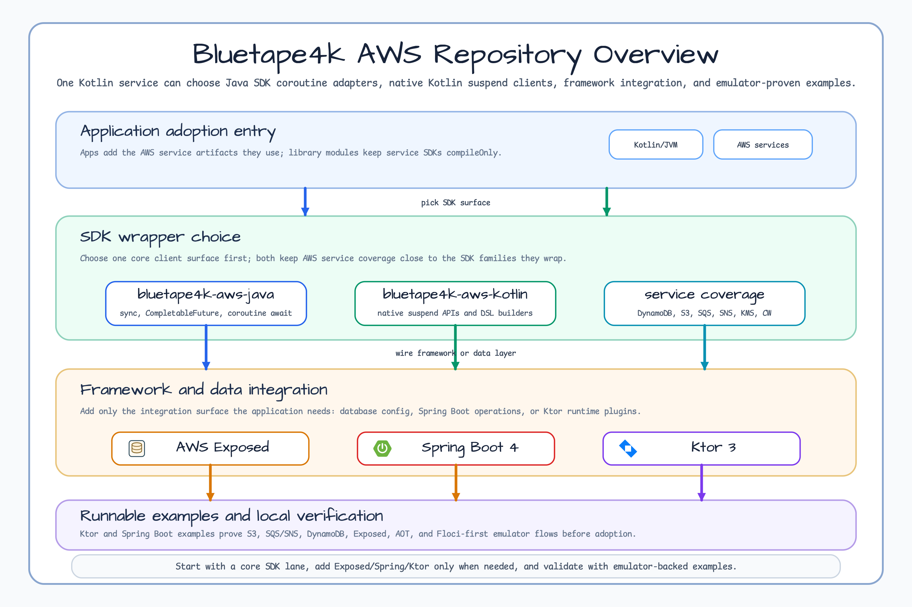

## Module Composition Chart

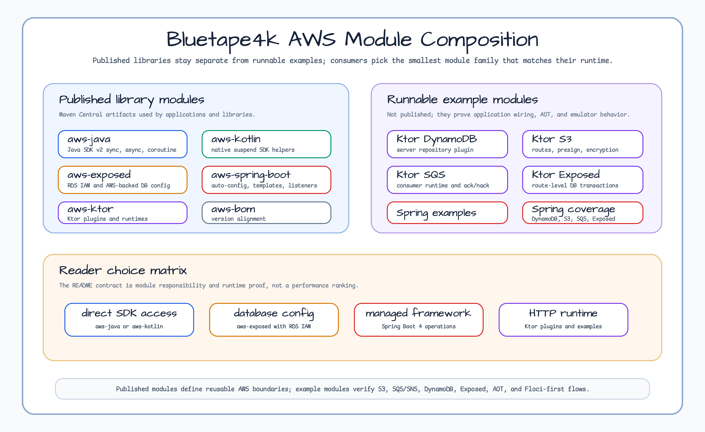
<!-- README_VISUAL_OVERVIEW:END -->

## Modules

| Module | Artifact | Description |
|---|---|---|
| `bluetape4k-aws-java` | `io.github.bluetape4k.aws:bluetape4k-aws-java` | AWS Java SDK v2 wrappers. Sync, async (`CompletableFuture`), and Coroutines extensions for DynamoDB, S3, optional S3 Vectors, SES/v2, SNS, SQS, KMS, CloudWatch, CloudWatch Logs, Kinesis, EventBridge, EventBridge Scheduler, Bedrock Runtime, STS, Secrets Manager, Parameter Store, and Java SDK-backed RDS IAM token helpers |
| `bluetape4k-aws-kotlin` | `io.github.bluetape4k.aws:bluetape4k-aws-kotlin` | AWS Kotlin SDK wrappers. Native `suspend` functions + DSL builders for DynamoDB, S3, SES/v2, SNS, SQS, KMS, CloudWatch, CloudWatch Logs, Kinesis, EventBridge, EventBridge Scheduler, Bedrock Runtime, STS, Secrets Manager, and Parameter Store |
| `bluetape4k-aws-exposed` | `io.github.bluetape4k.aws:bluetape4k-aws-exposed` | Shared Exposed JDBC database foundation for AWS-backed configuration. Provides database properties, RDS IAM authentication token support, Secrets Manager/Parameter Store source descriptors, Hikari-backed Exposed `Database` creation, and default/named database registry support |
| `bluetape4k-aws-spring-boot` | `io.github.bluetape4k.aws:bluetape4k-aws-spring-boot` | Spring Boot 4 auto-configuration for AWS services. Coroutines-native, no awspring dependency. Includes S3 Transfer Manager (`S3TransferTemplate`), optional S3 Access Grants through S3 Control, optional S3 Vectors operations, EventBridge operations, SES sender and JavaMail adapter, SNS HTTP endpoint notification parsing (`SnsHttpMessageParser`), SQS listener support, Kinesis operations, DynamoDB with optional DAX, CloudWatch/CloudWatch Logs with Micrometer snapshot publishing, EC2 IMDS metadata operations, KMS, Secrets Manager, and Parameter Store |
| `bluetape4k-aws-ktor` | `io.github.bluetape4k.aws:bluetape4k-aws-ktor` | Ktor 3 SigV4 client plugin, coroutine-friendly S3 REST client with KMS encryption header support, optional S3 Access Grants and S3 Vectors server plugins, EventBridge server plugin, Kinesis and STS server plugins, SES v2 and SNS server plugins, SQS consumer runtime, DynamoDB server repository plugin, EC2 IMDS helpers, AWS-backed Exposed configuration, and shared `bluetape4k-ktor-core` baseline helpers |
| `aws-ktor-dynamodb-examples` | not published | Ktor 3 DynamoDB server repository example backed by Floci-first AWS emulator tests and shared `bluetape4k-ktor-*` helpers |
| `aws-ktor-s3-examples` | not published | Ktor 3 `S3KtorClient` examples for object routes, presigned URLs, content-type detection, config objects, and client-side encryption |
| `aws-ktor-sqs-examples` | not published | Ktor 3 SQS consumer/runtime example backed by Floci, with manual ack/nack, retry-once redelivery, interceptors, and observer events |
| `aws-ktor-exposed-examples` | not published | Ktor 3 `AwsExposedPlugin` example with PostgreSQL Testcontainers and route-level Exposed transactions |
| `aws-ktor-service-coverage-examples` | not published | Ktor 3 service coverage examples for SES/v2, SNS, CloudWatch, CloudWatch Logs, Kinesis, and STS plugins with injected operations for deterministic route tests |
| `aws-spring-boot-dynamodb-examples` | not published | Spring Boot 4 DynamoDB repository examples for coroutine service flows |
| `aws-spring-boot-s3-examples` | not published | Spring Boot 4 WebFlux examples for `S3Operations`/`S3CoroutinesTemplate`, presigned URLs, and optional KMS-backed client-side encryption; compiled, tested, and wired for Spring AOT |
| `aws-spring-boot-sqs-examples` | not published | Spring Boot 4 SQS/SNS fanout examples for `SqsOperations`, typed/manual-ack `@SqsListener`, retry, interceptor events, and Floci-first SNS subscriptions; compiled, tested, and wired for Spring AOT |
| `aws-spring-boot-exposed-examples` | not published | Spring Boot 4 MVC/Exposed example backed by `AwsExposedAutoConfiguration` and PostgreSQL Testcontainers |

### Component Map

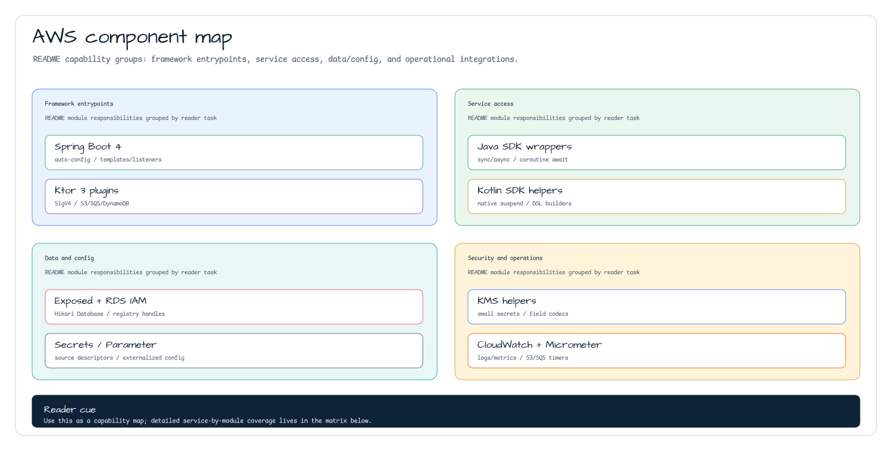

### Selected Cross-Module Service Coverage

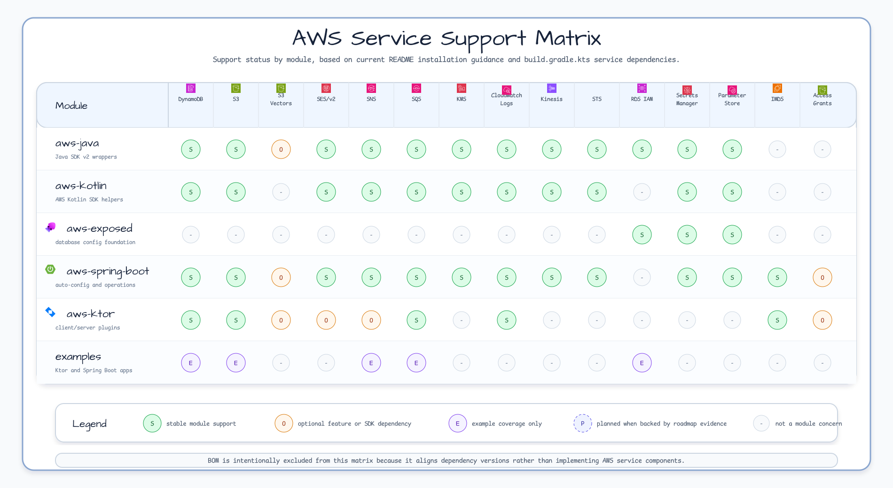

This chart tracks established cross-module integrations. Core-client-only
services such as Bedrock Runtime are listed in the module table and module
READMEs.

---

## Architecture

### Overview

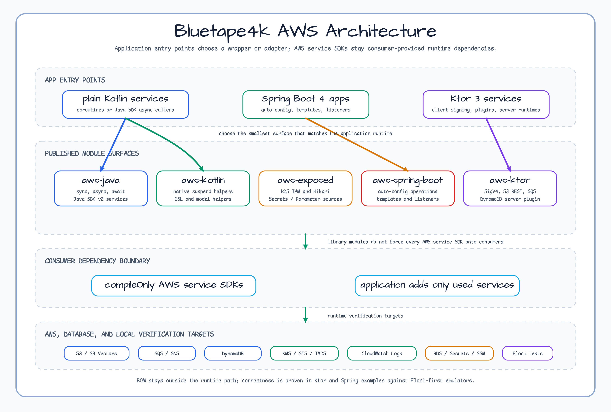

### Three-Tier API (`bluetape4k-aws-java` module — Java SDK v2)

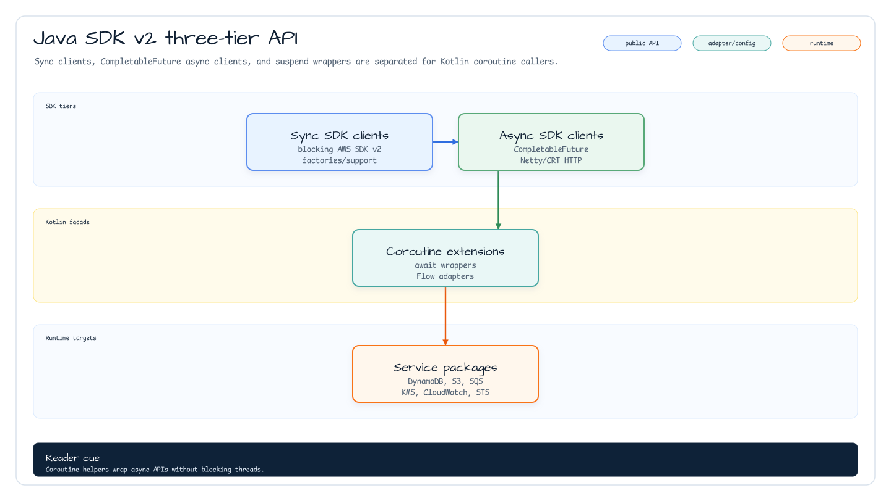

### Native Suspend (`bluetape4k-aws-kotlin` module — Kotlin SDK)

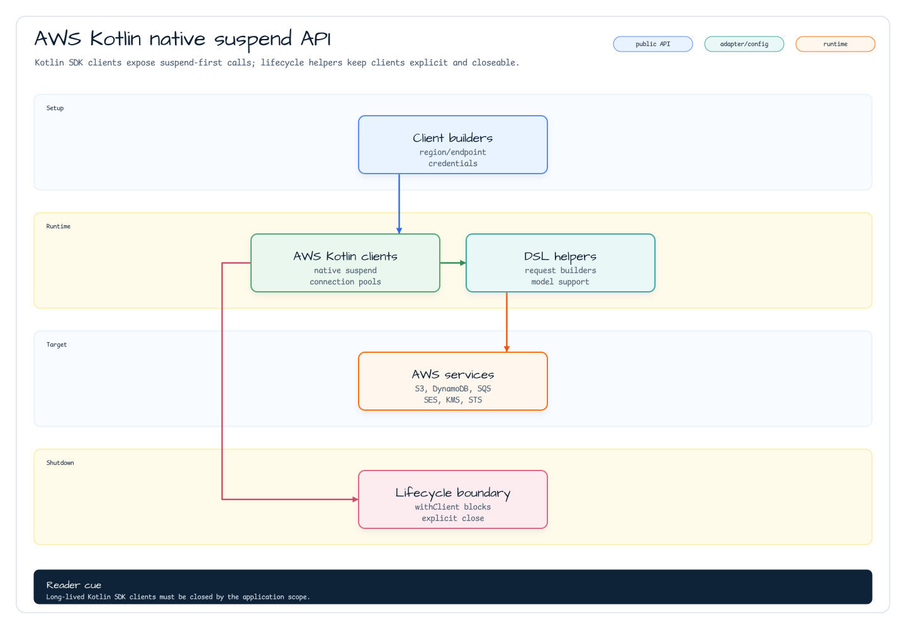

---

## Requirements

- **JDK**: 21+
- **Kotlin**: 2.3+
- **Gradle**: 9.5+

---

## Installation

AWS service SDKs are declared as `compileOnly` in this library. Add only the service dependencies
you need at runtime. Import the central `bluetape4k-dependencies` BOM once; it
aligns this library and the supported AWS SDK artifacts, so consumers do not
select separate repository or SDK BOM versions.

Core Secrets Manager and Parameter Store helpers are intentionally thin SDK
wrappers. Spring Environment loading, JSON flattening, cache/refresh policies,
rotation orchestration, IAM/KMS policy management, and full all-pages
pagination abstractions remain in higher-level modules or application code.

### Using `bluetape4k-aws-java` (Java SDK v2 wrappers)

```kotlin
dependencies {
    implementation(platform("io.github.bluetape4k:bluetape4k-dependencies:<version>"))
    implementation("io.github.bluetape4k.aws:bluetape4k-aws-java")

    // Add the AWS Java SDK v2 services you use
    implementation("software.amazon.awssdk:dynamodb-enhanced")
    implementation("software.amazon.awssdk:s3")
    implementation("software.amazon.awssdk:s3-transfer-manager")
    implementation("software.amazon.awssdk:s3vectors")
    implementation("software.amazon.awssdk:secretsmanager")
    implementation("software.amazon.awssdk:sqs")
    implementation("software.amazon.awssdk:ssm")
    implementation("software.amazon.awssdk:sns")
    implementation("software.amazon.awssdk:kms")
    implementation("software.amazon.awssdk:cloudwatch")
    implementation("software.amazon.awssdk:cloudwatchlogs")
    implementation("software.amazon.awssdk:kinesis")
    implementation("software.amazon.awssdk:eventbridge")
    implementation("software.amazon.awssdk:scheduler")
    implementation("software.amazon.awssdk:bedrockruntime")
    implementation("software.amazon.awssdk:rds")
    implementation("software.amazon.awssdk:sts")
}
```

> For Maven Central Snapshots, add the repository:
> ```kotlin
> repositories {
>     maven("https://central.sonatype.com/repository/maven-snapshots/")
> }
> ```

### Using `bluetape4k-aws-kotlin` (Kotlin SDK wrappers)

```kotlin
dependencies {
    implementation(platform("io.github.bluetape4k:bluetape4k-dependencies:<version>"))
    implementation("io.github.bluetape4k.aws:bluetape4k-aws-kotlin")

    // Add the AWS Kotlin SDK services you use
    implementation("aws.sdk.kotlin:dynamodb")
    implementation("aws.sdk.kotlin:s3")
    implementation("aws.sdk.kotlin:secretsmanager")
    implementation("aws.sdk.kotlin:sqs")
    implementation("aws.sdk.kotlin:ssm")
    implementation("aws.sdk.kotlin:sns")
    implementation("aws.sdk.kotlin:kms")
    implementation("aws.sdk.kotlin:cloudwatch")
    implementation("aws.sdk.kotlin:kinesis")
    implementation("aws.sdk.kotlin:eventbridge")
    implementation("aws.sdk.kotlin:scheduler")
    implementation("aws.sdk.kotlin:bedrockruntime")
    implementation("aws.sdk.kotlin:sts")
}
```

### Using `bluetape4k-aws-spring-boot` (Spring Boot 4 auto-configuration)

```kotlin
dependencies {
    implementation(platform("io.github.bluetape4k:bluetape4k-dependencies:<version>"))
    implementation("io.github.bluetape4k.aws:bluetape4k-aws-spring-boot")

    // Add the AWS Java SDK v2 services you use at runtime.
    implementation("software.amazon.awssdk:dynamodb-enhanced")
    implementation("software.amazon.awssdk:cloudwatch")
    implementation("software.amazon.awssdk:cloudwatchlogs")
    implementation("software.amazon.awssdk:eventbridge")
    implementation("software.amazon.awssdk:imds")
    implementation("software.amazon.awssdk:kinesis")
    implementation("software.amazon.awssdk:kms")
    implementation("software.amazon.awssdk:s3")
    implementation("software.amazon.awssdk:s3vectors")
    implementation("software.amazon.awssdk:secretsmanager")
    implementation("software.amazon.awssdk:sns")
    implementation("software.amazon.awssdk:sqs")

    // Optional: only needed if you want the Spring Security TextEncryptor adapter.
    implementation("org.springframework.security:spring-security-crypto")
    implementation("software.amazon.awssdk:ssm")
}
```

Use this module when your application wants Spring-managed AWS clients and coroutine-friendly service
helpers. The library includes `micrometer-core` because Micrometer is a Spring Boot observability
baseline. When a `MeterRegistry` bean exists, SQS/S3 operation timers and SQS listener phase
timers are registered automatically with low-cardinality tags. It still does not pull every AWS SDK
service at runtime; add only the AWS SDK modules you actually use. Add
`software.amazon.awssdk:cloudwatch` and `software.amazon.awssdk:cloudwatchlogs` when using
CloudWatch helpers. Add `software.amazon.awssdk:imds` when using EC2 metadata helpers. For KMS, add
`software.amazon.awssdk:kms`. Add `software.amazon.awssdk:kinesis` when using Kinesis operations.
Add `software.amazon.awssdk:eventbridge` when using EventBridge operations.
Add `spring-security-crypto` only when you want to inject Spring Security's synchronous
`TextEncryptor`.

```yaml
bluetape4k:
  aws:
    kms:
      region: ap-northeast-2
      endpoint-override: http://localhost:4566
      key-id: alias/app-secrets
      encryption-context:
        service: order-api
      data-key-cache:
        enabled: true
        max-size: 64
        ttl: PT5M
    s3:
      region: ap-northeast-2
      endpoint-override: http://localhost:4566
      path-style-access-enabled: true
      presign:
        duration: PT15M
      config:
        region: ap-northeast-2
        endpoint-override: http://localhost:4566
        path-style-access-enabled: true
        refresh-interval: 30s
        sources:
          - name: app-s3-config
            bucket: order-config
            key: application.properties
            prefix: app
            format: properties
      client-side-encryption:
        enabled: true
        key-id: alias/app-s3
        encryption-context:
          service: order-api
    s3-vectors:
      enabled: true
      region: ap-northeast-2
    dynamodb:
      region: ap-northeast-2
      endpoint-override: http://localhost:4566
      table-prefix: local-
    cloudwatch:
      region: ap-northeast-2
      endpoint-override: http://localhost:4566
      namespace: OrderApi
      micrometer:
        enabled: true
    cloudwatch-logs:
      region: ap-northeast-2
      endpoint-override: http://localhost:4566
      log-group-name: /aws/app/order-api
      log-stream-name: local
    eventbridge:
      region: ap-northeast-2
      endpoint-override: http://localhost:4566
      default-event-bus-name: orders
    imds:
      enabled: true
      endpoint-mode: ipv4
      token-ttl: PT6H
      request-timeout: 1s
      retries: 0
    sqs:
      region: ap-northeast-2
      endpoint-override: http://localhost:4566
      listener:
        max-messages: 10
        wait-time-seconds: 20
        concurrency: 2
        retry:
          max-attempts: 2
          initial-backoff: 100ms
          max-backoff: 2s
          multiplier: 2.0
          jitter-ratio: 0.2
    secrets-manager:
      region: ap-northeast-2
      endpoint-override: http://localhost:4566
      sources:
        - name: app-secret
          secret-id: local/app
          prefix: app
    parameter-store:
      region: ap-northeast-2
      endpoint-override: http://localhost:4566
      sources:
        - name: app-parameters
          path: /config/app
          prefix: app
          recursive: true
          with-decryption: true
    sns:
      region: ap-northeast-2
      endpoint-override: http://localhost:4566
      topics:
        orders.fifo:
          fifo: true
          content-based-deduplication: true
          fifo-throughput-scope: message-group
```

KMS is intended for small secrets and key management, not for bulk payload encryption. Use
`KmsOperations.encrypt` directly for short values such as tokens, credentials, or configuration
secrets. For larger data, call `generateDataKey`, encrypt the payload locally with the plaintext data
key, and store the encrypted data key with the payload metadata. The built-in `DataKeyCache` can reuse
plaintext data keys briefly, but this is sensitive in-memory key material; keep the TTL and cache size
small.

#### KMS Spring Boot Components

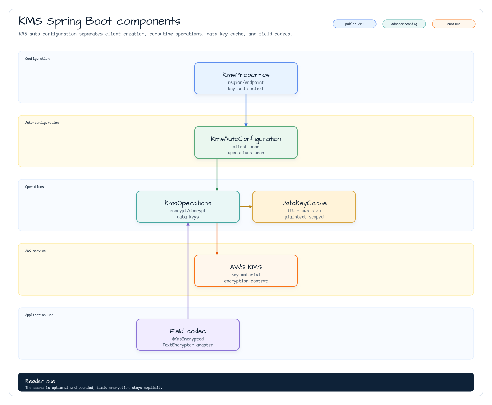

#### KMS Encrypt / Decrypt Flow

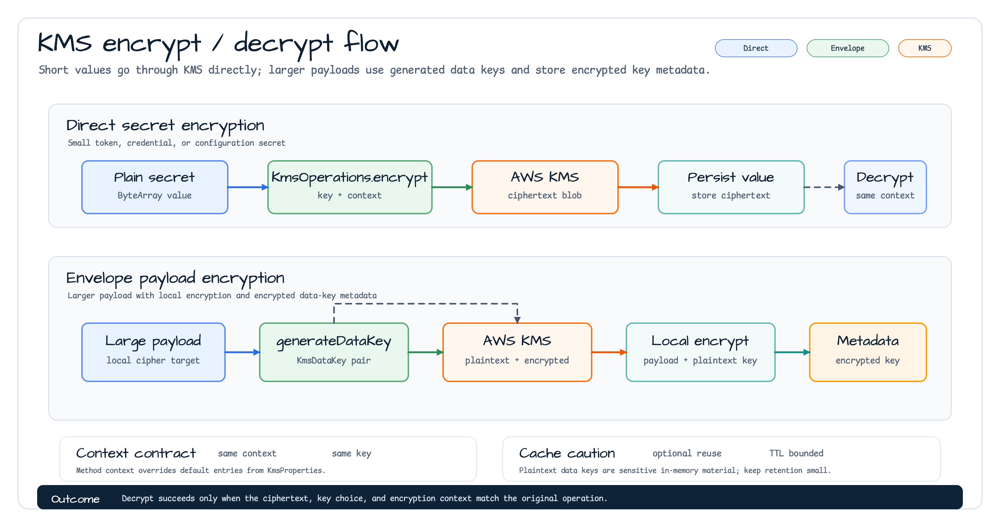

---

## Usage

### S3 — Spring Boot Coroutines Template

```kotlin
import io.bluetape4k.aws.spring.s3.S3Operations
import io.bluetape4k.aws.spring.s3.S3TransferOperations
import java.nio.file.Path

class DocumentStorage(
    private val s3: S3Operations,
    private val transfer: S3TransferOperations,
) {
    suspend fun save(bucket: String, key: String, contents: String) {
        s3.upload(bucket, key, contents, contentType = "text/plain")
    }

    suspend fun read(bucket: String, key: String): String =
        s3.downloadText(bucket, key)

    suspend fun saveLargeFile(bucket: String, key: String, source: Path) {
        transfer.uploadFile(bucket, key, source)
    }
}
```

`S3Operations` covers small/common object operations, resources, listing, and
presigned URLs. `S3TransferOperations` is auto-configured only when
`software.amazon.awssdk:s3-transfer-manager` is on the classpath and is intended
for large files, multipart transfers, and transfer listeners. For CRT-backed
throughput tuning, add the AWS CRT runtime dependency and provide a CRT-backed
`S3AsyncClient`; the Spring auto-configuration reuses that client for transfer
manager construction.

#### S3 Access Grants

S3 Access Grants support is opt-in and uses the AWS SDK v2 S3 Control client.
Applications that enable it must add the runtime service dependency; otherwise
the auto-configuration backs off cleanly:

```kotlin
runtimeOnly("software.amazon.awssdk:s3control")
```

```yaml
bluetape4k:
  aws:
    s3:
      access-grants:
        enabled: true
        region: us-east-1
```

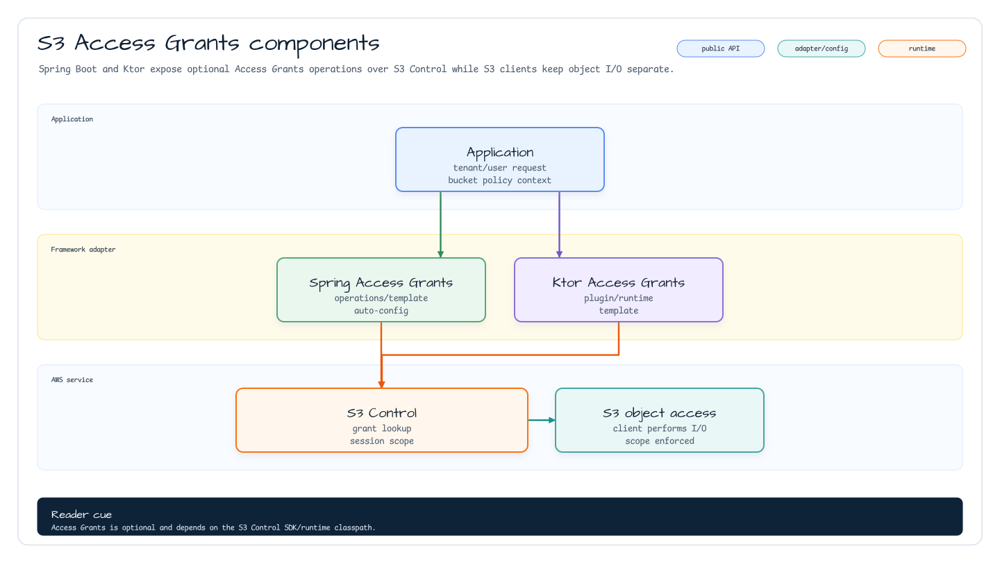

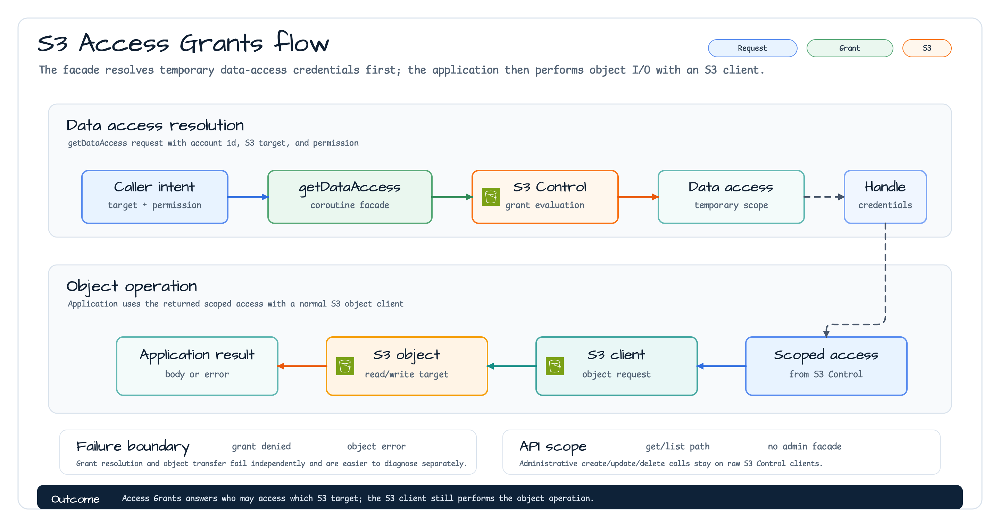

```kotlin
import io.bluetape4k.aws.spring.s3.accessgrants.S3AccessGrantsOperations
import software.amazon.awssdk.services.s3control.model.GetDataAccessRequest
import software.amazon.awssdk.services.s3control.model.Permission

class GrantedObjectAccess(
    private val accessGrants: S3AccessGrantsOperations,
) {
    suspend fun readCredentials(accountId: String, target: String) =
        accessGrants.getDataAccess(
            GetDataAccessRequest.builder()
                .accountId(accountId)
                .target(target)
                .permission(Permission.READ)
                .build()
        )
}
```

`S3AccessGrantsOperations` covers the common read and data-access path:
`getDataAccess`, `listCallerAccessGrants`, `listAccessGrants`,
`listAccessGrantsInstances`, and `listAccessGrantsLocations`. Administrative
create, update, and delete calls intentionally stay on the raw `S3ControlClient`
and `S3ControlAsyncClient` beans so policy-changing operations remain explicit.

### DynamoDB — Spring Boot Coroutine Repository

The Spring Boot integration wires the async clients and table-name resolver, but
the repository still owns the entity schema, key mapping, and table lifecycle.

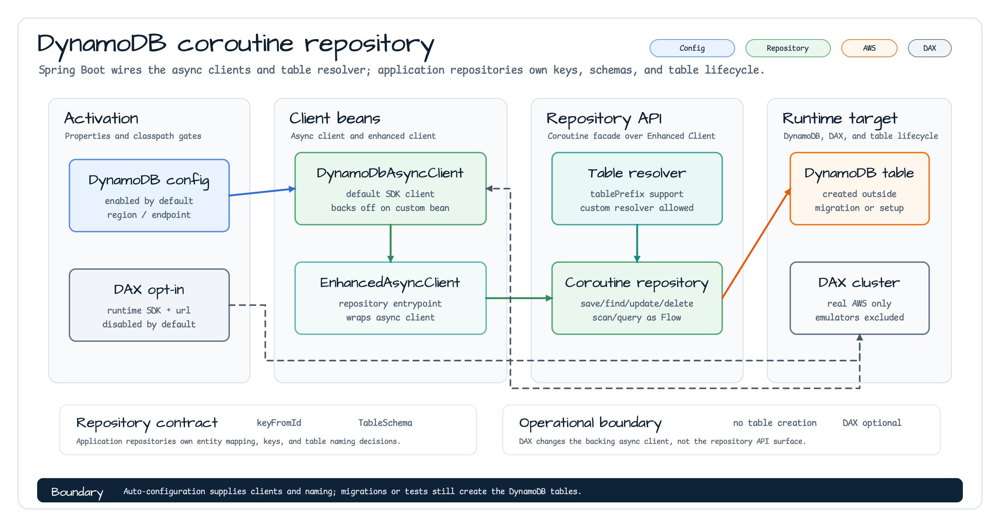

```kotlin
import io.bluetape4k.aws.spring.dynamodb.AbstractCoroutinesDynamoDbRepository
import io.bluetape4k.aws.spring.dynamodb.DynamoDbTableNameResolver
import software.amazon.awssdk.enhanced.dynamodb.DynamoDbEnhancedAsyncClient
import software.amazon.awssdk.enhanced.dynamodb.Key

class OrderRepository(
    enhancedClient: DynamoDbEnhancedAsyncClient,
    tableNameResolver: DynamoDbTableNameResolver,
) : AbstractCoroutinesDynamoDbRepository<OrderDocument, OrderId>(
    enhancedClient = enhancedClient,
    tableNameResolver = tableNameResolver,
    entityClass = OrderDocument::class.java,
) {
    override val tableName: String = "orders"

    override fun keyFromId(id: OrderId): Key =
        Key.builder().partitionValue(id.orderId).sortValue(id.createdAt).build()
}
```

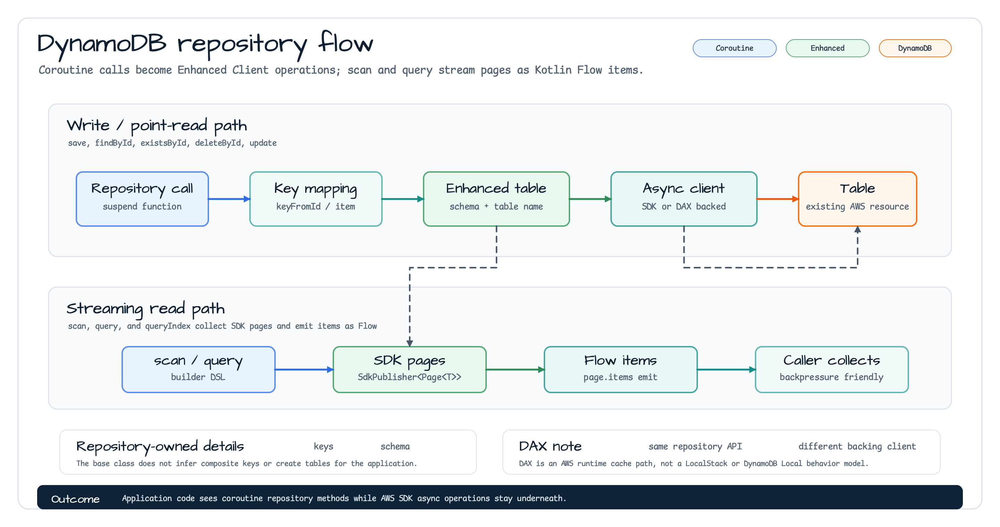

`aws-spring-boot` does not create DynamoDB tables automatically. Create tables
through migrations, deployment automation, or explicit test setup so schema
changes remain visible.

DynamoDB Accelerator (DAX) is optional and requires the DAX runtime dependency
in the consuming application:

```kotlin
runtimeOnly("software.amazon.dax:amazon-dax-client:2.0.9")
```

```yaml
bluetape4k:
  aws:
    dynamodb:
      region: us-east-1
      dax:
        enabled: true
        url: dax://orders-cache.abc123.dax-clusters.us-east-1.amazonaws.com
        connect-timeout: 1s
        request-timeout: 1s
        idle-timeout: 30s
```

When DAX is enabled, `DynamoDbEnhancedAsyncClient` is still the repository entry
point, but it is backed by the DAX `DynamoDbAsyncClient`. Use DAX only with real
AWS DAX clusters; LocalStack, Floci, and DynamoDB Local remain emulator/test
paths and do not model DAX cache consistency or latency behavior.

### CloudWatch — Spring Boot Metrics and Logs

CloudWatch metrics, CloudWatch Logs, and Micrometer snapshot publishing use
separate operation surfaces. The Micrometer helper reads an existing registry
only when application code explicitly publishes a snapshot.

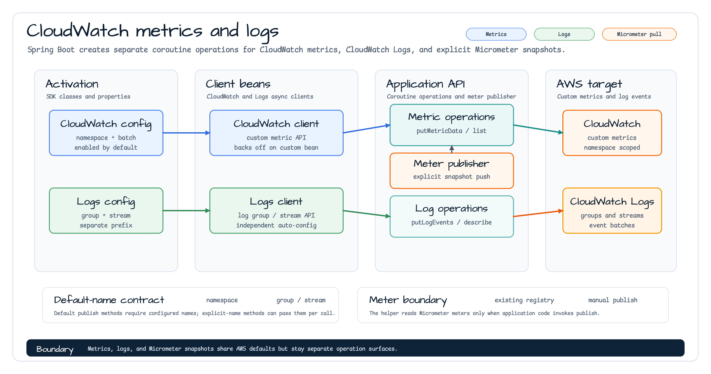

```kotlin
import io.bluetape4k.aws.cloudwatch.model.metricDatumOf
import io.bluetape4k.aws.cloudwatch.model.cloudwatchlogs.inputLogEventOf
import io.bluetape4k.aws.spring.cloudwatch.CloudWatchLogsOperations
import io.bluetape4k.aws.spring.cloudwatch.CloudWatchMeterPublishingOperations
import io.bluetape4k.aws.spring.cloudwatch.CloudWatchOperations
import software.amazon.awssdk.services.cloudwatch.model.StandardUnit

class OrderObservability(
    private val cloudWatch: CloudWatchOperations,
    private val cloudWatchLogs: CloudWatchLogsOperations,
    private val meters: CloudWatchMeterPublishingOperations,
) {
    suspend fun processed(orderId: String) {
        cloudWatch.putMetricDatum(metricDatumOf("OrderProcessed", 1.0, StandardUnit.COUNT))
        cloudWatchLogs.putLogEvents(
            listOf(inputLogEventOf(System.currentTimeMillis(), "processed order=$orderId"))
        )
        meters.publishMeter("orders.processed")
    }
}
```

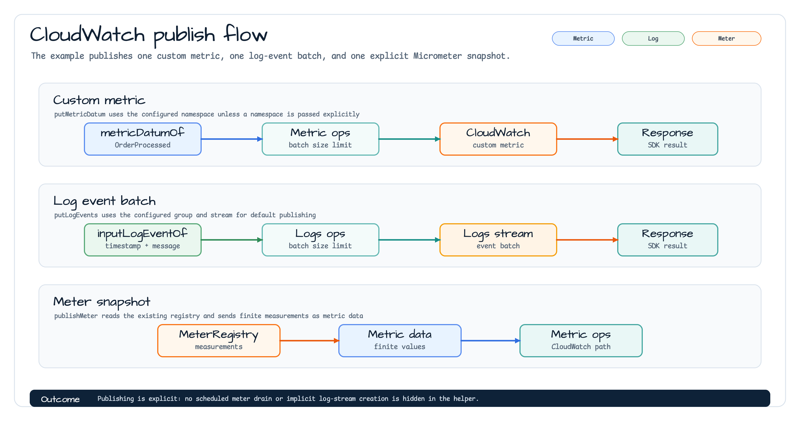

The Micrometer helper is registered only when a `MeterRegistry` bean exists. It
publishes explicit snapshots through `CloudWatchOperations` and does not replace
scheduled Micrometer registry publication. SQS/S3 Micrometer adapters also use
the application `MeterRegistry` when present: SQS send/receive/listener phases
and S3 upload/download/delete/list/presign operations are timed without adding
queue URLs, message IDs, object keys, or receipt handles as default tags.

### EC2 IMDS — Spring Boot Metadata Operations

Spring Boot auto-configuration and the Ktor plugin share the same passive
metadata contract: setup creates a facade, and IMDS is contacted only when an
operation is invoked.

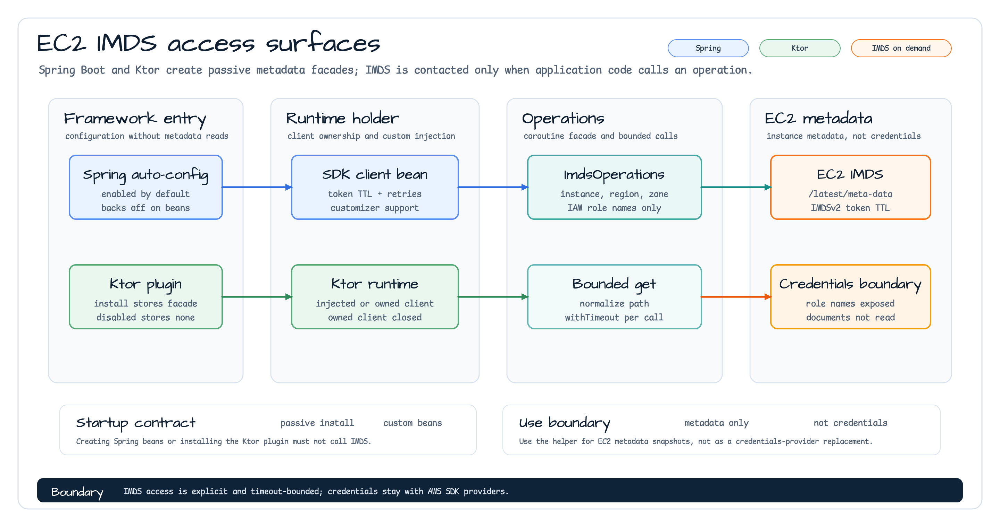

```kotlin
import io.bluetape4k.aws.spring.imds.ImdsOperations

class InstanceMetadataReporter(
    private val imds: ImdsOperations,
) {
    suspend fun describe(): String {
        val instanceId = imds.instanceId()
        val region = imds.region()
        val zone = imds.availabilityZone()

        return "$instanceId in $region/$zone"
    }
}
```

`ImdsOperations` is passive during Spring startup and calls IMDS only when an
operation is invoked. Each call is bounded by `bluetape4k.aws.imds.request-timeout`.
Use it for EC2 instance metadata, not as a replacement for `DefaultCredentialsProvider`
or EKS/IRSA web identity credentials. The helper exposes IAM role names only and
does not expose temporary credential documents.

### EC2 IMDS — Ktor Plugin

```kotlin
import io.bluetape4k.aws.ktor.imds.ImdsKtorPlugin
import io.bluetape4k.aws.ktor.imds.imds
import io.ktor.server.application.Application
import io.ktor.server.application.install
import java.time.Duration

fun Application.module() {
    install(ImdsKtorPlugin) {
        requestTimeout = Duration.ofSeconds(1)
    }
}

suspend fun Application.instanceSnapshot(): Map<String, String> =
    mapOf(
        "instanceId" to imds().instanceId(),
        "region" to imds().region(),
        "availabilityZone" to imds().availabilityZone(),
    )
```

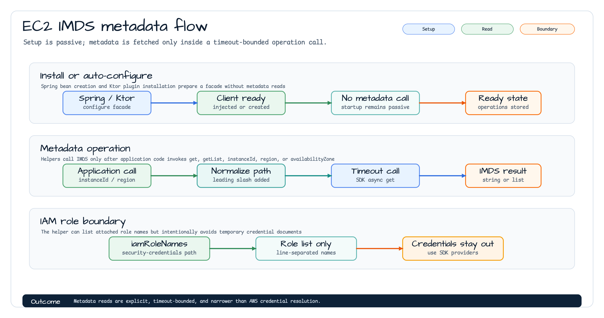

Add `software.amazon.awssdk:imds` when using the Ktor IMDS plugin. Installing
the plugin does not call IMDS; metadata is read only when `ImdsKtorOperations`
methods are invoked. The helper exposes IAM role names only and does not expose
temporary credential documents.

### Secrets Manager and Parameter Store — Environment Sources

Secrets Manager and SSM Parameter Store sources are loaded during Spring
Environment post-processing, before normal `@ConfigurationProperties` binding.
No remote lookup is performed unless at least one source is configured.

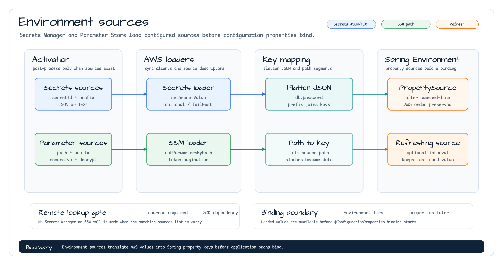

```kotlin
import org.springframework.boot.context.properties.ConfigurationProperties

@ConfigurationProperties("app.db")
data class DatabaseSettings(
    val username: String,
    val password: String,
)
```

For a JSON secret such as `{"db":{"username":"scott","password":"tiger"}}`
with `prefix: app`, the properties become `app.db.username` and
`app.db.password`. For Parameter Store path `/config/app/db/password` with
`path: /config/app` and `prefix: app`, the property becomes `app.db.password`.
When `refresh-interval` is configured, the loaded property source refreshes on
read and keeps the last good values if a refresh fails.

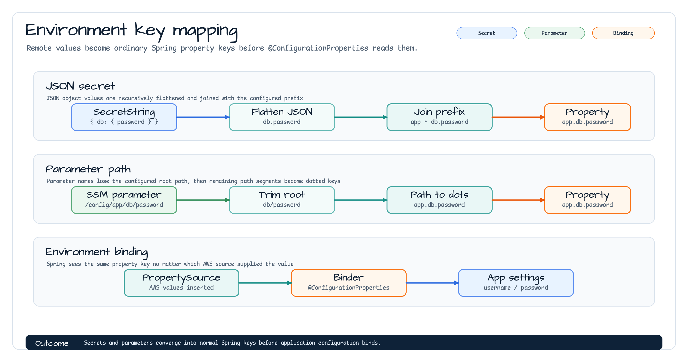

### Exposed Database Settings from Environment Sources

`AwsExposedAutoConfiguration` can create the Exposed registry from values that
Secrets Manager or Parameter Store have already published into the Spring
Environment. The Exposed resolver does not create a second AWS client path; it
uses the `secret-source` or `parameter-source` descriptor prefix to read
connection fields such as `url`, `driver-class-name`, `username`, and
`password`.

```yaml
bluetape4k:
  aws:
    secrets-manager:
      region: ap-northeast-2
      sources:
        - name: orders-db
          secret-id: prod/orders/database
          prefix: orders.db
    exposed:
      default-database:
        secret-source:
          source-id: prod/orders/database
          prefix: orders.db
        pool:
          maximum-pool-size: 10
```

The secret payload can then provide the database fields:

```json
{
  "url": "jdbc:postgresql://orders.cluster.local:5432/orders",
  "driver-class-name": "org.postgresql.Driver",
  "username": "orders",
  "password": "change-me"
}
```

Direct `bluetape4k.aws.exposed.default-database.*` properties still work for
local and test profiles. Source descriptor values overlay only keys that exist
under the descriptor prefix, and optional descriptors leave existing settings
unchanged when the source is absent.

### SQS — Spring Boot Coroutines Template and Listener

SQS auto-configuration separates the coroutine operations surface from the
listener runtime. Listener methods can use raw payloads, Jackson-converted
payloads, and optional manual acknowledgement.

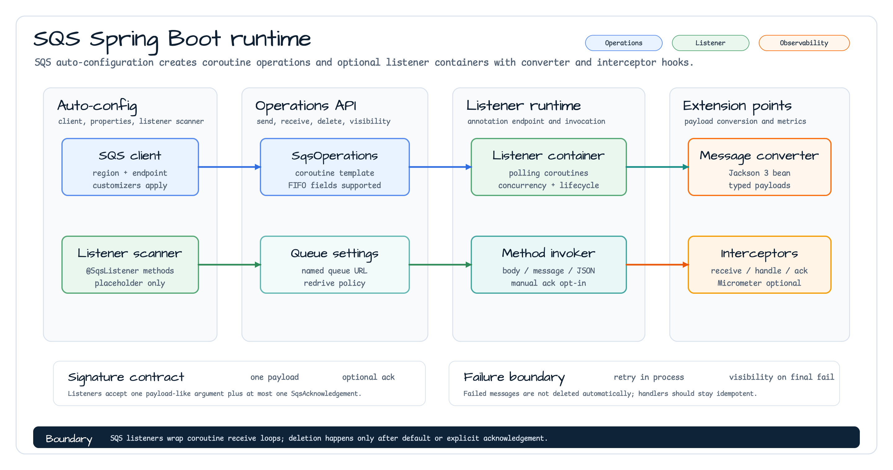

```kotlin
import io.bluetape4k.aws.spring.sqs.SqsListener
import io.bluetape4k.aws.spring.sqs.SqsAcknowledgement
import io.bluetape4k.aws.spring.sqs.SqsOperations

data class OrderEvent(val id: String, val total: Long)

class OrderQueue(
    private val sqs: SqsOperations,
) {
    suspend fun send(queueUrl: String, payload: String) {
        sqs.send(queueUrl, payload)
    }

    @SqsListener("\${orders.queue-url}")
    suspend fun handle(body: String) {
        // Make handlers idempotent; failed messages are not deleted automatically.
        process(body)
    }

    @SqsListener("\${orders-json.queue-url}")
    suspend fun handle(event: OrderEvent, acknowledgement: SqsAcknowledgement) {
        process(event)
        acknowledgement.acknowledge()
    }
}
```

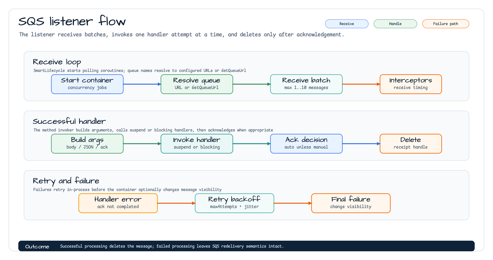

Typed listener payloads are enabled by a `SqsMessageConverter`; a Jackson 3
converter is auto-registered when an `ObjectMapper` bean is present. Declaring
`SqsAcknowledgement` switches the listener to manual acknowledgement. Listener
retry, backoff, jitter, and `SqsListenerInterceptor` hooks cover production
redelivery and observability scenarios.

### KMS — Spring Boot Coroutines Encryptor

KMS support is centered on `KmsOperations`. Auto-configuration registers the SDK
client, coroutine encryptor, bounded data-key cache, explicit field encryption
codec, and optional Spring Security `TextEncryptor` adapter.

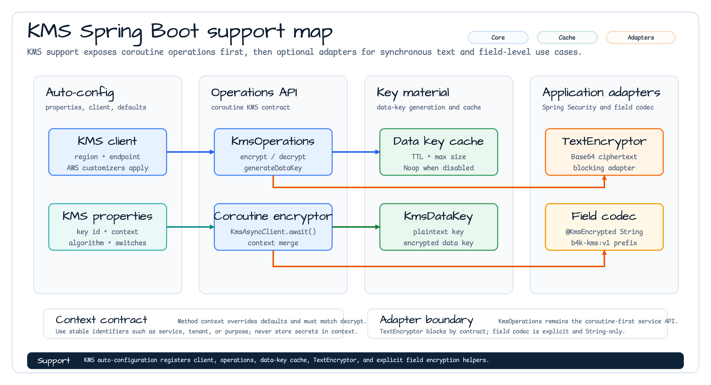

```kotlin
import io.bluetape4k.aws.spring.kms.KmsOperations
import java.util.Base64

class SecretVault(
    private val kms: KmsOperations,
) {
    suspend fun protectToken(token: String): String {
        val ciphertext = kms.encrypt(
            plaintext = token.encodeToByteArray(),
            encryptionContext = mapOf("purpose" to "api-token"),
        )
        return Base64.getEncoder().encodeToString(ciphertext)
    }

    suspend fun revealToken(encodedCiphertext: String): String {
        val plaintext = kms.decrypt(
            ciphertext = Base64.getDecoder().decode(encodedCiphertext),
            encryptionContext = mapOf("purpose" to "api-token"),
        )
        return plaintext.decodeToString()
    }
}
```

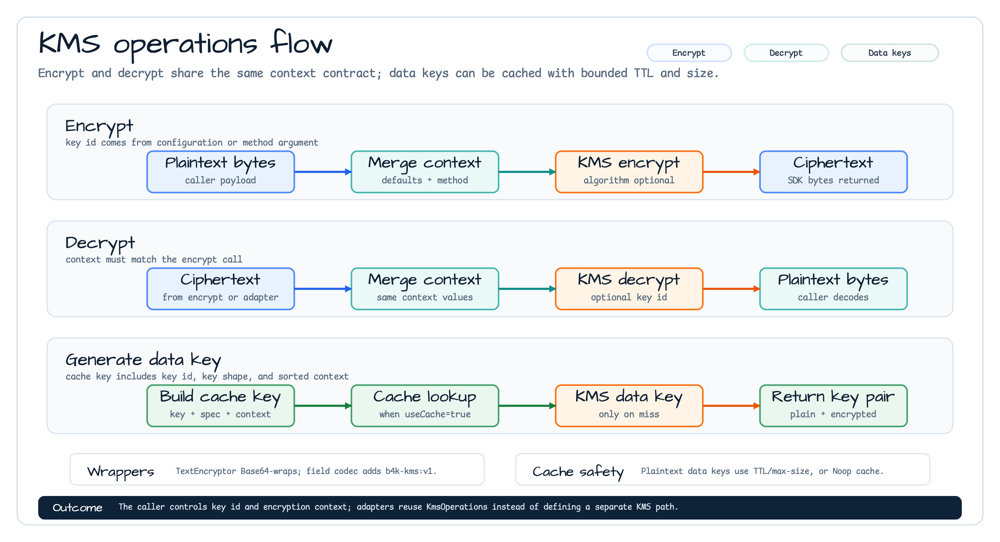

The encryption context is authenticated metadata. Use the same context for decrypt that you used for
encrypt, and put stable identifiers such as `service`, `tenant`, or `purpose` in it. Do not put
secrets in the context because AWS logs and policies may expose it.

### KMS — Spring Security `TextEncryptor`

```kotlin
import org.springframework.security.crypto.encrypt.TextEncryptor

class PropertyProtector(
    private val textEncryptor: TextEncryptor,
) {
    fun encrypt(value: String): String =
        textEncryptor.encrypt(value)

    fun decrypt(value: String): String =
        textEncryptor.decrypt(value)
}
```

`TextEncryptor` is synchronous, so this adapter is best for short administrative flows or startup-time
secret handling. Prefer `KmsOperations` in coroutine services.

### SNS — Spring Boot Coroutines Template

SNS support centers on `SnsOperations`: create standard or FIFO topics, publish
topic messages, publish direct SMS messages, and confirm HTTP endpoint
subscriptions after the application verifies trust.

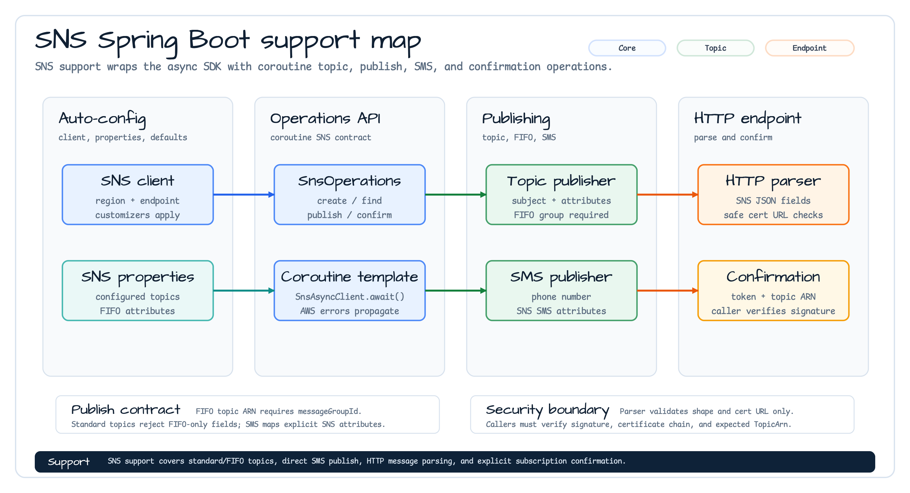

```kotlin
import io.bluetape4k.aws.spring.sns.SnsOperations
import io.bluetape4k.aws.spring.sns.SnsHttpMessageParser
import io.bluetape4k.aws.spring.sns.SnsHttpMessageType
import io.bluetape4k.aws.spring.sns.SnsPublishRequest
import io.bluetape4k.aws.spring.sns.SnsSmsRequest
import io.bluetape4k.aws.spring.sns.SnsSmsType

class OrderTopic(
    private val sns: SnsOperations,
) {
    suspend fun publish(topicArn: String, payload: String): String {
        val response = sns.publish(
            SnsPublishRequest(
                topicArn = topicArn,
                message = payload,
            )
        )
        return response.messageId()
    }

    suspend fun sendSms(phoneNumber: String, text: String): String =
        sns.publishSms(
            SnsSmsRequest(
                phoneNumber = phoneNumber,
                message = text,
                smsType = SnsSmsType.TRANSACTIONAL,
                senderId = "BLUETAPE",
            )
        ).messageId()

    suspend fun handleHttpEndpoint(body: String, messageTypeHeader: String?) {
        val message = SnsHttpMessageParser.parse(body, messageTypeHeader)
        // Verify Signature, SigningCertURL, SignatureVersion, and expected TopicArn here.
        when (message.type) {
            SnsHttpMessageType.SUBSCRIPTION_CONFIRMATION,
            SnsHttpMessageType.UNSUBSCRIBE_CONFIRMATION -> sns.confirmSubscription(message)
            SnsHttpMessageType.NOTIFICATION -> processNotification(message.message)
        }
    }

    private fun processNotification(message: String) = Unit
}
```

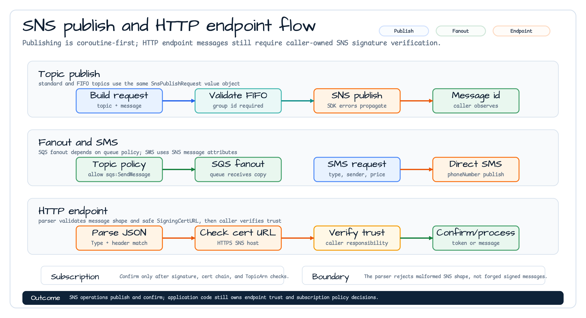

SNS can publish to an SQS subscription when the queue policy allows
`sqs:SendMessage` from the topic ARN. The `aws-spring-boot-sqs-examples`
module includes the emulator-backed SQS/SNS fanout flow.
`SnsHttpMessageParser` maps SNS HTTP JSON, checks the optional
`x-amz-sns-message-type` header, and rejects non-HTTPS or non-SNS
`SigningCertURL` hosts, but it does not validate SNS signatures.
Validate the certificate chain, `Signature`, `SignatureVersion`, and expected
`TopicArn` before processing notifications or confirming subscriptions.

### Kinesis — Spring Boot Coroutines Template

Spring Boot Kinesis support centers on `KinesisOperations`: stream creation from
explicit or configured shard counts, record publishing, shard iterator lookup,
bounded `GetRecords` polling, and a cold single-shard `Flow<Record>`. It does
not provide a listener or checkpoint runtime; collect the Flow explicitly and
store checkpoints in application code when needed.

```kotlin
import io.bluetape4k.aws.spring.kinesis.KinesisOperations
import io.bluetape4k.aws.spring.kinesis.KinesisPutRecordRequest
import software.amazon.awssdk.core.SdkBytes

class StreamPublisher(
    private val kinesis: KinesisOperations,
) {
    suspend fun publish(streamName: String, payload: String): String =
        kinesis.putRecord(
            KinesisPutRecordRequest(
                streamName = streamName,
                partitionKey = "orders",
                data = SdkBytes.fromUtf8String(payload),
            )
        ).sequenceNumber()
}
```

### EventBridge — Spring Boot Coroutines Template

Spring Boot EventBridge support centers on `EventBridgeOperations`: event bus
creation/deletion, rule creation/deletion, target add/remove, rule/target
listing, and `PutEvents`. It is an explicit operations API; it does not add
Scheduler support, hidden batching, retry, cleanup, or listener runtimes.

```kotlin
import io.bluetape4k.aws.eventbridge.model.putEventsRequestEntryOf
import io.bluetape4k.aws.spring.eventbridge.EventBridgeOperations

class EventPublisher(
    private val eventBridge: EventBridgeOperations,
) {
    suspend fun publishOrderCreated(orderId: String) {
        val response = eventBridge.putEvents(
            listOf(
                putEventsRequestEntryOf(
                    source = "orders",
                    detailType = "order.created",
                    detail = """{"orderId":"$orderId"}""",
                    eventBusName = "orders",
                )
            )
        )
        require(response.failedEntryCount() == 0) { "EventBridge rejected one or more entries." }
    }
}
```

`PutEvents`, `PutTargets`, and `RemoveTargets` can partially succeed. Inspect
the raw response before committing downstream state.

### S3 Object IO — Coroutines (`aws-java` module)

S3 coroutine support extends AWS SDK v2 `S3AsyncClient` and
`S3TransferManager`. The object helpers cover bucket checks, typed get/put
overloads, paged object listing as a cold `Flow`, and explicit move semantics.
Transfer-manager helpers are available under `io.bluetape4k.aws.s3.transfer.*`
for larger upload/download paths.

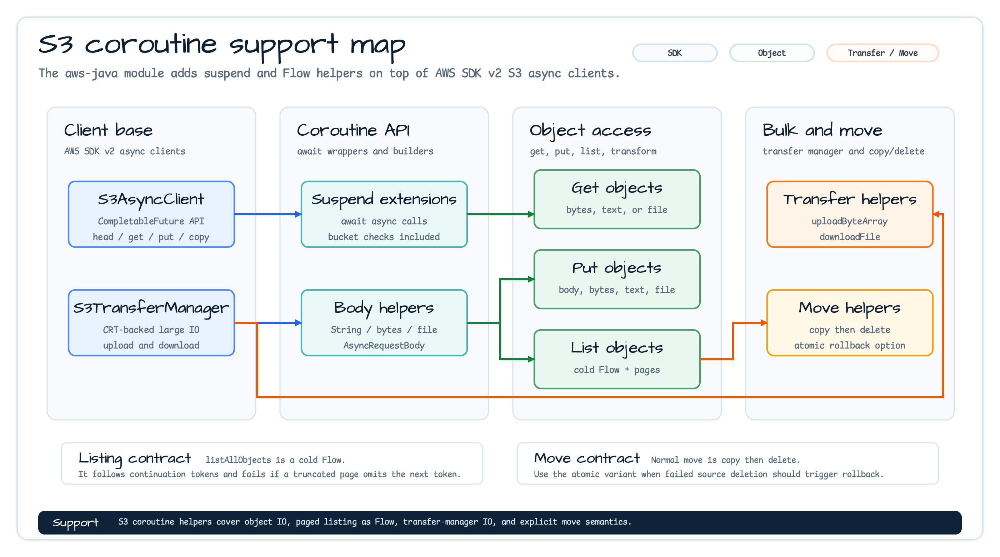

```kotlin
import io.bluetape4k.aws.s3.listAllObjects
import io.bluetape4k.aws.s3.moveObjectAtomic
import io.bluetape4k.aws.s3.putAsByteArray
import kotlinx.coroutines.flow.map
import kotlinx.coroutines.flow.toList
import software.amazon.awssdk.services.s3.S3AsyncClient

val s3: S3AsyncClient = S3AsyncClient.create()

suspend fun uploadObject(bucket: String, key: String, bytes: ByteArray) =
    s3.putAsByteArray(bucket, key, bytes) {
        contentLength(bytes.size.toLong())
    }

suspend fun listKeys(bucket: String, prefix: String): List<String> =
    s3.listAllObjects(bucket, prefix)
        .map { it.key() }
        .toList()

suspend fun archiveObject(bucket: String, key: String) =
    s3.moveObjectAtomic(
        srcBucketName = bucket,
        srcKey = key,
        destBucketName = bucket,
        destKey = "archive/$key",
    )
```

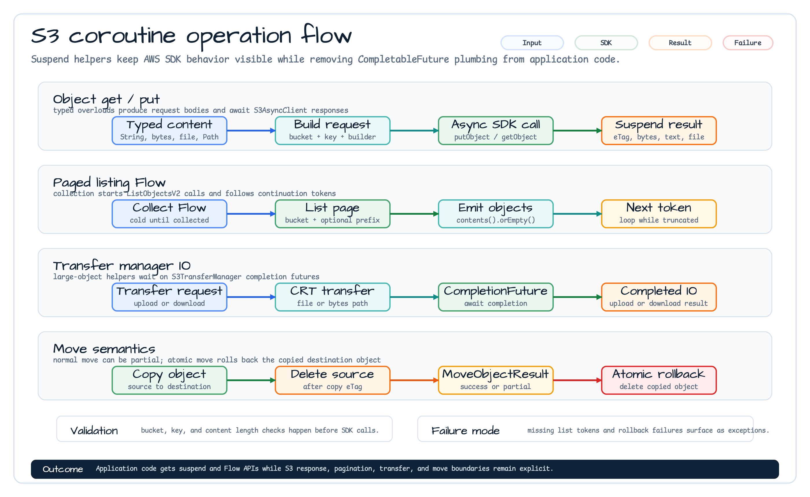

`listAllObjects` starts S3 calls only when the returned `Flow` is collected. It
continues through `nextContinuationToken` and fails fast if S3 reports a
truncated page without a token. Normal move is copy-then-delete and can be
partial; use `moveObjectAtomic` when a failed source delete should roll back the
copied destination object.

### SQS Send / Receive — Coroutines (`aws-java` module)

SQS coroutine support extends AWS SDK v2 `SqsAsyncClient` with suspend helpers
for queue discovery, single and batch send, receive, visibility changes, message
deletion, and queue deletion. The async layer validates blank queue URLs,
receive counts, and empty batch entries before the SDK call.

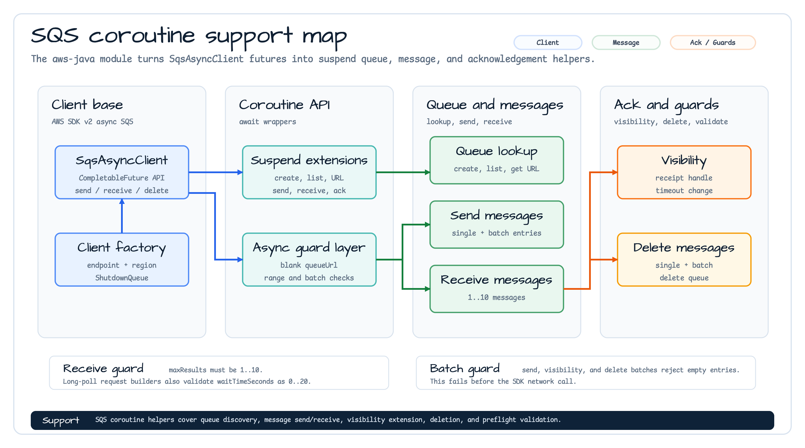

```kotlin
import io.bluetape4k.aws.sqs.changeMessageVisibility
import io.bluetape4k.aws.sqs.deleteMessage
import io.bluetape4k.aws.sqs.receiveMessages
import io.bluetape4k.aws.sqs.send
import software.amazon.awssdk.services.sqs.SqsAsyncClient

suspend fun sendMessage(client: SqsAsyncClient, queueUrl: String, body: String) =
    client.send(queueUrl, body)

suspend fun receiveMessages(client: SqsAsyncClient, queueUrl: String) =
    client.receiveMessages(queueUrl, maxResults = 10).messages()

suspend fun processOnce(client: SqsAsyncClient, queueUrl: String) {
    val message = client.receiveMessages(queueUrl, maxResults = 1).messages().firstOrNull() ?: return
    client.changeMessageVisibility(queueUrl, message.receiptHandle(), visibilityTimeout = 30)
    process(message.body())
    client.deleteMessage(queueUrl, message.receiptHandle())
}

private fun process(body: String) = Unit
```

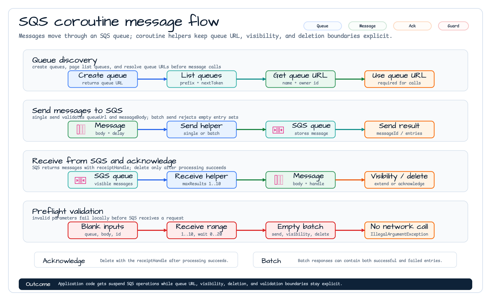

`receiveMessages` accepts `maxResults` only in the SQS range `1..10`.
Batch send, visibility, and delete helpers reject empty entry collections before
the request reaches SQS. Delete messages with the `receiptHandle` only after
processing succeeds; otherwise let the visibility timeout return the message to
the queue.

### EventBridge — Core And Framework Integration

EventBridge support covers focused event bus, rule, target, list, and
`PutEvents` helpers. EventBridge Scheduler is exposed as a separate
`io.bluetape4k.aws.scheduler` / `io.bluetape4k.aws.kotlin.scheduler` surface for
schedule and schedule-group CRUD. The Java SDK v2 module provides sync, async,
and coroutine adapters; the AWS Kotlin SDK module provides native suspend
helpers. Spring Boot adds `EventBridgeOperations`, and Ktor adds
`EventBridgeKtorPlugin`. Add `software.amazon.awssdk:eventbridge` or
`aws.sdk.kotlin:eventbridge` for event bus/rule operations, and add
`software.amazon.awssdk:scheduler` or `aws.sdk.kotlin:scheduler` for Scheduler
helpers.


`PutEvents`, `PutTargets`, and `RemoveTargets` can partially succeed. The
helpers return raw SDK responses so callers can inspect failed-entry counts and
per-entry failure details. Scheduler helpers also return raw SDK responses and
validate only bluetape4k-level request ranges such as flexible time windows,
retry policy limits, and list page sizes. Global endpoints, cross-account target
orchestration, and target-specific validation beyond SDK model types stay
outside these thin helper layers.

### DynamoDB — Native Suspend (`bluetape4k-aws-kotlin` module)

The Kotlin DynamoDB module keeps the AWS Kotlin SDK surface intact and adds a
thin support layer for client lifecycle, table helpers, request builders,
`AttributeValue` conversion, scan pagination, and batch write retries.
`withDynamoDbClient` creates a scoped client and closes it after the suspend
block, while helper builders fail fast on blank table names, blank regions, and
empty item maps.

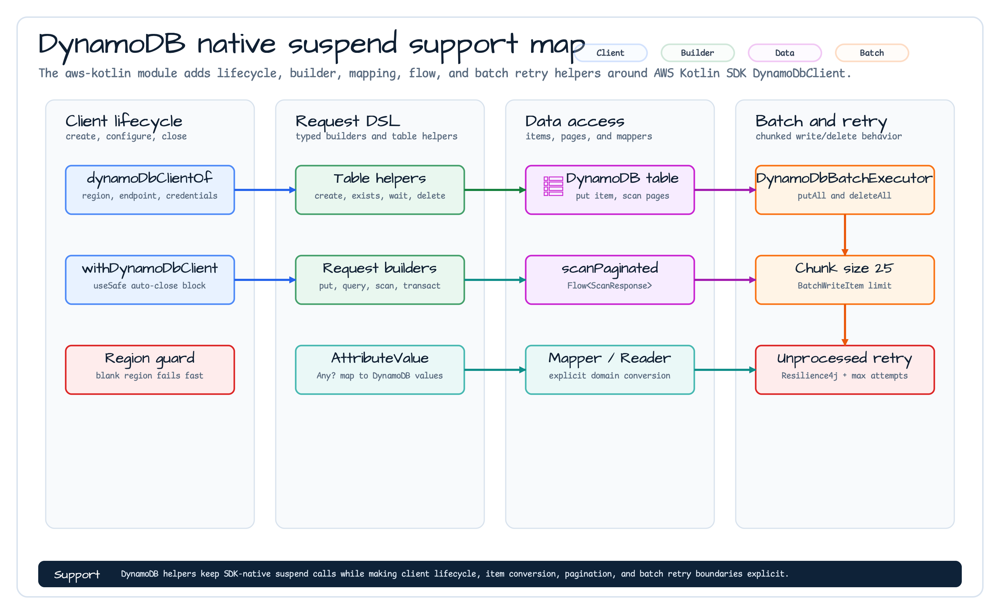

```kotlin
import aws.sdk.kotlin.services.dynamodb.model.AttributeValue
import io.bluetape4k.aws.kotlin.dynamodb.*
import io.bluetape4k.aws.kotlin.dynamodb.model.toAttributeValueMap
import kotlinx.coroutines.flow.mapNotNull
import kotlinx.coroutines.flow.toList

// One-shot: auto-close after the block
suspend fun writeAndScan(tableName: String) =
    withDynamoDbClient(region = "ap-northeast-2") { client ->
        client.putItem(tableName, mapOf("id" to "u1", "name" to "Alice"))

        client.scanPaginated(tableName, exclusiveStartKey = emptyMap(), limit = 25)
            .mapNotNull { it.items }
            .toList()
    }

data class User(val id: String, val name: String)

val userMapper = DynamoItemMapper<User> { user ->
    mapOf("id" to AttributeValue.S(user.id), "name" to AttributeValue.S(user.name))
}

val userReader = DynamoItemReader<User> { item ->
    User(id = item.getValue("id").asS(), name = item.getValue("name").asS())
}

fun userAttributes(user: User) = mapOf("id" to user.id, "name" to user.name).toAttributeValueMap()
```

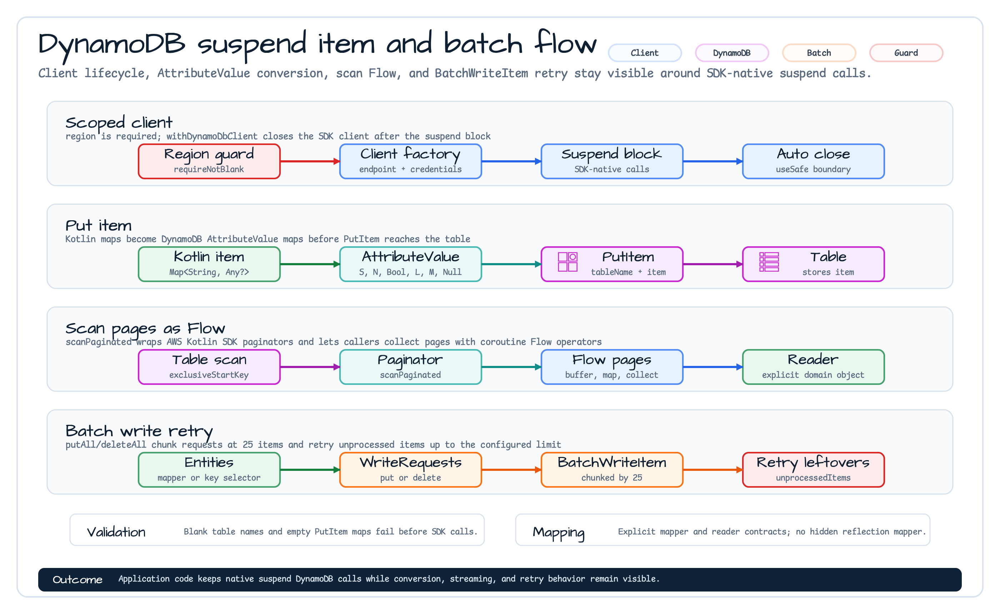

Use `DynamoDbBatchExecutor` when writes or deletes may exceed DynamoDB's
25-item `BatchWriteItem` limit. It chunks requests, applies a Resilience4j
retry, and recursively retries `unprocessedItems` until they are accepted or the
configured retry ceiling is reached.

### CloudWatch Metrics — DSL (`bluetape4k-aws-kotlin` module)

CloudWatch helpers in `bluetape4k-aws-kotlin` keep the AWS Kotlin SDK response
types intact while making the common metric path shorter: create a scoped
client, build `MetricDatum` values, validate the namespace, publish one or more
metrics, and query metric metadata with optional filters.

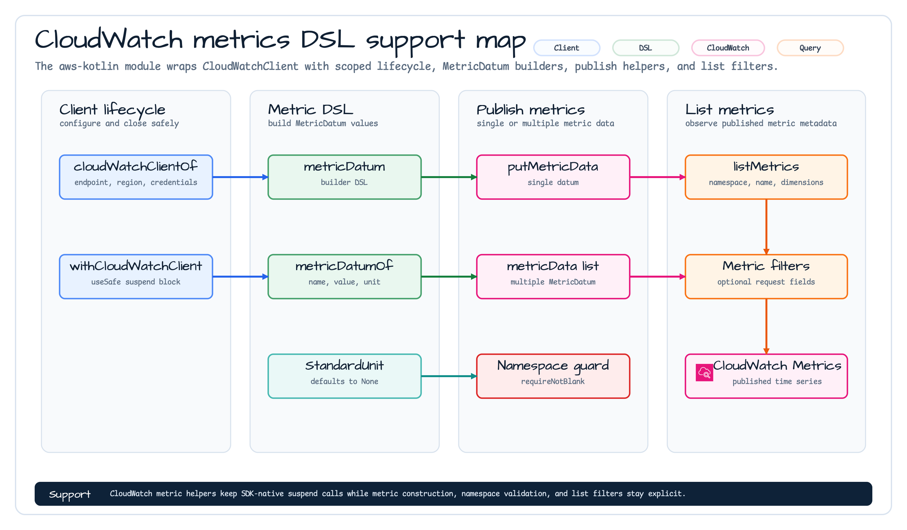

```kotlin
import aws.sdk.kotlin.services.cloudwatch.model.StandardUnit
import io.bluetape4k.aws.kotlin.cloudwatch.*
import io.bluetape4k.aws.kotlin.cloudwatch.model.metricDatumOf

suspend fun publishMetric(namespace: String, value: Double) =
    withCloudWatchClient(region = "ap-northeast-2") { client ->
        val datum = metricDatumOf(
            metricName = "RequestCount",
            value = value,
            unit = StandardUnit.Count,
        )

        client.putMetricData(namespace, datum)
        client.listMetrics(namespace = namespace, metricName = "RequestCount")
    }
```

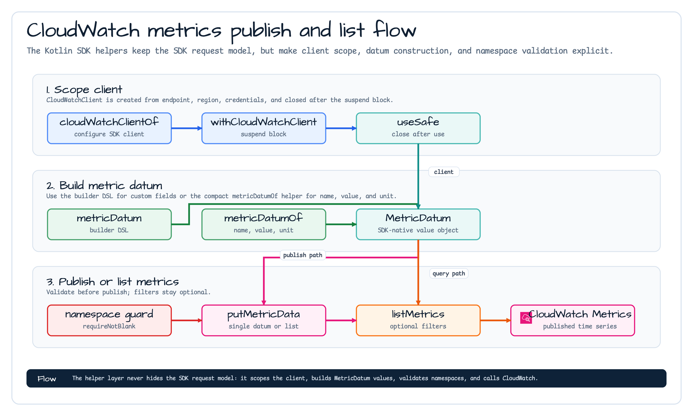

Use `metricDatumOf` for the usual name/value/unit case, or `metricDatum { ... }`
when you need extra fields such as `storageResolution`. `putMetricData` rejects
blank namespaces before the SDK request is sent; `listMetrics` leaves
`namespace`, `metricName`, and `dimensions` optional so callers can choose how
broadly to inspect CloudWatch metric metadata.

---

## Test Environment

Integration tests use Testcontainers-backed AWS emulators. The migration policy
is **Floci-first**: new or migrated emulator-aware tests should prefer Floci,
keep LocalStack as an explicit fallback, and treat MiniStack as an
evaluation-only candidate for coverage gaps until the same SDK smoke matrix
passes consistently.

| Scope | Current default | Supported override | Policy |
|---|---|---|---|
| `bluetape4k-aws-spring-boot` | Floci | `floci`, `localstack`, `ministack` | Floci-first; use MiniStack only for comparison runs |
| Java/Kotlin SDK wrapper tests | Floci | `floci`, `localstack` | Floci-first; LocalStack verifies Floci coverage gaps |
| Ktor and AWS example tests | Floci | `floci`, `localstack` where emulator-aware | Floci-first; LocalStack verifies Floci coverage gaps |

Override the emulator per test task with `-Dbluetape4k.aws.emulator=...` when
the module supports it. Do not change repository-wide defaults based on service
count claims alone; prove the exact AWS SDK calls used by the module.

Testcontainer launchers are shared only within a single module test JVM.
Committed tests, examples, application startup paths, and CI must not enable
Docker-level container reuse implicitly. A developer who needs local-only
container reuse for an experiment must instantiate the wrapper explicitly with
`reuse = true` outside repository defaults and keep that choice out of CI.

```bash
# Core Floci-first modules
./gradlew :bluetape4k-aws-java:test
./gradlew :bluetape4k-aws-kotlin:test
./gradlew :bluetape4k-aws-spring-boot:test
./gradlew :bluetape4k-aws-ktor:test
./gradlew :aws-ktor-dynamodb-examples:test
./gradlew :aws-ktor-sqs-examples:test
./gradlew :aws-ktor-service-coverage-examples:test
./gradlew :aws-spring-boot-dynamodb-examples:test
./gradlew :aws-spring-boot-s3-examples:test
./gradlew :aws-spring-boot-sqs-examples:test

# Explicit fallback for emulator coverage gaps
./gradlew :bluetape4k-aws-java:test -Dbluetape4k.aws.emulator=localstack
./gradlew :bluetape4k-aws-kotlin:test -Dbluetape4k.aws.emulator=localstack
./gradlew :bluetape4k-aws-ktor:test -Dbluetape4k.aws.emulator=localstack

# Comparison-only smoke run, where supported
./gradlew :bluetape4k-aws-spring-boot:test -Dbluetape4k.aws.emulator=ministack
```

---

## License

MIT License — see [LICENSE](LICENSE).
