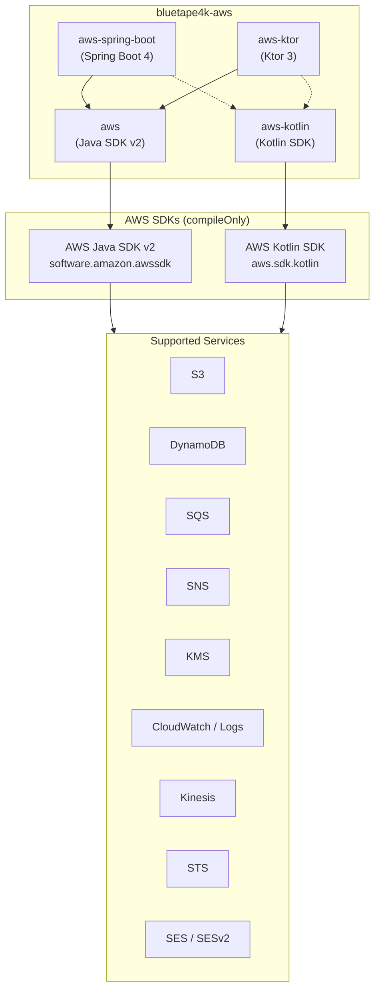
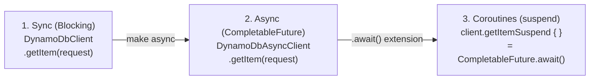
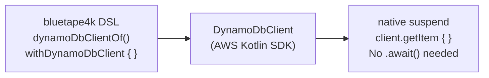
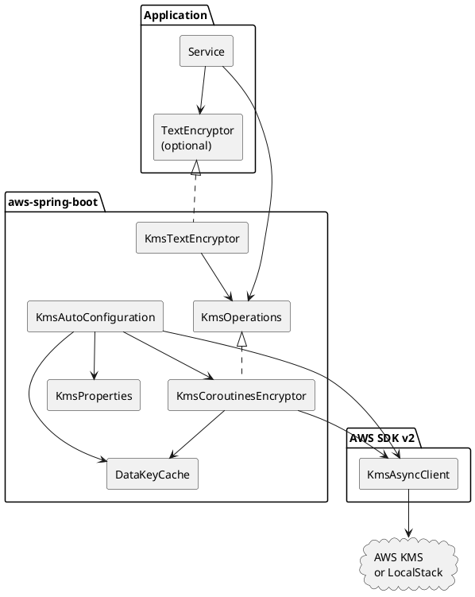
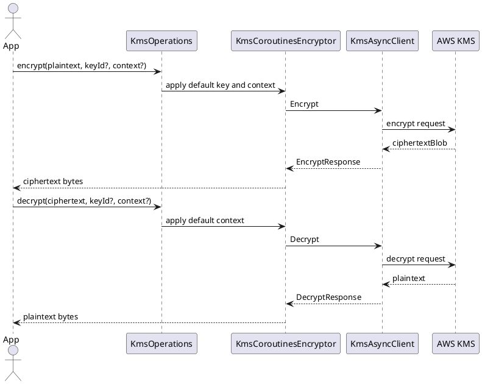

# bluetape4k-aws

[](https://github.com/bluetape4k/bluetape4k-aws/actions/workflows/ci.yml)
[](https://kotlinlang.org)
[](https://openjdk.org)
[](LICENSE)

English | [한국어](./README.ko.md)


Kotlin/JVM wrappers for **AWS Java SDK v2** and the **AWS Kotlin SDK**, with Kotlin Coroutines
support, Spring Boot 4 auto-configuration, and Ktor 3 integration. Part of the
[bluetape4k](https://github.com/bluetape4k) ecosystem.

---

## Project Purpose

`bluetape4k-aws` keeps AWS service access idiomatic for Kotlin services. It
bridges the Java SDK v2 async model, the AWS Kotlin SDK suspend model, Spring
Boot 4 auto-configuration, and Ktor 3 HTTP integration without forcing
applications to adopt a single framework or dependency stack.

## What It Provides

- **Kotlin-first AWS clients** — coroutine adapters for Java SDK v2 plus native
  AWS Kotlin SDK helpers and DSL builders.
- **Service coverage** — DynamoDB, S3, SES/SESv2, SNS, SQS, KMS, CloudWatch,
  CloudWatch Logs, Kinesis, and STS.
- **Spring Boot 4 operations** — coroutine-oriented templates, repositories,
  listeners, and auto-configuration without awspring.
- **Ktor 3 integration** — SigV4 signing, coroutine S3 client support, SQS
  consumer runtime, DynamoDB server repository support, and Ktor server/client
  examples.
- **Local integration testing** — LocalStack/FLOCI emulator wiring through
  Testcontainers and Nightly examples.

## Modules

| Module | Artifact | Description |
|---|---|---|
| `aws` | `io.github.bluetape4k.aws:aws` | AWS Java SDK v2 wrappers. Sync, async (`CompletableFuture`), and Coroutines extensions for DynamoDB, S3, SES/v2, SNS, SQS, KMS, CloudWatch, CloudWatch Logs, Kinesis, STS |
| `aws-kotlin` | `io.github.bluetape4k.aws:aws-kotlin` | AWS Kotlin SDK wrappers. Native `suspend` functions + DSL builders for DynamoDB, S3, SES/v2, SNS, SQS, KMS, CloudWatch, CloudWatch Logs, Kinesis, STS |
| `aws-spring-boot` | `io.github.bluetape4k.aws:aws-spring-boot` | Spring Boot 4 auto-configuration for AWS services (WIP — Coroutines-native, no awspring dependency) |
| `aws-ktor` | `io.github.bluetape4k.aws:aws-ktor` | Ktor 3 SigV4 client plugin, coroutine-friendly S3 REST client, SQS consumer runtime, and DynamoDB server repository plugin |
| `aws-ktor-s3-examples` | not published | LocalStack-oriented examples for `S3KtorClient`; compiled and tested in Nightly |
| `aws-spring-boot-s3-examples` | not published | Spring Boot 4 WebFlux examples for `S3Operations`/`S3CoroutinesTemplate`; compiled and tested in Nightly |

---

## Architecture

### Overview



### Three-Tier API (`aws` module — Java SDK v2)



### Native Suspend (`aws-kotlin` module — Kotlin SDK)



---

## Requirements

- **JDK**: 21+
- **Kotlin**: 2.3+
- **Gradle**: 8.x

---

## Installation

AWS service SDKs are declared as `compileOnly` in this library. Add only the service dependencies
you need at runtime.

### Using `aws` (Java SDK v2 wrappers)

```kotlin
dependencies {
    implementation("io.github.bluetape4k.aws:aws:0.1.0-SNAPSHOT")

    // Add the AWS Java SDK v2 services you use
    implementation(platform("software.amazon.awssdk:bom:${awsSdkVersion}"))
    implementation("software.amazon.awssdk:dynamodb-enhanced")
    implementation("software.amazon.awssdk:s3")
    implementation("software.amazon.awssdk:s3-transfer-manager")
    implementation("software.amazon.awssdk:secretsmanager")
    implementation("software.amazon.awssdk:sqs")
    implementation("software.amazon.awssdk:ssm")
    implementation("software.amazon.awssdk:sns")
    implementation("software.amazon.awssdk:kms")
    implementation("software.amazon.awssdk:cloudwatch")
    implementation("software.amazon.awssdk:cloudwatchlogs")
    implementation("software.amazon.awssdk:kinesis")
    implementation("software.amazon.awssdk:sts")
}
```

> For Maven Central Snapshots, add the repository:
> ```kotlin
> repositories {
>     maven("https://central.sonatype.com/repository/maven-snapshots/")
> }
> ```

### Using `aws-kotlin` (Kotlin SDK wrappers)

```kotlin
dependencies {
    implementation("io.github.bluetape4k.aws:aws-kotlin:0.1.0-SNAPSHOT")

    // Add the AWS Kotlin SDK services you use
    implementation("aws.sdk.kotlin:dynamodb:${awsKotlinSdkVersion}")
    implementation("aws.sdk.kotlin:s3:${awsKotlinSdkVersion}")
    implementation("aws.sdk.kotlin:sqs:${awsKotlinSdkVersion}")
    implementation("aws.sdk.kotlin:sns:${awsKotlinSdkVersion}")
    implementation("aws.sdk.kotlin:kms:${awsKotlinSdkVersion}")
    implementation("aws.sdk.kotlin:cloudwatch:${awsKotlinSdkVersion}")
    implementation("aws.sdk.kotlin:kinesis:${awsKotlinSdkVersion}")
    implementation("aws.sdk.kotlin:sts:${awsKotlinSdkVersion}")
}
```

### Using `aws-spring-boot` (Spring Boot 4 auto-configuration)

```kotlin
dependencies {
    implementation("io.github.bluetape4k.aws:aws-spring-boot:0.1.0-SNAPSHOT")

    // Add the AWS Java SDK v2 services you use at runtime.
    implementation(platform("software.amazon.awssdk:bom:${awsSdkVersion}"))
    implementation("software.amazon.awssdk:dynamodb-enhanced")
    implementation("software.amazon.awssdk:kms")
    implementation("software.amazon.awssdk:s3")
    implementation("software.amazon.awssdk:secretsmanager")
    implementation("software.amazon.awssdk:sns")
    implementation("software.amazon.awssdk:sqs")

    // Optional: only needed if you want the Spring Security TextEncryptor adapter.
    implementation("org.springframework.security:spring-security-crypto")
    implementation("software.amazon.awssdk:ssm")
}
```

Use this module when your application wants Spring-managed AWS clients and coroutine-friendly service
helpers. The library does not pull every AWS SDK service at runtime; add only the AWS SDK modules
you actually use. For KMS, add `software.amazon.awssdk:kms`. Add `spring-security-crypto` only when
you want to inject Spring Security's synchronous `TextEncryptor`.

```yaml
bluetape4k:
  aws:
    kms:
      region: ap-northeast-2
      endpoint-override: http://localhost:4566
      key-id: alias/app-secrets
      encryption-context:
        service: order-api
      data-key-cache:
        enabled: true
        max-size: 64
        ttl: PT5M
    s3:
      region: ap-northeast-2
      endpoint-override: http://localhost:4566
      path-style-access-enabled: true
      presign:
        duration: PT15M
    dynamodb:
      region: ap-northeast-2
      endpoint-override: http://localhost:4566
      table-prefix: local-
    sqs:
      region: ap-northeast-2
      endpoint-override: http://localhost:4566
      listener:
        max-messages: 10
        wait-time-seconds: 20
        concurrency: 2
    secrets-manager:
      region: ap-northeast-2
      endpoint-override: http://localhost:4566
      sources:
        - name: app-secret
          secret-id: local/app
          prefix: app
    parameter-store:
      region: ap-northeast-2
      endpoint-override: http://localhost:4566
      sources:
        - name: app-parameters
          path: /config/app
          prefix: app
          recursive: true
          with-decryption: true
    sns:
      region: ap-northeast-2
      endpoint-override: http://localhost:4566
      topics:
        orders.fifo:
          fifo: true
          content-based-deduplication: true
          fifo-throughput-scope: message-group
```

KMS is intended for small secrets and key management, not for bulk payload encryption. Use
`KmsOperations.encrypt` directly for short values such as tokens, credentials, or configuration
secrets. For larger data, call `generateDataKey`, encrypt the payload locally with the plaintext data
key, and store the encrypted data key with the payload metadata. The built-in `DataKeyCache` can reuse
plaintext data keys briefly, but this is sensitive in-memory key material; keep the TTL and cache size
small.

#### KMS Spring Boot Components



#### KMS Encrypt / Decrypt Flow



---

## Usage

### S3 — Spring Boot Coroutines Template

```kotlin
import io.bluetape4k.aws.spring.s3.S3Operations
import io.bluetape4k.aws.spring.s3.S3TransferOperations
import java.nio.file.Path

class DocumentStorage(
    private val s3: S3Operations,
    private val transfer: S3TransferOperations,
) {
    suspend fun save(bucket: String, key: String, contents: String) {
        s3.upload(bucket, key, contents, contentType = "text/plain")
    }

    suspend fun read(bucket: String, key: String): String =
        s3.downloadText(bucket, key)

    suspend fun saveLargeFile(bucket: String, key: String, source: Path) {
        transfer.uploadFile(bucket, key, source)
    }
}
```

`S3Operations` covers small/common object operations, resources, listing, and
presigned URLs. `S3TransferOperations` is auto-configured only when
`software.amazon.awssdk:s3-transfer-manager` is on the classpath and is intended
for large files, multipart transfers, and transfer listeners. For CRT-backed
throughput tuning, add the AWS CRT runtime dependency and provide a CRT-backed
`S3AsyncClient`; the Spring auto-configuration reuses that client for transfer
manager construction.

### DynamoDB — Spring Boot Coroutine Repository

```kotlin
import io.bluetape4k.aws.spring.dynamodb.AbstractCoroutinesDynamoDbRepository
import io.bluetape4k.aws.spring.dynamodb.DynamoDbTableNameResolver
import software.amazon.awssdk.enhanced.dynamodb.DynamoDbEnhancedAsyncClient
import software.amazon.awssdk.enhanced.dynamodb.Key

class OrderRepository(
    enhancedClient: DynamoDbEnhancedAsyncClient,
    tableNameResolver: DynamoDbTableNameResolver,
) : AbstractCoroutinesDynamoDbRepository<OrderDocument, OrderId>(
    enhancedClient = enhancedClient,
    tableNameResolver = tableNameResolver,
    entityClass = OrderDocument::class.java,
) {
    override val tableName: String = "orders"

    override fun keyFromId(id: OrderId): Key =
        Key.builder().partitionValue(id.orderId).sortValue(id.createdAt).build()
}
```

`aws-spring-boot` does not create DynamoDB tables automatically. Create tables
through migrations, deployment automation, or explicit test setup.

### Secrets Manager and Parameter Store — Environment Sources

Secrets Manager and SSM Parameter Store sources are loaded during Spring
Environment post-processing, before normal `@ConfigurationProperties` binding.
No remote lookup is performed unless at least one source is configured.

```kotlin
import org.springframework.boot.context.properties.ConfigurationProperties

@ConfigurationProperties("app.db")
data class DatabaseSettings(
    val username: String,
    val password: String,
)
```

For a JSON secret such as `{"db":{"username":"scott","password":"tiger"}}`
with `prefix: app`, the properties become `app.db.username` and
`app.db.password`. For Parameter Store path `/config/app/db/password` with
`path: /config/app` and `prefix: app`, the property becomes `app.db.password`.

### SQS — Spring Boot Coroutines Template and Listener

```kotlin
import io.bluetape4k.aws.spring.sqs.SqsListener
import io.bluetape4k.aws.spring.sqs.SqsOperations

class OrderQueue(
    private val sqs: SqsOperations,
) {
    suspend fun send(queueUrl: String, payload: String) {
        sqs.send(queueUrl, payload)
    }

    @SqsListener("\${orders.queue-url}")
    suspend fun handle(body: String) {
        // Make handlers idempotent; failed messages are not deleted automatically.
        process(body)
    }
}
```

### KMS — Spring Boot Coroutines Encryptor

```kotlin
import io.bluetape4k.aws.spring.kms.KmsOperations
import java.util.Base64

class SecretVault(
    private val kms: KmsOperations,
) {
    suspend fun protectToken(token: String): String {
        val ciphertext = kms.encrypt(
            plaintext = token.encodeToByteArray(),
            encryptionContext = mapOf("purpose" to "api-token"),
        )
        return Base64.getEncoder().encodeToString(ciphertext)
    }

    suspend fun revealToken(encodedCiphertext: String): String {
        val plaintext = kms.decrypt(
            ciphertext = Base64.getDecoder().decode(encodedCiphertext),
            encryptionContext = mapOf("purpose" to "api-token"),
        )
        return plaintext.decodeToString()
    }
}
```

The encryption context is authenticated metadata. Use the same context for decrypt that you used for
encrypt, and put stable identifiers such as `service`, `tenant`, or `purpose` in it. Do not put
secrets in the context because AWS logs and policies may expose it.

### KMS — Spring Security `TextEncryptor`

```kotlin
import org.springframework.security.crypto.encrypt.TextEncryptor

class PropertyProtector(
    private val textEncryptor: TextEncryptor,
) {
    fun encrypt(value: String): String =
        textEncryptor.encrypt(value)

    fun decrypt(value: String): String =
        textEncryptor.decrypt(value)
}
```

`TextEncryptor` is synchronous, so this adapter is best for short administrative flows or startup-time
secret handling. Prefer `KmsOperations` in coroutine services.
### SNS — Spring Boot Coroutines Template

```kotlin
import io.bluetape4k.aws.spring.sns.SnsOperations
import io.bluetape4k.aws.spring.sns.SnsHttpMessageParser
import io.bluetape4k.aws.spring.sns.SnsHttpMessageType
import io.bluetape4k.aws.spring.sns.SnsPublishRequest
import io.bluetape4k.aws.spring.sns.SnsSmsRequest
import io.bluetape4k.aws.spring.sns.SnsSmsType

class OrderTopic(
    private val sns: SnsOperations,
) {
    suspend fun publish(topicArn: String, payload: String): String {
        val response = sns.publish(
            SnsPublishRequest(
                topicArn = topicArn,
                message = payload,
            )
        )
        return response.messageId()
    }

    suspend fun sendSms(phoneNumber: String, text: String): String =
        sns.publishSms(
            SnsSmsRequest(
                phoneNumber = phoneNumber,
                message = text,
                smsType = SnsSmsType.TRANSACTIONAL,
                senderId = "BLUETAPE",
            )
        ).messageId()

    suspend fun handleHttpEndpoint(body: String, messageTypeHeader: String?) {
        val message = SnsHttpMessageParser.parse(body, messageTypeHeader)
        // Verify Signature, SigningCertURL, SignatureVersion, and expected TopicArn here.
        when (message.type) {
            SnsHttpMessageType.SUBSCRIPTION_CONFIRMATION,
            SnsHttpMessageType.UNSUBSCRIBE_CONFIRMATION -> sns.confirmSubscription(message)
            SnsHttpMessageType.NOTIFICATION -> processNotification(message.message)
        }
    }

    private fun processNotification(message: String) = Unit
}
```

SNS can publish to an SQS subscription when the queue policy allows
`sqs:SendMessage` from the topic ARN. The full SQS-SNS application example is
tracked separately in issue #13. `SnsHttpMessageParser` maps SNS HTTP JSON,
checks the optional `x-amz-sns-message-type` header, and rejects non-HTTPS or
non-SNS `SigningCertURL` hosts, but it does not validate SNS signatures.
Validate the certificate chain, `Signature`, `SignatureVersion`, and expected
`TopicArn` before processing notifications or confirming subscriptions.

### S3 Upload — Coroutines (`aws` module)

```kotlin
import io.bluetape4k.aws.s3.coroutines.*
import software.amazon.awssdk.services.s3.S3AsyncClient

val s3: S3AsyncClient = S3AsyncClient.create()

suspend fun uploadObject(bucket: String, key: String, bytes: ByteArray) =
    s3.putObjectSuspend(bucket, key) {
        it.contentLength(bytes.size.toLong())
    }
```

### SQS Send / Receive — Coroutines (`aws` module)

```kotlin
import io.bluetape4k.aws.sqs.coroutines.*

suspend fun sendMessage(client: SqsAsyncClient, queueUrl: String, body: String) =
    client.sendMessageSuspend {
        it.queueUrl(queueUrl).messageBody(body)
    }

suspend fun receiveMessages(client: SqsAsyncClient, queueUrl: String) =
    client.receiveMessageSuspend {
        it.queueUrl(queueUrl).maxNumberOfMessages(10)
    }.messages()
```

### DynamoDB — Native Suspend (`aws-kotlin` module)

```kotlin
import aws.sdk.kotlin.services.dynamodb.DynamoDbClient
import io.bluetape4k.aws.kotlin.dynamodb.*

// One-shot: auto-close after the block
suspend fun getItem(tableName: String, key: Map<String, AttributeValue>) =
    withDynamoDbClient(region = "ap-northeast-2") { client ->
        client.getItem {
            this.tableName = tableName
            this.key = key
        }
    }
```

### CloudWatch Metrics — DSL (`aws-kotlin` module)

```kotlin
import io.bluetape4k.aws.kotlin.cloudwatch.*
import aws.sdk.kotlin.services.cloudwatch.CloudWatchClient

val cw = CloudWatchClient { region = "ap-northeast-2" }

suspend fun publishMetric(namespace: String, value: Double) {
    cw.putMetricData {
        this.namespace = namespace
        metricData = listOf(
            metricDatum {                // bluetape4k DSL
                metricName = "RequestCount"
                this.value = value
                unit = StandardUnit.Count
            }
        )
    }
}
```

---

## Test Environment

Integration tests use **LocalStack** (default) or **Floci** as a local AWS emulator, started
automatically via Testcontainers.

```bash
# Run with LocalStack (default)
./gradlew :aws:test
./gradlew :aws-kotlin:test

# Run with Floci emulator
./gradlew :aws:test -Dbluetape4k.aws.emulator=floci
./gradlew :aws-kotlin:test -Dbluetape4k.aws.emulator=floci
```

---

## License

MIT License — see [LICENSE](LICENSE).
