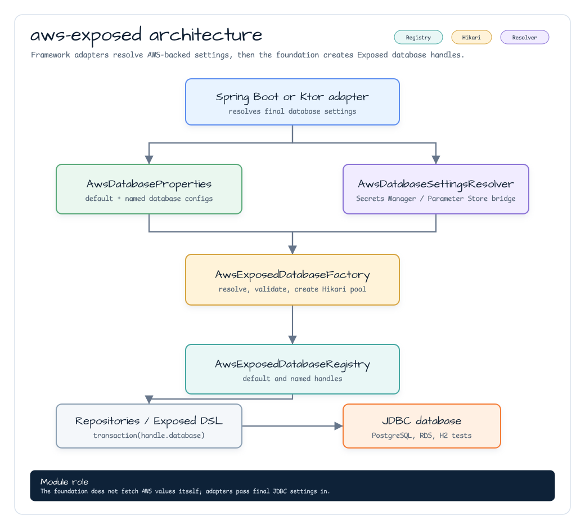
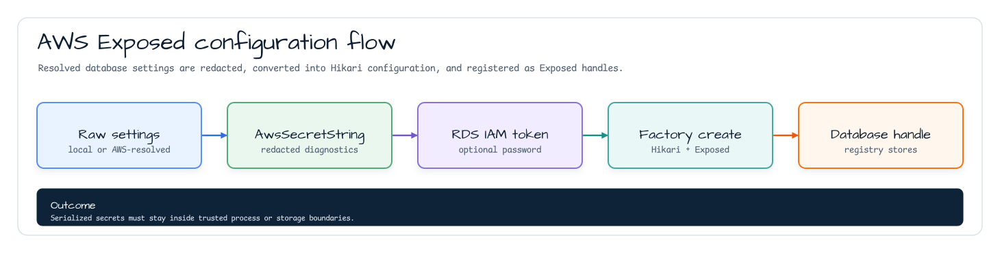
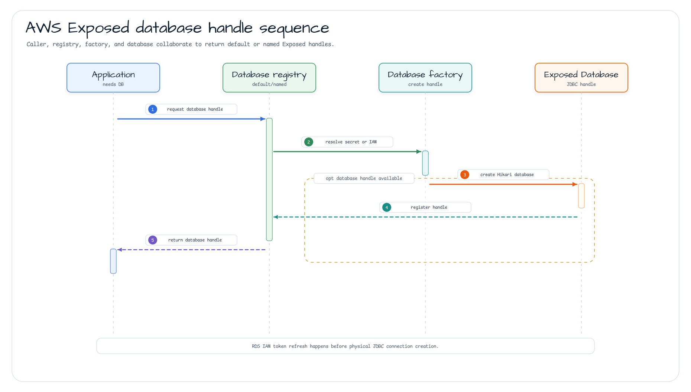

# bluetape4k-aws-exposed

[English](README.md) | [한국어](README.ko.md)

Shared Exposed JDBC foundation for AWS-backed database configuration.

## Features

- `AwsDatabaseProperties` for default and named databases.
- `AwsDatabaseSettingsResolver` for framework-specific Secrets Manager or
  Parameter Store resolution.
- `AwsSecretString` for redacted password diagnostics.
- `AwsDatabaseAuthenticationMode.RDS_IAM` for Amazon RDS IAM database
  authentication tokens.
- `AwsExposedDatabaseFactory` for Hikari-backed Exposed `Database` creation.
- `AwsExposedDatabaseRegistry` for default and named handles.

This module does not fetch AWS values by itself. Spring Boot and Ktor adapters
resolve AWS configuration and pass the final JDBC settings to this foundation.
`AwsSecretString` redacts diagnostic output, but Java-serialized bytes still
contain the raw secret and must stay inside trusted process or storage
boundaries.

## Diagrams

### Module Architecture



### Configuration Flow



### Database Handle Sequence



## Dependency

```kotlin
dependencies {
    implementation("io.github.bluetape4k.aws:bluetape4k-aws-exposed:0.2.2")
}
```

RDS IAM authentication mode also needs the AWS SDK RDS module on the runtime
classpath:

```kotlin
dependencies {
    runtimeOnly("software.amazon.awssdk:rds")
}
```

## Usage

### Static Password

```kotlin
val factory = AwsExposedDatabaseFactory()
val handle = factory.create(
    properties = AwsDatabaseConnectionProperties(
        url = "jdbc:postgresql://localhost:5432/app",
        driverClassName = "org.postgresql.Driver",
        username = "app",
        password = AwsSecretString.of("secret"),
    )
)

transaction(handle.database) {
    // Run bluetape4k-exposed repositories or Exposed DSL here.
}
```

### RDS IAM Authentication

```kotlin
val handle = factory.create(
    properties = AwsDatabaseConnectionProperties(
        url = "jdbc:postgresql://database-1.cluster-example.ap-northeast-2.rds.amazonaws.com:5432/app",
        driverClassName = "org.postgresql.Driver",
        username = "app_user",
        authenticationMode = AwsDatabaseAuthenticationMode.RDS_IAM,
        rdsIam = AwsRdsIamAuthenticationProperties(
            region = "ap-northeast-2",
            hostname = "database-1.cluster-example.ap-northeast-2.rds.amazonaws.com",
            port = 5432,
        ),
        dataSourceProperties = mapOf("sslmode" to "require"),
    )
)
```

RDS IAM mode signs a fresh token before Hikari opens a physical JDBC
connection. The SDK-backed generator delegates signing to the shared
`bluetape4k-aws-java` RDS IAM helper, then adapts the redacted core token to
the JDBC-facing `AwsSecretString`. Tokens are treated as JDBC password
substitutes, cached only until the refresh window, and generated without a real
AWS network call by `RdsUtilities`. AWS credentials may still be resolved
through the configured AWS SDK credential chain.

Use the real RDS endpoint hostname in `AwsRdsIamAuthenticationProperties`; AWS
does not support generating IAM database authentication tokens against a custom
Route 53 DNS alias. Configure engine-specific TLS JDBC properties yourself, for
example `sslmode=require` for PostgreSQL. The caller's IAM principal needs
`rds-db:connect` permission for the target DB resource ARN:

```text
arn:aws:rds-db:{region}:{account-id}:dbuser:{dbi-resource-id}/{db-user-name}
```

### Named Database Handles

`AwsDatabaseProperties.defaultDatabase` is always exposed through the reserved
handle name `default`. Use a different key for each `namedDatabases` entry so
registry lookup cannot collide with the default handle.

## Local Verification

```bash
./gradlew :bluetape4k-aws-exposed:test
```

Tests use H2 and PostgreSQL Testcontainers. They do not require real AWS
credentials.
