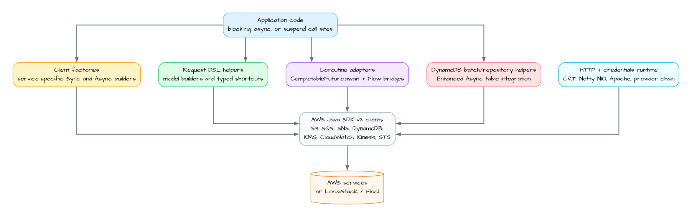
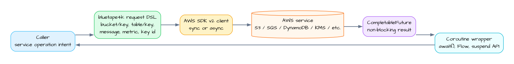
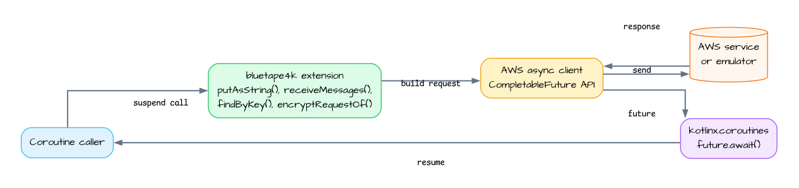

# Module bluetape4k-aws-java

[English](./README.md) | 한국어

AWS Java SDK v2 기반 단일 통합 모듈입니다. DynamoDB, S3, SES, SNS, SQS, KMS, CloudWatch, Kinesis, STS 등 주요 AWS 서비스를 Async/Non-Blocking 방식 및 Kotlin Coroutines로 사용할 수 있도록 지원합니다.

## 아키텍처

### Architecture



### Operation Flow



### Coroutine Sequence



## 제공 서비스

| 서비스                 | 주요 기능                                                   |
|---------------------|---------------------------------------------------------|
| **DynamoDB**        | 테이블 CRUD, Enhanced Client, Coroutines 확장                |
| **S3**              | 객체 업로드/다운로드, TransferManager(대용량), Coroutines 확장        |
| **SES**             | 이메일 발송, Coroutines 확장                                   |
| **SNS**             | 토픽 발행, SMS, 푸시 알림, Coroutines 확장                        |
| **SQS**             | 메시지 발송/수신/삭제, Coroutines 확장                             |
| **KMS**             | 암호화 키 관리, 요청 DSL, Sync/Async 클라이언트 빌더                    |
| **CloudWatch**      | 메트릭 발행/조회, Coroutines 확장                                |
| **CloudWatch Logs** | 로그 그룹/스트림 관리, 이벤트 전송, Coroutines 확장                     |
| **Kinesis**         | 스트림 레코드 전송/조회, Coroutines 확장                            |
| **STS**             | AssumeRole, CallerIdentity, SessionToken, Coroutines 확장 |

## 3단계 API 패턴

각 서비스는 3단계 API를 제공합니다:

```
sync (blocking) → async (CompletableFuture) → coroutines (suspend)
```

코루틴 확장이 제공되는 API는 `CompletableFuture`를 `.await()` 확장 함수로 래핑하므로, 코루틴 컨텍스트에서 스레드 블로킹 없이 사용할 수 있습니다.
서비스 SDK와 코루틴 헬퍼 아티팩트는 `compileOnly`로 유지되므로 애플리케이션은 실제 사용하는 AWS SDK 및 코루틴 런타임 모듈을 추가해야 합니다.

## 사용 예시

### DynamoDB Enhanced Async Table

```kotlin
import io.bluetape4k.aws.dynamodb.enhanced.getItem
import kotlinx.coroutines.future.await
import software.amazon.awssdk.enhanced.dynamodb.DynamoDbAsyncTable

suspend fun saveAndLoad(table: DynamoDbAsyncTable<UserDocument>, user: UserDocument): UserDocument? {
    table.putItem(user).await()
    return table.getItem(partitionValue = user.id)
}
```

### S3 Async Client

```kotlin
import io.bluetape4k.aws.s3.getAsString
import io.bluetape4k.aws.s3.listAllObjects
import io.bluetape4k.aws.s3.putAsString
import kotlinx.coroutines.flow.toList
import software.amazon.awssdk.services.s3.S3AsyncClient

suspend fun writeThenRead(client: S3AsyncClient, bucket: String, key: String): String {
    client.putAsString(bucket, key, "hello")
    return client.getAsString(bucket, key)
}

suspend fun listLogKeys(client: S3AsyncClient, bucket: String): List<String> =
    client.listAllObjects(bucket, prefix = "logs/")
        .toList()
        .mapNotNull { it.key() }
```

### SQS Coroutine Extensions

```kotlin
import io.bluetape4k.aws.sqs.receiveMessages
import io.bluetape4k.aws.sqs.send
import software.amazon.awssdk.services.sqs.SqsAsyncClient

suspend fun sendMessage(client: SqsAsyncClient, queueUrl: String, body: String) =
    client.send(queueUrl, body)

suspend fun receiveMessages(client: SqsAsyncClient, queueUrl: String) =
    client.receiveMessages(queueUrl, maxResults = 10).messages()
```

### SNS Coroutine Extensions

```kotlin
import io.bluetape4k.aws.sns.createTopic
import software.amazon.awssdk.services.sns.SnsAsyncClient

suspend fun createTopic(client: SnsAsyncClient, topicName: String) =
    client.createTopic(topicName)
```

### KMS Request DSL

```kotlin
import io.bluetape4k.aws.kms.model.encryptRequestOf
import software.amazon.awssdk.core.SdkBytes

val request = encryptRequestOf(
    keyId = "alias/my-key",
    plainText = SdkBytes.fromUtf8String("plain-text"),
)
```

### CloudWatch Coroutine Extensions

```kotlin
import io.bluetape4k.aws.cloudwatch.putMetricData
import software.amazon.awssdk.services.cloudwatch.CloudWatchAsyncClient
import software.amazon.awssdk.services.cloudwatch.model.MetricDatum
import software.amazon.awssdk.services.cloudwatch.model.StandardUnit

suspend fun publishMetric(client: CloudWatchAsyncClient, namespace: String, value: Double) =
    client.putMetricData(
        namespace = namespace,
        metricDatum = MetricDatum.builder()
            .metricName("RequestCount")
            .value(value)
            .unit(StandardUnit.COUNT)
            .build()
    )
```

### Kinesis Coroutine Extensions

```kotlin
import io.bluetape4k.aws.kinesis.putRecord
import software.amazon.awssdk.core.SdkBytes
import software.amazon.awssdk.services.kinesis.KinesisAsyncClient

suspend fun putRecord(client: KinesisAsyncClient, streamName: String, data: ByteArray) =
    client.putRecord(
        streamName = streamName,
        partitionKey = "default",
        data = SdkBytes.fromByteArray(data),
    )
```

## 테스트 환경

공유 AWS 테스트 베이스에서 `LocalStackServer`를 사용해 통합 테스트를 실행합니다.

```kotlin
abstract class AbstractAwsTest {
    companion object {
        val awsEmulator: LocalStackServer by lazy {
            LocalStackServer.Launcher.getLocalStack("s3", "sqs", "dynamodb")
        }
    }

    fun buildS3Client(): S3Client = S3Client.builder()
        .endpointOverride(awsEmulator.endpoint)
        .credentialsProvider(awsEmulator.credentialsProvider)
        .region(Region.of(awsEmulator.region))
        .build()
}
```

`bluetape4k-aws-java` 모듈 테스트 실행:

```bash
./gradlew :bluetape4k-aws-java:test
```

## 설치

AWS SDK 서비스와 코루틴 헬퍼는 `compileOnly`로 선언되어 있으므로, 사용할 API에 필요한 런타임 의존성을 애플리케이션에서 추가해야 합니다.

```kotlin
dependencies {
    implementation("io.github.bluetape4k.aws:bluetape4k-aws-java:${bluetape4kVersion}")

    // 공개 코루틴 확장과 Flow 어댑터 사용 시 필요
    implementation("io.github.bluetape4k:bluetape4k-coroutines:${bluetape4kVersion}")
    implementation(platform("org.jetbrains.kotlinx:kotlinx-coroutines-bom:${coroutinesVersion}"))
    implementation("org.jetbrains.kotlinx:kotlinx-coroutines-core")
    implementation("org.jetbrains.kotlinx:kotlinx-coroutines-reactive")

    // 사용할 AWS 서비스만 선택적으로 추가
    implementation(platform("software.amazon.awssdk:bom:${awsSdkVersion}"))
    implementation("software.amazon.awssdk:dynamodb-enhanced")
    implementation("software.amazon.awssdk:s3")
    implementation("software.amazon.awssdk:s3-transfer-manager")
    implementation("software.amazon.awssdk:sqs")
    implementation("software.amazon.awssdk:sns")
    implementation("software.amazon.awssdk:kms")
    implementation("software.amazon.awssdk:cloudwatch")
    implementation("software.amazon.awssdk:kinesis")
    implementation("software.amazon.awssdk:sts")
    // ... 필요한 서비스 추가
}
```
