# Module bluetape4k-aws-kotlin

[English](./README.md) | 한국어

AWS Kotlin SDK 기반 단일 통합 모듈입니다. native `suspend` 함수를 기본 제공하여 `.await()` 변환 없이 Coroutines 환경에서 바로 사용할 수 있습니다.

> AWS Java SDK v2 기반 모듈은 `bluetape4k-aws`를 사용하세요.

## 아키텍처

### Java SDK v2 vs Kotlin SDK 비교 다이어그램



### 클라이언트 생성 패턴 다이어그램



### DSL 지원 서비스



### 클라이언트 패턴 클래스 다이어그램



## 제공 서비스

| 서비스                 | 주요 기능                                             |
|---------------------|---------------------------------------------------|
| **DynamoDB**        | 테이블 CRUD, 스캔/쿼리, DSL 빌더                           |
| **S3**              | 객체 업로드/다운로드, 멀티파트, 버킷 관리                          |
| **SES / SESv2**     | 이메일 발송, 템플릿 메일                                    |
| **SNS**             | 토픽 발행, SMS, 구독 관리                                 |
| **SQS**             | 메시지 발송/수신/삭제, FIFO 큐                              |
| **KMS**             | 암호화 키 관리, 데이터 키 생성                                |
| **CloudWatch**      | 메트릭 발행/조회, DSL(`metricDatum {}`)                  |
| **CloudWatch Logs** | 로그 이벤트 전송, DSL(`inputLogEvent {}`)                |
| **Kinesis**         | 스트림 레코드 전송, `recordFlow {}` 샤드별 cold Flow, DSL(`putRecordRequestOf {}`) |
| **STS**             | AssumeRole, CallerIdentity, DSL(`stsClientOf {}`) |

## Java SDK v2 vs Kotlin SDK 비교

| 항목         | `bluetape4k-aws` (Java SDK) | `bluetape4k-aws-kotlin` (Kotlin SDK) |
|------------|-----------------------------|--------------------------------------|
| Coroutines | `.await()` 변환 필요            | native `suspend` 기본 제공               |
| DSL 지원     | 제한적                         | 풍부한 DSL 빌더                           |
| 성능         | CRT/Netty NIO 선택            | CRT / OkHttp 선택                      |

## 클라이언트 생성 패턴

각 서비스는 두 가지 팩토리 함수를 제공합니다.

### `xxxClientOf` — 클라이언트 직접 생성

장기 보유(long-lived) 클라이언트가 필요할 때 사용합니다. **반드시 `close()`를 호출**해야 합니다.

```kotlin
val client = sqsClientOf(
    endpointUrl = Url.parse("http://localhost:4566"),
    region = "us-east-1",
    credentialsProvider = credentialsProvider
)

try {
    client.sendMessage(queueUrl, "Hello!")
} finally {
    client.close()   // 또는 useSafe { } 활용
}
```

### `withXxxClient` — 단발성 사용 (권장)

내부적으로 `useSafe { }` 를 사용하여 코루틴 취소·예외 상황에서도 리소스를 안전하게 해제합니다.

```kotlin
withSqsClient(endpointUrl, region, credentialsProvider) { client ->
    client.sendMessage(queueUrl, "Hello!")
}   // close() 자동 호출
```

> **[!NOTE]**
> AWS Kotlin SDK 클라이언트는 내부 HTTP 커넥션 풀·스레드를 보유하므로, 사용 후 반드시 `close()`를 호출해야 합니다.
> `withXxxClient { }` 블록을 사용하면 코루틴 취소·예외 상황에서도 자동으로 리소스가 해제됩니다.
> 장기 보유 클라이언트를 직접 생성한 경우에는 애플리케이션 종료 시점에 `close()`를 명시적으로 호출하세요.

## 사용 예시

### DynamoDB (native suspend)

```kotlin
import aws.sdk.kotlin.services.dynamodb.DynamoDbClient
import aws.sdk.kotlin.services.dynamodb.getItem
import io.bluetape4k.aws.kotlin.dynamodb.*
import io.bluetape4k.aws.kotlin.dynamodb.model.toAttributeValue

// 단발성: withDynamoDbClient 사용 (close 자동)
suspend fun getItem(tableName: String, userId: String) =
    withDynamoDbClient(region = "ap-northeast-2") { client ->
        client.getItem {
            this.tableName = tableName
            this.key = mapOf("userId" to userId.toAttributeValue())
        }
    }
```

### CloudWatch 메트릭 (DSL)

```kotlin
import io.bluetape4k.aws.kotlin.cloudwatch.*
import io.bluetape4k.aws.kotlin.cloudwatch.model.metricDatum
import aws.sdk.kotlin.services.cloudwatch.CloudWatchClient
import aws.sdk.kotlin.services.cloudwatch.putMetricData
import aws.sdk.kotlin.services.cloudwatch.model.StandardUnit

val cw = CloudWatchClient { region = "ap-northeast-2" }

suspend fun publishMetric(namespace: String, value: Double) {
    cw.putMetricData {
        this.namespace = namespace
        metricData = listOf(
            metricDatum {           // bluetape4k DSL
                metricName = "RequestCount"
                this.value = value
                unit = StandardUnit.Count
            }
        )
    }
}
```

### CloudWatch Logs (DSL)

```kotlin
import aws.sdk.kotlin.services.cloudwatchlogs.CloudWatchLogsClient
import aws.sdk.kotlin.services.cloudwatchlogs.putLogEvents
import io.bluetape4k.aws.kotlin.cloudwatch.*
import io.bluetape4k.aws.kotlin.cloudwatch.model.cloudwatchlogs.inputLogEvent

suspend fun sendLog(client: CloudWatchLogsClient, logGroup: String, logStream: String, message: String) {
    client.putLogEvents {
        logGroupName = logGroup
        logStreamName = logStream
        logEvents = listOf(
            inputLogEvent {         // bluetape4k DSL
                timestamp = System.currentTimeMillis()
                this.message = message
            }
        )
    }
}
```

### STS (DSL)

```kotlin
import aws.sdk.kotlin.services.sts.getCallerIdentity
import io.bluetape4k.aws.kotlin.sts.*

// bluetape4k DSL로 StsClient 생성
val stsClient = stsClientOf(region = "ap-northeast-2")

suspend fun getCallerIdentity() = stsClient.getCallerIdentity {}
```

### Kinesis (DSL)

```kotlin
import aws.sdk.kotlin.services.kinesis.KinesisClient
import aws.sdk.kotlin.services.kinesis.putRecord
import io.bluetape4k.aws.kotlin.kinesis.model.putRecordRequestOf

suspend fun putRecord(client: KinesisClient, streamName: String, data: ByteArray) {
    client.putRecord(
        putRecordRequestOf(streamName, data, partitionKey = "default")
    )
}
```

### Kinesis — `recordFlow` (샤드별 cold `Flow<Record>`)

`KinesisClient.recordFlow()`는 단일 샤드를 지속적으로 폴링하여 각 레코드를 emit하는 cold `Flow<Record>`를 반환합니다.
샤드가 닫히면(리샤딩) 플로우가 자연스럽게 완료됩니다.

```kotlin
import aws.sdk.kotlin.services.kinesis.KinesisClient
import io.bluetape4k.aws.kotlin.kinesis.KinesisStartingPosition
import io.bluetape4k.aws.kotlin.kinesis.KinesisRecordFlowOptions
import io.bluetape4k.aws.kotlin.kinesis.recordFlow
import kotlinx.coroutines.flow.take
import kotlin.time.Duration.Companion.milliseconds
import kotlin.time.Duration.Companion.seconds

// 기본 사용 — 샤드의 처음부터 읽기
kinesisClient.recordFlow(
    streamName = "my-stream",
    shardId    = "shardId-000000000000",
    position   = KinesisStartingPosition.TrimHorizon,
).collect { record ->
    println(record.data!!.decodeToString())
}

// 저장된 체크포인트에서 재개
kinesisClient.recordFlow(
    streamName = "my-stream",
    shardId    = "shardId-000000000000",
    position   = KinesisStartingPosition.AfterSequenceNumber(lastSequenceNumber),
).collect { record -> /* ... */ }

// 커스텀 옵션
val options = KinesisRecordFlowOptions(
    batchLimit             = 500,
    pollInterval           = 200.milliseconds,
    emptyBackoff           = 2.seconds,
    maxIteratorRetries     = 5,
    initialThrottleBackoff = 500.milliseconds,
    maxThrottleBackoff     = 30.seconds,
    maxThrottleRetries     = 5,
)
kinesisClient.recordFlow("my-stream", "shardId-000000000000", options = options)
    .take(1_000)
    .collect { /* ... */ }
```

#### 시작 위치 (Starting Position)

| 위치 | 설명 |
|---|---|
| `TrimHorizon` | 샤드에서 가장 오래된 레코드부터 (기본값) |
| `Latest` | 이터레이터 획득 이후에 작성된 레코드. **주의:** 첫 레코드 처리 전에 이터레이터가 만료되면 레코드를 무음 skip하는 대신 즉시 예외를 던집니다. |
| `AtSequenceNumber(seq)` | 지정한 시퀀스 번호의 레코드 포함 (inclusive) |
| `AfterSequenceNumber(seq)` | 지정한 시퀀스 번호 이후의 레코드 (exclusive) |
| `AtTimestamp(instant)` | 지정한 `java.time.Instant` 이후의 레코드 |

#### 오류 처리

| 오류 | 동작 |
|---|---|
| 샤드 닫힘 (`nextShardIterator == null`) | 플로우 정상 완료 |
| `ExpiredIteratorException` | 마지막 시퀀스 번호로 이터레이터 재획득; `maxIteratorRetries` 초과 시 예외 전파 |
| `Latest` + 체크포인트 없음 + 만료 | 즉시 예외 — 재획득 시 레코드 skip 발생 방지 |
| 재시도 가능 `KinesisException` | 지수 지터 백오프; `maxThrottleRetries` 초과 시 예외 전파 |
| 재시도 불가 `KinesisException` | 즉시 예외 전파 |
| `CancellationException` | 즉시 예외 전파 |

## 테스트 환경

통합 테스트는 Testcontainers 기반 LocalStack을 사용합니다. Gradle test 태스크는 sibling 모듈과의 일관성을 위해
`-Dbluetape4k.aws.emulator=localstack` 값을 전달하지만, 이 모듈의 테스트 베이스는 `LocalStackServer`를 직접 생성합니다.

```kotlin
abstract class AbstractAwsTest {
    companion object {
        val awsEmulator: LocalStackServer by lazy {
            LocalStackServer.Launcher.getLocalStack("s3", "sqs", "dynamodb")
        }
    }

    suspend fun buildSqsClient(): SqsClient = SqsClient {
        endpointUrl = Url.parse(awsEmulator.awsEndpoint.toString())
        region = awsEmulator.regionName
        credentialsProvider = StaticCredentialsProvider {
            accessKeyId = awsEmulator.awsAccessKey
            secretAccessKey = awsEmulator.awsSecretKey
        }
    }
}
```

모듈 테스트 실행:

```bash
./gradlew :aws-kotlin:test
```

## 설치

AWS Kotlin SDK 서비스는 `compileOnly`로 선언되어 있으므로, 사용할 서비스 SDK를 런타임 의존성으로 추가해야 합니다.
`bluetape4k-aws-kotlin`은 공통 bluetape4k coroutine 유틸리티를 노출하지만, 사용하지 않는 AWS 서비스 클라이언트를
소비자 애플리케이션에 강제로 올리지는 않습니다.

```kotlin
dependencies {
    implementation("io.github.bluetape4k:bluetape4k-aws-kotlin:${bluetape4kVersion}")

    // 사용할 서비스만 선택적으로 추가
    implementation("aws.sdk.kotlin:dynamodb:${awsKotlinSdkVersion}")
    implementation("aws.sdk.kotlin:s3:${awsKotlinSdkVersion}")
    implementation("aws.sdk.kotlin:sqs:${awsKotlinSdkVersion}")
    implementation("aws.sdk.kotlin:sns:${awsKotlinSdkVersion}")
    implementation("aws.sdk.kotlin:kms:${awsKotlinSdkVersion}")
    implementation("aws.sdk.kotlin:cloudwatch:${awsKotlinSdkVersion}")
    implementation("aws.sdk.kotlin:cloudwatchlogs:${awsKotlinSdkVersion}")
    implementation("aws.sdk.kotlin:kinesis:${awsKotlinSdkVersion}")
    implementation("aws.sdk.kotlin:sts:${awsKotlinSdkVersion}")
    // ... 필요한 서비스 추가
}
```
