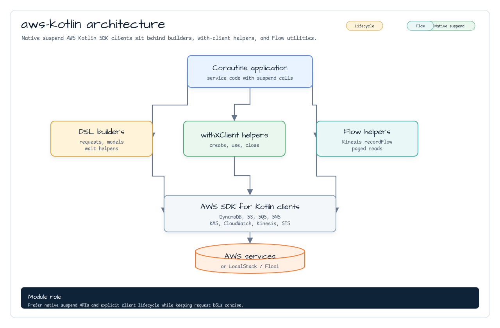
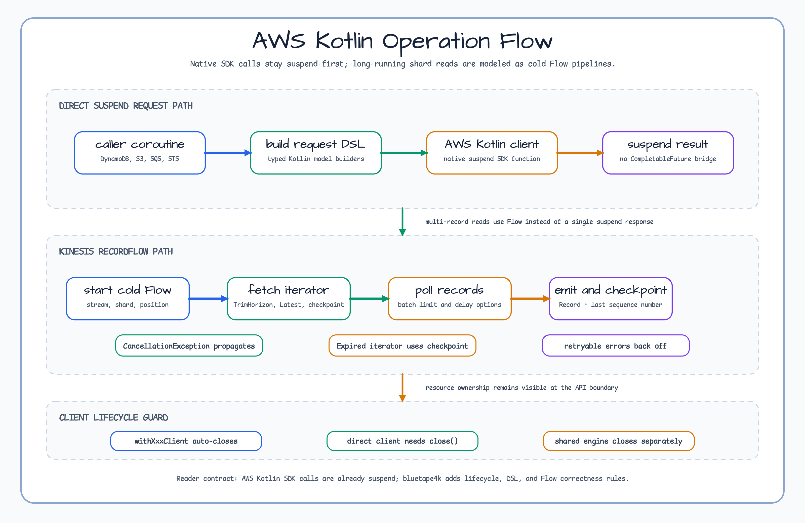
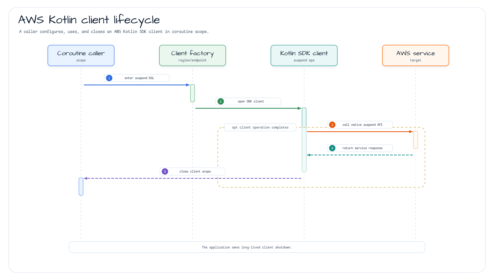
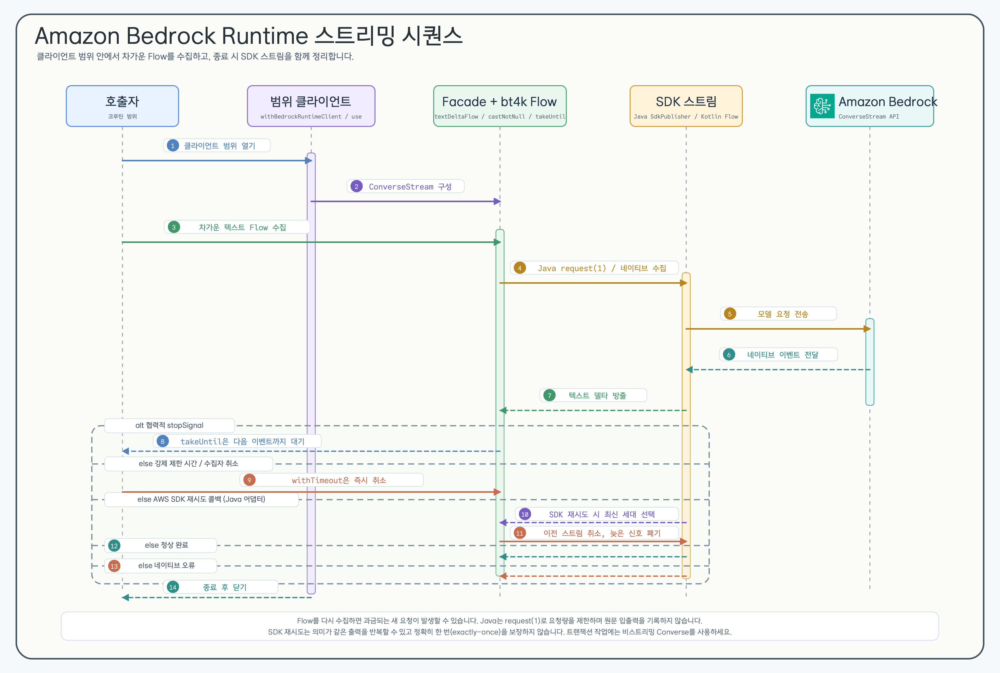

# Module bluetape4k-aws-kotlin

[English](./README.md) | 한국어

AWS Kotlin SDK 기반 단일 통합 모듈입니다. native `suspend` 함수를 기본 제공하여 `.await()` 변환 없이 Coroutines 환경에서 바로 사용할 수 있습니다.

> AWS Java SDK v2 기반 모듈은 `bluetape4k-aws-java`를 사용하세요.

## 다이어그램

### 모듈 아키텍처



### 작업 흐름



### 클라이언트 생명주기 시퀀스



## 제공 서비스

| 서비스                 | 주요 기능                                             |
|---------------------|---------------------------------------------------|
| **DynamoDB**        | 테이블 CRUD, 스캔/쿼리, DSL 빌더                           |
| **S3**              | 객체 업로드/다운로드, 멀티파트, 버킷 관리                          |
| **S3 Tables**       | table bucket, namespace, table 관리와 native suspend helper          |
| **SES / SESv2**     | 이메일 발송, 템플릿 메일                                    |
| **SNS**             | 토픽 발행, SMS, 구독 관리                                 |
| **SQS**             | 메시지 발송/수신/삭제, FIFO 큐                              |
| **KMS**             | 암호화 키 관리, 데이터 키 생성                                |
| **CloudWatch**      | 메트릭 발행/조회, DSL(`metricDatum {}`)                  |
| **CloudWatch Logs** | 로그 이벤트 전송, DSL(`inputLogEvent {}`)                |
| **Kinesis**         | 스트림 레코드 전송, `recordFlow {}` 샤드별 cold Flow, DSL(`putRecordRequestOf {}`) |
| **EventBridge**     | Event bus, rule, target, list, `PutEvents` suspend helper |
| **Step Functions**  | 실행 시작/중지/조회/목록과 native suspend `Flow` polling |
| **Lambda**          | native suspend 호출, typed payload codec, raw response metadata |
| **Bedrock Runtime** | native suspend `Converse`, `ConverseStream`, cold text-delta `Flow` |
| **STS**             | AssumeRole, CallerIdentity, DSL(`stsClientOf {}`) |
| **Secrets Manager** | Redacted secret value, client lifecycle helper, 요청 DSL |
| **Parameter Store** | Parameter 읽기, SecureString wrapper, path query, 요청 DSL |

## Bedrock Runtime Converse와 스트리밍



이 파사드는 AWS Kotlin SDK의 요청·응답·이벤트·예외·일시 중단 계약을 그대로
유지합니다. `Converse`는 네이티브 suspend 연산으로 사용하고, `ConverseStream`은
특정 모델 제공자용 프롬프트 프레임워크를 더하지 않은 cold `Flow`로 수집합니다.

```kotlin
import io.bluetape4k.aws.kotlin.bedrock.converseStreamFlow
import io.bluetape4k.aws.kotlin.bedrock.model.converseStreamRequestOf
import io.bluetape4k.aws.kotlin.bedrock.model.userMessageOf
import io.bluetape4k.aws.kotlin.bedrock.textDeltaFlow
import io.bluetape4k.aws.kotlin.bedrock.withBedrockRuntimeClient
import io.bluetape4k.coroutines.flow.extensions.takeUntil
import kotlinx.coroutines.flow.Flow
import kotlinx.coroutines.flow.toList
import kotlinx.coroutines.withTimeout
import kotlin.time.Duration.Companion.seconds

suspend fun streamReply(
    modelId: String,
    prompt: String,
    stopSignal: Flow<Any?>,
): List<String> =
    withBedrockRuntimeClient { client ->
        withTimeout(30.seconds) {
            client.converseStreamFlow(
                converseStreamRequestOf(
                    modelId = modelId,
                    messages = listOf(userMessageOf(prompt)),
                ),
            )
                .textDeltaFlow()
                .takeUntil(stopSignal)
                .toList()
        }
    }
```

최종 수집은 `withBedrockRuntimeClient` 블록 안에서 끝내야 합니다. 블록 밖으로
돌려보낸 Flow는 이미 닫힌 클라이언트를 사용할 수 없습니다. 애플리케이션
범위의 장기 클라이언트가 필요하면 `bedrockRuntimeClientOf`로 만들고 직접 닫으세요.
Flow를 다시 수집하면 과금될 수 있는 새 요청이 실행됩니다. `takeUntil`은 원본 Flow가
다음 이벤트를 내보낼 때 중단 상태를 확인하므로, 강제 제한 시간은 `withTimeout`으로
별도로 지정해야 합니다.

- `textDeltaFlow()`는 bluetape4k-coroutines의 `castNotNull`을 재사용해 네이티브
  텍스트 델타를 순서대로 고릅니다. 버퍼링·재생·병렬 매핑·로그 기록은 추가하지 않습니다.
- 빈 모델 ID, 비어 있는 메시지 컬렉션, `contentBlockOf` 또는
  `userMessageOf`에 전달한 빈 텍스트는 SDK 호출 전에
  `IllegalArgumentException`으로 거절합니다.
- 네이티브 SDK 오류와 구조화된 취소는 바꾸지 않고 호출자에게 전달합니다. 실패·시간
  초과·취소 시점에 수집자에게는 이미 일부 텍스트가 전달됐을 수 있습니다.
- AWS SDK 재시도는 의미가 같은 출력을 반복할 수 있습니다. 정확히 한 번
  (exactly-once), 중복 제거, 재생, 파사드 차원의 재시도는 제공하지 않습니다.
- 트랜잭션 성격의 작업에는 비스트리밍 `Converse`가 더 안전합니다.
- 자격 증명은 기본 AWS provider chain으로 공급하고, 루프백 주소를 직접 지정한 테스트가
  아니라면 HTTPS 엔드포인트만 사용하세요. 생성된 출력은 신뢰하지 말고 도구를 자동
  실행하지 마세요. 운영 로그에는 허용한 메타데이터만 남기며 원문 SDK 예외, 프롬프트,
  모델 출력은 기록하거나 애플리케이션 경계 밖에 그대로 노출하지 않습니다.

## Java SDK v2 vs Kotlin SDK 비교

| 항목         | `bluetape4k-aws-java` (Java SDK) | `bluetape4k-aws-kotlin` (Kotlin SDK) |
|------------|-----------------------------|--------------------------------------|
| Coroutines | `.await()` 변환 필요            | native `suspend` 기본 제공               |
| DSL 지원     | 제한적                         | 풍부한 DSL 빌더                           |
| 성능         | CRT/Netty NIO 선택            | CRT / OkHttp 선택                      |

## 클라이언트 생성 패턴

각 서비스는 두 가지 팩토리 함수를 제공합니다.

### `xxxClientOf` — 클라이언트 직접 생성

장기 보유(long-lived) 클라이언트가 필요할 때 사용합니다. **반드시 `close()`를 호출**해야 합니다.

```kotlin
val client = sqsClientOf(
    endpointUrl = Url.parse("http://localhost:4566"),
    region = "us-east-1",
    credentialsProvider = credentialsProvider
)

try {
    client.sendMessage(queueUrl, "Hello!")
} finally {
    client.close()   // 또는 useSafe { } 활용
}
```

### `withXxxClient` — 단발성 사용 (권장)

내부적으로 `useSafe { }` 를 사용하여 코루틴 취소·예외 상황에서도 리소스를 안전하게 해제합니다.

```kotlin
withSqsClient(endpointUrl, region, credentialsProvider) { client ->
    client.sendMessage(queueUrl, "Hello!")
}   // close() 자동 호출
```

> **[!NOTE]**
> AWS Kotlin SDK 클라이언트는 내부 HTTP 커넥션 풀·스레드를 보유하므로, 사용 후 반드시 `close()`를 호출해야 합니다.
> `withXxxClient { }` 블록을 사용하면 코루틴 취소·예외 상황에서도 자동으로 리소스가 해제됩니다.
> 장기 보유 클라이언트를 직접 생성한 경우에는 애플리케이션 종료 시점에 `close()`를 명시적으로 호출하세요.

## 사용 예시

### DynamoDB (native suspend)

```kotlin
import aws.sdk.kotlin.services.dynamodb.DynamoDbClient
import aws.sdk.kotlin.services.dynamodb.getItem
import io.bluetape4k.aws.kotlin.dynamodb.*
import io.bluetape4k.aws.kotlin.dynamodb.model.toAttributeValue

// 단발성: withDynamoDbClient 사용 (close 자동)
suspend fun getItem(tableName: String, userId: String) =
    withDynamoDbClient(region = "ap-northeast-2") { client ->
        client.getItem {
            this.tableName = tableName
            this.key = mapOf("userId" to userId.toAttributeValue())
        }
    }
```

### CloudWatch 메트릭 (DSL)

```kotlin
import io.bluetape4k.aws.kotlin.cloudwatch.*
import io.bluetape4k.aws.kotlin.cloudwatch.model.metricDatum
import aws.sdk.kotlin.services.cloudwatch.CloudWatchClient
import aws.sdk.kotlin.services.cloudwatch.putMetricData
import aws.sdk.kotlin.services.cloudwatch.model.StandardUnit

val cw = CloudWatchClient { region = "ap-northeast-2" }

suspend fun publishMetric(namespace: String, value: Double) {
    cw.putMetricData {
        this.namespace = namespace
        metricData = listOf(
            metricDatum {           // bluetape4k DSL
                metricName = "RequestCount"
                this.value = value
                unit = StandardUnit.Count
            }
        )
    }
}
```

### CloudWatch Logs (DSL)

```kotlin
import aws.sdk.kotlin.services.cloudwatchlogs.CloudWatchLogsClient
import aws.sdk.kotlin.services.cloudwatchlogs.putLogEvents
import io.bluetape4k.aws.kotlin.cloudwatch.*
import io.bluetape4k.aws.kotlin.cloudwatch.model.cloudwatchlogs.inputLogEvent

suspend fun sendLog(client: CloudWatchLogsClient, logGroup: String, logStream: String, message: String) {
    client.putLogEvents {
        logGroupName = logGroup
        logStreamName = logStream
        logEvents = listOf(
            inputLogEvent {         // bluetape4k DSL
                timestamp = System.currentTimeMillis()
                this.message = message
            }
        )
    }
}
```

### STS (DSL)

```kotlin
import aws.sdk.kotlin.services.sts.getCallerIdentity
import io.bluetape4k.aws.kotlin.sts.*

// bluetape4k DSL로 StsClient 생성
val stsClient = stsClientOf(region = "ap-northeast-2")

suspend fun getCallerIdentity() = stsClient.getCallerIdentity {}
```

### Kinesis (DSL)

```kotlin
import aws.sdk.kotlin.services.kinesis.KinesisClient
import aws.sdk.kotlin.services.kinesis.putRecord
import io.bluetape4k.aws.kotlin.kinesis.model.putRecordRequestOf

suspend fun putRecord(client: KinesisClient, streamName: String, data: ByteArray) {
    client.putRecord(
        putRecordRequestOf(streamName, data, partitionKey = "default")
    )
}
```

### Kinesis — `recordFlow` (샤드별 cold `Flow<Record>`)

`KinesisClient.recordFlow()`는 단일 샤드를 지속적으로 폴링하여 각 레코드를 emit하는 cold `Flow<Record>`를 반환합니다.
샤드가 닫히면(리샤딩) 플로우가 자연스럽게 완료됩니다.

```kotlin
import aws.sdk.kotlin.services.kinesis.KinesisClient
import io.bluetape4k.aws.kotlin.kinesis.KinesisStartingPosition
import io.bluetape4k.aws.kotlin.kinesis.KinesisRecordFlowOptions
import io.bluetape4k.aws.kotlin.kinesis.recordFlow
import kotlinx.coroutines.flow.take
import kotlin.time.Duration.Companion.milliseconds
import kotlin.time.Duration.Companion.seconds

// 기본 사용 — 샤드의 처음부터 읽기
kinesisClient.recordFlow(
    streamName = "my-stream",
    shardId    = "shardId-000000000000",
    position   = KinesisStartingPosition.TrimHorizon,
).collect { record ->
    println(record.data!!.decodeToString())
}

// 저장된 체크포인트에서 재개
kinesisClient.recordFlow(
    streamName = "my-stream",
    shardId    = "shardId-000000000000",
    position   = KinesisStartingPosition.AfterSequenceNumber(lastSequenceNumber),
).collect { record -> /* ... */ }

// 커스텀 옵션
val options = KinesisRecordFlowOptions(
    batchLimit             = 500,
    pollInterval           = 200.milliseconds,
    emptyBackoff           = 2.seconds,
    maxIteratorRetries     = 5,
    initialThrottleBackoff = 500.milliseconds,
    maxThrottleBackoff     = 30.seconds,
    maxThrottleRetries     = 5,
)
kinesisClient.recordFlow("my-stream", "shardId-000000000000", options = options)
    .take(1_000)
    .collect { /* ... */ }
```

#### 시작 위치 (Starting Position)

| 위치 | 설명 |
|---|---|
| `TrimHorizon` | 샤드에서 가장 오래된 레코드부터 (기본값) |
| `Latest` | 이터레이터 획득 이후에 작성된 레코드. **주의:** 첫 레코드 처리 전에 이터레이터가 만료되면 레코드를 무음 skip하는 대신 즉시 예외를 던집니다. |
| `AtSequenceNumber(seq)` | 지정한 시퀀스 번호의 레코드 포함 (inclusive) |
| `AfterSequenceNumber(seq)` | 지정한 시퀀스 번호 이후의 레코드 (exclusive) |
| `AtTimestamp(instant)` | 지정한 `java.time.Instant` 이후의 레코드 |

#### 오류 처리

| 오류 | 동작 |
|---|---|
| 샤드 닫힘 (`nextShardIterator == null`) | 플로우 정상 완료 |
| `ExpiredIteratorException` | 마지막 시퀀스 번호로 이터레이터 재획득; `maxIteratorRetries` 초과 시 예외 전파 |
| `Latest` + 체크포인트 없음 + 만료 | 즉시 예외 — 재획득 시 레코드 skip 발생 방지 |
| 재시도 가능 `KinesisException` | 지수 지터 백오프; `maxThrottleRetries` 초과 시 예외 전파 |
| 재시도 불가 `KinesisException` | 즉시 예외 전파 |
| `CancellationException` | 즉시 예외 전파 |

### EventBridge (native suspend)

```kotlin
import aws.sdk.kotlin.services.eventbridge.EventBridgeClient
import io.bluetape4k.aws.kotlin.eventbridge.putEvents
import io.bluetape4k.aws.kotlin.eventbridge.model.putEventsRequestEntryOf

suspend fun publishOrderEvent(client: EventBridgeClient) {
    val entry = putEventsRequestEntryOf(
        source = "orders",
        detailType = "OrderCreated",
        detail = """{"orderId":"o-1"}""",
        eventBusName = "orders-bus",
    )

    val response = client.putEvents(listOf(entry))
    // 일부 항목 실패 여부는 response.failedEntryCount, response.entries로 확인합니다.
}
```

EventBridge helper는 호출 한 번당 SDK 요청 한 번만 수행하며 SDK 응답을 그대로 반환합니다.
런타임에는 `aws.sdk.kotlin:eventbridge`를 추가해야 합니다. Scheduler, framework integration,
global endpoint, cross-account target orchestration, SDK model 타입을 넘어서는 target별 검증은
이 모듈 범위에 포함하지 않습니다.

### S3 Tables 관리 (미출시/develop)

S3 Tables helper는 native AWS Kotlin SDK request·response 타입을 유지하면서 table bucket,
namespace, table의 생성·목록·조회·삭제를 native suspend로 제공합니다. 목록은 raw service의
한 페이지를 반환하므로 다음 페이지에는 `continuationToken`을 명시합니다. `ListTables`의
`namespace`는 선택 사항이므로 bucket 범위 목록에도 사용할 수 있습니다. `CreateTable`의
기본값은 `OpenTableFormat.Iceberg`이고, `GetTable`은 table ARN 또는
bucket/namespace/name selector를 사용합니다.

서비스 SDK는 `compileOnly`이므로 애플리케이션이 직접 추가해야 합니다.

```kotlin
dependencies {
    implementation("io.github.bluetape4k.aws:bluetape4k-aws-kotlin")
    implementation("aws.sdk.kotlin:s3tables")
}
```

```kotlin
import io.bluetape4k.aws.kotlin.s3tables.createNamespace
import io.bluetape4k.aws.kotlin.s3tables.createTable
import io.bluetape4k.aws.kotlin.s3tables.createTableBucket
import io.bluetape4k.aws.kotlin.s3tables.withS3TablesClient

suspend fun createOrdersTable() = withS3TablesClient(region = "ap-northeast-2") { client ->
    val bucketArn = client.createTableBucket("orders-tables").arn
    client.createNamespace(bucketArn, listOf("analytics"))
    client.createTable(bucketArn, "analytics", "orders")
}
```

`s3TablesClientOf`가 반환한 application-scoped client를 닫는 책임은 호출자에게 있습니다.
`withS3TablesClient`는 block이 끝날 때 service client만 닫고, 주입한 HTTP engine은 호출자가
관리합니다. 이 API는 management surface이며 Iceberg data-plane이나 SQL engine이 아닙니다.
Athena, Glue, Redshift, Apache Iceberg 연동은 애플리케이션의 책임으로 남기며, 로컬 emulator의
S3 Tables fidelity를 이 모듈이 보장한다고 주장하지 않습니다.

### Step Functions 실행 helper (미출시/develop)

develop 개발선에는 `StartExecution`, `StopExecution`, `DescribeExecution`,
`ListExecutions`를 위한 native suspend helper가 추가됩니다. Polling은 AWS Kotlin SDK의
`SfnClient`를 사용하며 raw 응답을 `Flow<DescribeExecutionResponse>` cold Flow로
전달합니다. client, timeout과 cancellation 정책은 호출자가 소유합니다.

```kotlin
import io.bluetape4k.aws.kotlin.sfn.describeExecutionFlow
import io.bluetape4k.aws.kotlin.sfn.withSfnClient
import aws.sdk.kotlin.services.sfn.model.DescribeExecutionResponse
import kotlinx.coroutines.flow.last
import kotlinx.coroutines.withTimeout
import kotlin.time.Duration.Companion.seconds

suspend fun awaitExecution(executionArn: String): DescribeExecutionResponse =
    withSfnClient(region = "ap-northeast-2") { client ->
        withTimeout(30.seconds) {
            client.describeExecutionFlow(executionArn).last()
        }
    }
```

이 예제는 Standard execution을 대상으로 합니다. Cancellation은 그대로 전파되며
`StopExecution`을 자동 호출하지 않습니다. 범위 지정 helper는 service client만 닫고 주입한
HTTP engine은 호출자 소유로 남깁니다. 서비스 SDK는 `compileOnly`로 유지되므로 런타임에
`aws.sdk.kotlin:sfn`을 직접 추가하세요. 의존성, Standard/Express/Map Run, IAM/KMS, quota와
emulator 경계는 [Step Functions Kotlin 모듈 매뉴얼](../docs/manual/ko/modules/bluetape4k-aws-kotlin.md)에서
확인할 수 있습니다.

### Lambda 호출 helper (미출시/develop)

develop 개발선에는 `io.bluetape4k.aws.kotlin.lambda` 아래에 native suspend
`Invoke` helper가 추가됩니다. `LambdaInvocationResult`는 raw response, 복사한 payload,
status, 선택적 `FunctionError`, 디코드한 tail log를 함께 보존합니다. Typed payload에는
소비자가 Jackson을 선택한 경우에만 `LambdaPayloadCodecs.jackson(...)`을 사용하세요.

```kotlin
import io.bluetape4k.aws.kotlin.lambda.invokeString
import io.bluetape4k.aws.kotlin.lambda.withLambdaClient

suspend fun invokeOrder(): String =
    withLambdaClient(region = "ap-northeast-2") { client ->
        val result = client.invokeString("orders-handler", "{\"id\":1}")
        check(!result.hasFunctionError)
        result.value.orEmpty()
    }
```

서비스 SDK는 `compileOnly`로 유지되므로 런타임에 `aws.sdk.kotlin:lambda`를 직접
추가하세요. `withLambdaClient`는 service client만 닫고 주입한 HTTP engine은 호출자 소유로
남깁니다. Native suspend cancellation을 그대로 전달하며 retry, 배포, polling, 로깅,
IAM policy 관리는 추가하지 않습니다.

### Secrets Manager와 Parameter Store

```kotlin
import io.bluetape4k.aws.kotlin.secretsmanager.getSecretString
import io.bluetape4k.aws.kotlin.secretsmanager.withSecretsManagerClient
import io.bluetape4k.aws.kotlin.ssm.getParameter
import io.bluetape4k.aws.kotlin.ssm.getParametersByPath
import io.bluetape4k.aws.kotlin.ssm.getSecureParameter
import io.bluetape4k.aws.kotlin.ssm.withSsmClient

data class DatabaseCredential(
    val apiKey: String,
    val password: String,
    val database: String,
)

suspend fun loadApiCredential(secretId: String): DatabaseCredential {
    val apiKey = withSecretsManagerClient(region = "ap-northeast-2") { client ->
        client.getSecretString(secretId)
    }
    val dbPassword = withSsmClient(region = "ap-northeast-2") { client ->
        client.getSecureParameter("/app/db/password")
    }
    val dbName = withSsmClient(region = "ap-northeast-2") { client ->
        client.getParameter("/app/db/name").parameter?.value.orEmpty()
    }

    return DatabaseCredential(
        apiKey = apiKey.reveal(),
        password = dbPassword.reveal(),
        database = dbName,
    )
}

suspend fun loadAppParameters() =
    withSsmClient(region = "ap-northeast-2") { client ->
        client.getParametersByPath(
            path = "/app",
            recursive = true,
            maxResults = 10,
        ).parameters
    }
```

Secret 값은 plaintext가 꼭 필요한 consumer boundary까지 `AwsSecretValue` 안에
유지하세요. Revealed value를 출력, 로그, 예외 메시지에 포함하지 않습니다.

## 이 모듈이 제공하지 않는 것

이 모듈은 Spring Environment 로딩, JSON flattening, 캐시/refresh 정책,
rotation orchestration, IAM/KMS policy 관리, 숨겨진 전체 페이지 수집 abstraction을
제공하지 않습니다. 해당 책임은 Spring/Exposed 모듈이나 애플리케이션 코드에서 다룹니다.

Hot path에서는 애플리케이션 경계에서 caller-owned cache를 두고 refresh/error 정책을
명시하세요. Create/put helper는 AWS-side state를 변경하므로 의도적으로 사용하고
감사 가능하게 유지해야 합니다.

## 테스트 환경

통합 테스트는 Testcontainers 기반 Floci를 기본 emulator로 사용합니다. Floci coverage
gap은 `-Dbluetape4k.aws.emulator=localstack` 로 명시 실행해 LocalStack에서 검증합니다.

```kotlin
abstract class AbstractAwsTest {
    companion object {
        val awsEmulator: AwsEmulatorServer by lazy { FlociServer.Launcher.floci }
    }

    suspend fun buildSqsClient(): SqsClient = SqsClient {
        endpointUrl = Url.parse(awsEmulator.awsEndpoint.toString())
        region = awsEmulator.regionName
        credentialsProvider = StaticCredentialsProvider {
            accessKeyId = awsEmulator.awsAccessKey
            secretAccessKey = awsEmulator.awsSecretKey
        }
    }
}
```

모듈 테스트 실행:

```bash
./gradlew :bluetape4k-aws-kotlin:test
./gradlew :bluetape4k-aws-kotlin:test -Dbluetape4k.aws.emulator=localstack
```

## 설치

AWS Kotlin SDK 서비스는 `compileOnly`로 선언되어 있으므로, 사용할 서비스 SDK를 런타임 의존성으로 추가해야 합니다.
`bluetape4k-aws-kotlin`은 공통 bluetape4k coroutine 유틸리티를 노출하지만, 사용하지 않는 AWS 서비스 클라이언트를
소비자 애플리케이션에 강제로 올리지는 않습니다.

```kotlin
dependencies {
    implementation(platform("io.github.bluetape4k:bluetape4k-dependencies:${bluetape4kVersion}"))
    implementation("io.github.bluetape4k.aws:bluetape4k-aws-kotlin:${bluetape4kVersion}")

    // 사용할 서비스만 선택적으로 추가
    implementation("aws.sdk.kotlin:dynamodb:${awsKotlinSdkVersion}")
    implementation("aws.sdk.kotlin:s3:${awsKotlinSdkVersion}")
    implementation("aws.sdk.kotlin:secretsmanager:${awsKotlinSdkVersion}")
    implementation("aws.sdk.kotlin:sqs:${awsKotlinSdkVersion}")
    implementation("aws.sdk.kotlin:ssm:${awsKotlinSdkVersion}")
    implementation("aws.sdk.kotlin:sns:${awsKotlinSdkVersion}")
    implementation("aws.sdk.kotlin:kms:${awsKotlinSdkVersion}")
    implementation("aws.sdk.kotlin:cloudwatch:${awsKotlinSdkVersion}")
    implementation("aws.sdk.kotlin:cloudwatchlogs:${awsKotlinSdkVersion}")
    implementation("aws.sdk.kotlin:kinesis:${awsKotlinSdkVersion}")
    implementation("aws.sdk.kotlin:eventbridge:${awsKotlinSdkVersion}")
    implementation("aws.sdk.kotlin:sfn:${awsKotlinSdkVersion}")
    implementation("aws.sdk.kotlin:lambda:${awsKotlinSdkVersion}")
    implementation("aws.sdk.kotlin:bedrockruntime:${awsKotlinSdkVersion}")
    implementation("aws.sdk.kotlin:sts:${awsKotlinSdkVersion}")
    // ... 필요한 서비스 추가
}
```
