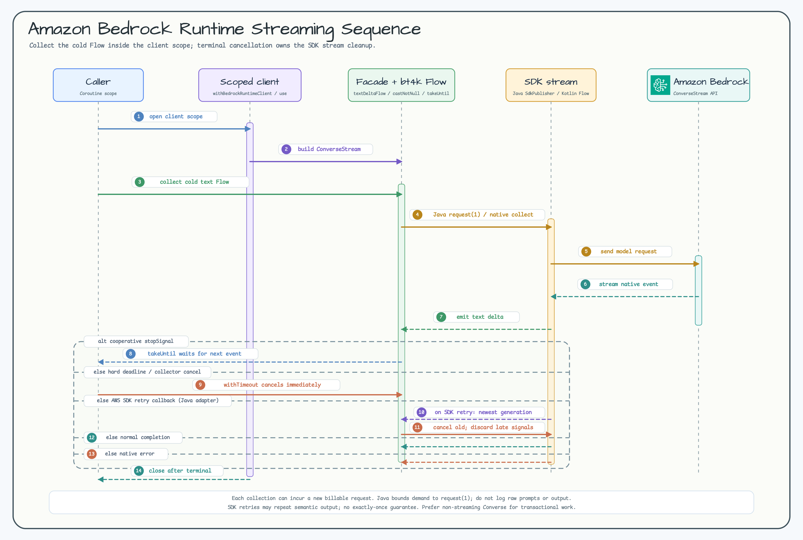

# Module bluetape4k-aws-kotlin

English | [한국어](./README.ko.md)

A unified integration module built on the AWS Kotlin SDK. Provides native
`suspend` functions out of the box, so you can use it directly in coroutine environments without any
`.await()` conversion.

> For the AWS Java SDK v2 based module, use `bluetape4k-aws-java`.

## Diagrams

### Module Architecture


### Operation Flow


### Client Lifecycle Sequence


## Supported Services

| Service             | Key Features                                            |
|---------------------|---------------------------------------------------------|
| **DynamoDB**        | Table CRUD, scan/query, DSL builders                    |
| **S3**              | Object upload/download, multipart, bucket management    |
| **S3 Tables**       | Table bucket, namespace, and table management with native suspend helpers |
| **SES / SESv2**     | Email sending, templated email                          |
| **SNS**             | Topic publishing, SMS, subscription management          |
| **SQS**             | Message send/receive/delete, FIFO queues                |
| **KMS**             | Encryption key management, data key generation          |
| **CloudWatch**      | Metric publishing/querying, DSL (`metricDatum {}`)      |
| **CloudWatch Logs** | Log event publishing, DSL (`inputLogEvent {}`)          |
| **Kinesis**         | Stream record publishing, `recordFlow {}` cold Flow per shard, DSL (`putRecordRequestOf {}`) |
| **EventBridge**     | Event bus, rule, target, list, and `PutEvents` suspend helpers |
| **Step Functions**  | Execution start/stop/describe/list and native suspend `Flow` polling |
| **Lambda**          | Native suspend invocation, typed payload codecs, raw response metadata |
| **Bedrock Runtime** | Native suspend `Converse`, `ConverseStream`, and cold text-delta `Flow` |
| **STS**             | AssumeRole, CallerIdentity, DSL (`stsClientOf {}`)      |
| **Secrets Manager** | Redacted secret values, client lifecycle helpers, request DSLs |
| **Parameter Store** | Parameter reads, SecureString wrappers, path queries, request DSLs |

## Bedrock Runtime Converse and Streaming



The facade keeps native AWS Kotlin SDK request, response, event, exception, and
suspension contracts. `Converse` stays a native suspend operation, while
`ConverseStream` becomes a cold `Flow` without adding a provider-specific
prompt framework.

```kotlin
import io.bluetape4k.aws.kotlin.bedrock.converseStreamFlow
import io.bluetape4k.aws.kotlin.bedrock.model.converseStreamRequestOf
import io.bluetape4k.aws.kotlin.bedrock.model.userMessageOf
import io.bluetape4k.aws.kotlin.bedrock.textDeltaFlow
import io.bluetape4k.aws.kotlin.bedrock.withBedrockRuntimeClient
import io.bluetape4k.coroutines.flow.extensions.takeUntil
import kotlinx.coroutines.flow.Flow
import kotlinx.coroutines.flow.toList
import kotlinx.coroutines.withTimeout
import kotlin.time.Duration.Companion.seconds

suspend fun streamReply(
    modelId: String,
    prompt: String,
    stopSignal: Flow<Any?>,
): List<String> =
    withBedrockRuntimeClient { client ->
        withTimeout(30.seconds) {
            client.converseStreamFlow(
                converseStreamRequestOf(
                    modelId = modelId,
                    messages = listOf(userMessageOf(prompt)),
                ),
            )
                .textDeltaFlow()
                .takeUntil(stopSignal)
                .toList()
        }
    }
```

Complete terminal collection inside `withBedrockRuntimeClient`; a returned
Flow cannot outlive the client scope. For application-scoped clients, use
`bedrockRuntimeClientOf` and close the client explicitly. Every collection is a
new, potentially billable request. `takeUntil` checks its stop state when the
source produces the next event, so use `withTimeout` for a hard deadline.

- `textDeltaFlow()` reuses bluetape4k-coroutines `castNotNull` to select native
  text deltas in order without buffering, replay, parallel mapping, or logging.
- Blank model IDs, empty message collections, and blank text passed to
  `contentBlockOf` or `userMessageOf` fail with `IllegalArgumentException`
  before an SDK call.
- Native SDK failures and structured cancellation reach the caller unchanged.
  A streaming collector can already hold partial text when failure, timeout,
  or cancellation occurs.
- AWS SDK retries can repeat semantically equivalent output. There is no
  exactly-once delivery, deduplication, replay, or facade-level retry.
- Prefer non-streaming `Converse` when the operation must be transactional.
- Keep credentials on the default AWS provider chain, use HTTPS except for
  literal loopback tests, treat generated output as untrusted, and never
  execute tools from it automatically. Log only allowlisted operation
  metadata; never log or expose raw SDK exceptions, prompts, or model output
  beyond the application boundary.

## Java SDK v2 vs Kotlin SDK Comparison

| Aspect      | `bluetape4k-aws-java` (Java SDK) | `bluetape4k-aws-kotlin` (Kotlin SDK) |
|-------------|--------------------------------|--------------------------------------|
| Coroutines  | requires `.await()` conversion | native `suspend` built in            |
| DSL support | limited                        | rich DSL builders                    |
| Performance | CRT/Netty NIO choice           | CRT / OkHttp choice                  |

## Client Creation Patterns

Each service provides two factory functions.

### `xxxClientOf` — Direct Client Creation

Use this for long-lived clients. **You must call `close()`** when done.

```kotlin
val client = sqsClientOf(
    endpointUrl = Url.parse("http://localhost:4566"),
    region = "us-east-1",
    credentialsProvider = credentialsProvider
)

try {
    client.sendMessage(queueUrl, "Hello!")
} finally {
    client.close()   // or use useSafe { }
}
```

### `withXxxClient` — One-Shot Usage (Recommended)

Uses `useSafe { }` internally to release resources safely even on coroutine cancellation or exceptions.

```kotlin
withSqsClient(endpointUrl, region, credentialsProvider) { client ->
    client.sendMessage(queueUrl, "Hello!")
}   // close() called automatically
```

> **[!NOTE]**
> AWS Kotlin SDK clients hold internal HTTP connection pools and threads, so `close()` must always be called after use.
> The
`withXxxClient { }` block ensures resources are released automatically even on coroutine cancellation or exceptions.
> If you create a long-lived client directly, call `close()` explicitly when the application shuts down.

## Usage Examples

### DynamoDB coordination (Issue #476)

`DynamoDbDistributedLock` and `DynamoDbMetadataStore` provide coroutine-first,
bounded conditional coordination on a caller-owned PK-only DynamoDB table.
Locks retain a monotonic fencing token after release; metadata stores bounded
String values with optional logical/DynamoDB TTL expiry. The client is not
created or closed by these adapters.

```kotlin
val schema = DynamoDbCoordinationSchema(tableName = "coordination", namespace = "orders")
val lock = DynamoDbDistributedLock(client, schema)
val lease = lock.tryAcquire("orders", "worker-1")
if (lease != null) {
    // Include lease.fencingToken in the downstream conditional write.
    lock.release(lease)
}
```

Use FlociServer for the local contract test; no real AWS endpoint is required:

```bash
./gradlew -Dbluetape4k.aws.emulator=floci --no-parallel --max-workers=1 \
  :bluetape4k-aws-kotlin:test --tests '*DynamoDbCoordinationFlociTest'
```

### DynamoDB (native suspend)

```kotlin
import aws.sdk.kotlin.services.dynamodb.DynamoDbClient
import aws.sdk.kotlin.services.dynamodb.getItem
import io.bluetape4k.aws.kotlin.dynamodb.*
import io.bluetape4k.aws.kotlin.dynamodb.model.toAttributeValue

// One-shot: use withDynamoDbClient (auto-close)
suspend fun getItem(tableName: String, userId: String) =
    withDynamoDbClient(region = "ap-northeast-2") { client ->
        client.getItem {
            this.tableName = tableName
            this.key = mapOf("userId" to userId.toAttributeValue())
        }
    }
```

### CloudWatch Metrics (DSL)

```kotlin
import io.bluetape4k.aws.kotlin.cloudwatch.*
import io.bluetape4k.aws.kotlin.cloudwatch.model.metricDatum
import aws.sdk.kotlin.services.cloudwatch.CloudWatchClient
import aws.sdk.kotlin.services.cloudwatch.putMetricData
import aws.sdk.kotlin.services.cloudwatch.model.StandardUnit

val cw = CloudWatchClient { region = "ap-northeast-2" }

suspend fun publishMetric(namespace: String, value: Double) {
    cw.putMetricData {
        this.namespace = namespace
        metricData = listOf(
            metricDatum {           // bluetape4k DSL
                metricName = "RequestCount"
                this.value = value
                unit = StandardUnit.Count
            }
        )
    }
}
```

### CloudWatch Logs (DSL)

```kotlin
import aws.sdk.kotlin.services.cloudwatchlogs.CloudWatchLogsClient
import aws.sdk.kotlin.services.cloudwatchlogs.putLogEvents
import io.bluetape4k.aws.kotlin.cloudwatch.*
import io.bluetape4k.aws.kotlin.cloudwatch.model.cloudwatchlogs.inputLogEvent

suspend fun sendLog(client: CloudWatchLogsClient, logGroup: String, logStream: String, message: String) {
    client.putLogEvents {
        logGroupName = logGroup
        logStreamName = logStream
        logEvents = listOf(
            inputLogEvent {         // bluetape4k DSL
                timestamp = System.currentTimeMillis()
                this.message = message
            }
        )
    }
}
```

### STS (DSL)

```kotlin
import aws.sdk.kotlin.services.sts.getCallerIdentity
import io.bluetape4k.aws.kotlin.sts.*

// Create StsClient using bluetape4k DSL
val stsClient = stsClientOf(region = "ap-northeast-2")

suspend fun getCallerIdentity() = stsClient.getCallerIdentity {}
```

### Kinesis (DSL)

```kotlin
import aws.sdk.kotlin.services.kinesis.KinesisClient
import aws.sdk.kotlin.services.kinesis.putRecord
import io.bluetape4k.aws.kotlin.kinesis.model.putRecordRequestOf

suspend fun putRecord(client: KinesisClient, streamName: String, data: ByteArray) {
    client.putRecord(
        putRecordRequestOf(streamName, data, partitionKey = "default")
    )
}
```

### Kinesis — `recordFlow` (cold `Flow<Record>` per shard)

`KinesisClient.recordFlow()` returns a cold `Flow<Record>` that continuously polls a single
shard and emits each record. The flow terminates naturally when the shard is closed (resharding).

```kotlin
import aws.sdk.kotlin.services.kinesis.KinesisClient
import io.bluetape4k.aws.kotlin.kinesis.KinesisStartingPosition
import io.bluetape4k.aws.kotlin.kinesis.KinesisRecordFlowOptions
import io.bluetape4k.aws.kotlin.kinesis.recordFlow
import kotlinx.coroutines.flow.take
import kotlin.time.Duration.Companion.milliseconds
import kotlin.time.Duration.Companion.seconds

// Basic usage — read from the beginning of a shard
kinesisClient.recordFlow(
    streamName = "my-stream",
    shardId    = "shardId-000000000000",
    position   = KinesisStartingPosition.TrimHorizon,
).collect { record ->
    println(record.data!!.decodeToString())
}

// Resume from a saved checkpoint
kinesisClient.recordFlow(
    streamName = "my-stream",
    shardId    = "shardId-000000000000",
    position   = KinesisStartingPosition.AfterSequenceNumber(lastSequenceNumber),
).collect { record -> /* ... */ }

// Custom tuning
val options = KinesisRecordFlowOptions(
    batchLimit             = 500,
    pollInterval           = 200.milliseconds,
    emptyBackoff           = 2.seconds,
    maxIteratorRetries     = 5,
    initialThrottleBackoff = 500.milliseconds,
    maxThrottleBackoff     = 30.seconds,
    maxThrottleRetries     = 5,
)
kinesisClient.recordFlow("my-stream", "shardId-000000000000", options = options)
    .take(1_000)
    .collect { /* ... */ }
```

#### Starting positions

| Position | Description |
|---|---|
| `TrimHorizon` | All records from the oldest available (default) |
| `Latest` | Records written after the iterator is obtained. **Caution:** if the iterator expires before the first record is processed, the flow throws immediately rather than silently skipping records. |
| `AtSequenceNumber(seq)` | The record with the given sequence number (inclusive) |
| `AfterSequenceNumber(seq)` | Records after the given sequence number (exclusive) |
| `AtTimestamp(instant)` | Records at or after the given `java.time.Instant` |

#### Error handling

| Error | Behaviour |
|---|---|
| Shard closed (`nextShardIterator == null`) | Flow completes normally |
| `ExpiredIteratorException` | Re-fetches the iterator using the last seen sequence number; throws after `maxIteratorRetries` attempts |
| `Latest` with no checkpoint + expiry | Throws immediately — re-fetching `Latest` would silently skip records |
| Retryable `KinesisException` | Exponential jitter backoff; throws after `maxThrottleRetries` attempts |
| Non-retryable `KinesisException` | Propagated immediately |
| `CancellationException` | Propagated immediately |

### EventBridge (native suspend)

```kotlin
import aws.sdk.kotlin.services.eventbridge.EventBridgeClient
import io.bluetape4k.aws.kotlin.eventbridge.putEvents
import io.bluetape4k.aws.kotlin.eventbridge.model.putEventsRequestEntryOf

suspend fun publishOrderEvent(client: EventBridgeClient) {
    val entry = putEventsRequestEntryOf(
        source = "orders",
        detailType = "OrderCreated",
        detail = """{"orderId":"o-1"}""",
        eventBusName = "orders-bus",
    )

    val response = client.putEvents(listOf(entry))
    // Inspect response.failedEntryCount and response.entries for partial failures.
}
```

EventBridge helpers keep one SDK request per call and return raw SDK responses.
Add `aws.sdk.kotlin:eventbridge` at runtime. Scheduler, framework integrations,
global endpoints, cross-account target orchestration, and target-specific
validation beyond SDK model types are outside this module.

### S3 Tables management (1.0.0 development line)

S3 Tables helpers expose native AWS Kotlin SDK request and response types for
table bucket, namespace, and table create/list/get/delete operations. Lists
return one raw service page; pass `continuationToken` for the next page.
`ListTables` keeps `namespace` optional for bucket-level listing. `CreateTable`
defaults to `OpenTableFormat.Iceberg`, and `GetTable` accepts
either a table ARN or the bucket/namespace/name selector.

Add the service SDK directly because it remains `compileOnly`:

```kotlin
dependencies {
    implementation("io.github.bluetape4k.aws:bluetape4k-aws-kotlin")
    implementation("aws.sdk.kotlin:s3tables")
}
```

```kotlin
import io.bluetape4k.aws.kotlin.s3tables.createNamespace
import io.bluetape4k.aws.kotlin.s3tables.createTable
import io.bluetape4k.aws.kotlin.s3tables.createTableBucket
import io.bluetape4k.aws.kotlin.s3tables.withS3TablesClient

suspend fun createOrdersTable() = withS3TablesClient(region = "ap-northeast-2") { client ->
    val bucketArn = client.createTableBucket("orders-tables").arn
    client.createNamespace(bucketArn, listOf("analytics"))
    client.createTable(bucketArn, "analytics", "orders")
}
```

`s3TablesClientOf` returns an application-scoped client that the caller must
close. `withS3TablesClient` closes only its service client when the block ends;
an injected HTTP engine remains caller-owned. This is a management API surface, not an
Iceberg data-plane or SQL engine. Athena, Glue, Redshift, and Apache Iceberg
integration remain application concerns, and local emulator fidelity for S3
Tables is not asserted by this module.

### Step Functions Execution Helpers (1.0.0 development line)

The `1.0.0` development line provides native suspend helpers for `StartExecution`,
`StopExecution`, `DescribeExecution`, and `ListExecutions`. Polling uses the
AWS Kotlin SDK `SfnClient` and returns a cold `Flow<DescribeExecutionResponse>`
of raw responses. The caller owns the client, timeout, and cancellation policy.

```kotlin
import io.bluetape4k.aws.kotlin.sfn.describeExecutionFlow
import io.bluetape4k.aws.kotlin.sfn.withSfnClient
import aws.sdk.kotlin.services.sfn.model.DescribeExecutionResponse
import kotlinx.coroutines.flow.last
import kotlinx.coroutines.withTimeout
import kotlin.time.Duration.Companion.seconds

suspend fun awaitExecution(executionArn: String): DescribeExecutionResponse =
    withSfnClient(region = "ap-northeast-2") { client ->
        withTimeout(30.seconds) {
            client.describeExecutionFlow(executionArn).last()
        }
    }
```

The example targets a Standard execution. Cancellation is rethrown and does
not trigger an implicit `StopExecution`; the scoped helper closes only the
service client and leaves an injected HTTP engine under caller ownership. Add
`aws.sdk.kotlin:sfn` directly at runtime because service SDKs remain
`compileOnly`. See the [Step Functions Kotlin module
manual](https://bluetape4k.github.io/manual/bluetape4k-aws/0.5/modules/bluetape4k-aws-kotlin/) for dependency,
Standard/Express/Map Run, IAM/KMS, quota, and emulator boundaries.

### Lambda invocation helpers (1.0.0 development line)

The `1.0.0` development line provides native suspend `Invoke` helpers under
`io.bluetape4k.aws.kotlin.lambda`. A `LambdaInvocationResult` keeps the raw
response, copied payload, status, optional `FunctionError`, and decoded tail
log together. Use `LambdaPayloadCodecs.jackson(...)` only when the consumer
chooses Jackson for typed payloads.

```kotlin
import io.bluetape4k.aws.kotlin.lambda.invokeString
import io.bluetape4k.aws.kotlin.lambda.withLambdaClient

suspend fun invokeOrder(): String =
    withLambdaClient(region = "ap-northeast-2") { client ->
        val result = client.invokeString("orders-handler", "{\"id\":1}")
        check(!result.hasFunctionError)
        result.value.orEmpty()
    }
```

Add `aws.sdk.kotlin:lambda` directly at runtime because service SDKs remain
`compileOnly`. The helper preserves native suspend cancellation and closes only
the service client in `withLambdaClient`; an injected HTTP engine remains
caller-owned. It does not add retry, deployment, polling, logging, or IAM
policy management.

### Secrets Manager and Parameter Store

```kotlin
import io.bluetape4k.aws.kotlin.secretsmanager.getSecretString
import io.bluetape4k.aws.kotlin.secretsmanager.withSecretsManagerClient
import io.bluetape4k.aws.kotlin.ssm.getParameter
import io.bluetape4k.aws.kotlin.ssm.getParametersByPath
import io.bluetape4k.aws.kotlin.ssm.getSecureParameter
import io.bluetape4k.aws.kotlin.ssm.withSsmClient

data class DatabaseCredential(
    val apiKey: String,
    val password: String,
    val database: String,
)

suspend fun loadApiCredential(secretId: String): DatabaseCredential {
    val apiKey = withSecretsManagerClient(region = "ap-northeast-2") { client ->
        client.getSecretString(secretId)
    }
    val dbPassword = withSsmClient(region = "ap-northeast-2") { client ->
        client.getSecureParameter("/app/db/password")
    }
    val dbName = withSsmClient(region = "ap-northeast-2") { client ->
        client.getParameter("/app/db/name").parameter?.value.orEmpty()
    }

    return DatabaseCredential(
        apiKey = apiKey.reveal(),
        password = dbPassword.reveal(),
        database = dbName,
    )
}

suspend fun loadAppParameters() =
    withSsmClient(region = "ap-northeast-2") { client ->
        client.getParametersByPath(
            path = "/app",
            recursive = true,
            maxResults = 10,
        ).parameters
    }
```

Keep secret values inside `AwsSecretValue` until the consumer boundary that
requires plaintext. Do not print, log, or include revealed values in exception
messages.

## Not Provided by This Module

This module does not provide Spring Environment loading, JSON flattening,
cache/refresh policies, rotation orchestration, IAM/KMS policy management, or a
hidden all-pages collection abstraction. Use the Spring/Exposed modules or
application code for those concerns.

For hot paths, keep caller-owned caches at the application boundary and define
explicit refresh/error policy there. Create and put helpers mutate AWS-side
state; keep their use deliberate and audited.

## Test Environment

Integration tests default to Floci through Testcontainers. LocalStack remains
available as an explicit fallback with `-Dbluetape4k.aws.emulator=localstack`
for emulator coverage gaps.

```kotlin
abstract class AbstractAwsTest {
    companion object {
        val awsEmulator: AwsEmulatorServer by lazy { FlociServer.Launcher.floci }
    }

    suspend fun buildSqsClient(): SqsClient = SqsClient {
        endpointUrl = Url.parse(awsEmulator.awsEndpoint.toString())
        region = awsEmulator.regionName
        credentialsProvider = StaticCredentialsProvider {
            accessKeyId = awsEmulator.awsAccessKey
            secretAccessKey = awsEmulator.awsSecretKey
        }
    }
}
```

Run module tests:

```bash
./gradlew :bluetape4k-aws-kotlin:test
./gradlew :bluetape4k-aws-kotlin:test -Dbluetape4k.aws.emulator=localstack
```

## Adding the Dependency

AWS Kotlin SDK services are declared as
`compileOnly` dependencies, so you need to add the runtime dependencies for the services you use.
`bluetape4k-aws-kotlin` exposes common bluetape4k coroutine utilities, but it does not force every
AWS service client onto consumers that do not use that service.

```kotlin
dependencies {
    implementation(platform("io.github.bluetape4k:bluetape4k-dependencies:${bluetape4kVersion}"))
    implementation("io.github.bluetape4k.aws:bluetape4k-aws-kotlin:${bluetape4kVersion}")

    // Add only the services you need
    implementation("aws.sdk.kotlin:dynamodb:${awsKotlinSdkVersion}")
    implementation("aws.sdk.kotlin:s3:${awsKotlinSdkVersion}")
    implementation("aws.sdk.kotlin:secretsmanager:${awsKotlinSdkVersion}")
    implementation("aws.sdk.kotlin:sqs:${awsKotlinSdkVersion}")
    implementation("aws.sdk.kotlin:ssm:${awsKotlinSdkVersion}")
    implementation("aws.sdk.kotlin:sns:${awsKotlinSdkVersion}")
    implementation("aws.sdk.kotlin:kms:${awsKotlinSdkVersion}")
    implementation("aws.sdk.kotlin:cloudwatch:${awsKotlinSdkVersion}")
    implementation("aws.sdk.kotlin:cloudwatchlogs:${awsKotlinSdkVersion}")
    implementation("aws.sdk.kotlin:kinesis:${awsKotlinSdkVersion}")
    implementation("aws.sdk.kotlin:eventbridge:${awsKotlinSdkVersion}")
    implementation("aws.sdk.kotlin:sfn:${awsKotlinSdkVersion}")
    implementation("aws.sdk.kotlin:lambda:${awsKotlinSdkVersion}")
    implementation("aws.sdk.kotlin:bedrockruntime:${awsKotlinSdkVersion}")
    implementation("aws.sdk.kotlin:sts:${awsKotlinSdkVersion}")
    // ... add other services as needed
}
```
