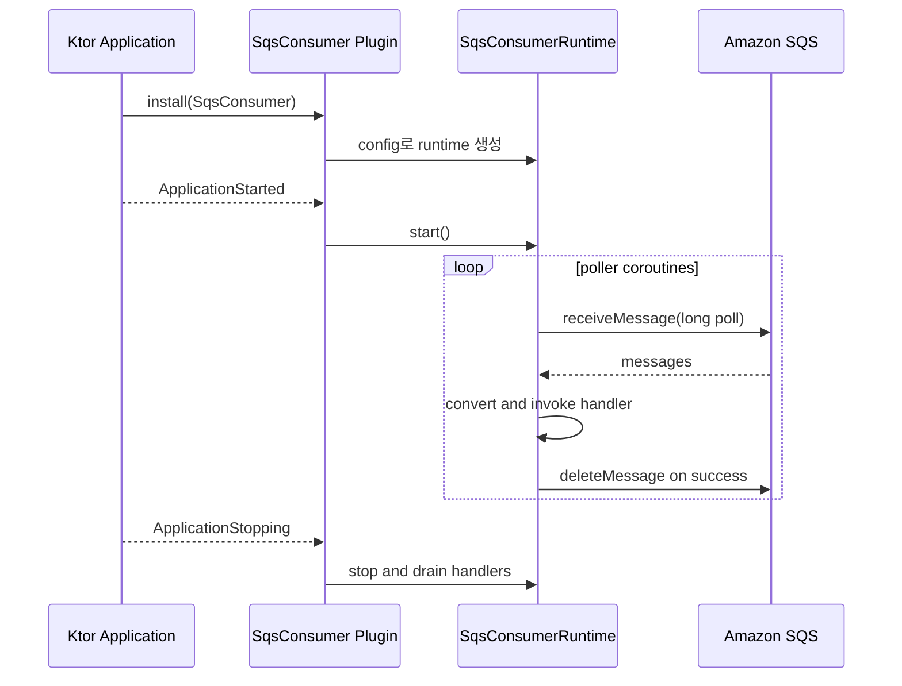

# Module bluetape4k-aws-ktor

[English](README.md) | [한국어](README.ko.md)

bluetape4k AWS 모듈을 위한 Ktor 3 통합 모듈입니다. Ktor `HttpClient`의 outgoing
AWS HTTP 요청에 Signature Version 4 서명을 적용하는 플러그인, 그 위에 구축한
coroutine 친화적 S3 REST client, Ktor lifecycle에 맞춰 동작하는 server-side SQS
consumer/publisher runtime을 제공합니다.

## 기능

- Ktor `HttpClient`용 `AwsSigV4Plugin`.
- Static, Default, Profile, Session provider를 포함한 AWS SDK Java v2
  `AwsCredentialsProvider` 연동.
- 헤더 서명과 쿼리 문자열 서명.
- region, service, path normalization, URL encoding, payload signing, clock
  주입 옵션.
- PutObject, GetObject, DeleteObject, ListObjectsV2, multipart upload,
  presigned GET/PUT URL을 지원하는 `S3KtorClient`.
- Coroutine 기반 SQS polling, publishing, graceful shutdown, retry visibility
  제어, 선택적 manual DLQ forwarding을 제공하는 `SqsConsumer` Ktor
  `ApplicationPlugin`.

## 의존성

`aws-ktor` 는 Ktor client core와 AWS auth API를 노출하지만 Ktor server, Ktor
engine, AWS service client는 가능한 한 `compileOnly` 로 둡니다. 애플리케이션은 실제
실행에 사용할 runtime 구성요소를 직접 추가해야 합니다.

```kotlin
dependencies {
    implementation("io.github.bluetape4k.aws:aws-ktor:${bluetape4kAwsVersion}")

    // SigV4/S3 client 사용 시
    implementation("io.ktor:ktor-client-cio")

    // SQS consumer/publisher 사용 시
    implementation("io.ktor:ktor-server-core")
    implementation("software.amazon.awssdk:sqs")
}
```

## 사용법

```kotlin
import io.bluetape4k.aws.ktor.client.AwsSigV4Plugin
import io.ktor.client.HttpClient
import io.ktor.client.engine.cio.CIO
import io.ktor.client.request.get
import software.amazon.awssdk.auth.credentials.DefaultCredentialsProvider

val client = HttpClient(CIO) {
    install(AwsSigV4Plugin) {
        region = "ap-northeast-2"
        service = "execute-api"
        credentialsProvider = DefaultCredentialsProvider.builder().build()
    }
}

val response = client.get("https://example.execute-api.ap-northeast-2.amazonaws.com/prod/orders")
```

애플리케이션이 직접 만든 `HttpClient` 는 애플리케이션 scope 종료 시 닫아야 합니다.

## Payload 서명

플러그인은 body가 없는 요청과 replay 가능한 `OutgoingContent.ByteArrayContent`
payload를 직접 서명합니다. 임의의 Ktor streaming content는 엔진 전송 전에 안전하게
소비하고 재생할 수 없으므로 `payloadSigningEnabled=true`일 때 거부합니다.

대상 AWS 서비스가 해당 요청에서 unsigned payload를 허용할 때만
`payloadSigningEnabled = false`를 설정하세요.

```kotlin
install(AwsSigV4Plugin) {
    region = "ap-northeast-2"
    service = "execute-api"
    payloadSigningEnabled = false
}
```

## S3 Client

`S3KtorClient`는 동일한 SigV4 플러그인을 사용하며 S3 전용 signing flag
(`doubleUrlEncode=false`, `normalizePath=false`, unsigned payload)를 적용합니다.
LocalStack 같은 path-style endpoint와 DNS-safe bucket의 virtual-hosted AWS S3
endpoint를 모두 지원합니다. `endpointOverride` 를 지정하면 path-style URL을
사용합니다.

```kotlin
import io.bluetape4k.aws.ktor.s3.s3KtorClientOf
import io.bluetape4k.aws.ktor.s3.S3KtorAddressingStyle
import io.ktor.http.Url
import software.amazon.awssdk.auth.credentials.DefaultCredentialsProvider

val s3 = s3KtorClientOf(
    region = "ap-northeast-2",
    credentialsProvider = DefaultCredentialsProvider.builder().build(),
    endpointOverride = Url("http://localhost:4566"), // LocalStack 사용 시
    addressingStyle = S3KtorAddressingStyle.Path,
)

suspend fun roundTrip(bucket: String, key: String): String {
    s3.putObject(
        bucket = bucket,
        key = key,
        bytes = "hello".encodeToByteArray(),
        contentType = "text/plain; charset=utf-8",
    )
    return s3.getObjectBytes(bucket, key).decodeToString()
}

val download = s3.presignGetObject(bucket = "demo-bucket", key = "hello.txt", expires = java.time.Duration.ofMinutes(15))
```

`s3KtorClientOf` 는 내부에서 만든 `HttpClient` 를 소유하므로 짧게 쓰는 client는
`close()` 또는 Kotlin `use { ... }` 로 닫습니다. Presigned URL 만료 시간은 1초 이상
7일 이하여야 합니다.

실행 가능한 예제는 `examples/aws-ktor-s3-examples`에 있으며 Nightly workflow에
포함됩니다.

## SQS Consumer And Publisher

`SqsConsumer` 는 하나의 SQS consumer runtime을 Ktor 애플리케이션에 설치합니다.
runtime은 `ApplicationStarted` 이벤트에서 시작하고 `ApplicationStopping` 이벤트에서
중지하며, publish가 필요하면 `application.sqsConsumer()` 로 접근할 수 있습니다.



```kotlin
import io.bluetape4k.aws.ktor.sqs.SqsConsumer
import io.bluetape4k.aws.ktor.sqs.sqsConsumer
import io.ktor.server.application.Application
import io.ktor.server.application.install
import software.amazon.awssdk.auth.credentials.DefaultCredentialsProvider
import software.amazon.awssdk.regions.Region
import software.amazon.awssdk.services.sqs.SqsAsyncClient

fun Application.module() {
    val sqs = SqsAsyncClient.builder()
        .region(Region.AP_NORTHEAST_2)
        .credentialsProvider(DefaultCredentialsProvider.create())
        .build()

    install(SqsConsumer) {
        sqsAsyncClient = sqs
        queueName = "orders"
        coroutines = 4
        maxMessages = 10
        waitTimeSeconds = 20
        visibilityTimeoutSeconds = 30
        shutdownTimeout = java.time.Duration.ofSeconds(30)

        onMessage<String> { body ->
            processOrder(body)
        }
    }
}

suspend fun Application.publishOrder(json: String) {
    sqsConsumer().send(json)
}
```

주입한 `SqsAsyncClient` 는 애플리케이션이 소유합니다. 플러그인은 client를 닫지
않으므로 애플리케이션 scope 종료 시 직접 닫아야 합니다.

### SQS Consumer 옵션

| 옵션 | 기본값 | 설명 |
|---|---:|---|
| `queueUrl` / `queueName` | 필수 | source queue 식별자 중 정확히 하나만 설정합니다. |
| `coroutines` | `1` | polling coroutine 수입니다. 기본 dispatcher는 `Dispatchers.IO.limitedParallelism(coroutines)` 이며, runtime backpressure가 in-flight handler 수를 `coroutines * maxMessages` 로 제한합니다. |
| `maxMessages` | `10` | SQS receive batch size이며 `1..10` 범위로 검증합니다. |
| `waitTimeSeconds` | `20` | long-poll 대기 시간이며 `0..20` 범위로 검증합니다. |
| `visibilityTimeoutSeconds` | `null` | receive visibility timeout입니다. visibility heartbeat를 켜려면 필요합니다. |
| `deleteOnSuccess` | `true` | handler가 정상 종료되면 source message를 삭제합니다. |
| `failureVisibilityTimeoutSeconds` | `null` | handler 실패 후 visibility를 변경합니다. 즉시 재전송하려면 `0`을 사용합니다. |
| `deadLetterQueueUrl` / `deadLetterQueueName` | `null` | 선택적 manual DLQ forwarding입니다. `failureVisibilityTimeoutSeconds` 와 동시에 사용할 수 없습니다. |
| `pollBackoff` | `250ms -> 5s` | transient SQS receive 오류에 대한 exponential backoff입니다. |
| `visibilityHeartbeatSeconds` | `null` | handler 실행 중 message visibility를 주기적으로 연장합니다. |
| `shutdownTimeout` | `30s` | shutdown 시 in-flight handler를 기다릴 시간입니다. |

### 실패와 Shutdown 의미

성공 시 runtime은 handler가 이미 `SqsMessageContext.delete()` 를 호출하지 않았다면
message를 삭제합니다. `CancellationException` 은 그대로 다시 던지며 message를 ack하지
않습니다.

handler 실패 시 우선순위는 다음과 같습니다.

1. Manual DLQ가 설정되어 있으면 원본 body와 message attributes를 DLQ로 전송하고
   SQS message attribute 10개 제한 안에서 `bluetape4k-*` 원본/error metadata를 추가한 뒤
   source message를 삭제합니다.
2. 아니면 `failureVisibilityTimeoutSeconds` 가 설정되어 있을 때 visibility를 변경합니다.
3. 아니면 message를 그대로 두어 SQS 기본 redelivery 또는 native redrive policy에 맡깁니다.

Manual DLQ forwarding은 SQS의 atomic transaction이 아닙니다. 운영에서 가능하면 native
SQS redrive policy를 우선 사용하고, 실패 message를 handler에서 보강해야 할 때만 manual
forwarding을 사용하세요.

Shutdown 시 runtime은 새 receive를 중단하고, `shutdownTimeout` 동안 in-flight handler를
기다린 뒤 남은 handler를 cancel합니다. cancel된 handler의 message는 삭제하지 않습니다.
