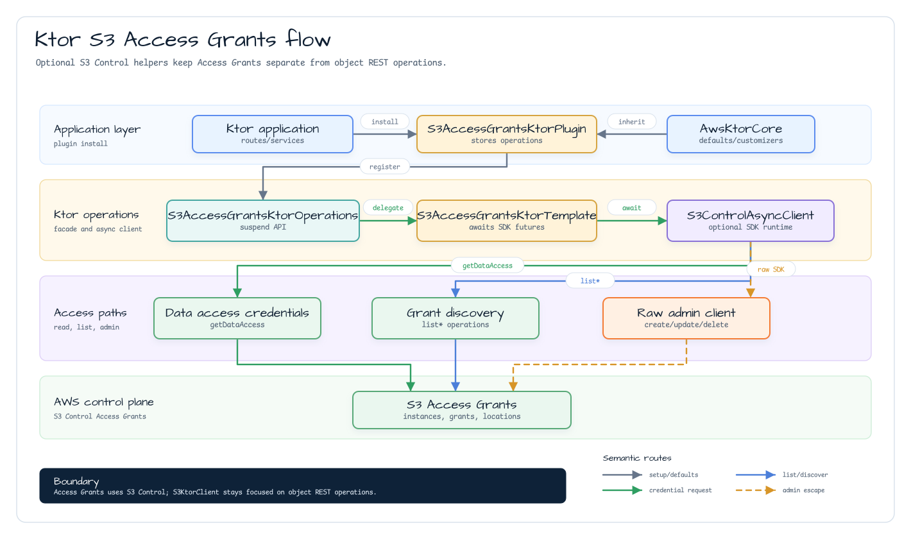

# Module bluetape4k-aws-ktor

[English](README.md) | [한국어](README.ko.md)

bluetape4k AWS 모듈을 위한 Ktor 3 통합 모듈입니다. Ktor `HttpClient`의 outgoing
AWS HTTP 요청에 Signature Version 4 서명을 적용하는 플러그인, 그 위에 구축한
coroutine 친화적 S3 REST client, Ktor lifecycle에 맞춰 동작하는 server-side SQS
consumer/publisher runtime을 제공합니다. 또한 `:aws-kotlin` 과 공식 AWS SDK for
Kotlin을 사용하는 DynamoDB Ktor server plugin, repository facade, 그리고
AWS-backed Exposed JDBC database registry를 Ktor lifecycle에 연결하는 server
plugin과 선택적 EC2 IMDS metadata operation을 제공합니다. 또한 명시적 metric/log-event
publishing을 위한 선택적 CloudWatch와 CloudWatch Logs server plugin을 제공합니다.


## 기능

- region, endpoint override, Java/Kotlin credentials provider, signing clock,
  client customizer를 애플리케이션 수준에서 공유하는 선택적 `AwsKtorCore`.
- Ktor `HttpClient`용 `AwsSigV4Plugin`.
- Static, Default, Profile, Session provider를 포함한 AWS SDK Java v2
  `AwsCredentialsProvider` 연동.
- 헤더 서명과 쿼리 문자열 서명.
- region, service, path normalization, URL encoding, payload signing, clock
  주입 옵션.
- PutObject, GetObject, DeleteObject, ListObjectsV2, multipart upload,
  presigned GET/PUT URL, content-type 감지, server-side encryption header,
  client-side envelope encryption, S3 기반 Ktor config object 로딩을 지원하는
  `S3KtorClient`.
- S3 Control 기반 Access Grants data access와 discovery operation을 선택적으로
  설치하는 `S3AccessGrantsKtorPlugin`.
- Coroutine 기반 SQS polling, publishing, graceful shutdown, retry visibility
  제어, 선택적 manual DLQ forwarding을 제공하는 `SqsConsumer` Ktor
  `ApplicationPlugin`.
- AWS Kotlin SDK DynamoDB client, 명시적 table auto-create, repository-style
  접근을 제공하는 `DynamoDbKtorPlugin`.
- local property 또는 AWS config-source descriptor에서 로드한 Exposed JDBC
  database registry를 공유하는 `AwsExposedPlugin`.
- credential 전략으로 IMDS를 사용하지 않고 EC2 metadata만 제한적으로 읽는
  `ImdsKtorPlugin`.
- 명시적 CloudWatch metric publishing, CloudWatch Logs setup, buffered log-event
  publishing, bounded shutdown flush를 제공하는 `CloudWatchKtorPlugin` 과
  `CloudWatchLogsKtorPlugin`.

## 의존성

`aws-ktor` 는 공통 Ktor baseline에 공유 `bluetape4k-ktor-core` helper를 사용하고,
Ktor client core와 AWS auth API를 노출합니다. Ktor engine, Jackson content
negotiation, AWS service client는 runtime 선택이 중요하므로 애플리케이션 의존성으로
명시합니다.

```kotlin
dependencies {
    implementation("io.github.bluetape4k.aws:bluetape4k-aws-ktor:${bluetape4kAwsVersion}")

    // SigV4/S3 client 사용 시
    implementation("io.ktor:ktor-client-cio")

    // S3 Access Grants plugin 사용 시
    implementation("io.ktor:ktor-server-core")
    implementation("software.amazon.awssdk:s3control")

    // SQS consumer/publisher 사용 시
    implementation("io.ktor:ktor-server-core")
    implementation("software.amazon.awssdk:sqs")

    // EC2 IMDS metadata 사용 시
    implementation("io.ktor:ktor-server-core")
    implementation("software.amazon.awssdk:imds")

    // CloudWatch metrics 및 CloudWatch Logs 사용 시
    implementation("io.ktor:ktor-server-core")
    implementation("software.amazon.awssdk:cloudwatch")
    implementation("software.amazon.awssdk:cloudwatchlogs")

    // SQS/S3/CloudWatch Ktor helper용 선택적 Micrometer bridge
    implementation("io.micrometer:micrometer-core")

    // DynamoDB Ktor server 사용 시
    implementation("io.ktor:ktor-server-core")
    implementation("aws.sdk.kotlin:dynamodb:${awsKotlinSdkVersion}")

    // AWS-backed Exposed Ktor server 사용 시
    implementation("io.ktor:ktor-server-core")
    implementation("io.github.bluetape4k.aws:bluetape4k-aws-exposed:${bluetape4kAwsVersion}")
    runtimeOnly("com.h2database:h2") // 또는 운영 JDBC driver
}
```

## 사용법

### 공유 AWS 기본값

여러 Ktor 통합이 같은 AWS region, local endpoint, credentials, signing clock,
client customizer를 공유해야 한다면 `AwsKtorCore`를 한 번 설치합니다. 서비스별
설정은 항상 공유 기본값보다 우선합니다.
애플리케이션이 JSON content negotiation, 표준 status pages, health/readiness route
같은 공유 `bluetape4k-ktor-core` baseline도 함께 원한다면 `AwsKtorCore` 안에서
`ktorCore()`를 호출합니다.

```kotlin
import io.bluetape4k.aws.ktor.AwsKtorCore
import io.bluetape4k.aws.ktor.sqs.SqsConsumer
import io.ktor.http.Url
import io.ktor.server.application.Application
import io.ktor.server.application.install
import software.amazon.awssdk.auth.credentials.DefaultCredentialsProvider

fun Application.module() {
    install(AwsKtorCore) {
        region = "ap-northeast-2"
        endpointOverride = Url("http://localhost:4566")
        javaCredentialsProvider = DefaultCredentialsProvider.builder().build()
        ktorCore()
    }

    install(SqsConsumer) {
        queueName = "orders"
        onMessage<String> { body -> processOrder(body) }
    }
}
```

`S3KtorClient`, `SqsConsumer`, `CloudWatchKtorPlugin`,
`CloudWatchLogsKtorPlugin`, `DynamoDbKtorPlugin`은 공유 기본값을 상속할 수 있습니다.
특정 통합만 다른 대상이 필요하면 서비스 로컬 `region`, `endpointOverride` /
`endpointUrl`, credentials provider를 설정합니다. EKS/IRSA 같은
web identity 배포에서는 적절한 AWS SDK credentials provider를 `AwsKtorCore`에 직접
주입하고, 해당 provider가 STS를 요구한다면 애플리케이션 runtime classpath에
`software.amazon.awssdk:sts` 또는 `aws.sdk.kotlin:sts`를 추가합니다.

```kotlin
import io.bluetape4k.aws.ktor.client.AwsSigV4Plugin
import io.ktor.client.HttpClient
import io.ktor.client.engine.cio.CIO
import io.ktor.client.request.get
import software.amazon.awssdk.auth.credentials.DefaultCredentialsProvider

val client = HttpClient(CIO) {
    install(AwsSigV4Plugin) {
        region = "ap-northeast-2"
        service = "execute-api"
        credentialsProvider = DefaultCredentialsProvider.builder().build()
    }
}

val response = client.get("https://example.execute-api.ap-northeast-2.amazonaws.com/prod/orders")
```

애플리케이션이 직접 만든 `HttpClient` 는 애플리케이션 scope 종료 시 닫아야 합니다.

## EC2 IMDS Plugin

`ImdsKtorPlugin` 은 EC2에서 실행되는 Ktor 애플리케이션이 instance metadata를 읽어야 할
때만 사용합니다. Plugin 설치는 operations facade만 만들거나 저장하며 metadata endpoint를
호출하지 않습니다. 각 operation은 `requestTimeout` 으로 제한됩니다.

```kotlin
import io.bluetape4k.aws.ktor.imds.ImdsKtorPlugin
import io.bluetape4k.aws.ktor.imds.imds
import io.ktor.server.application.Application
import io.ktor.server.application.install
import java.time.Duration

fun Application.module() {
    install(ImdsKtorPlugin) {
        requestTimeout = Duration.ofSeconds(1)
    }
}

suspend fun Application.instanceSnapshot(): Map<String, String> =
    mapOf(
        "instanceId" to imds().instanceId(),
        "instanceType" to imds().instanceType(),
        "region" to imds().region(),
        "availabilityZone" to imds().availabilityZone(),
    )
```

테스트나 custom metadata routing 이 필요할 때만 `endpoint` 를 명시합니다. 그 외에는
설정된 `endpointMode` 를 사용합니다. IMDS는 일반 AWS service endpoint가 아니므로
`AwsKtorCore.endpointOverride` 를 자동 상속하지 않습니다. Credential 조회는
`DefaultCredentialsProvider`, STS web identity, 또는 명시적 AWS SDK credentials
provider에 맡겨야 합니다. `ImdsKtorOperations` 는 IAM role 이름만 노출하고 임시
credential document는 노출하지 않습니다.

## Payload 서명

플러그인은 body가 없는 요청과 replay 가능한 `OutgoingContent.ByteArrayContent`
payload를 직접 서명합니다. 임의의 Ktor streaming content는 엔진 전송 전에 안전하게
소비하고 재생할 수 없으므로 `payloadSigningEnabled=true`일 때 거부합니다.

대상 AWS 서비스가 해당 요청에서 unsigned payload를 허용할 때만
`payloadSigningEnabled = false`를 설정하세요.

```kotlin
install(AwsSigV4Plugin) {
    region = "ap-northeast-2"
    service = "execute-api"
    payloadSigningEnabled = false
}
```

## S3 Client

`S3KtorClient`는 동일한 SigV4 플러그인을 사용하며 S3 전용 signing flag
(`doubleUrlEncode=false`, `normalizePath=false`, unsigned payload)를 적용합니다.
LocalStack 같은 path-style endpoint와 DNS-safe bucket의 virtual-hosted AWS S3
endpoint를 모두 지원합니다. `endpointOverride` 를 지정하면 path-style URL을
사용합니다.

```kotlin
import io.bluetape4k.aws.ktor.s3.s3KtorClientOf
import io.bluetape4k.aws.ktor.s3.S3KtorAddressingStyle
import io.ktor.http.Url
import software.amazon.awssdk.auth.credentials.DefaultCredentialsProvider

val s3 = s3KtorClientOf(
    region = "ap-northeast-2",
    credentialsProvider = DefaultCredentialsProvider.builder().build(),
    endpointOverride = Url("http://localhost:4566"), // LocalStack 사용 시
    addressingStyle = S3KtorAddressingStyle.Path,
)

suspend fun roundTrip(bucket: String, key: String): String {
    s3.putObject(
        bucket = bucket,
        key = key,
        bytes = "hello".encodeToByteArray(),
        contentType = "text/plain; charset=utf-8",
    )
    return s3.getObjectBytes(bucket, key).decodeToString()
}

val download = s3.presignGetObject(bucket = "demo-bucket", key = "hello.txt", expires = java.time.Duration.ofMinutes(15))
```

`s3KtorClientOf` 는 내부에서 만든 `HttpClient` 를 소유하므로 짧게 쓰는 client는
`close()` 또는 Kotlin `use { ... }` 로 닫습니다. Presigned URL 만료 시간은 1초 이상
7일 이하여야 합니다.

Server plugin 밖에서 애플리케이션 기본값을 상속하려면 설치된 defaults를 명시적으로
전달합니다.

```kotlin
import io.bluetape4k.aws.ktor.awsKtorDefaults
import io.bluetape4k.aws.ktor.s3.s3KtorClientOf
import io.ktor.server.application.Application

fun Application.s3Client() = s3KtorClientOf(defaults = awsKtorDefaults())
```

실행 가능한 S3 예제는
[`examples/aws-ktor-s3-examples`](../examples/aws-ktor-s3-examples)에 있으며 기본
object route, content-type 감지, config object, presigned URL, client-side
encryption 시나리오를 포함합니다.

### 고급 S3 Helper

`S3KtorClient` 는 추가 AWS service client를 필수 의존성으로 만들지 않고 고급 object
workflow를 opt-in helper로 제공합니다.

- `putObjectDetectingContentType(...)` 는 object key와 payload로 content type을
  감지하고 실패하면 `application/octet-stream`을 사용합니다.
- `putEncryptedObject(...)`, `createEncryptedMultipartUpload(...)` 는 SSE-S3,
  SSE-KMS, DSSE-KMS, bucket key, SSE-C용 S3 server-side encryption header를
  생성합니다.
- `S3KtorClientSideEncryption` 은 업로드 전에 로컬 AES-GCM envelope encryption을
  수행하고 encrypted data key와 nonce를 S3 metadata에 저장합니다.
- `putConfigObject(...)`, `getConfigObject(...)` 는 Spring `Environment`나 특정 Ktor
  `ApplicationConfig` parser에 결합하지 않고 S3에서 text config 파일을 저장/로드합니다.


#### 시나리오: 안전한 Config Bootstrap

Ktor service는 S3에서 runtime config를 bootstrap한 뒤 민감한 object를 server-side 또는
client-side encryption으로 저장할 수 있습니다.

1. `putConfigObject(...)` 로 `application.conf` 또는 tenant override를 저장합니다.
2. 시작 시 `getConfigObject(...)` 로 text를 로드하고 application-owned config layer에서
   파싱합니다.
3. `putObjectDetectingContentType(...)` 로 사용자/tenant payload를 업로드합니다.
4. S3가 at-rest encryption을 담당해야 하면 `putEncryptedObject(...)` 로 SSE-S3/SSE-KMS
   header를 추가합니다.
5. Payload가 process를 떠나기 전에 암호화되어야 하면 `S3KtorClientSideEncryption` 을
   사용합니다.


```kotlin
import io.bluetape4k.aws.ktor.s3.S3KtorServerSideEncryption

suspend fun uploadSecureConfig(s3: S3KtorClient) {
    s3.putConfigObject(
        bucket = "demo-bucket",
        key = "config/application.conf",
        text = "ktor { deployment { port = 8080 } }",
        metadata = mapOf("source" to "s3"),
    )

    s3.putEncryptedObject(
        bucket = "demo-bucket",
        key = "secure/report.txt",
        bytes = "secret".encodeToByteArray(),
        encryption = S3KtorServerSideEncryption.Kms(
            keyId = "alias/app",
            encryptionContext = mapOf("tenant" to "demo"),
            bucketKeyEnabled = true,
        ),
    )
}
```

Client-side encryption은 KMS에 직접 의존하지 않고 `S3KtorDataKeyProvider` 를
주입받습니다. 운영 provider는 AWS KMS `GenerateDataKey` 와 `Decrypt` 를 감싸면 되고,
테스트나 로컬 도구는 in-memory provider를 사용할 수 있습니다. Plaintext data key는
process-local로만 다루고 provider 경계 밖에 저장하지 마세요.

### S3 Access Grants

`S3AccessGrantsKtorPlugin` 은 AWS SDK Java v2 `S3ControlAsyncClient` 기반 suspend
operations facade를 설치합니다. Access Grants는 S3 Control boundary에 유지하고, object
REST 호출은 `S3KtorClient` 에 남깁니다. Request 처리 중 필요한 data-access와 discovery
호출은 `application.s3AccessGrants()` 로 사용합니다.



Plugin은 caller-owned `S3AccessGrantsKtorOperations`, caller-owned
`S3ControlAsyncClient`, 또는 `AwsKtorCore` 기본값과 service-specific customizer로 만든
plugin-managed client를 사용할 수 있습니다. Administrative create, update, delete
operation은 의도적으로 raw S3 Control client에 남겨 Ktor facade가 request handling에
유용한 read/data-access path만 감싸도록 했습니다.

```kotlin
import io.bluetape4k.aws.ktor.AwsKtorCore
import io.bluetape4k.aws.ktor.s3.accessgrants.S3AccessGrantsKtorPlugin
import io.bluetape4k.aws.ktor.s3.accessgrants.s3AccessGrants
import io.ktor.server.application.Application
import io.ktor.server.application.install
import software.amazon.awssdk.auth.credentials.DefaultCredentialsProvider
import software.amazon.awssdk.services.s3control.model.GetDataAccessRequest
import software.amazon.awssdk.services.s3control.model.Permission

fun Application.module() {
    install(AwsKtorCore) {
        region = "ap-northeast-2"
        javaCredentialsProvider = DefaultCredentialsProvider.builder().build()
    }

    install(S3AccessGrantsKtorPlugin)
}

suspend fun Application.readGrantedCredentials(accountId: String, target: String) =
    s3AccessGrants().getDataAccess(
        GetDataAccessRequest.builder()
            .accountId(accountId)
            .target(target)
            .permission(Permission.READ)
            .build(),
    )
```

S3 Vector API는 기본 API 표면에 강제로 포함하지 않습니다. Service API를 runtime hard
dependency 없이 감싸도 될 만큼 안정화되기 전까지 공식 service SDK를 직접 사용하세요.

## CloudWatch Metrics And Logs

`CloudWatchKtorPlugin` 은 coroutine 기반 CloudWatch metric operation을 Ktor
애플리케이션에 설치합니다. Plugin 설치는 operations facade만 저장하며,
애플리케이션 코드가 `application.cloudWatch()` 를 호출하기 전에는 metric을 publish하지
않습니다.

```kotlin
import io.bluetape4k.aws.ktor.cloudwatch.CloudWatchKtorPlugin
import io.bluetape4k.aws.ktor.cloudwatch.cloudWatch
import io.ktor.server.application.Application
import io.ktor.server.application.install
import software.amazon.awssdk.services.cloudwatch.model.MetricDatum
import software.amazon.awssdk.services.cloudwatch.model.StandardUnit

fun Application.module() {
    install(CloudWatchKtorPlugin) {
        namespace = "Orders/Ktor"
        batchSize = 1000
    }
}

suspend fun Application.publishLatency(millis: Double) {
    cloudWatch().putMetricDatum(
        MetricDatum.builder()
            .metricName("order.latency")
            .unit(StandardUnit.MILLISECONDS)
            .value(millis)
            .build()
    )
}
```

`CloudWatchLogsKtorPlugin` 은 CloudWatch Logs operation과 작은 buffered runtime을
설치합니다. 애플리케이션 logging appender를 대체하지 않습니다. Runtime에 event를
명시적으로 append하거나 `cloudWatchLogs()` operation을 직접 호출하세요. Buffered event는
`ApplicationStopping` 에서 `shutdownFlushTimeout` 안에 flush됩니다.

```kotlin
import io.bluetape4k.aws.ktor.cloudwatch.CloudWatchLogsKtorPlugin
import io.bluetape4k.aws.ktor.cloudwatch.CloudWatchLogsKtorRuntimeKey
import io.ktor.server.application.Application
import io.ktor.server.application.install
import java.time.Duration

fun Application.module() {
    install(CloudWatchLogsKtorPlugin) {
        logGroupName = "/app/orders"
        logStreamName = "ktor"
        batchSize = 10000
        flushInterval = Duration.ofSeconds(5)
        shutdownFlushTimeout = Duration.ofSeconds(5)
    }
}

suspend fun Application.publishAudit(message: String) {
    attributes[CloudWatchLogsKtorRuntimeKey].append(message)
}
```

서비스가 Micrometer snapshot을 한 번 CloudWatch로 publish하고 싶을 때는
`CloudWatchKtorMeterPublishingTemplate` 을 사용합니다. 이 helper는 호출된 시점에만
기존 `MeterRegistry` 를 읽으며 scheduled CloudWatch registry exporter를 등록하지
않습니다.

## SQS Consumer And Publisher

`SqsConsumer` 는 하나의 SQS consumer runtime을 Ktor 애플리케이션에 설치합니다.
runtime은 `ApplicationStarted` 이벤트에서 시작하고 `ApplicationStopping` 이벤트에서
중지하며, publish가 필요하면 `application.sqsConsumer()` 로 접근할 수 있습니다.


```kotlin
import io.bluetape4k.aws.ktor.sqs.SqsConsumer
import io.bluetape4k.aws.ktor.sqs.sqsConsumer
import io.ktor.server.application.Application
import io.ktor.server.application.install
import software.amazon.awssdk.auth.credentials.DefaultCredentialsProvider
import software.amazon.awssdk.regions.Region
import software.amazon.awssdk.services.sqs.SqsAsyncClient

fun Application.module() {
    val sqs = SqsAsyncClient.builder()
        .region(Region.AP_NORTHEAST_2)
        .credentialsProvider(DefaultCredentialsProvider.builder().build())
        .build()

    install(SqsConsumer) {
        sqsAsyncClient = sqs
        queueName = "orders"
        coroutines = 4
        maxMessages = 10
        waitTimeSeconds = 20
        visibilityTimeoutSeconds = 30
        shutdownTimeout = java.time.Duration.ofSeconds(30)

        onMessage<String> { body ->
            processOrder(body)
        }
    }
}

suspend fun Application.publishOrder(json: String) {
    sqsConsumer().send(json)
}
```

명시적 ack 흐름이 필요하면 자동 삭제를 끄고 handler 안에서 `ack()` / `nack()` 을
사용합니다. Interceptor는 receive, invoke, ack, nack hook 전후에 실행됩니다. Observer는
이 모듈에 metrics 의존성을 추가하지 않고도 Micrometer, OpenTelemetry, log로 연결할 수
있는 lightweight event를 내보냅니다.

```kotlin
import io.bluetape4k.aws.ktor.sqs.SqsConversionFailurePolicy
import io.bluetape4k.aws.ktor.sqs.SqsFixedFailureVisibilityStrategy
import io.bluetape4k.aws.ktor.sqs.micrometer

install(SqsConsumer) {
    sqsAsyncClient = sqs
    queueName = "orders"
    deleteOnSuccess = false
    conversionFailurePolicy = SqsConversionFailurePolicy.HandleAsFailure
    failureVisibilityStrategy = SqsFixedFailureVisibilityStrategy(timeoutSeconds = 5)
    micrometer(meterRegistry)

    onMessage<String> { body ->
        if (shouldRetryLater(body)) {
            nack(timeoutSeconds = 30)
            return@onMessage
        }

        processOrder(body)
        ack()
    }
}
```

Micrometer observer 는 send, receive, invoke, ack, nack, conversion failure,
retry/failure event 를 `bluetape4k.aws.ktor.sqs.operation` timer 로 기록합니다. 기본
tag 에 queue URL, message ID, receipt handle 은 넣지 않습니다.

주입한 `SqsAsyncClient` 는 애플리케이션이 소유합니다. 플러그인은 client를 닫지
않으므로 애플리케이션 scope 종료 시 직접 닫아야 합니다. client를 주입하지 않으면
`SqsConsumer`가 `AwsKtorCore` 또는 서비스 로컬 설정으로 plugin-owned client를 만들 수
있고, 이 client는 `ApplicationStopping` 시 닫힙니다.

실행 가능한 SQS 예제는
[`examples/aws-ktor-sqs-examples`](../examples/aws-ktor-sqs-examples)에 있으며
Floci 기반 publish, manual ack/nack, retry-once redelivery, interceptor,
observer summary를 다룹니다.

### Micrometer S3 Wrapper

Ktor service 가 모든 `aws-ktor` 사용자에게 Micrometer 를 강제하지 않으면서
`S3KtorClient` 호출 주변에 operation timer 를 붙이고 싶을 때 `withMicrometer(...)` 를
사용합니다.

```kotlin
import io.bluetape4k.aws.ktor.s3.S3KtorClient
import io.bluetape4k.aws.ktor.s3.withMicrometer
import io.micrometer.core.instrument.MeterRegistry

suspend fun loadDocument(s3: S3KtorClient, meterRegistry: MeterRegistry): ByteArray {
    val observedS3 = s3.withMicrometer(meterRegistry)
    return observedS3.getObjectBytes("documents", "orders/latest.json")
}
```

Wrapper 는 선택된 put/get/delete/list/presign operation 을
`bluetape4k.aws.ktor.s3.operation` timer 로 기록합니다. Bucket tag 는 기본적으로 꺼져
있고 object key 는 기본 tag 로 사용하지 않습니다.

## DynamoDB Server Plugin

`DynamoDbKtorPlugin` 은 AWS Kotlin SDK `DynamoDbClient` 를 Ktor application
lifecycle에 설치하고 `application.dynamoDb()` 로 노출합니다. 플러그인은
애플리케이션이 주입한 client를 사용할 수도 있고 `region`, `endpointUrl`,
credentials로 직접 만들 수도 있습니다. 주입한 client는 플러그인이 닫지 않으며,
플러그인이 만든 client만 `ApplicationStopping` 에서 닫습니다.
`AwsKtorCore`가 설치되어 있으면 생략한 `region`, `endpointUrl`, credentials, HTTP
engine, DynamoDB customizer는 공유 기본값에서 상속됩니다.

테이블 생성은 명시적입니다. 로컬 개발이나 테스트에서 누락된 테이블을 만들고 싶을 때
`autoCreateTables = true` 를 설정하고 `table { }` 정의를 등록합니다. 이미 존재하는
테이블은 건너뛰며, schema 검증은 운영 절차와 migration 도구에 맡깁니다. Auto-create는
`ApplicationStarted` 중 실행되므로 각 등록 테이블이 준비되거나 `tableReadyTimeout` 이
만료될 때까지 Ktor startup을 block합니다.

```kotlin
import aws.sdk.kotlin.services.dynamodb.model.AttributeValue
import aws.sdk.kotlin.services.dynamodb.model.BillingMode
import io.bluetape4k.aws.kotlin.dynamodb.DynamoItemMapper
import io.bluetape4k.aws.kotlin.dynamodb.DynamoItemReader
import io.bluetape4k.aws.kotlin.dynamodb.model.partitionKeyOf
import io.bluetape4k.aws.kotlin.dynamodb.model.stringAttrDefinitionOf
import io.bluetape4k.aws.ktor.dynamodb.DynamoDbKtorPlugin
import io.bluetape4k.aws.ktor.dynamodb.dynamoDb
import io.ktor.server.application.Application
import io.ktor.server.application.install

data class Order(val id: String, val status: String)

val orderMapper = DynamoItemMapper<Order> { order ->
    mapOf(
        "id" to AttributeValue.S(order.id),
        "status" to AttributeValue.S(order.status),
    )
}
val orderReader = DynamoItemReader<Order> { item ->
    Order(
        id = item.getValue("id").asS(),
        status = item.getValue("status").asS(),
    )
}
val orderKeyMapper = DynamoItemMapper<String> { id ->
    mapOf("id" to AttributeValue.S(id))
}

fun Application.module() {
    install(DynamoDbKtorPlugin) {
        region = "ap-northeast-2"
        autoCreateTables = true
        table(
            tableName = "orders",
            keySchema = listOf(partitionKeyOf("id")),
            attributeDefinitions = listOf(stringAttrDefinitionOf("id")),
        ) {
            billingMode = BillingMode.PayPerRequest
        }
    }
}

suspend fun Application.findOrder(id: String): Order? =
    dynamoDb()
        .repository("orders", orderMapper, orderReader, orderKeyMapper)
        .findById(id)
```

Repository는 명시적인 `DynamoItemMapper` 와 `DynamoItemReader` 함수를 사용합니다.
AWS Kotlin DynamoDB Mapper는 아직 Developer Preview API이므로 기본 구현으로
사용하지 않습니다.

## AWS Exposed Server Plugin

`AwsExposedPlugin` 은 `AwsExposedKtorRuntime` 하나를 Ktor application lifecycle에
설치합니다. startup에서는 `bluetape4k-aws-exposed` 의
`AwsExposedDatabaseRegistry` 를 만들고, shutdown에서는 registry를 한 번만 닫습니다.
Route code는 runtime, default/named handle, Exposed `Database`, suspend
transaction helper를 사용할 수 있습니다.

```kotlin
import io.bluetape4k.aws.ktor.exposed.AwsExposedPlugin
import io.bluetape4k.aws.ktor.exposed.awsExposedTransaction
import io.ktor.server.application.Application
import io.ktor.server.application.install
import io.ktor.server.response.respondText
import io.ktor.server.routing.get
import io.ktor.server.routing.routing
import org.jetbrains.exposed.v1.jdbc.selectAll

fun Application.module() {
    install(AwsExposedPlugin) {
        defaultDatabase {
            url = "jdbc:postgresql://localhost:5432/orders"
            driverClassName = "org.postgresql.Driver"
            username = "orders"
            password = "change-me"
            pool {
                maximumPoolSize = 8
                minimumIdle = 1
            }
        }
        database("analytics") {
            url = "jdbc:postgresql://localhost:5432/analytics"
            driverClassName = "org.postgresql.Driver"
            username = "analytics"
        }
    }

    routing {
        get("/orders/count") {
            val count = call.awsExposedTransaction {
                Orders.selectAll().count()
            }
            call.respondText(count.toString())
        }
    }
}
```

원격 설정은 AWS source descriptor를 보존하고, `AwsDatabaseSettingsResolver` 가 최종
JDBC 값을 제공하게 구성합니다. 이렇게 하면 Ktor 통합과 Secrets Manager 또는
Parameter Store 로딩 정책을 분리할 수 있습니다.

```kotlin
install(AwsExposedPlugin) {
    settingsResolver = mySecretsManagerResolver
    defaultDatabase {
        secretSource("/prod/app/database") {
            prefix = "db"
        }
    }
}
```

설정 이후 password 값은 `AwsSecretString` 으로 보관되며 generated diagnostics에는
redacted 문자열로 표시됩니다.

### CloudWatch 옵션

| 옵션 | 기본값 | 설명 |
|---|---:|---|
| `namespace` | `null` | namespace를 생략한 metric 호출에 사용할 기본 CloudWatch namespace입니다. |
| `batchSize` | `1000` | CloudWatch metric batch size이며 `1..1000` 범위로 검증합니다. |
| `cloudWatchAsyncClient` | `null` | 선택적 application-owned CloudWatch client입니다. 주입한 client는 plugin이 닫지 않습니다. |
| `cloudWatchOperations` | `null` | 테스트나 custom wrapper에 사용할 수 있는 선택적 application-owned operations facade입니다. |

### CloudWatch Logs 옵션

| 옵션 | 기본값 | 설명 |
|---|---:|---|
| `logGroupName` / `logStreamName` | `null` | buffered publishing과 default operation에 사용할 기본 log stream identity입니다. 두 값을 함께 설정해야 합니다. |
| `batchSize` | `10000` | CloudWatch Logs event batch size이며 `1..10000` 범위로 검증합니다. |
| `flushInterval` | `5s` | 명시적으로 append한 event의 periodic flush 주기입니다. Buffer가 비어 있으면 AWS를 호출하지 않습니다. |
| `shutdownFlushTimeout` | `5s` | shutdown flush 제한 시간입니다. Flush가 timeout되어도 plugin-owned client는 닫습니다. |
| `createLogGroupOnStart` | `false` | startup 시 log group을 생성할지 선택합니다. 기본값은 비활성입니다. |
| `createLogStreamOnStart` | `false` | startup 시 log stream을 생성할지 선택합니다. 기본값은 비활성입니다. |
| `cloudWatchLogsAsyncClient` | `null` | 선택적 application-owned CloudWatch Logs client입니다. 주입한 client는 plugin이 닫지 않습니다. |
| `cloudWatchLogsOperations` | `null` | 테스트나 custom wrapper에 사용할 수 있는 선택적 application-owned operations facade입니다. |

### SQS Consumer 옵션

| 옵션 | 기본값 | 설명 |
|---|---:|---|
| `queueUrl` / `queueName` | 필수 | source queue 식별자 중 정확히 하나만 설정합니다. |
| `coroutines` | `1` | polling coroutine 수입니다. 기본 dispatcher는 `Dispatchers.IO.limitedParallelism(coroutines)` 이며, runtime backpressure가 in-flight handler 수를 `coroutines * maxMessages` 로 제한합니다. |
| `maxMessages` | `10` | SQS receive batch size이며 `1..10` 범위로 검증합니다. |
| `waitTimeSeconds` | `20` | long-poll 대기 시간이며 `0..20` 범위로 검증합니다. |
| `visibilityTimeoutSeconds` | `null` | receive visibility timeout입니다. visibility heartbeat를 켜려면 필요합니다. |
| `deleteOnSuccess` | `true` | handler가 정상 종료되면 source message를 삭제합니다. |
| `conversionFailurePolicy` | `HandleAsFailure` | 변환 실패를 failure path로 보낼지, message를 삭제할지, redelivery에 맡길지 선택합니다. |
| `failureVisibilityTimeoutSeconds` | `null` | 변환 또는 handler 실패 후 visibility를 변경합니다. 즉시 재전송하려면 `0`을 사용합니다. `failureVisibilityStrategy` 와 동시에 사용할 수 없습니다. |
| `failureVisibilityStrategy` | `null` | `ApproximateReceiveCount` 를 포함한 message context로 실패 visibility를 계산합니다. fixed failure visibility 및 manual DLQ forwarding과 동시에 사용할 수 없습니다. |
| `deadLetterQueueUrl` / `deadLetterQueueName` | `null` | 선택적 manual DLQ forwarding입니다. fixed 또는 strategy 기반 failure visibility와 동시에 사용할 수 없습니다. |
| `pollBackoff` | `250ms -> 5s` | transient SQS receive 오류에 대한 exponential backoff입니다. |
| `visibilityHeartbeatSeconds` | `null` | handler 실행 중 message visibility를 주기적으로 연장합니다. |
| `shutdownTimeout` | `30s` | shutdown 시 in-flight handler를 기다릴 시간입니다. |
| `interceptor(...)` | 없음 | receive, invoke, ack, nack lifecycle hook을 등록합니다. |
| `observer(...)` | 없음 | metrics 또는 tracing bridge를 위한 lightweight runtime observation event를 등록합니다. |

### 실패와 Shutdown 의미

성공 시 runtime은 handler가 이미 `SqsMessageContext.delete()` 또는
`SqsMessageContext.ack()` 을 호출하지 않았다면 message를 삭제합니다.
`deleteOnSuccess = false` 를 설정하면 manual acknowledgement 모드가 되며 handler에서
`ack()` 또는 `nack(timeoutSeconds)` 를 명시적으로 호출합니다. `CancellationException`
은 그대로 다시 던지며 message를 ack하지 않습니다.

변환 실패는 `conversionFailurePolicy` 에 따라 handler 예외와 같은 failure path로 보내거나,
source message를 삭제하거나, 아무 처리 없이 SQS redelivery에 맡깁니다.

failure path로 들어간 변환 또는 handler 실패의 우선순위는 다음과 같습니다.

1. Manual DLQ가 설정되어 있으면 원본 body와 message attributes를 DLQ로 전송하고
   SQS message attribute 10개 제한 안에서 `bluetape4k-*` 원본/error metadata를 추가한 뒤
   source message를 삭제합니다.
2. 아니면 `failureVisibilityStrategy` 가 설정되어 있을 때 failure context로 visibility를
   계산해 변경합니다.
3. 아니면 `failureVisibilityTimeoutSeconds` 가 설정되어 있을 때 visibility를 변경합니다.
4. 아니면 message를 그대로 두어 SQS 기본 redelivery 또는 native redrive policy에 맡깁니다.

Manual DLQ forwarding은 SQS의 atomic transaction이 아닙니다. 운영에서 가능하면 native
SQS redrive policy를 우선 사용하고, 실패 message를 handler에서 보강해야 할 때만 manual
forwarding을 사용하세요.

Shutdown 시 runtime은 새 receive를 중단하고, `shutdownTimeout` 동안 in-flight handler를
기다린 뒤 남은 handler를 cancel합니다. cancel된 handler의 message는 삭제하지 않습니다.
