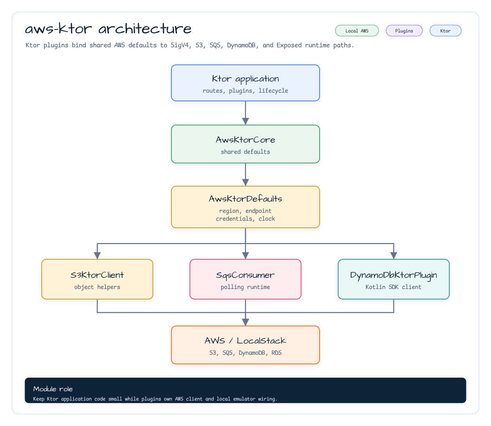
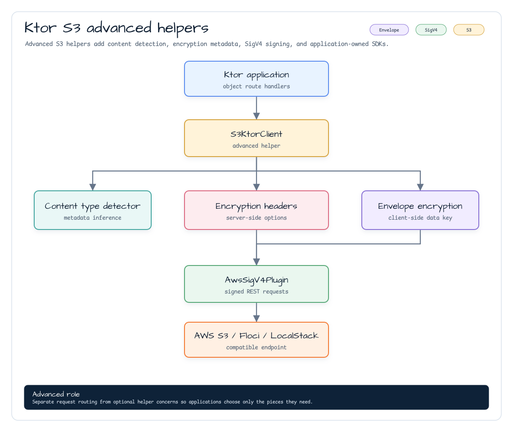
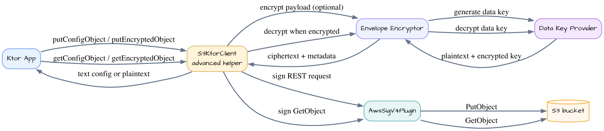
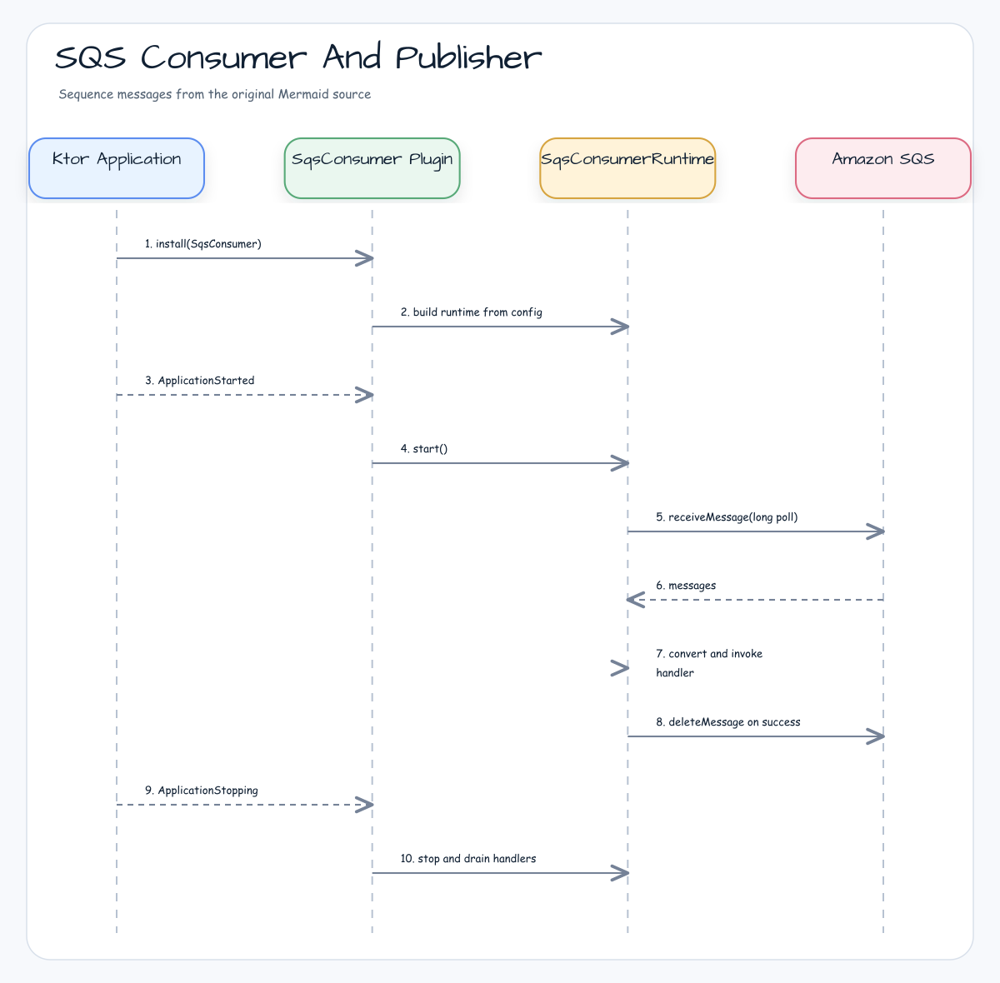

# Module bluetape4k-aws-ktor

[English](README.md) | [한국어](README.ko.md)

Ktor 3 integration for bluetape4k AWS modules. It provides a Ktor
`HttpClient` plugin for AWS Signature Version 4, a coroutine-friendly S3 REST
client built on that plugin, and a server-side SQS consumer/publisher runtime
that follows the Ktor application lifecycle. It also provides a Ktor server
plugin and repository facade for DynamoDB using `:aws-kotlin` and the official
AWS SDK for Kotlin, plus a Ktor server plugin for AWS-backed Exposed JDBC
database registries.



## Features

- `AwsKtorCore` for optional application-level AWS defaults: region, endpoint
  override, Java/Kotlin credentials providers, signing clock, and client
  customizers.
- `AwsSigV4Plugin` for Ktor `HttpClient`.
- AWS SDK Java v2 `AwsCredentialsProvider` integration, including static,
  default, profile, and session providers.
- Header signing and query-string signing.
- Deterministic signing options for region, service, path normalization, URL
  encoding, payload signing, and clock injection.
- `S3KtorClient` for S3 PutObject, GetObject, DeleteObject, ListObjectsV2,
  multipart upload, presigned GET/PUT URLs, content-type detection,
  server-side encryption headers, client-side envelope encryption, and S3-backed
  Ktor config object loading.
- `SqsConsumer` Ktor `ApplicationPlugin` for coroutine SQS polling, publishing,
  graceful shutdown, retry visibility control, and optional manual DLQ
  forwarding.
- `DynamoDbKtorPlugin` for Ktor server applications that need an AWS Kotlin SDK
  DynamoDB client, explicit table auto-creation, and repository-style access.
- `AwsExposedPlugin` for Ktor server applications that need shared Exposed JDBC
  databases loaded from local properties or AWS config-source descriptors.

## Dependency

`aws-ktor` uses shared `bluetape4k-ktor-core` helpers for the common Ktor
baseline and exposes Ktor client core plus AWS auth APIs. Ktor engines,
Jackson content negotiation, and AWS service clients remain explicit
application dependencies where runtime choice matters.

```kotlin
dependencies {
    implementation("io.github.bluetape4k.aws:bluetape4k-aws-ktor:${bluetape4kAwsVersion}")

    // SigV4/S3 client usage
    implementation("io.ktor:ktor-client-cio")

    // SQS consumer/publisher usage
    implementation("io.ktor:ktor-server-core")
    implementation("software.amazon.awssdk:sqs")

    // DynamoDB Ktor server usage
    implementation("io.ktor:ktor-server-core")
    implementation("aws.sdk.kotlin:dynamodb:${awsKotlinSdkVersion}")

    // AWS-backed Exposed Ktor server usage
    implementation("io.ktor:ktor-server-core")
    implementation("io.github.bluetape4k.aws:bluetape4k-aws-exposed:${bluetape4kAwsVersion}")
    runtimeOnly("com.h2database:h2") // or the production JDBC driver
}
```

## Usage

### Shared AWS Defaults

Install `AwsKtorCore` once when multiple Ktor integrations should inherit the
same AWS region, local endpoint, credentials, signing clock, or client
customizers. Service-specific configuration still wins over shared defaults.

```kotlin
import io.bluetape4k.aws.ktor.AwsKtorCore
import io.bluetape4k.aws.ktor.sqs.SqsConsumer
import io.ktor.http.Url
import io.ktor.server.application.Application
import io.ktor.server.application.install
import software.amazon.awssdk.auth.credentials.DefaultCredentialsProvider

fun Application.module() {
    install(AwsKtorCore) {
        region = "ap-northeast-2"
        endpointOverride = Url("http://localhost:4566")
        javaCredentialsProvider = DefaultCredentialsProvider.builder().build()
    }

    install(SqsConsumer) {
        queueName = "orders"
        onMessage<String> { body -> processOrder(body) }
    }
}
```

`S3KtorClient`, `SqsConsumer`, and `DynamoDbKtorPlugin` can inherit shared
defaults. Set a service-local `region`, `endpointOverride` / `endpointUrl`, or
credentials provider when one integration needs a different target. For
EKS/IRSA or other web-identity deployments, supply the appropriate AWS SDK
credentials provider in `AwsKtorCore`; keep `software.amazon.awssdk:sts` or
`aws.sdk.kotlin:sts` on the application runtime classpath when that provider
requires STS.

```kotlin
import io.bluetape4k.aws.ktor.client.AwsSigV4Plugin
import io.ktor.client.HttpClient
import io.ktor.client.engine.cio.CIO
import io.ktor.client.request.get
import software.amazon.awssdk.auth.credentials.DefaultCredentialsProvider

val client = HttpClient(CIO) {
    install(AwsSigV4Plugin) {
        region = "ap-northeast-2"
        service = "execute-api"
        credentialsProvider = DefaultCredentialsProvider.builder().build()
    }
}

val response = client.get("https://example.execute-api.ap-northeast-2.amazonaws.com/prod/orders")
```

Close application-owned `HttpClient` instances when the application scope ends.

## Payload Signing

The plugin signs no-body requests and replayable `OutgoingContent.ByteArrayContent`
payloads directly. Streaming content is rejected while `payloadSigningEnabled`
is `true`, because a client plugin cannot safely consume and replay arbitrary
Ktor streams before the engine sends them.

Set `payloadSigningEnabled = false` only when the target AWS service accepts an
unsigned payload for the request shape.

```kotlin
install(AwsSigV4Plugin) {
    region = "ap-northeast-2"
    service = "execute-api"
    payloadSigningEnabled = false
}
```

## S3 Client

`S3KtorClient` uses the same SigV4 plugin with S3-specific signing flags:
`doubleUrlEncode=false`, `normalizePath=false`, and unsigned payloads. It
supports path-style endpoints for LocalStack and virtual-hosted AWS S3
endpoints when the bucket name is DNS-safe. If `endpointOverride` is set, the
client uses path-style URLs.

```kotlin
import io.bluetape4k.aws.ktor.s3.s3KtorClientOf
import io.bluetape4k.aws.ktor.s3.S3KtorAddressingStyle
import io.ktor.http.Url
import software.amazon.awssdk.auth.credentials.DefaultCredentialsProvider

val s3 = s3KtorClientOf(
    region = "ap-northeast-2",
    credentialsProvider = DefaultCredentialsProvider.builder().build(),
    endpointOverride = Url("http://localhost:4566"), // optional, for LocalStack
    addressingStyle = S3KtorAddressingStyle.Path,
)

suspend fun roundTrip(bucket: String, key: String): String {
    s3.putObject(
        bucket = bucket,
        key = key,
        bytes = "hello".encodeToByteArray(),
        contentType = "text/plain; charset=utf-8",
    )
    return s3.getObjectBytes(bucket, key).decodeToString()
}

val download = s3.presignGetObject(bucket = "demo-bucket", key = "hello.txt", expires = java.time.Duration.ofMinutes(15))
```

`s3KtorClientOf` owns the internally created `HttpClient`; call `close()` or
use Kotlin `use { ... }` when the client is short-lived. Presigned URL expiry
must be between 1 second and 7 days.

To inherit application defaults outside a server plugin, pass the installed
defaults explicitly:

```kotlin
import io.bluetape4k.aws.ktor.awsKtorDefaults
import io.bluetape4k.aws.ktor.s3.s3KtorClientOf
import io.ktor.server.application.Application

fun Application.s3Client() = s3KtorClientOf(defaults = awsKtorDefaults())
```

Runnable S3 examples live in
[`examples/aws-ktor-s3-examples`](../examples/aws-ktor-s3-examples) and include
basic object routes plus content-type detection, config object, presigned URL,
and client-side encryption scenarios.

### Advanced S3 Helpers

`S3KtorClient` includes opt-in helpers for advanced object workflows without
adding mandatory AWS service clients:

- `putObjectDetectingContentType(...)` detects a content type from the object
  key and payload, then falls back to `application/octet-stream`.
- `putEncryptedObject(...)` and `createEncryptedMultipartUpload(...)` render
  S3 server-side encryption headers for SSE-S3, SSE-KMS, DSSE-KMS, bucket keys,
  and SSE-C.
- `S3KtorClientSideEncryption` performs local AES-GCM envelope encryption before
  upload and stores the encrypted data key and nonce in S3 metadata.
- `putConfigObject(...)` and `getConfigObject(...)` store and load text config
  files from S3 without coupling them to Spring `Environment` or a specific
  Ktor `ApplicationConfig` parser.



#### Scenario: Secure Config Bootstrap

A Ktor service can bootstrap runtime configuration from S3, then write sensitive
objects with server-side or client-side encryption:

1. Store `application.conf` or tenant overrides with `putConfigObject(...)`.
2. Load the text at startup with `getConfigObject(...)` and parse it in the
   application-owned config layer.
3. Upload user or tenant payloads with `putObjectDetectingContentType(...)`.
4. Add SSE-S3/SSE-KMS headers with `putEncryptedObject(...)` when S3 should own
   encryption at rest.
5. Use `S3KtorClientSideEncryption` when payloads must be encrypted before they
   leave the process.



```kotlin
import io.bluetape4k.aws.ktor.s3.S3KtorServerSideEncryption

suspend fun uploadSecureConfig(s3: S3KtorClient) {
    s3.putConfigObject(
        bucket = "demo-bucket",
        key = "config/application.conf",
        text = "ktor { deployment { port = 8080 } }",
        metadata = mapOf("source" to "s3"),
    )

    s3.putEncryptedObject(
        bucket = "demo-bucket",
        key = "secure/report.txt",
        bytes = "secret".encodeToByteArray(),
        encryption = S3KtorServerSideEncryption.Kms(
            keyId = "alias/app",
            encryptionContext = mapOf("tenant" to "demo"),
            bucketKeyEnabled = true,
        ),
    )
}
```

Client-side encryption intentionally depends on an injected
`S3KtorDataKeyProvider` instead of directly depending on KMS. A production
provider can wrap AWS KMS `GenerateDataKey` and `Decrypt`; tests or local tools
can use an in-memory provider. Keep plaintext data keys process-local and do
not persist them outside the provider boundary.

S3 Access Grants and S3 Vector APIs are not pulled into the default API surface.
For Access Grants, obtain the vended S3 credentials through the AWS SDK
component your application already uses, then build `S3KtorClient` with that
credentials provider. For S3 Vector, use the official service SDK directly
until the service API is stable enough to wrap without a hard runtime
dependency.

## SQS Consumer And Publisher

`SqsConsumer` installs one SQS consumer runtime into a Ktor application. The
runtime starts on `ApplicationStarted`, stops on `ApplicationStopping`, and is
also available through `application.sqsConsumer()` for publishing.



```kotlin
import io.bluetape4k.aws.ktor.sqs.SqsConsumer
import io.bluetape4k.aws.ktor.sqs.sqsConsumer
import io.ktor.server.application.Application
import io.ktor.server.application.install
import software.amazon.awssdk.auth.credentials.DefaultCredentialsProvider
import software.amazon.awssdk.regions.Region
import software.amazon.awssdk.services.sqs.SqsAsyncClient

fun Application.module() {
    val sqs = SqsAsyncClient.builder()
        .region(Region.AP_NORTHEAST_2)
        .credentialsProvider(DefaultCredentialsProvider.builder().build())
        .build()

    install(SqsConsumer) {
        sqsAsyncClient = sqs
        queueName = "orders"
        coroutines = 4
        maxMessages = 10
        waitTimeSeconds = 20
        visibilityTimeoutSeconds = 30
        shutdownTimeout = java.time.Duration.ofSeconds(30)

        onMessage<String> { body ->
            processOrder(body)
        }
    }
}

suspend fun Application.publishOrder(json: String) {
    sqsConsumer().send(json)
}
```

For explicit acknowledgement flows, opt out of automatic delete and use
`ack()` / `nack()` inside the handler. Interceptors run around receive, invoke,
ack, and nack hooks. Observers emit lightweight events that can be bridged to
Micrometer, OpenTelemetry, or logs without adding a metrics dependency to this
module.

```kotlin
import io.bluetape4k.aws.ktor.sqs.SqsConsumerObservation
import io.bluetape4k.aws.ktor.sqs.SqsConversionFailurePolicy
import io.bluetape4k.aws.ktor.sqs.SqsFixedFailureVisibilityStrategy

install(SqsConsumer) {
    sqsAsyncClient = sqs
    queueName = "orders"
    deleteOnSuccess = false
    conversionFailurePolicy = SqsConversionFailurePolicy.HandleAsFailure
    failureVisibilityStrategy = SqsFixedFailureVisibilityStrategy(timeoutSeconds = 5)

    observer { observation: SqsConsumerObservation ->
        meterRegistry.counter(
            "aws.sqs.consumer",
            "operation", observation.operation,
            "outcome", observation.outcome,
        ).increment()
    }

    onMessage<String> { body ->
        if (shouldRetryLater(body)) {
            nack(timeoutSeconds = 30)
            return@onMessage
        }

        processOrder(body)
        ack()
    }
}
```

The application owns the injected `SqsAsyncClient`; the plugin never closes it.
Close the client when the application scope ends. When no client is injected,
`SqsConsumer` can create a plugin-owned client from `AwsKtorCore` or
service-local settings and closes that client on `ApplicationStopping`.

Runnable SQS examples live in
[`examples/aws-ktor-sqs-examples`](../examples/aws-ktor-sqs-examples) and cover
Floci-backed publishing, manual ack/nack, retry-once redelivery,
interceptors, and observer summaries.

## DynamoDB Server Plugin

`DynamoDbKtorPlugin` installs an AWS Kotlin SDK `DynamoDbClient` into the Ktor
application lifecycle and exposes it through `application.dynamoDb()`. The
plugin can use an injected application-owned client or create one from
`region`, `endpointUrl`, and credentials. Injected clients are not closed by the
plugin; plugin-created clients are closed on `ApplicationStopping`.
When `AwsKtorCore` is installed, omitted `region`, `endpointUrl`, credentials,
HTTP engine, and DynamoDB customizers inherit from shared defaults.

Table creation is explicit. Set `autoCreateTables = true` and register table
definitions with `table { }` when local development or tests should create
missing tables. Existing tables are skipped; schema verification is left to
operations and migration tooling. Auto-creation runs during `ApplicationStarted`
and blocks Ktor startup until each registered table is ready or
`tableReadyTimeout` expires.

```kotlin
import aws.sdk.kotlin.services.dynamodb.model.AttributeValue
import aws.sdk.kotlin.services.dynamodb.model.BillingMode
import io.bluetape4k.aws.kotlin.dynamodb.DynamoItemMapper
import io.bluetape4k.aws.kotlin.dynamodb.DynamoItemReader
import io.bluetape4k.aws.kotlin.dynamodb.model.partitionKeyOf
import io.bluetape4k.aws.kotlin.dynamodb.model.stringAttrDefinitionOf
import io.bluetape4k.aws.ktor.dynamodb.DynamoDbKtorPlugin
import io.bluetape4k.aws.ktor.dynamodb.dynamoDb
import io.ktor.server.application.Application
import io.ktor.server.application.install

data class Order(val id: String, val status: String)

val orderMapper = DynamoItemMapper<Order> { order ->
    mapOf(
        "id" to AttributeValue.S(order.id),
        "status" to AttributeValue.S(order.status),
    )
}
val orderReader = DynamoItemReader<Order> { item ->
    Order(
        id = item.getValue("id").asS(),
        status = item.getValue("status").asS(),
    )
}
val orderKeyMapper = DynamoItemMapper<String> { id ->
    mapOf("id" to AttributeValue.S(id))
}

fun Application.module() {
    install(DynamoDbKtorPlugin) {
        region = "ap-northeast-2"
        autoCreateTables = true
        table(
            tableName = "orders",
            keySchema = listOf(partitionKeyOf("id")),
            attributeDefinitions = listOf(stringAttrDefinitionOf("id")),
        ) {
            billingMode = BillingMode.PayPerRequest
        }
    }
}

suspend fun Application.findOrder(id: String): Order? =
    dynamoDb()
        .repository("orders", orderMapper, orderReader, orderKeyMapper)
        .findById(id)
```

The repository intentionally uses explicit `DynamoItemMapper` and
`DynamoItemReader` functions. It does not depend on the AWS Kotlin DynamoDB
Mapper because that mapper is still a Developer Preview API.

## AWS Exposed Server Plugin

`AwsExposedPlugin` installs one `AwsExposedKtorRuntime` into the Ktor
application lifecycle. Startup creates a shared `AwsExposedDatabaseRegistry`
from `bluetape4k-aws-exposed`; shutdown closes it once. Route code can use the
runtime, a default or named handle, an Exposed `Database`, or a suspend
transaction helper.

```kotlin
import io.bluetape4k.aws.ktor.exposed.AwsExposedPlugin
import io.bluetape4k.aws.ktor.exposed.awsExposedTransaction
import io.ktor.server.application.Application
import io.ktor.server.application.install
import io.ktor.server.response.respondText
import io.ktor.server.routing.get
import io.ktor.server.routing.routing
import org.jetbrains.exposed.v1.jdbc.selectAll

fun Application.module() {
    install(AwsExposedPlugin) {
        defaultDatabase {
            url = "jdbc:postgresql://localhost:5432/orders"
            driverClassName = "org.postgresql.Driver"
            username = "orders"
            password = "change-me"
            pool {
                maximumPoolSize = 8
                minimumIdle = 1
            }
        }
        database("analytics") {
            url = "jdbc:postgresql://localhost:5432/analytics"
            driverClassName = "org.postgresql.Driver"
            username = "analytics"
        }
    }

    routing {
        get("/orders/count") {
            val count = call.awsExposedTransaction {
                Orders.selectAll().count()
            }
            call.respondText(count.toString())
        }
    }
}
```

For remote configuration, the plugin preserves AWS source descriptors and lets
an `AwsDatabaseSettingsResolver` supply final JDBC values. This keeps Ktor
integration separate from concrete Secrets Manager or Parameter Store loading
policy.

```kotlin
install(AwsExposedPlugin) {
    settingsResolver = mySecretsManagerResolver
    defaultDatabase {
        secretSource("/prod/app/database") {
            prefix = "db"
        }
    }
}
```

Password values are represented by `AwsSecretString` after configuration and
render as redacted in generated diagnostics.

### SQS Consumer Options

| Option | Default | Description |
|---|---:|---|
| `queueUrl` / `queueName` | required | Configure exactly one source queue identity. |
| `coroutines` | `1` | Number of polling coroutines. The default dispatcher is `Dispatchers.IO.limitedParallelism(coroutines)`. Runtime backpressure limits in-flight handlers to `coroutines * maxMessages`. |
| `maxMessages` | `10` | SQS receive batch size, validated as `1..10`. |
| `waitTimeSeconds` | `20` | Long-poll wait time, validated as `0..20`. |
| `visibilityTimeoutSeconds` | `null` | Optional receive visibility timeout. Required when visibility heartbeat is enabled. |
| `deleteOnSuccess` | `true` | Deletes the source message after the handler completes. |
| `conversionFailurePolicy` | `HandleAsFailure` | Chooses whether conversion failures use the failure path, delete the message, or leave it for redelivery. |
| `failureVisibilityTimeoutSeconds` | `null` | Changes visibility after conversion or handler failure. Use `0` for immediate redelivery. Mutually exclusive with `failureVisibilityStrategy`. |
| `failureVisibilityStrategy` | `null` | Calculates failure visibility from message context, including `ApproximateReceiveCount`. Mutually exclusive with fixed failure visibility and manual DLQ forwarding. |
| `deadLetterQueueUrl` / `deadLetterQueueName` | `null` | Optional manual DLQ forwarding. Mutually exclusive with fixed or strategy-based failure visibility. |
| `pollBackoff` | `250ms -> 5s` | Exponential receive-loop backoff for transient SQS errors. |
| `visibilityHeartbeatSeconds` | `null` | Periodically extends message visibility while the handler is running. |
| `shutdownTimeout` | `30s` | Time to drain in-flight handlers before cancellation. |
| `interceptor(...)` | none | Registers receive, invoke, ack, and nack lifecycle hooks. |
| `observer(...)` | none | Registers lightweight runtime observation events for metrics or tracing bridges. |

### Failure And Shutdown Semantics

On success, the runtime deletes the message unless the handler already called
`SqsMessageContext.delete()` or `SqsMessageContext.ack()`. Set
`deleteOnSuccess = false` for manual acknowledgement and call `ack()` or
`nack(timeoutSeconds)` explicitly. On `CancellationException`, cancellation is
rethrown and the message is not acknowledged.

For conversion failures, `conversionFailurePolicy` decides whether the runtime
uses the same failure path as handler exceptions, deletes the source message, or
leaves it untouched for SQS redelivery.

For conversion or handler failures routed to the failure path, precedence is:

1. If manual DLQ forwarding is configured, send the original body and message
   attributes to the DLQ, add `bluetape4k-*` original/error metadata within
   the SQS 10 message-attribute limit, then delete the source message.
2. Else if `failureVisibilityStrategy` is configured, calculate and change
   visibility from the failure context.
3. Else if `failureVisibilityTimeoutSeconds` is configured, change visibility.
4. Else leave the message for normal SQS redelivery or native redrive policy.

Manual DLQ forwarding is not an atomic SQS transaction. Prefer native SQS
redrive policies when operationally possible; use manual forwarding when the
handler must enrich failed messages before they move to a DLQ.

During shutdown the runtime stops new receives, waits for in-flight handlers up
to `shutdownTimeout`, and cancels remaining handlers without deleting their
messages.
