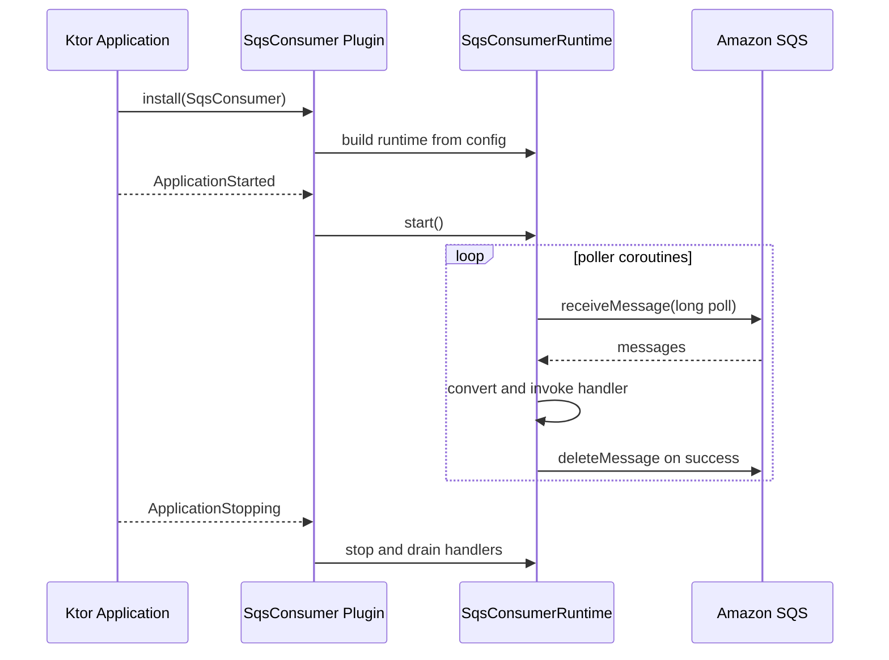

# Module bluetape4k-aws-ktor

[English](README.md) | [한국어](README.ko.md)

Ktor 3 integration for bluetape4k AWS modules. It provides a Ktor
`HttpClient` plugin for AWS Signature Version 4, a coroutine-friendly S3 REST
client built on that plugin, and a server-side SQS consumer/publisher runtime
that follows the Ktor application lifecycle.

## Features

- `AwsSigV4Plugin` for Ktor `HttpClient`.
- AWS SDK Java v2 `AwsCredentialsProvider` integration, including static,
  default, profile, and session providers.
- Header signing and query-string signing.
- Deterministic signing options for region, service, path normalization, URL
  encoding, payload signing, and clock injection.
- `S3KtorClient` for S3 PutObject, GetObject, DeleteObject, ListObjectsV2,
  multipart upload, and presigned GET/PUT URLs.
- `SqsConsumer` Ktor `ApplicationPlugin` for coroutine SQS polling, publishing,
  graceful shutdown, retry visibility control, and optional manual DLQ
  forwarding.

## Dependency

`aws-ktor` exposes Ktor client core and AWS auth APIs, but Ktor server, Ktor
engines, and AWS service clients are declared as `compileOnly` where possible.
Applications must add the runtime pieces they actually use.

```kotlin
dependencies {
    implementation("io.github.bluetape4k.aws:aws-ktor:${bluetape4kAwsVersion}")

    // SigV4/S3 client usage
    implementation("io.ktor:ktor-client-cio")

    // SQS consumer/publisher usage
    implementation("io.ktor:ktor-server-core")
    implementation("software.amazon.awssdk:sqs")
}
```

## Usage

```kotlin
import io.bluetape4k.aws.ktor.client.AwsSigV4Plugin
import io.ktor.client.HttpClient
import io.ktor.client.engine.cio.CIO
import io.ktor.client.request.get
import software.amazon.awssdk.auth.credentials.DefaultCredentialsProvider

val client = HttpClient(CIO) {
    install(AwsSigV4Plugin) {
        region = "ap-northeast-2"
        service = "execute-api"
        credentialsProvider = DefaultCredentialsProvider.builder().build()
    }
}

val response = client.get("https://example.execute-api.ap-northeast-2.amazonaws.com/prod/orders")
```

Close application-owned `HttpClient` instances when the application scope ends.

## Payload Signing

The plugin signs no-body requests and replayable `OutgoingContent.ByteArrayContent`
payloads directly. Streaming content is rejected while `payloadSigningEnabled`
is `true`, because a client plugin cannot safely consume and replay arbitrary
Ktor streams before the engine sends them.

Set `payloadSigningEnabled = false` only when the target AWS service accepts an
unsigned payload for the request shape.

```kotlin
install(AwsSigV4Plugin) {
    region = "ap-northeast-2"
    service = "execute-api"
    payloadSigningEnabled = false
}
```

## S3 Client

`S3KtorClient` uses the same SigV4 plugin with S3-specific signing flags:
`doubleUrlEncode=false`, `normalizePath=false`, and unsigned payloads. It
supports path-style endpoints for LocalStack and virtual-hosted AWS S3
endpoints when the bucket name is DNS-safe. If `endpointOverride` is set, the
client uses path-style URLs.

```kotlin
import io.bluetape4k.aws.ktor.s3.s3KtorClientOf
import io.bluetape4k.aws.ktor.s3.S3KtorAddressingStyle
import io.ktor.http.Url
import software.amazon.awssdk.auth.credentials.DefaultCredentialsProvider

val s3 = s3KtorClientOf(
    region = "ap-northeast-2",
    credentialsProvider = DefaultCredentialsProvider.builder().build(),
    endpointOverride = Url("http://localhost:4566"), // optional, for LocalStack
    addressingStyle = S3KtorAddressingStyle.Path,
)

suspend fun roundTrip(bucket: String, key: String): String {
    s3.putObject(
        bucket = bucket,
        key = key,
        bytes = "hello".encodeToByteArray(),
        contentType = "text/plain; charset=utf-8",
    )
    return s3.getObjectBytes(bucket, key).decodeToString()
}

val download = s3.presignGetObject(bucket = "demo-bucket", key = "hello.txt", expires = java.time.Duration.ofMinutes(15))
```

`s3KtorClientOf` owns the internally created `HttpClient`; call `close()` or
use Kotlin `use { ... }` when the client is short-lived. Presigned URL expiry
must be between 1 second and 7 days.

Runnable examples live in `examples/aws-ktor-s3-examples` and are included in
the Nightly workflow.

## SQS Consumer And Publisher

`SqsConsumer` installs one SQS consumer runtime into a Ktor application. The
runtime starts on `ApplicationStarted`, stops on `ApplicationStopping`, and is
also available through `application.sqsConsumer()` for publishing.



```kotlin
import io.bluetape4k.aws.ktor.sqs.SqsConsumer
import io.bluetape4k.aws.ktor.sqs.sqsConsumer
import io.ktor.server.application.Application
import io.ktor.server.application.install
import software.amazon.awssdk.auth.credentials.DefaultCredentialsProvider
import software.amazon.awssdk.regions.Region
import software.amazon.awssdk.services.sqs.SqsAsyncClient

fun Application.module() {
    val sqs = SqsAsyncClient.builder()
        .region(Region.AP_NORTHEAST_2)
        .credentialsProvider(DefaultCredentialsProvider.create())
        .build()

    install(SqsConsumer) {
        sqsAsyncClient = sqs
        queueName = "orders"
        coroutines = 4
        maxMessages = 10
        waitTimeSeconds = 20
        visibilityTimeoutSeconds = 30
        shutdownTimeout = java.time.Duration.ofSeconds(30)

        onMessage<String> { body ->
            processOrder(body)
        }
    }
}

suspend fun Application.publishOrder(json: String) {
    sqsConsumer().send(json)
}
```

The application owns the injected `SqsAsyncClient`; the plugin never closes it.
Close the client when the application scope ends.

### SQS Consumer Options

| Option | Default | Description |
|---|---:|---|
| `queueUrl` / `queueName` | required | Configure exactly one source queue identity. |
| `coroutines` | `1` | Number of polling coroutines. The default dispatcher is `Dispatchers.IO.limitedParallelism(coroutines)`. Runtime backpressure limits in-flight handlers to `coroutines * maxMessages`. |
| `maxMessages` | `10` | SQS receive batch size, validated as `1..10`. |
| `waitTimeSeconds` | `20` | Long-poll wait time, validated as `0..20`. |
| `visibilityTimeoutSeconds` | `null` | Optional receive visibility timeout. Required when visibility heartbeat is enabled. |
| `deleteOnSuccess` | `true` | Deletes the source message after the handler completes. |
| `failureVisibilityTimeoutSeconds` | `null` | Changes visibility after handler failure. Use `0` for immediate redelivery. |
| `deadLetterQueueUrl` / `deadLetterQueueName` | `null` | Optional manual DLQ forwarding. Mutually exclusive with `failureVisibilityTimeoutSeconds`. |
| `pollBackoff` | `250ms -> 5s` | Exponential receive-loop backoff for transient SQS errors. |
| `visibilityHeartbeatSeconds` | `null` | Periodically extends message visibility while the handler is running. |
| `shutdownTimeout` | `30s` | Time to drain in-flight handlers before cancellation. |

### Failure And Shutdown Semantics

On success, the runtime deletes the message unless the handler already called
`SqsMessageContext.delete()`. On `CancellationException`, cancellation is
rethrown and the message is not acknowledged.

For other handler failures, precedence is:

1. If manual DLQ forwarding is configured, send the original body and message
   attributes to the DLQ, add `bluetape4k-*` original/error metadata within
   the SQS 10 message-attribute limit, then delete the source message.
2. Else if `failureVisibilityTimeoutSeconds` is configured, change visibility.
3. Else leave the message for normal SQS redelivery or native redrive policy.

Manual DLQ forwarding is not an atomic SQS transaction. Prefer native SQS
redrive policies when operationally possible; use manual forwarding when the
handler must enrich failed messages before they move to a DLQ.

During shutdown the runtime stops new receives, waits for in-flight handlers up
to `shutdownTimeout`, and cancels remaining handlers without deleting their
messages.
