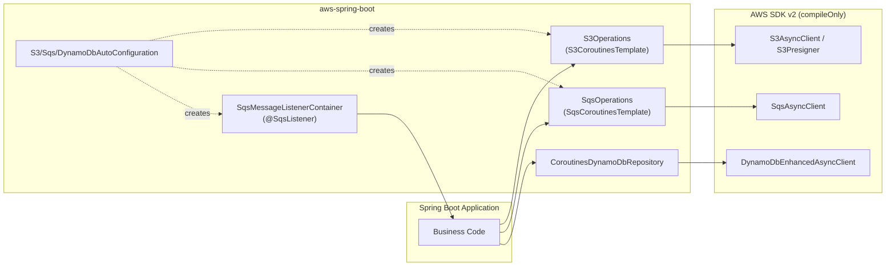

# aws-spring-boot

한국어 | [English](README.md)

AWS Java SDK v2 를 위한 Spring Boot 4 자동 설정 모듈. Coroutines 우선 템플릿과
SQS 리스너 컨테이너를 제공하며, `awspring` 런타임 의존성은 사용하지 않는다.

## Architecture



## 주요 기능

- **S3** — `S3CoroutinesTemplate` 로 버킷 존재 확인, 업로드/다운로드(바이트·문자열),
  삭제, 페이지 단위 조회(`listPage`/`listFlow`), Spring `Resource` 뷰, presigned
  GET/PUT URL 발급을 지원한다.
- **SQS** — `SqsCoroutinesTemplate` 로 큐 조회·생성, 송신, 수신, visibility 변경,
  cold `Flow<SqsReceivedMessage>` 스트림을 제공한다.
- **SQS 리스너** — `@SqsListener` 어노테이션 기반의 Coroutine 메시지 리스너 컨테이너.
  동시 처리 수, visibility/error-visibility 타임아웃을 속성으로 조정한다.
- **DynamoDB** — `CoroutinesDynamoDbRepository<T, ID>` 추상 베이스가
  `DynamoDbAsyncTable` 위에서 `save`/`findById`/`update`/`delete` 와
  `scan`/`query`/`queryIndex` 의 `Flow` 결과를 제공한다. 논리 테이블 이름은
  `DynamoDbTableNameResolver`(기본 구현은 `tablePrefix` 적용)로 해석된다.
- **awspring 런타임 의존성 없음** — AWS SDK v2 서비스는 모두 `compileOnly` 로
  선언되어 있어, 사용자는 실제로 쓰는 서비스만 골라 추가할 수 있다.

## 의존성

```kotlin
dependencies {
    implementation("io.github.bluetape4k.aws:aws-spring-boot:${bluetape4kAwsVersion}")

    // 런타임에서 사용할 AWS SDK v2 서비스만 선택적으로 추가
    implementation(platform("software.amazon.awssdk:bom:${awsSdkVersion}"))
    implementation("software.amazon.awssdk:s3")
    implementation("software.amazon.awssdk:sqs")
    implementation("software.amazon.awssdk:dynamodb-enhanced")
}
```

> Maven Central Snapshots:
> ```kotlin
> repositories { maven("https://central.sonatype.com/repository/maven-snapshots/") }
> ```

## 설정

```yaml
bluetape4k:
  aws:
    s3:
      enabled: true
      region: ap-northeast-2
      endpoint-override: http://localhost:4566   # LocalStack
      path-style-access-enabled: true
      presign:
        duration: PT15M
    sqs:
      enabled: true
      region: ap-northeast-2
      endpoint-override: http://localhost:4566
      listener:
        max-messages: 10              # 1..10
        wait-time-seconds: 20         # 0..20
        visibility-timeout-seconds: 60
        concurrency: 2
        stop-timeout-millis: 25000
      queues:
        orders:
          url: http://localhost:4566/000000000000/orders
    dynamodb:
      enabled: true
      region: ap-northeast-2
      endpoint-override: http://localhost:4566
      table-prefix: local-
```

`endpoint-override` 를 지정하면 반드시 `region` 도 설정해야 한다. 각 Properties
클래스의 `init` 블록에서 시작 시점에 강제한다.
`sqs.queues.<name>.url` 은 `@SqsListener(queue = "<name>")` 에서 논리 큐 이름을
실제 URL로 바꾸는 alias 설정이다. `SqsOperations.getQueueUrl("<name>")` 은 여전히
AWS SQS `GetQueueUrl` 요청을 수행한다.

## 사용 예제

### S3 — Coroutines 템플릿

```kotlin
import io.bluetape4k.aws.spring.s3.S3Operations

class DocumentStorage(private val s3: S3Operations) {
    suspend fun save(bucket: String, key: String, contents: String) {
        s3.upload(bucket, key, contents)
    }

    suspend fun load(bucket: String, key: String): String =
        s3.downloadText(bucket, key)

    fun presignedUpload(bucket: String, key: String) =
        s3.presignPut(bucket, key, contentType = "application/json")
}
```

### SQS — 송수신

```kotlin
import io.bluetape4k.aws.spring.sqs.SqsOperations

class OrderQueue(private val sqs: SqsOperations) {
    suspend fun publish(json: String) {
        val url = sqs.getQueueUrl("orders")
        sqs.send(url, json)
    }

    suspend fun drain(): List<String> {
        val url = sqs.getQueueUrl("orders")
        return sqs.receive(url, maxMessages = 10).map { it.body }
    }
}
```

### SQS — `@SqsListener` 어노테이션

```kotlin
import io.bluetape4k.aws.spring.sqs.SqsListener
import io.bluetape4k.aws.spring.sqs.SqsReceivedMessage
import org.springframework.stereotype.Component

@Component
class OrderListener {
    @SqsListener(queue = "orders", maxMessages = 10, waitTimeSeconds = 20)
    suspend fun onMessage(message: SqsReceivedMessage) {
        // 처리. 예외 throw 시 재배달.
    }
}
```

리스너 메서드는 `String`, AWS SDK `Message`, `SqsReceivedMessage` 중 하나를
인자로 받을 수 있다. `queue` 에는 SpEL 을 지원하지 않으며 `${...}` 플레이스홀더는
지원한다.
`bluetape4k.aws.sqs.queues.orders.url` 을 설정하면 `queue = "orders"` 는 해당 URL을
직접 사용한다.

### DynamoDB — Coroutines Repository

```kotlin
import io.bluetape4k.aws.spring.dynamodb.AbstractCoroutinesDynamoDbRepository
import io.bluetape4k.aws.spring.dynamodb.DynamoDbTableNameResolver
import software.amazon.awssdk.enhanced.dynamodb.DynamoDbEnhancedAsyncClient
import software.amazon.awssdk.enhanced.dynamodb.Key

class OrderRepository(
    enhancedClient: DynamoDbEnhancedAsyncClient,
    tableNameResolver: DynamoDbTableNameResolver,
): AbstractCoroutinesDynamoDbRepository<Order, String>(
    enhancedClient = enhancedClient,
    tableNameResolver = tableNameResolver,
    entityClass = Order::class.java,
) {
    override val tableName: String = "orders"

    override fun keyFromId(id: String): Key =
        Key.builder().partitionValue(id).build()
}
```

`aws-spring-boot` 은 DynamoDB 테이블을 자동 생성하지 않는다. 마이그레이션,
배포 자동화, 또는 테스트 셋업에서 명시적으로 테이블을 만들어야 한다.

## 테스트

`src/test/...` 에 LocalStack 기반 통합 테스트가 포함되어 있다. opt-in 으로 실행:

```bash
./gradlew :aws-spring-boot:test -Dbluetape4k.aws.emulator=localstack
```
