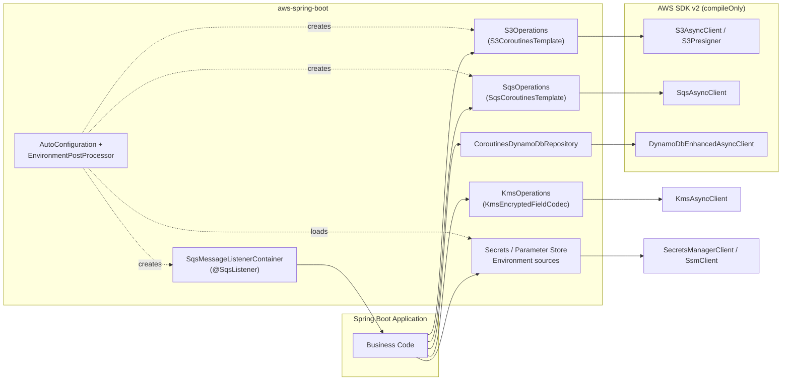

# Module bluetape4k-aws-spring-boot

[English](README.md) | [한국어](README.ko.md)

Spring Boot 4 auto-configuration for AWS Java SDK v2. Provides coroutine-first
templates, a SQS listener container, and remote Environment sources, with no
`awspring` runtime dependency.

## Architecture



## Core Features

- **S3** — `S3CoroutinesTemplate` for bucket-existence, upload/download (bytes
  or text), delete, paginated listing (`listPage`/`listFlow`), Spring
  `Resource` view, and presigned GET/PUT URLs.
- **SQS** — `SqsCoroutinesTemplate` for queue lookup/creation, send, receive,
  visibility change, and a cold `Flow<SqsReceivedMessage>` stream.
- **SQS listener** — `@SqsListener` annotation drives a coroutine-based
  message listener container with configurable concurrency, visibility, and
  error-visibility timeouts.
- **DynamoDB** — `CoroutinesDynamoDbRepository<T, ID>` abstract base over
  `DynamoDbAsyncTable` with `save`/`findById`/`update`/`delete`, plus
  `scan`/`query`/`queryIndex` `Flow` results. Logical table names are resolved
  through `DynamoDbTableNameResolver` (default applies `tablePrefix`).
- **KMS** — `KmsOperations` for coroutine encryption/decryption and data-key
  generation, optional Spring Security `TextEncryptor`, and explicit
  `@KmsEncrypted` + `KmsEncryptedFieldCodec` support for `String` fields.
- **Secrets Manager / Parameter Store** — startup Environment sources for
  remote secrets and parameters, optional lazy refresh, and composed
  `@SecretsValue` / `@ParameterStoreValue` annotations over Spring `@Value`.
- **No awspring runtime dependency** — AWS SDK v2 services are `compileOnly`;
  the consumer adds only the services they actually use.

## Dependency

```kotlin
dependencies {
    implementation("io.github.bluetape4k.aws:aws-spring-boot:${bluetape4kAwsVersion}")

    // Add only the AWS SDK v2 services you need at runtime.
    implementation(platform("software.amazon.awssdk:bom:${awsSdkVersion}"))
    implementation("software.amazon.awssdk:s3")
    implementation("software.amazon.awssdk:sqs")
    implementation("software.amazon.awssdk:dynamodb-enhanced")
    implementation("software.amazon.awssdk:kms")
    implementation("software.amazon.awssdk:secretsmanager")
    implementation("software.amazon.awssdk:ssm")
}
```

> Maven Central Snapshots:
> ```kotlin
> repositories { maven("https://central.sonatype.com/repository/maven-snapshots/") }
> ```

## Configuration

```yaml
bluetape4k:
  aws:
    s3:
      enabled: true
      region: ap-northeast-2
      endpoint-override: http://localhost:4566   # LocalStack
      path-style-access-enabled: true
      presign:
        duration: PT15M
    sqs:
      enabled: true
      region: ap-northeast-2
      endpoint-override: http://localhost:4566
      listener:
        max-messages: 10              # 1..10
        wait-time-seconds: 20         # 0..20
        visibility-timeout-seconds: 60
        concurrency: 2
        stop-timeout-millis: 25000
      queues:
        orders:
          url: http://localhost:4566/000000000000/orders
    dynamodb:
      enabled: true
      region: ap-northeast-2
      endpoint-override: http://localhost:4566
      table-prefix: local-
    kms:
      enabled: true
      region: ap-northeast-2
      endpoint-override: http://localhost:4566
      key-id: alias/app
      encryption-context:
        service: order-api
      field-encryption:
        enabled: true
    secrets-manager:
      enabled: true
      region: ap-northeast-2
      endpoint-override: http://localhost:4566
      refresh-interval: 30s
      sources:
        - name: app-secret
          secret-id: /config/order-api
          prefix: app
          format: json
    parameter-store:
      enabled: true
      region: ap-northeast-2
      endpoint-override: http://localhost:4566
      refresh-interval: 30s
      sources:
        - name: app-parameters
          path: /config/order-api
          prefix: app
          recursive: true
          with-decryption: true
```

`endpoint-override` requires `region` to be set. Each property class enforces
this at startup via `require`.
`sqs.queues.<name>.url` is used by `@SqsListener(queue = "<name>")` as a
logical queue alias. `SqsOperations.getQueueUrl("<name>")` still performs an
AWS SQS `GetQueueUrl` call.
Secrets Manager and Parameter Store sources are loaded by
`EnvironmentPostProcessor` before normal bean binding. When `refresh-interval`
is set, the property source reloads lazily on property access after the interval
has elapsed; failed reloads keep the previous values. When multiple remote
sources define the same key, the earlier configured source has higher Spring
property-source precedence.

## Usage Examples

### Secrets Manager / Parameter Store — Environment values

```kotlin
import io.bluetape4k.aws.spring.parameterstore.ParameterStoreValue
import io.bluetape4k.aws.spring.secretsmanager.SecretsValue
import org.springframework.boot.context.properties.ConfigurationProperties

@ConfigurationProperties("app.db")
data class DatabaseProperties(
    val username: String,
    val password: String,
)

class DatabaseTokenReader(
    @SecretsValue("\${app.db.password}") private val password: String,
    @ParameterStoreValue("\${app.db.username}") private val username: String,
)
```

JSON secrets are flattened with dot notation. Parameter names under the
configured path are mapped to dot-separated keys, and `prefix` is prepended to
both source types. `@SecretsValue` and `@ParameterStoreValue` use normal Spring
`@Value` placeholder syntax.

### S3 — coroutine-friendly template

```kotlin
import io.bluetape4k.aws.spring.s3.S3Operations

class DocumentStorage(private val s3: S3Operations) {
    suspend fun save(bucket: String, key: String, contents: String) {
        s3.upload(bucket, key, contents)
    }

    suspend fun load(bucket: String, key: String): String =
        s3.downloadText(bucket, key)

    fun presignedUpload(bucket: String, key: String) =
        s3.presignPut(bucket, key, contentType = "application/json")
}
```

### SQS — send and receive

```kotlin
import io.bluetape4k.aws.spring.sqs.SqsOperations

class OrderQueue(private val sqs: SqsOperations) {
    suspend fun publish(json: String) {
        val url = sqs.getQueueUrl("orders")
        sqs.send(url, json)
    }

    suspend fun drain(): List<String> {
        val url = sqs.getQueueUrl("orders")
        return sqs.receive(url, maxMessages = 10).map { it.body }
    }
}
```

### SQS — `@SqsListener` annotation

```kotlin
import io.bluetape4k.aws.spring.sqs.SqsListener
import io.bluetape4k.aws.spring.sqs.SqsReceivedMessage
import org.springframework.stereotype.Component

@Component
class OrderListener {
    @SqsListener(queue = "orders", maxMessages = 10, waitTimeSeconds = 20)
    suspend fun onMessage(message: SqsReceivedMessage) {
        // process; throw to re-deliver
    }
}
```

Listener method may receive `String`, AWS SDK `Message`, or `SqsReceivedMessage`.
SpEL is not supported in `queue`; `${...}` placeholders are.
If `bluetape4k.aws.sqs.queues.orders.url` is configured, `queue = "orders"`
uses that URL directly.

### DynamoDB — Coroutines repository

```kotlin
import io.bluetape4k.aws.spring.dynamodb.AbstractCoroutinesDynamoDbRepository
import io.bluetape4k.aws.spring.dynamodb.DynamoDbTableNameResolver
import software.amazon.awssdk.enhanced.dynamodb.DynamoDbEnhancedAsyncClient
import software.amazon.awssdk.enhanced.dynamodb.Key

class OrderRepository(
    enhancedClient: DynamoDbEnhancedAsyncClient,
    tableNameResolver: DynamoDbTableNameResolver,
): AbstractCoroutinesDynamoDbRepository<Order, String>(
    enhancedClient = enhancedClient,
    tableNameResolver = tableNameResolver,
    entityClass = Order::class.java,
) {
    override val tableName: String = "orders"

    override fun keyFromId(id: String): Key =
        Key.builder().partitionValue(id).build()
}
```

`aws-spring-boot` does not create DynamoDB tables. Use migrations,
deployment automation, or explicit test setup to provision tables.

### KMS — explicit field encryption

`@KmsEncrypted` is metadata for mapper/converter boundaries. It does not
transparently mutate DTOs, entities, configuration properties, or existing
plaintext data. The first supported field type is `String`/`String?`.

```kotlin
import io.bluetape4k.aws.spring.kms.KmsEncrypted
import io.bluetape4k.aws.spring.kms.KmsEncryptedFieldCodec

data class CustomerSecret(
    @field:KmsEncrypted(encryptionContext = ["field=ssn"])
    val ssn: String?,
)

class CustomerSecretMapper(private val codec: KmsEncryptedFieldCodec) {
    private val ssnField = CustomerSecret::class.java.getDeclaredField("ssn")
    private val ssnEncryption = ssnField.getAnnotation(KmsEncrypted::class.java)

    suspend fun toStored(secret: CustomerSecret): String? {
        codec.validate(ssnField)
        return codec.encrypt(secret.ssn, ssnEncryption)
    }

    suspend fun fromStored(ciphertext: String?): CustomerSecret =
        CustomerSecret(codec.decrypt(ciphertext, ssnEncryption))
}
```

Ciphertext strings use the `b4k-kms:v1:` prefix. Malformed ciphertext,
unsupported annotated field types, missing key ids, and KMS decrypt failures
fail with deterministic exceptions. Use direct `KmsOperations` for service-level
payloads or envelope-encryption flows; use field encryption only where a
single short `String` needs a stable persistence or serialization boundary.

## Testing

LocalStack-based integration tests are provided under `src/test/...`. They run
opt-in via:

```bash
./gradlew :aws-spring-boot:test -Dbluetape4k.aws.emulator=localstack
```
