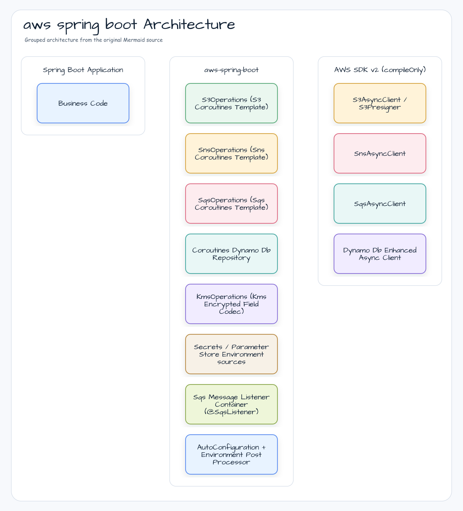
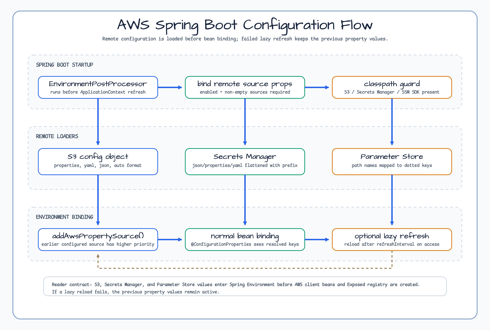
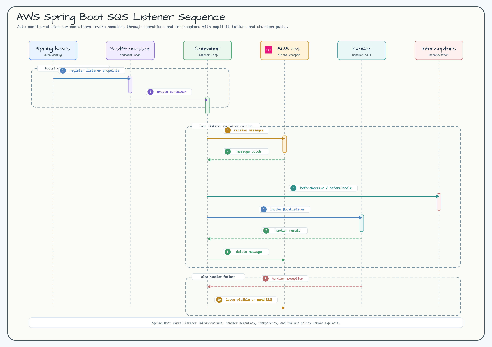
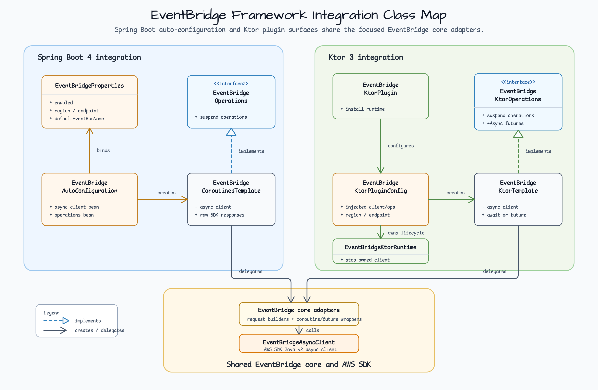

# Module bluetape4k-aws-spring-boot

English | [한국어](README.ko.md)

Spring Boot 4 auto-configuration for AWS Java SDK v2 without an `awspring`
runtime dependency. The module provides coroutine-first templates, an SQS
listener container, CloudWatch metric/log helpers, EC2 IMDS metadata operations,
Kinesis and EventBridge operations, remote Environment sources, and AWS-backed
Exposed database wiring.

## Diagrams

### Module Architecture



### Configuration Flow



### SQS Listener Sequence



## Core Features

- **S3** — `S3CoroutinesTemplate` for bucket-existence, upload/download (bytes
  or text), delete, paginated listing (`listPage`/`listFlow`), Spring
  `Resource` view, and presigned GET/PUT URLs.
- **S3 Vectors** — optional `S3VectorsOperations` for vector bucket/index
  discovery and vector put/get/list/query calls.
- **SNS** — `SnsCoroutinesTemplate` for topic creation/lookup, single and batch
  topic publishing, FIFO publish fields, direct SMS publish options, and HTTP(S) notification
  JSON parsing plus token-based subscription confirmation.
- **Kinesis** — `KinesisCoroutinesTemplate` for stream creation, record
  publishing, shard iterator lookup, bounded `GetRecords` polling, and a cold
  single-shard `Flow<Record>`.
- **EventBridge** — `EventBridgeCoroutinesTemplate` for event bus, rule,
  target, list, and `PutEvents` operations while preserving raw partial-failure
  responses.
- **SES** — `SesCoroutinesMailSender` for simple, templated, raw, attachment,
  and custom-header email sends, plus an optional Spring `JavaMailSender`
  adapter.
- **SQS** — `SqsCoroutinesTemplate` for queue lookup/creation, send, receive,
  visibility change, and a cold `Flow<SqsReceivedMessage>` stream.
- **SQS listener** — `@SqsListener` annotation drives a coroutine-based
  message listener container with configurable concurrency, visibility, and
  error-visibility timeouts.
- **DynamoDB** — `CoroutinesDynamoDbRepository<T, ID>` abstract base over
  `DynamoDbAsyncTable` with `save`/`findById`/`update`/`delete`, plus
  `scan`/`query`/`queryIndex` `Flow` results. Logical table names are resolved
  through `DynamoDbTableNameResolver` (default applies `tablePrefix`), and the
  async client can optionally be backed by DynamoDB Accelerator (DAX).
- **CloudWatch / CloudWatch Logs** — `CloudWatchCoroutinesTemplate` and
  `CloudWatchLogsCoroutinesTemplate` for coroutine metric/log publishing, plus
  an opt-in `CloudWatchMeterPublishingOperations` helper that reads the
  application `MeterRegistry` when Micrometer is present.
- **EC2 IMDS** — `ImdsOperations` wraps AWS SDK v2 IMDS calls with coroutine
  methods and per-operation timeouts for EC2 instance metadata reads.
- **KMS** — `KmsOperations` for coroutine encryption/decryption and data-key
  generation, optional Spring Security `TextEncryptor`, and explicit
  `@KmsEncrypted` + `KmsEncryptedFieldCodec` support for `String` fields.
- **S3 / Secrets Manager / Parameter Store config** — startup Environment sources for
  S3 objects, remote secrets, and parameters, optional lazy refresh, and composed
  `@SecretsValue` / `@ParameterStoreValue` annotations over Spring `@Value`.
- **Exposed databases** — auto-configures an AWS-backed
  `AwsExposedDatabaseRegistry`, default Exposed `Database`, and default
  `DataSource` from explicit properties or remote Environment values loaded
  from Secrets Manager / Parameter Store.
- **No awspring runtime dependency** — AWS SDK v2 services are `compileOnly`;
  the consumer adds only the services they actually use.

## Dependency

```kotlin
dependencies {
    implementation("io.github.bluetape4k.aws:bluetape4k-aws-spring-boot:${bluetape4kAwsVersion}")

    // Required only for AWS-backed Exposed database auto-configuration.
    implementation("io.github.bluetape4k.aws:bluetape4k-aws-exposed:${bluetape4kAwsVersion}")

    // Add only the AWS SDK v2 services you need at runtime.
    implementation(platform("software.amazon.awssdk:bom:${awsSdkVersion}"))
    implementation("software.amazon.awssdk:s3")
    implementation("software.amazon.awssdk:s3vectors")
    implementation("software.amazon.awssdk:sesv2")
    implementation("software.amazon.awssdk:sns")
    implementation("software.amazon.awssdk:sns-message-manager") // required for SNS HTTP signature verification
    implementation("software.amazon.awssdk:sqs")
    implementation("software.amazon.awssdk:sts") // optional web-identity credentials support
    implementation("software.amazon.awssdk:dynamodb-enhanced")
    implementation("software.amazon.awssdk:cloudwatch")
    implementation("software.amazon.awssdk:cloudwatchlogs")
    implementation("software.amazon.awssdk:eventbridge")
    implementation("software.amazon.awssdk:imds")
    implementation("software.amazon.awssdk:kinesis")
    implementation("software.amazon.awssdk:kms")
    implementation("software.amazon.awssdk:secretsmanager")
    implementation("software.amazon.awssdk:ssm")

    // Required only when using the Spring JavaMailSender adapter.
    implementation("org.eclipse.angus:angus-mail")
}
```

> Maven Central Snapshots:
> ```kotlin
> repositories { maven("https://central.sonatype.com/repository/maven-snapshots/") }
> ```

## Configuration

```yaml
bluetape4k:
  aws:
    enabled: true
    region: ap-northeast-2
    endpoint-override: http://localhost:4566   # shared local AWS emulator default
    credentials:
      web-identity:
        enabled: false                          # requires software.amazon.awssdk:sts
        role-arn: arn:aws:iam::123456789012:role/order-api
        role-session-name: order-api
        token-file: /var/run/secrets/eks.amazonaws.com/serviceaccount/token
    s3:
      enabled: true
      region: ap-northeast-2                   # overrides the shared default
      endpoint-override: http://localhost:4566 # overrides the shared default
      path-style-access-enabled: true
      presign:
        duration: PT15M
      config:
        enabled: true
        region: ap-northeast-2
        endpoint-override: http://localhost:4566
        path-style-access-enabled: true
        refresh-interval: 30s
        sources:
          - name: app-s3-config
            bucket: order-config
            key: application.properties
            prefix: app
            format: properties
      client-side-encryption:
        enabled: true
        key-id: alias/app-s3
        encryption-context:
          service: order-api
    s3-vectors:
      enabled: true
      region: ap-northeast-2
      endpoint-override: http://localhost:4566
    sqs:
      enabled: true
      region: ap-northeast-2
      endpoint-override: http://localhost:4566
      listener:
        max-messages: 10              # 1..10
        wait-time-seconds: 20         # 0..20
        visibility-timeout-seconds: 60
        error-visibility-timeout-seconds: 0
        message-visibility-heartbeat-interval-seconds: 20
        message-visibility-heartbeat-seconds: 60
        concurrency: 2
        stop-timeout-millis: 25000
        retry:
          max-attempts: 2
          initial-backoff: 100ms
          max-backoff: 2s
          multiplier: 2.0
          jitter-ratio: 0.2
      queues:
        orders:
          url: http://localhost:4566/000000000000/orders
    sns:
      enabled: true
      region: ap-northeast-2
      endpoint-override: http://localhost:4566
      topics:
        orders.fifo:
          fifo: true
          content-based-deduplication: true
          fifo-throughput-scope: message-group
    ses:
      enabled: true
      region: ap-northeast-2
      endpoint-override: http://localhost:4566
      default-from: no-reply@example.com
      configuration-set-name: app-prod
      java-mail-sender:
        enabled: true
    dynamodb:
      enabled: true
      region: ap-northeast-2
      endpoint-override: http://localhost:4566
      table-prefix: local-
    cloudwatch:
      enabled: true
      region: ap-northeast-2
      endpoint-override: http://localhost:4566
      namespace: OrderApi
      batch-size: 1000
      micrometer:
        enabled: true
    cloudwatch-logs:
      enabled: true
      region: ap-northeast-2
      endpoint-override: http://localhost:4566
      log-group-name: /aws/app/order-api
      log-stream-name: local
      batch-size: 10000
    eventbridge:
      enabled: true
      region: ap-northeast-2
      endpoint-override: http://localhost:4566
      default-event-bus-name: orders
    imds:
      enabled: true
      endpoint-mode: ipv4
      token-ttl: PT6H
      request-timeout: 1s
      retries: 0
    kms:
      enabled: true
      region: ap-northeast-2
      endpoint-override: http://localhost:4566
      key-id: alias/app
      encryption-context:
        service: order-api
      field-encryption:
        enabled: true
    secrets-manager:
      enabled: true
      region: ap-northeast-2
      endpoint-override: http://localhost:4566
      refresh-interval: 30s
      sources:
        - name: app-secret
          secret-id: /config/order-api
          prefix: app
          format: json
    parameter-store:
      enabled: true
      region: ap-northeast-2
      endpoint-override: http://localhost:4566
      refresh-interval: 30s
      sources:
        - name: app-parameters
          path: /config/order-api
          prefix: app
          recursive: true
          with-decryption: true
    exposed:
      enabled: true
      default-database:
        url: jdbc:postgresql://localhost:5432/orders
        driver-class-name: org.postgresql.Driver
        username: order_app
        password: ${app.db.password}
        pool:
          maximum-pool-size: 10
          minimum-idle: 1
      named-databases:
        analytics:
          url: jdbc:postgresql://localhost:5432/analytics
          driver-class-name: org.postgresql.Driver
          username: analytics_app
          password: ${app.analytics.password}
```

`bluetape4k.aws.region` and `bluetape4k.aws.endpoint-override` are shared
defaults for auto-configured AWS SDK v2 clients. Service-specific properties
such as `bluetape4k.aws.s3.region` or `bluetape4k.aws.sqs.endpoint-override`
override the shared defaults. Any effective `endpoint-override` requires an
effective region.
`bluetape4k.aws.credentials.web-identity.enabled=true` registers an opt-in
`WebIdentityTokenFileCredentialsProvider` when `software.amazon.awssdk:sts` is
on the runtime classpath. Otherwise the module falls back to the default AWS SDK
credentials provider chain.
Applications can customize generated AWS SDK v2 builders by registering ordered
`AwsSyncClientCustomizer`, `AwsAsyncClientCustomizer`, or typed
`AwsClientCustomizer<S3ClientBuilder>` / `AwsClientCustomizer<SqsAsyncClientBuilder>`
beans.
`sns.topics.<name>` configures topic creation defaults used by
`SnsOperations.createConfiguredTopic("<name>")`.
`sqs.queues.<name>.url` is used by `@SqsListener(queue = "<name>")` as a
logical queue alias. `SqsOperations.getQueueUrl("<name>")` still performs an
AWS SQS `GetQueueUrl` call.
`cloudwatch.namespace` is used by default-namespace metric publishing methods.
The Micrometer helper is registered only when an application `MeterRegistry`
bean exists; it reads meter snapshots on explicit method calls and does not
replace the active registry.
`cloudwatch-logs.log-group-name` and `cloudwatch-logs.log-stream-name` are used
by default log-event publishing methods.
`imds.request-timeout` bounds each metadata operation. IMDS bean creation never
calls the metadata endpoint, so non-EC2 environments do not pay a startup
probe cost. Keep credential retrieval on the AWS SDK default provider chain or
STS web identity; `ImdsOperations` exposes safe metadata helpers only.
S3 config, Secrets Manager, and Parameter Store sources are loaded by
`EnvironmentPostProcessor` before normal bean binding. S3 config sources load
single objects in `properties`, `yaml`, or `json` format; `auto` format detects
the parser from the object key extension and defaults to `properties`. When
`refresh-interval` is set, the property source reloads lazily on property access
after the interval has elapsed; failed reloads keep the previous values. When
multiple remote sources define the same key, the earlier configured source has
higher Spring property-source precedence.
Setting `bluetape4k.aws.enabled=false` disables these startup Environment sources
as well as AWS auto-configuration, so configured remote sources are not accessed.
`bluetape4k.aws.exposed.default-database.url` activates the Exposed registry.
If the URL is absent, the Exposed auto-configuration contributes only property
binding and does not create a registry or database pool.

## Usage Examples

### S3 / Secrets Manager / Parameter Store — Environment values

```kotlin
import io.bluetape4k.aws.spring.parameterstore.ParameterStoreValue
import io.bluetape4k.aws.spring.secretsmanager.SecretsValue
import org.springframework.boot.context.properties.ConfigurationProperties

@ConfigurationProperties("app.db")
data class DatabaseProperties(
    val username: String,
    val password: String,
)

class DatabaseTokenReader(
    @SecretsValue("\${app.db.password}") private val password: String,
    @ParameterStoreValue("\${app.db.username}") private val username: String,
)
```

JSON secrets are flattened with dot notation. Parameter names under the
configured path are mapped to dot-separated keys, and `prefix` is prepended to
both source types. `@SecretsValue` and `@ParameterStoreValue` use normal Spring
`@Value` placeholder syntax.
S3 config JSON objects are flattened the same way; S3 `.properties` and YAML
objects are loaded through Spring Boot property-source loaders and then receive
the configured `prefix`.

### Exposed — AWS-backed database registry

```kotlin
import io.bluetape4k.aws.exposed.AwsExposedDatabaseRegistry
import org.jetbrains.exposed.v1.jdbc.Database
import org.jetbrains.exposed.v1.jdbc.selectAll
import org.jetbrains.exposed.v1.jdbc.transactions.transaction
import javax.sql.DataSource

class OrderQueryService(
    private val database: Database,
    private val dataSource: DataSource,
    private val registry: AwsExposedDatabaseRegistry,
) {
    fun countOrders(): Long =
        transaction(database) {
            // Use bluetape4k-exposed repositories or Exposed DSL here.
            // Orders is your Exposed Table object.
            Orders.selectAll().count()
        }

    fun analyticsDatabase(): Database =
        registry.get("analytics").database

    fun defaultDataSource(): DataSource =
        dataSource
}
```

The Spring adapter creates the registry through `bluetape4k-aws-exposed` and
aliases the default handle as a Spring `DataSource` and Exposed `Database` when
the application has not already supplied those beans. Named databases are
available through `AwsExposedDatabaseRegistry`. To load database credentials
from Secrets Manager or Parameter Store, configure those Environment sources
with a `prefix` such as `bluetape4k.aws.exposed.default-database`; the resolved
keys bind before the registry is created. Pool lifecycle is owned by the
registry, so the alias beans do not close the pool separately.

### S3 — coroutine-friendly template

```kotlin
import io.bluetape4k.aws.spring.s3.S3ClientSideEncryptionOperations
import io.bluetape4k.aws.spring.s3.S3Operations
import io.bluetape4k.aws.spring.s3.S3TransferOperations
import java.nio.file.Path

class DocumentStorage(
    private val s3: S3Operations,
    private val transfer: S3TransferOperations,
    private val encryptedS3: S3ClientSideEncryptionOperations,
) {
    suspend fun save(bucket: String, key: String, contents: String) {
        s3.upload(bucket, key, contents)
    }

    suspend fun load(bucket: String, key: String): String =
        s3.downloadText(bucket, key)

    fun presignedUpload(bucket: String, key: String) =
        s3.presignPut(bucket, key, contentType = "application/json")

    suspend fun saveLargeFile(bucket: String, key: String, source: Path) {
        transfer.uploadFile(bucket, key, source)
    }

    suspend fun saveSecret(bucket: String, key: String, contents: String) {
        encryptedS3.uploadEncrypted(
            bucket = bucket,
            key = key,
            bytes = contents.encodeToByteArray(),
            contentType = "text/plain",
        )
    }
}
```

`S3Operations` is the default small-object API for upload/download, resources,
listing, and presigned URLs. `S3TransferOperations` is available only when
`software.amazon.awssdk:s3-transfer-manager` is on the classpath and
`bluetape4k.aws.s3.transfer.enabled=true` (default). It delegates to the `aws`
module's coroutine `S3TransferManager` extensions for multipart file and byte
transfers. To use CRT-backed transfers, provide a CRT-backed `S3AsyncClient`
bean; the transfer manager auto-configuration reuses it instead of forcing CRT
dependencies on basic S3 users.

`S3ClientSideEncryptionOperations` is available when
`bluetape4k.aws.s3.client-side-encryption.enabled=true` and a `KmsOperations`
bean is present. It generates an AWS KMS data key, encrypts object bytes locally
with AES-GCM, and stores the encrypted data key and nonce in S3 metadata. This
helper is for byte-array objects; it does not support multipart or streaming
client-side encryption, and the metadata format is not AWS Encryption SDK
compatible.

### S3 Vectors — Spring Boot operations

S3 Vectors support is disabled by default and uses the separate AWS SDK v2
`s3vectors` service. Applications that enable it must add the runtime service
dependency:

```kotlin
runtimeOnly("software.amazon.awssdk:s3vectors")
```

```yaml
bluetape4k:
  aws:
    s3-vectors:
      enabled: true
      region: us-east-1
```

```kotlin
import io.bluetape4k.aws.s3vectors.S3VectorsOperations
import software.amazon.awssdk.services.s3vectors.model.QueryVectorsRequest

class SemanticSearch(
    private val s3Vectors: S3VectorsOperations,
) {
    suspend fun query(request: QueryVectorsRequest) =
        s3Vectors.queryVectors(request)
}
```

The auto-configuration contributes `S3VectorsAsyncClient` and
`S3VectorsOperations` only when `bluetape4k.aws.s3-vectors.enabled=true` and the
`s3vectors` SDK is present. It does not imply LocalStack, Floci, or Ministack
S3 Vectors behavior.

### SQS — send and receive

```kotlin
import io.bluetape4k.aws.spring.sqs.SqsOperations

class OrderQueue(private val sqs: SqsOperations) {
    suspend fun publish(json: String) {
        val url = sqs.getQueueUrl("orders")
        sqs.send(url, json)
    }

    suspend fun drain(): List<String> {
        val url = sqs.getQueueUrl("orders")
        return sqs.receive(url, maxMessages = 10).map { it.body }
    }
}
```

### SQS Extended Client — opt-in S3 offload

Enable the coroutine-native Extended Client explicitly when payloads can exceed
the SQS `256 KiB` limit. Small messages keep the existing SQS body; larger
messages are authenticated pointers to an S3 object.

```yaml
bluetape4k:
  aws:
    sqs:
      extended:
        enabled: true
        producer-enabled: true
        consumer-enabled: true
        default-queue-urls:
          - https://sqs.us-east-1.amazonaws.com/123456789012/orders
        default-policy:
          bucket: my-extended-payloads
          key-prefix: bluetape4k/sqs/orders
          pointer-signing-key-ref: orders
          delete-on-ack: true
```

Use `SqsExtendedClientOperations` for `send`, bounded `receive`/`receiveFlow`,
identity-bound `acknowledge`, and retryable `cleanup` handles. The legacy
`@SqsListener` consumer must not be attached to a queue carrying these pointer
messages. The optional Jackson 3 module serializes safe DTO fields only; raw
AWS requests, bodies, pointers, and receipt handles are never serialized.
Client-side encryption is an opt-in Bluetape4k wire format and is not
interoperable with the AWS Java Extended Client library. External publisher
latency/cleanup telemetry and heap/throughput measurements remain tracked in
follow-up issue [#515](https://github.com/bluetape4k/bluetape4k-aws/issues/515).

### SES — simple, template, raw, and JavaMail sends

```kotlin
import io.bluetape4k.aws.spring.ses.SesEmailAddressSet
import io.bluetape4k.aws.spring.ses.SesEmailAttachment
import io.bluetape4k.aws.spring.ses.SesEmailBody
import io.bluetape4k.aws.spring.ses.SesEmailRequest
import io.bluetape4k.aws.spring.ses.SesOperations
import io.bluetape4k.aws.spring.ses.SesTemplateEmailRequest
import org.springframework.mail.SimpleMailMessage
import org.springframework.mail.javamail.JavaMailSender

class OrderEmail(
    private val ses: SesOperations,
    private val javaMailSender: JavaMailSender,
) {
    suspend fun sendReceipt(orderId: String, pdf: ByteArray) {
        ses.sendEmail(
            SesEmailRequest(
                destination = SesEmailAddressSet(to = listOf("customer@example.com")),
                subject = "Receipt $orderId",
                body = SesEmailBody(html = "<p>Your receipt is attached.</p>"),
                headers = mapOf("X-Order-Id" to orderId),
                attachments = listOf(
                    SesEmailAttachment(
                        fileName = "receipt-$orderId.pdf",
                        content = pdf,
                        contentType = "application/pdf",
                    )
                ),
            )
        )
    }

    suspend fun sendWelcomeTemplate() {
        ses.sendTemplateEmail(
            SesTemplateEmailRequest(
                destination = SesEmailAddressSet(to = listOf("customer@example.com")),
                templateName = "welcome",
                templateData = """{"name":"Bluetape"}""",
            )
        )
    }

    fun sendWithSpringMail() {
        javaMailSender.send(
            SimpleMailMessage().apply {
                setTo("customer@example.com")
                subject = "Hello"
                text = "Welcome."
            }
        )
    }
}
```

`SesOperations` applies `bluetape4k.aws.ses.default-from` and
`configuration-set-name` to convenience requests. The lower-level
`send(SendEmailRequest)` method sends the AWS SDK request as-is. The JavaMail
adapter is registered only when Spring `JavaMailSender`, Jakarta Mail, and an
Angus Mail provider are on the runtime classpath.

### SNS — publish, SMS, and HTTP endpoint messages

```kotlin
import io.bluetape4k.aws.spring.sns.SnsHttpMessageType
import io.bluetape4k.aws.spring.sns.SnsHttpMessageVerifier
import io.bluetape4k.aws.spring.sns.SnsOperations
import io.bluetape4k.aws.spring.sns.SnsPublishRequest
import io.bluetape4k.aws.spring.sns.SnsPublishBatchEntry
import io.bluetape4k.aws.spring.sns.SnsPublishBatchRequest
import io.bluetape4k.aws.spring.sns.SnsBatchExecutionOptions
import io.bluetape4k.aws.spring.sns.SnsSmsRequest
import io.bluetape4k.aws.spring.sns.SnsSmsType

class OrderNotifications(
    private val sns: SnsOperations,
    private val verifier: SnsHttpMessageVerifier,
) {
    suspend fun publishOrder(topicArn: String, json: String) {
        sns.publish(SnsPublishRequest(topicArn = topicArn, message = json))
    }

    suspend fun sendSms(phoneNumber: String, text: String) {
        sns.publishSms(
            SnsSmsRequest(
                phoneNumber = phoneNumber,
                message = text,
                smsType = SnsSmsType.TRANSACTIONAL,
                senderId = "BLUETAPE",
            )
        )
    }

    suspend fun handleHttpEndpoint(
        body: String,
        messageTypeHeader: String?,
        expectedTopicArn: String,
    ) {
        val message = verifier.verify(body, messageTypeHeader, expectedTopicArn)
        when (message.type) {
            SnsHttpMessageType.SUBSCRIPTION_CONFIRMATION,
            SnsHttpMessageType.UNSUBSCRIBE_CONFIRMATION -> sns.confirmSubscription(message)
            SnsHttpMessageType.NOTIFICATION -> processNotification(message.message)
        }
    }

    private fun processNotification(message: String) = Unit
}
```

### SNS — AWS SDK wrappers

The sibling `bluetape4k-aws-java` extensions keep AWS SDK responses and exceptions visible while
validating the topic ARN, entry IDs, duplicate IDs, and the ten-entry `PublishBatch` limit. The sync,
`CompletableFuture`, and coroutine APIs share one request model; the AWS Kotlin SDK wrapper provides
the native suspend equivalent.

```kotlin
import io.bluetape4k.aws.sns.model.publishBatchRequestEntryOf
import io.bluetape4k.aws.sns.model.publishBatchRequestOf
import io.bluetape4k.aws.sns.publishBatch
import io.bluetape4k.aws.sns.publishBatchAsync
import io.bluetape4k.aws.sns.publishBatchSuspend

val javaEntries = listOf(
    publishBatchRequestEntryOf(id = "order-001", message = "created"),
)
val request = publishBatchRequestOf(topicArn, javaEntries)

val syncResponse = snsClient.publishBatch(topicArn, javaEntries)
val futureResponse = snsAsyncClient.publishBatchAsync(request)
val suspendResponse = snsAsyncClient.publishBatchSuspend(request)
```

The AWS Kotlin SDK wrapper uses its native request-entry model:

```kotlin
import io.bluetape4k.aws.kotlin.sns.model.publishBatchRequestEntryOf
import io.bluetape4k.aws.kotlin.sns.publishBatch

val kotlinEntries = listOf(
    publishBatchRequestEntryOf(id = "order-001", message = "created"),
)
val kotlinResponse = kotlinSnsClient.publishBatch(topicArn, kotlinEntries)
```

Raw responses can contain successful and failed entries together; reconcile by entry ID. These
wrappers do not retry or roll back partial sends, and cancellation is propagated (the Java coroutine
extension also cancels its underlying future). FIFO group/deduplication fields and an external
idempotency key remain caller responsibilities. Use the Spring API below when a redacted
transport/protocol exception boundary is preferred.

#### SNS batch publishing

`SnsCoroutinesTemplate.publishBatch` maps `SnsPublishBatchEntry` to AWS
`PublishBatchRequestEntry` and sends at most 10 entries per SDK request. Set
`maxInFlightBatches` to bound concurrent requests; an empty request avoids an
SDK call.

```kotlin
val result = sns.publishBatch(
    SnsPublishBatchRequest(
        topicArn = topicArn,
        entries = orders.map { order ->
            SnsPublishBatchEntry(
                id = order.id,
                message = order.json,
                messageGroupId = order.groupId,       // FIFO topics only
                messageDeduplicationId = order.deduplicationId,
            )
        },
    ),
    options = SnsBatchExecutionOptions(maxInFlightBatches = 4),
)
```

`result.successful` and `result.failed` keep input order within each list and
include the entry ID for reconciliation. Transport or protocol failures use a
redacted Spring exception; cancellation is propagated and no automatic retry
is attempted. FIFO group/deduplication values and external idempotency remain
the caller's responsibility. The low-level Java/Kotlin SDK APIs pass raw SDK
responses and exceptions through, while this Spring template provides the safe
transport/protocol boundary.

Existing `SnsOperations` implementations that do not override `publishBatch`
use the additive default implementation. It invokes the existing single-message
`publish` operation sequentially, stops at the first non-cancellation failure,
records only the successful prefix in `completedEntryIds`, and treats
`maxInFlightBatches` as 1. It does not retry or roll back a partial send.

When a sibling chunk fails after a preceding chunk returned mixed results, do
not replay the complete input blindly. Reconcile by entry ID, use FIFO
deduplication or an external idempotency store, and manually resolve entries
without a known terminal response. Business rollback and compensation are not
provided. Spring Cloud AWS-style public `BatchExecutionStrategy` and converter
expansion research is tracked in [#514](https://github.com/bluetape4k/bluetape4k-aws/issues/514).
Publisher cleanup/latency telemetry and heap/throughput measurement are tracked in
[#515](https://github.com/bluetape4k/bluetape4k-aws/issues/515).

SNS can publish to an SQS subscription when the queue policy allows
`sqs:SendMessage` from the topic ARN. `SnsHttpMessageParser` maps SNS HTTP JSON,
checks the optional `x-amz-sns-message-type` header, and rejects non-HTTPS or
non-SNS `SigningCertURL` hosts. `SnsHttpMessageVerifier` must run after the
parser and before notification processing or subscription confirmation; it
delegates Signature v1/v2, certificate chain, and SNS host verification to the
AWS SDK message manager and fails closed on an exception.

### SNS HTTP message signature verification

Add `software.amazon.awssdk:sns-message-manager` to the application runtime
because this module keeps it `compileOnly`. Verification is enabled by default:

```yaml
bluetape4k:
  aws:
    sns:
      verification:
        enabled: true
```

Setting `verification.enabled=false` removes the auto-configured verifier and is
an explicit security opt-out; parser output alone is not authenticated. Floci
does not create signed SNS HTTP payloads, so fixture or manager-mock tests cover
this boundary. Certificate-fetch timeout/cleanup telemetry and real AWS smoke
measurement are tracked separately from this contract.

### Kinesis — stream operations and record Flow

```yaml
bluetape4k:
  aws:
    kinesis:
      region: us-east-1
      streams:
        orders:
          shard-count: 1
      consumer:
        batch-limit: 100
        poll-interval: 200ms
        empty-backoff: 1s
```

```kotlin
import io.bluetape4k.aws.spring.kinesis.KinesisOperations
import io.bluetape4k.aws.spring.kinesis.KinesisPutRecordRequest
import io.bluetape4k.aws.spring.kinesis.KinesisRecordFlowRequest
import io.bluetape4k.aws.spring.kinesis.KinesisStartingPosition
import kotlinx.coroutines.flow.collect
import software.amazon.awssdk.core.SdkBytes

class OrderStream(
    private val kinesis: KinesisOperations,
) {
    suspend fun ensureStream() {
        kinesis.createConfiguredStream("orders")
    }

    suspend fun publish(payload: String): String =
        kinesis.putRecord(
            KinesisPutRecordRequest(
                streamName = "orders",
                partitionKey = "orders",
                data = SdkBytes.fromUtf8String(payload),
            )
        ).sequenceNumber()

    suspend fun consume(shardId: String) {
        kinesis.recordFlow(
            KinesisRecordFlowRequest(
                streamName = "orders",
                shardId = shardId,
                startingPosition = KinesisStartingPosition.TrimHorizon,
            )
        ).collect { record ->
            handle(record.data().asUtf8String())
        }
    }

    private fun handle(payload: String) = Unit
}
```

`KinesisOperations` is intentionally an explicit operations API. It does not
start listener containers or manage checkpoints; store sequence numbers or
application checkpoints in your own persistence layer when you collect the Flow.

### EventBridge — event bus, rules, targets, and PutEvents



```yaml
bluetape4k:
  aws:
    eventbridge:
      region: us-east-1
      default-event-bus-name: orders
```

```kotlin
import io.bluetape4k.aws.eventbridge.model.putEventsRequestEntryOf
import io.bluetape4k.aws.spring.eventbridge.EventBridgeOperations

class OrderEvents(
    private val eventBridge: EventBridgeOperations,
) {
    suspend fun publishCreated(orderId: String) {
        val response = eventBridge.putEvents(
            listOf(
                putEventsRequestEntryOf(
                    source = "orders",
                    detailType = "order.created",
                    detail = """{"orderId":"$orderId"}""",
                )
            )
        )
        require(response.failedEntryCount() == 0) { "EventBridge rejected one or more entries." }
    }
}
```

Add `software.amazon.awssdk:eventbridge` when using EventBridge operations. The
template uses `default-event-bus-name` for rule, target, and list calls that
omit an event bus name; it does not rewrite `PutEvents` entries. `PutEvents`,
`PutTargets`, and `RemoveTargets` return raw SDK responses so callers can
inspect partial failures.

### SQS — `@SqsListener` annotation

```kotlin
import io.bluetape4k.aws.spring.sqs.SqsListener
import io.bluetape4k.aws.spring.sqs.SqsAcknowledgement
import io.bluetape4k.aws.spring.sqs.SqsReceivedMessage
import org.springframework.stereotype.Component

data class OrderEvent(val id: String, val total: Long)

@Component
class OrderListener {
    @SqsListener(
        queue = "orders",
        maxMessages = 10,
        waitTimeSeconds = 20,
        messageVisibilityHeartbeatIntervalSeconds = 20,
        messageVisibilityHeartbeatSeconds = 60,
    )
    suspend fun onMessage(message: SqsReceivedMessage) {
        // process; throw to re-deliver
    }

    @SqsListener(queue = "orders-json")
    suspend fun onTypedMessage(event: OrderEvent, acknowledgement: SqsAcknowledgement) {
        process(event)
        acknowledgement.acknowledge()
    }
}
```

Listener method may receive `String`, AWS SDK `Message`, `SqsReceivedMessage`,
or a typed payload when a `SqsMessageConverter` bean is present. A Jackson 3
converter is auto-registered when `tools.jackson.databind.ObjectMapper` is
available. Declaring `SqsAcknowledgement` switches the listener to manual
acknowledgement, so the container does not delete the message unless the handler
calls `acknowledge()`.
SpEL is not supported in `queue`; `${...}` placeholders are.
If `bluetape4k.aws.sqs.queues.orders.url` is configured, `queue = "orders"`
uses that URL directly.
Listener acknowledgement is delete-on-success: the container deletes the message
only after the listener method returns normally. If the listener throws, the
message is not deleted; when `error-visibility-timeout-seconds` is configured,
the container changes visibility so retry timing is explicit. `listener.retry`
adds in-process retry attempts with linear/exponential backoff and optional
jitter before the final failure path. Register `SqsListenerInterceptor` beans to
observe receive, handler, ack/nack, and failure phases with Micrometer or a
logging/tracing library. `stop-timeout-millis` bounds container shutdown after
poller cancellation.

The opt-in visibility heartbeat requires both `message-visibility-heartbeat-interval-seconds`
and `message-visibility-heartbeat-seconds`; it is disabled by default. The interval must be
positive, shorter than the heartbeat timeout, and no greater than 43,200 seconds. The annotation
properties with the same names in camelCase override the global listener values. Each heartbeat
is an additional `ChangeMessageVisibility` request, so choose an interval that leaves margin
before expiry and account for SQS request cost and throttling. A heartbeat failure is logged and
observed through the existing Micrometer operations without changing the handler result.

For batch listeners, only messages still pending acknowledgement are extended. A partial
acknowledgement removes completed messages from later heartbeat requests, while FIFO ordering
metadata remains under the existing batch acknowledgement rules.

Batch delivery is opt-in with `batch = true` and accepts one `List<SqsReceivedMessage>`,
`List<software.amazon.awssdk.services.sqs.model.Message>`, or concrete `List<T>` payload plus
an optional `SqsBatchAcknowledgement`. `maxMessages` remains within the AWS limit of 1..10.
`acknowledgementMode` supports `INHERIT`, `ON_SUCCESS`, and `MANUAL`; partial handling uses
`acknowledge(messages)`, `nack(messages, timeoutSeconds = 0)`, or `changeVisibility` and returns
`SqsBatchAcknowledgementResult` with per-item status. `SqsOperations.deleteBatch` and
`changeVisibilityBatch` use one optimized AWS request when available and a sequential fallback
otherwise. FIFO groups preserve a contiguous successful prefix, and at-least-once delivery still
requires idempotent side effects or message-id deduplication. Receipt handles, bodies, and raw
message identifiers are not emitted in result `toString()`, logs, metric tags, or correlation
values. Use the [storage and messaging manual](../docs/manual/en/modules/bluetape4k-aws-spring-boot/storage-and-messaging.md)
for the canary/rollback sequence (`STOPPING_RECEIVE -> DRAINING -> STOPPED`, DLQ redrive, and
idempotency checks).

FIFO queue metadata is preserved in `SqsReceivedMessage` when messages are
received. Use `SqsSendRequest` to publish FIFO messages with group and
deduplication IDs:

```kotlin
import io.bluetape4k.aws.spring.sqs.SqsSendRequest
import io.bluetape4k.aws.spring.sqs.SqsOperations

suspend fun publishOrder(sqs: SqsOperations, queueUrl: String, body: String) {
    sqs.send(
        SqsSendRequest(
            queueUrl = queueUrl,
            body = body,
            messageGroupId = "orders",
            messageDeduplicationId = "order-123",
        )
    )
}
```

`SqsReceivedMessage.messageGroupId`, `messageDeduplicationId`, `sequenceNumber`,
`approximateReceiveCount`, and `messageAttributes` expose the SQS metadata that
is needed for FIFO and retry handling.

### DynamoDB — Coroutines repository

```kotlin
import io.bluetape4k.aws.spring.dynamodb.AbstractCoroutinesDynamoDbRepository
import io.bluetape4k.aws.spring.dynamodb.DynamoDbTableNameResolver
import software.amazon.awssdk.enhanced.dynamodb.DynamoDbEnhancedAsyncClient
import software.amazon.awssdk.enhanced.dynamodb.Key

class OrderRepository(
    enhancedClient: DynamoDbEnhancedAsyncClient,
    tableNameResolver: DynamoDbTableNameResolver,
): AbstractCoroutinesDynamoDbRepository<Order, String>(
    enhancedClient = enhancedClient,
    tableNameResolver = tableNameResolver,
    entityClass = Order::class.java,
) {
    override val tableName: String = "orders"

    override fun keyFromId(id: String): Key =
        Key.builder().partitionValue(id).build()
}
```

`aws-spring-boot` does not create DynamoDB tables. Use migrations,
deployment automation, or explicit test setup to provision tables.

Enable DynamoDB Accelerator (DAX) only when the application also carries the DAX
runtime dependency:

```kotlin
runtimeOnly("software.amazon.dax:amazon-dax-client:2.0.9")
```

```yaml
bluetape4k:
  aws:
    dynamodb:
      region: us-east-1
      dax:
        enabled: true
        url: dax://orders-cache.abc123.dax-clusters.us-east-1.amazonaws.com
        connect-timeout: 1s
        request-timeout: 1s
        read-retries: 2
        write-retries: 2
```

When DAX is active, the auto-configuration contributes a DAX-backed
`DynamoDbAsyncClient`; the existing `DynamoDbEnhancedAsyncClient` and repository
base classes continue to be used unchanged. DAX is a real AWS cluster cache, not
an emulator feature. Keep LocalStack, Floci, and DynamoDB Local tests on the
normal DynamoDB client path and document any DAX cache-consistency assumptions
at the application boundary.

### CloudWatch — Metrics, Logs, and Micrometer

```kotlin
import io.bluetape4k.aws.cloudwatch.model.metricDatumOf
import io.bluetape4k.aws.cloudwatch.model.cloudwatchlogs.inputLogEventOf
import io.bluetape4k.aws.spring.cloudwatch.CloudWatchLogsOperations
import io.bluetape4k.aws.spring.cloudwatch.CloudWatchMeterPublishingOperations
import io.bluetape4k.aws.spring.cloudwatch.CloudWatchOperations
import software.amazon.awssdk.services.cloudwatch.model.StandardUnit

class OrderObservability(
    private val cloudWatch: CloudWatchOperations,
    private val cloudWatchLogs: CloudWatchLogsOperations,
    private val meters: CloudWatchMeterPublishingOperations,
) {
    suspend fun publishOrderProcessed(orderId: String) {
        cloudWatch.putMetricDatum(
            metricDatumOf("OrderProcessed", 1.0, StandardUnit.COUNT)
        )
        cloudWatchLogs.putLogEvents(
            listOf(inputLogEventOf(System.currentTimeMillis(), "processed order=$orderId"))
        )
        meters.publishMeter("orders.processed")
    }
}
```

`bluetape4k-aws-spring-boot` includes `micrometer-core` as a normal dependency
because Spring Boot applications already treat Micrometer as part of the
observability baseline. It still does not auto-configure
`micrometer-registry-cloudwatch`; add that registry in the application if you
want scheduled registry-level publication. The built-in helper is an explicit
snapshot publisher over the current `MeterRegistry`.

When a `MeterRegistry` bean exists, the module also registers low-cardinality
SQS/S3 operation timers automatically. SQS instrumentation covers send,
receive, listener handler, acknowledgement, and failure phases. S3
instrumentation covers upload, download, delete, list, resource, and presign
operations. Queue URLs, message IDs, receipt handles, object keys, and raw
exception messages are not default tags.

### EC2 IMDS — Metadata Operations

```kotlin
import io.bluetape4k.aws.spring.imds.ImdsOperations

class InstanceMetadataReporter(
    private val imds: ImdsOperations,
) {
    suspend fun snapshot(): Map<String, String> =
        mapOf(
            "instanceId" to imds.instanceId(),
            "instanceType" to imds.instanceType(),
            "region" to imds.region(),
            "availabilityZone" to imds.availabilityZone(),
        )

    suspend fun roleNames(): List<String> =
        imds.iamRoleNames()
}
```

`ImdsOperations` delegates to AWS SDK v2 `Ec2MetadataAsyncClient` and wraps each
call in the configured timeout. It is passive during Spring startup and should
be used only by EC2-hosted applications that need instance metadata. It does not
expose IAM role credential documents; applications should keep credentials on
`DefaultCredentialsProvider`, STS web identity, or another explicit AWS SDK
credentials provider.

### KMS — explicit field encryption

`@KmsEncrypted` is metadata for mapper/converter boundaries. It does not
transparently mutate DTOs, entities, configuration properties, or existing
plaintext data. The first supported field type is `String`/`String?`.

```kotlin
import io.bluetape4k.aws.spring.kms.KmsEncrypted
import io.bluetape4k.aws.spring.kms.KmsEncryptedFieldCodec

data class CustomerSecret(
    @field:KmsEncrypted(encryptionContext = ["field=ssn"])
    val ssn: String?,
)

class CustomerSecretMapper(private val codec: KmsEncryptedFieldCodec) {
    private val ssnField = CustomerSecret::class.java.getDeclaredField("ssn")
    private val ssnEncryption = ssnField.getAnnotation(KmsEncrypted::class.java)

    suspend fun toStored(secret: CustomerSecret): String? {
        codec.validate(ssnField)
        return codec.encrypt(secret.ssn, ssnEncryption)
    }

    suspend fun fromStored(ciphertext: String?): CustomerSecret =
        CustomerSecret(codec.decrypt(ciphertext, ssnEncryption))
}
```

Ciphertext strings use the `b4k-kms:v1:` prefix. Malformed ciphertext,
unsupported annotated field types, missing key ids, and KMS decrypt failures
fail with deterministic exceptions. Use direct `KmsOperations` for service-level
payloads or envelope-encryption flows; use field encryption only where a
single short `String` needs a stable persistence or serialization boundary.

## Testing

Local AWS emulator integration tests are provided under `src/test/...`. They
default to Floci and can be switched with `-Dbluetape4k.aws.emulator=...`:

```bash
./gradlew :bluetape4k-aws-spring-boot:test -Dbluetape4k.aws.emulator=floci
./gradlew :bluetape4k-aws-spring-boot:test -Dbluetape4k.aws.emulator=ministack
```
