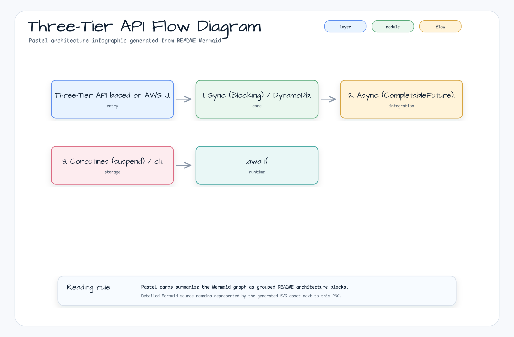
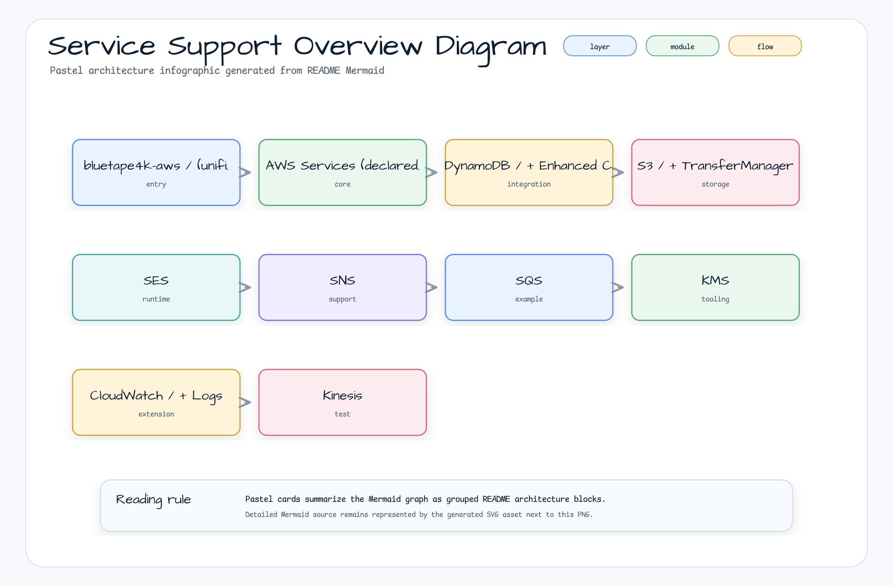
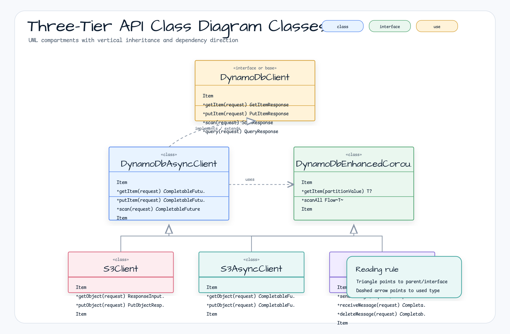

# Module bluetape4k-aws

English | [한국어](./README.ko.md)

A unified integration module built on AWS Java SDK v2. Provides async/non-blocking and Kotlin Coroutines support for major AWS services including DynamoDB, S3, SES, SNS, SQS, KMS, CloudWatch, Kinesis, and STS.

## Architecture

### Three-Tier API Flow



### Service Support Overview



### Three-Tier API Class Diagram



## Supported Services

| Service             | Key Features                                                                 |
|---------------------|------------------------------------------------------------------------------|
| **DynamoDB**        | Table CRUD, Enhanced Client, Coroutines extensions                           |
| **S3**              | Object upload/download, TransferManager (large files), Coroutines extensions |
| **SES**             | Email sending, Coroutines extensions                                         |
| **SNS**             | Topic publishing, SMS, push notifications, Coroutines extensions             |
| **SQS**             | Message send/receive/delete, Coroutines extensions                           |
| **KMS**             | Encryption key management, request DSLs, sync/async client builders          |
| **CloudWatch**      | Metric publishing/querying, Coroutines extensions                            |
| **CloudWatch Logs** | Log group/stream management, event publishing, Coroutines extensions         |
| **Kinesis**         | Stream record send/receive, Coroutines extensions                            |
| **STS**             | AssumeRole, CallerIdentity, SessionToken, Coroutines extensions              |

## Three-Tier API Pattern

Each service provides three tiers of API:

```
sync (blocking) → async (CompletableFuture) → coroutines (suspend)
```

Where coroutine extensions are provided, the coroutines tier wraps
`CompletableFuture` with `.await()` extension functions, so no thread blocking
occurs in coroutine contexts. Service SDK artifacts remain `compileOnly`;
applications must add the AWS SDK and coroutine runtime modules they use.

## Usage Examples

### DynamoDB Enhanced Async Table

```kotlin
import io.bluetape4k.aws.dynamodb.enhanced.getItem
import kotlinx.coroutines.future.await
import software.amazon.awssdk.enhanced.dynamodb.DynamoDbAsyncTable

suspend fun saveAndLoad(table: DynamoDbAsyncTable<UserDocument>, user: UserDocument): UserDocument? {
    table.putItem(user).await()
    return table.getItem(partitionValue = user.id)
}
```

### S3 Async Client

```kotlin
import io.bluetape4k.aws.s3.getAsString
import io.bluetape4k.aws.s3.putAsString
import software.amazon.awssdk.services.s3.S3AsyncClient

suspend fun writeThenRead(client: S3AsyncClient, bucket: String, key: String): String {
    client.putAsString(bucket, key, "hello")
    return client.getAsString(bucket, key)
}
```

### SQS Coroutine Extensions

```kotlin
import io.bluetape4k.aws.sqs.receiveMessages
import io.bluetape4k.aws.sqs.send
import software.amazon.awssdk.services.sqs.SqsAsyncClient

suspend fun sendMessage(client: SqsAsyncClient, queueUrl: String, body: String) =
    client.send(queueUrl, body)

suspend fun receiveMessages(client: SqsAsyncClient, queueUrl: String) =
    client.receiveMessages(queueUrl, maxResults = 10).messages()
```

### SNS Coroutine Extensions

```kotlin
import io.bluetape4k.aws.sns.createTopic
import software.amazon.awssdk.services.sns.SnsAsyncClient

suspend fun createTopic(client: SnsAsyncClient, topicName: String) =
    client.createTopic(topicName)
```

### KMS Request DSL

```kotlin
import io.bluetape4k.aws.kms.model.encryptRequestOf
import software.amazon.awssdk.core.SdkBytes

val request = encryptRequestOf(
    keyId = "alias/my-key",
    plainText = SdkBytes.fromUtf8String("plain-text"),
)
```

### CloudWatch Coroutine Extensions

```kotlin
import io.bluetape4k.aws.cloudwatch.putMetricData
import software.amazon.awssdk.services.cloudwatch.CloudWatchAsyncClient
import software.amazon.awssdk.services.cloudwatch.model.MetricDatum
import software.amazon.awssdk.services.cloudwatch.model.StandardUnit

suspend fun publishMetric(client: CloudWatchAsyncClient, namespace: String, value: Double) =
    client.putMetricData(
        namespace = namespace,
        metricDatum = MetricDatum.builder()
            .metricName("RequestCount")
            .value(value)
            .unit(StandardUnit.COUNT)
            .build()
    )
```

### Kinesis Coroutine Extensions

```kotlin
import io.bluetape4k.aws.kinesis.putRecord
import software.amazon.awssdk.core.SdkBytes
import software.amazon.awssdk.services.kinesis.KinesisAsyncClient

suspend fun putRecord(client: KinesisAsyncClient, streamName: String, data: ByteArray) =
    client.putRecord(
        streamName = streamName,
        partitionKey = "default",
        data = SdkBytes.fromByteArray(data),
    )
```

## Test Environment

Integration tests use `LocalStackServer` through the shared AWS test base.

```kotlin
abstract class AbstractAwsTest {
    companion object {
        val awsEmulator: LocalStackServer by lazy {
            LocalStackServer.Launcher.getLocalStack("s3", "sqs", "dynamodb")
        }
    }

    fun buildS3Client(): S3Client = S3Client.builder()
        .endpointOverride(awsEmulator.endpoint)
        .credentialsProvider(awsEmulator.credentialsProvider)
        .region(Region.of(awsEmulator.region))
        .build()
}
```

Run the `aws` module tests:

```bash
./gradlew :aws:test
```

## Adding the Dependency

AWS SDK services and coroutine helpers are declared as `compileOnly`
dependencies, so consumers add the runtime dependencies for the APIs they use.

```kotlin
dependencies {
    implementation("io.github.bluetape4k:bluetape4k-aws:${bluetape4kVersion}")

    // Coroutine extensions and Flow adapters used by public APIs
    implementation("io.github.bluetape4k:bluetape4k-coroutines:${bluetape4kVersion}")
    implementation(platform("org.jetbrains.kotlinx:kotlinx-coroutines-bom:${coroutinesVersion}"))
    implementation("org.jetbrains.kotlinx:kotlinx-coroutines-core")
    implementation("org.jetbrains.kotlinx:kotlinx-coroutines-reactive")

    // Add only the AWS services you need
    implementation(platform("software.amazon.awssdk:bom:${awsSdkVersion}"))
    implementation("software.amazon.awssdk:dynamodb-enhanced")
    implementation("software.amazon.awssdk:s3")
    implementation("software.amazon.awssdk:s3-transfer-manager")
    implementation("software.amazon.awssdk:sqs")
    implementation("software.amazon.awssdk:sns")
    implementation("software.amazon.awssdk:kms")
    implementation("software.amazon.awssdk:cloudwatch")
    implementation("software.amazon.awssdk:kinesis")
    implementation("software.amazon.awssdk:sts")
    // ... add other services as needed
}
```
