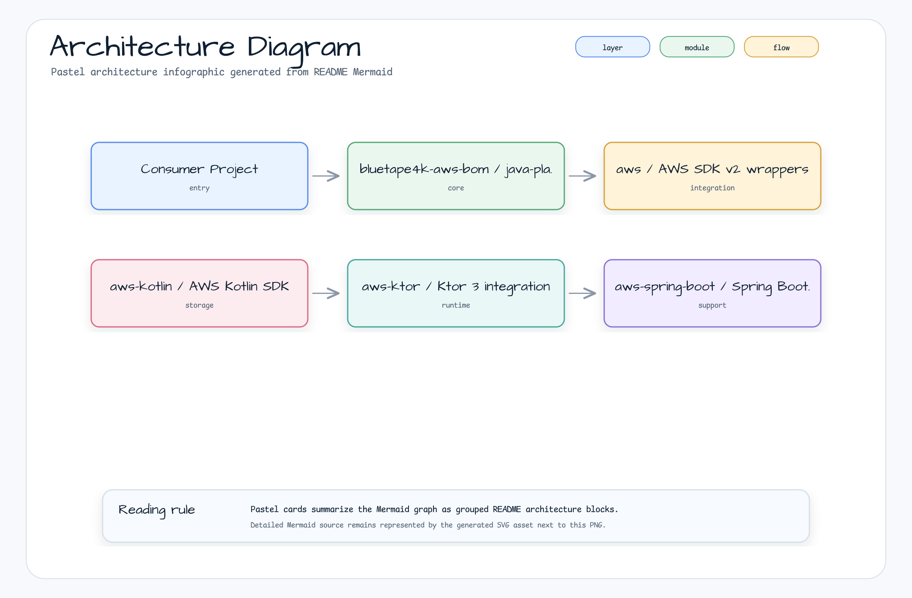

# bluetape4k-aws-bom

한국어 | [English](./README.md)

**bluetape4k-aws** 생태계용 Maven BOM (Bill of Materials). 모든 `io.github.bluetape4k.aws:*`
모듈의 버전을 중앙 관리하므로 소비자는 개별 버전을 명시하지 않고 의존성을 선언할 수 있다.

## Architecture



BOM은 Gradle `java-platform` 으로 `<dependencyManagement>` constraint 만 게시하며 런타임 클래스는 포함하지 않는다.
소비자는 `dependencyManagement` (Spring) 또는 Gradle `platform()` 으로 import 한다.

## 핵심 기능

- 모든 `bluetape4k-aws` 모듈 버전 중앙 관리
- 단일 진실 원천 — BOM 버전만 올리면 생태계 전체 갱신
- `bluetape4k-dependencies` 가 상위에서 통합 — 다중 생태계 버전 일관성 확보

## 관리 모듈

| 모듈 | 설명 |
|------|------|
| `bluetape4k-aws` | AWS SDK v2 래퍼 (Coroutines 지원) |
| `bluetape4k-aws-kotlin` | AWS Kotlin SDK 확장 |
| `bluetape4k-aws-ktor` | Ktor 3 연동 헬퍼 |
| `bluetape4k-aws-spring-boot` | Spring Boot 4 auto-configuration |

## 사용 예제

### Gradle Kotlin DSL

```kotlin
plugins {
    id("io.spring.dependency-management") version "1.1.x"
}

dependencyManagement {
    imports {
        mavenBom("io.github.bluetape4k.aws:bluetape4k-aws-bom:<version>")
    }
}

dependencies {
    implementation("io.github.bluetape4k.aws:bluetape4k-aws")            // 버전 생략
    implementation("io.github.bluetape4k.aws:bluetape4k-aws-spring-boot") // 버전 생략
}
```

### 순수 Gradle (Spring 미사용)

```kotlin
dependencies {
    implementation(platform("io.github.bluetape4k.aws:bluetape4k-aws-bom:<version>"))
    implementation("io.github.bluetape4k.aws:bluetape4k-aws")
}
```

### Maven

```xml
<dependencyManagement>
    <dependencies>
        <dependency>
            <groupId>io.github.bluetape4k.aws</groupId>
            <artifactId>bluetape4k-aws-bom</artifactId>
            <version>${bluetape4k-aws.version}</version>
            <type>pom</type>
            <scope>import</scope>
        </dependency>
    </dependencies>
</dependencyManagement>
```

## 설정 옵션

BOM 자체는 별도 설정이 없다. 개별 모듈은 각 모듈별 README 참조.

SNAPSHOT 사용 시 Sonatype Central Snapshots 저장소 추가:

```kotlin
repositories {
    mavenCentral()
    maven {
        name = "central-snapshots"
        url = uri("https://central.sonatype.com/repository/maven-snapshots/")
    }
}
```

## 의존성

이 BOM은 `bluetape4k-dependencies` 에서 자동 통합된다. 여러 bluetape4k 생태계를 함께 사용한다면
`io.github.bluetape4k:bluetape4k-dependencies` import 가 권장 — `bluetape4k-aws-bom` 외 모든 sub-BOM 을 함께 가져온다.
