# bluetape4k-aws-bom

[한국어](./README.ko.md) | English

Maven BOM (Bill of Materials) for the **bluetape4k-aws** ecosystem. Manages versions of all
`io.github.bluetape4k.aws:*` modules so consumers can declare dependencies without specifying
individual versions.

## Architecture



The BOM is a Gradle `java-platform` that publishes only `<dependencyManagement>` constraints — no runtime classes. Consumers import it via `dependencyManagement` (Spring) or Gradle `platform()`.

## Core Features

- Centralized version management for all `bluetape4k-aws` modules
- Single source of truth — bumping the BOM version updates the entire ecosystem
- Aggregated by `bluetape4k-dependencies` for cross-ecosystem version coordination

## Modules Managed

| Module | Description |
|--------|-------------|
| `bluetape4k-aws` | Core AWS SDK v2 wrappers with Coroutines support |
| `bluetape4k-aws-kotlin` | AWS Kotlin SDK extensions |
| `bluetape4k-aws-ktor` | Ktor 3 integration helpers |
| `bluetape4k-aws-spring-boot` | Spring Boot 4 auto-configuration |

## Usage Examples

### Gradle Kotlin DSL

```kotlin
plugins {
    id("io.spring.dependency-management") version "1.1.x"
}

dependencyManagement {
    imports {
        mavenBom("io.github.bluetape4k.aws:bluetape4k-aws-bom:<version>")
    }
}

dependencies {
    implementation("io.github.bluetape4k.aws:bluetape4k-aws")            // version omitted
    implementation("io.github.bluetape4k.aws:bluetape4k-aws-spring-boot") // version omitted
}
```

### Plain Gradle (no Spring)

```kotlin
dependencies {
    implementation(platform("io.github.bluetape4k.aws:bluetape4k-aws-bom:<version>"))
    implementation("io.github.bluetape4k.aws:bluetape4k-aws")
}
```

### Maven

```xml
<dependencyManagement>
    <dependencies>
        <dependency>
            <groupId>io.github.bluetape4k.aws</groupId>
            <artifactId>bluetape4k-aws-bom</artifactId>
            <version>${bluetape4k-aws.version}</version>
            <type>pom</type>
            <scope>import</scope>
        </dependency>
    </dependencies>
</dependencyManagement>
```

## Configuration Options

The BOM itself has no configuration. Consumers configure individual modules.

For SNAPSHOT builds, add the Sonatype Central Snapshots repository:

```kotlin
repositories {
    mavenCentral()
    maven {
        name = "central-snapshots"
        url = uri("https://central.sonatype.com/repository/maven-snapshots/")
    }
}
```

## Dependency

This BOM is automatically aggregated by `bluetape4k-dependencies`. Prefer importing
`io.github.bluetape4k:bluetape4k-dependencies` when consuming multiple bluetape4k ecosystems —
it transitively imports `bluetape4k-aws-bom` and all other sub-BOMs.
