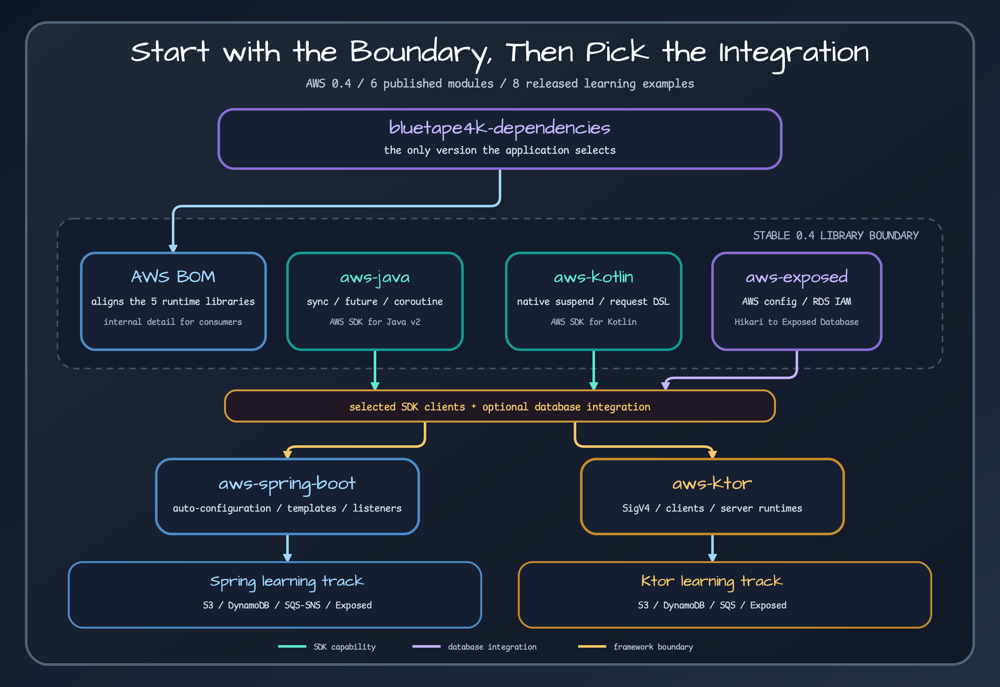

# AWS Repository Map

The `0.4.0` release contains 14 Gradle projects. Six are published libraries or platforms; eight are runnable examples. Read them as a set of layers rather than an alphabetical catalog.

## Layer 1: version alignment

`bluetape4k-aws-bom` aligns published artifacts from this repository. Application builds normally import the broader `bluetape4k-dependencies` BOM instead, because that is the consumer-facing version boundary across bluetape4k repositories.

## Layer 2: SDK foundations

| Project | SDK model | Use it for |
| --- | --- | --- |
| `bluetape4k-aws-java` | AWS SDK for Java v2 | Sync helpers, `CompletableFuture` extensions, suspending adapters, enhanced DynamoDB repositories, S3 transfer, and broad Java SDK service coverage |
| `bluetape4k-aws-kotlin` | AWS SDK for Kotlin | Native `suspend` clients, request DSLs, DynamoDB batch work, S3 helpers, and Kotlin-native service access |

These are alternative foundations for most application code. A framework integration may use both internally—for example, Java SDK SQS and Kotlin SDK DynamoDB—but an application should still define ownership for every client and HTTP engine.

## Layer 3: database bridge

`bluetape4k-aws-exposed` resolves AWS-backed connection settings, optionally creates RDS IAM authentication tokens, builds Hikari data sources, connects Exposed JDBC databases, and groups default and named handles in a closeable registry. It does not own transactions or AWS client lifecycle.

## Layer 4: application frameworks

- `bluetape4k-aws-spring-boot` binds `bluetape4k.aws.*` properties and creates conditional clients, templates, repositories, listeners, and database registries. Spring owns beans created by the auto-configuration and closes them with the application context.
- `bluetape4k-aws-ktor` provides Ktor plugins and runtime objects for SigV4, S3, SQS, DynamoDB, CloudWatch, IMDS, S3 Access Grants, S3 Vectors, and Exposed. Plugin-created resources are stopped with the Ktor application; injected clients remain application-owned.

## Layer 5: runnable learning projects

| Goal | Ktor example | Spring Boot example |
| --- | --- | --- |
| S3 object HTTP API | `aws-ktor-s3-examples` | `aws-spring-boot-s3-examples` |
| DynamoDB repository | `aws-ktor-dynamodb-examples` | `aws-spring-boot-dynamodb-examples` |
| SQS processing and SNS fanout | `aws-ktor-sqs-examples` | `aws-spring-boot-sqs-examples` |
| Exposed JDBC with AWS settings | `aws-ktor-exposed-examples` | `aws-spring-boot-exposed-examples` |

Examples are not published artifacts. They are copy points for configuration, application boundaries, and emulator-backed tests. Read an example together with its library module; copying only a route or controller omits the lifecycle and dependency decisions around it.

## Release scope rule

This map includes only projects registered by `settings.gradle.kts` in tag `0.4.0`. Projects added later on `develop` belong to a later manual baseline even if their source is already visible in the repository.

## Sources

- [Gradle project registry](../../../../settings.gradle.kts)
- [Published AWS platform](../../../../bom/build.gradle.kts)
- [Repository module overview](../../../../README.md)
