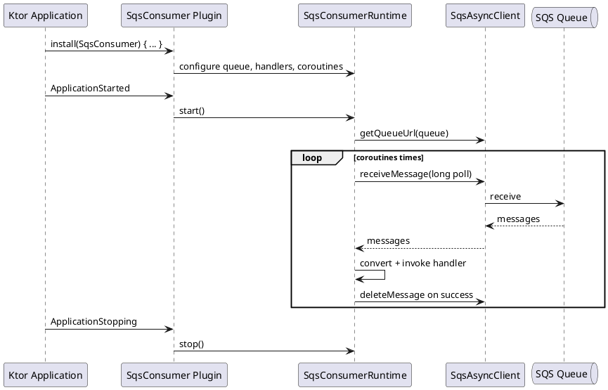
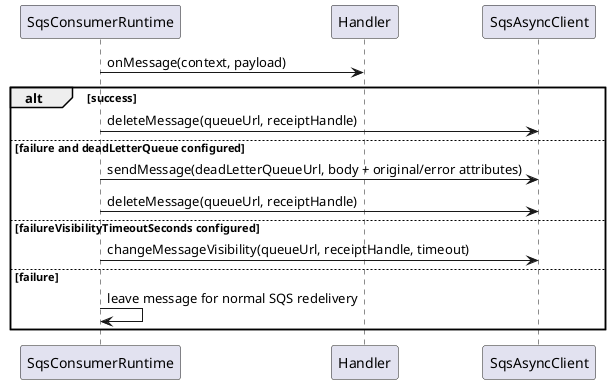

# 이슈 #10 Ktor SQS 소비자 / 게시자 설계

날짜: 2026-05-13
이슈: https://github.com/bluetape4k/bluetape4k-aws/issues/10
브랜치: `issue-10-ktor-sqs`

## 목표

Ktor 애플리케이션이 메시지를 게시하고 Ktor 애플리케이션 수명 주기 안에서 코루틴 기반 SQS 소비자를 실행할 수 있도록 SQS용 `aws-ktor` 서버 통합을 추가한다.

## 범위

- Ktor `ApplicationPlugin`인 `SqsConsumer`.
- 이슈 제목에서 쉽게 찾을 수 있도록 제공하는 `SqsKtorPlugin` 별칭.
- 수명 주기를 담당하며 테스트 가능한 핵심인 `SqsConsumerRuntime`.
- 큐 URL 또는 큐 이름을 사용한 큐 URL 해석.
- 구성 가능한 폴러 코루틴 수.
- 구성 가능한 수신 배치 크기, 롱 폴 대기 시간, 가시성 제한 시간, 성공 시 삭제, 수신 오류 백오프, 우아한 종료 제한 시간, 가시성 하트비트, 실패 가시성, 데드 레터 큐 전달.
- 주입된 `SqsAsyncClient`만 사용한다. `aws2.sqs`를 `aws-ktor`에서 `compileOnly`로 유지할 수 있도록 런타임은 AWS SDK 클라이언트를 만들거나 닫지 않는다.
- 플러그인 인스턴스당 핸들러 하나를 사용하며, 다중 큐 레지스트리 지원은 후속 이슈로 남긴다.
- 핸들러 DSL:

```kotlin
install(SqsConsumer) {
    sqsAsyncClient = sqs
    queueName = "orders"
    coroutines = 4
    onMessage<String> { body ->
        process(body)
    }
}
```

## 제외 범위

- 투명한 의존성 주입 프레임워크 바인딩을 제공하지 않는다.
- 임의 객체를 기본으로 자동 JSON 변환하지 않는다. 타입 지정 핸들러는 교체 가능한 `SqsMessageConverter`로 지원하며, 첫 번째 내장 변환기는 `String`, `ByteArray`, 원본 AWS `Message`를 지원한다.
- 런타임 상태를 위한 관리 엔드포인트를 제공하지 않는다.
- 첫 번째 작업 단위에서는 다중 큐 플러그인 인스턴스를 제공하지 않는다. 필요하면 나중에 레지스트리형 플러그인으로 여러 큐를 처리할 수 있다.
- 수동 DLQ 전달은 네이티브 SQS redrive를 원자적으로 대체하지 않는다. 보강이 필요한 사용 사례를 위한 최선형 기능이며, SQS의 메시지 속성 10개 제한 안에서 메타데이터에 우선순위를 둔다.

## 공개 API

- `SqsConsumerPluginConfig`
- `SqsConsumer`
- `SqsKtorPlugin`
- `SqsConsumerRuntime`
- `SqsConsumerRuntimeConfig`
- `SqsPollBackoff`
- `SqsMessageContext`
- `SqsMessageConverter`
- `StringOrByteArraySqsMessageConverter`

## 런타임 흐름



## 실패 흐름



## 코루틴 / 스레딩 규칙

- 한 메시지 핸들러의 실패가 다른 폴러를 중단하지 않도록 런타임은 `SupervisorJob`을 사용한다.
- 기본 디스패처는 `Dispatchers.IO.limitedParallelism(coroutines)`이다.
- 코루틴 허가로 핸들러 시작에 배압을 적용해 처리 중인 핸들러 수를 `coroutines * maxMessages`로 제한한다.
- 폴링 루프는 `CancellationException`을 다시 던진다.
- 런타임 실패 정책은 치명적이지 않은 `Exception`을 처리하며, 치명적인 `Error`를 SQS 재시도/DLQ 처리로 숨기지 않는다.
- 긴 루프는 취소에 잘 반응하도록 `isActive`와 `delay`를 사용한다.
- 수신 루프 오류는 과도한 재시도 루프를 피하도록 `SqsPollBackoff`를 사용한다.
- 종료 시 새 수신을 중단하고 처리 중인 핸들러를 `shutdownTimeout`까지 기다린 뒤, 취소된 메시지를 삭제하지 않고 남은 핸들러를 취소한다.
- 선택적 `visibilityHeartbeatSeconds`는 오래 실행되는 핸들러의 가시성을 주기적으로 연장하며 `visibilityTimeoutSeconds`가 필요하다.
- 실패 처리 우선순위는 수동 DLQ 전달, 실패 가시성 변경, 일반 SQS 재전달/네이티브 redrive 순서다.
- 테스트 범위:
  - 여러 폴러 코루틴이 메시지를 동시에 소비한다.
  - LocalStack/Testcontainers를 통한 실제 SQS 상호 작용.
  - 고정 sleep 대신 Awaitility 기반 최종 상태 검증.
  - Ktor `ApplicationStarted` 수명 주기 동작.
  - 실수로 메시지를 삭제하지 않는 우아한 종료 취소.
  - 메타데이터를 포함한 수동 DLQ 전달.
  - 큐 이름 해석 실패 재시도.
  - 성공한 핸들러의 삭제 실패가 핸들러 실패용 DLQ 처리로 이어지지 않는다.
  - 느린 핸들러가 수신 루프에 배압을 적용한다.

## 검증

- `./gradlew :aws-ktor:compileKotlin :aws-ktor:compileTestKotlin`
- `./gradlew :aws-ktor:test --tests 'io.bluetape4k.aws.ktor.sqs.*'` - 통과, 테스트 11개.
- `./gradlew :aws-ktor:test` - 통과, 테스트 30개.
- `git diff --check`
