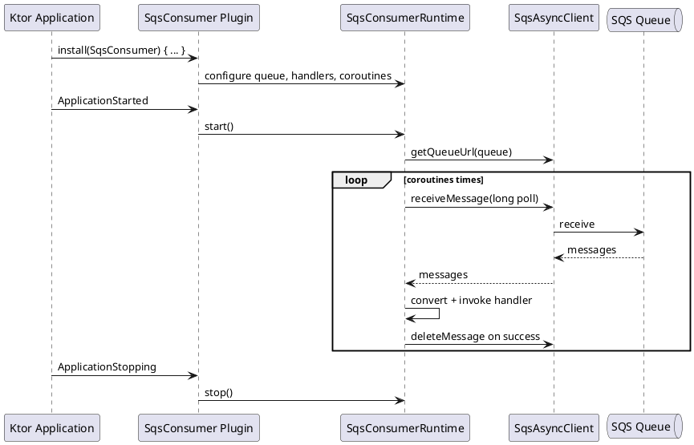
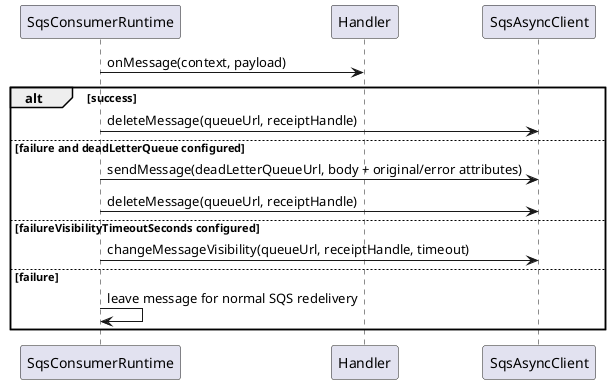

# Issue #10 Ktor SQS Consumer / Publisher Design

Date: 2026-05-13
Issue: https://github.com/bluetape4k/bluetape4k-aws/issues/10
Branch: `issue-10-ktor-sqs`

## Goal

Add an `aws-ktor` server integration for SQS so Ktor applications can publish messages and run coroutine-based SQS consumers inside the Ktor application lifecycle.

## Scope

- `SqsConsumer` Ktor `ApplicationPlugin`.
- `SqsKtorPlugin` alias for discoverability from the issue title.
- `SqsConsumerRuntime` as the lifecycle/testable core.
- Queue URL resolution from either queue URL or queue name.
- Configurable poller coroutine count.
- Configurable receive batch size, long-poll wait time, visibility timeout, success delete, receive-error backoff, graceful shutdown timeout, visibility heartbeat, failure visibility, and dead-letter queue forwarding.
- Injected `SqsAsyncClient` only. The runtime does not create or close AWS SDK clients so `aws2.sqs` can remain `compileOnly` in `aws-ktor`.
- One handler per plugin instance; multi-queue registry support is left for a later issue.
- Handler DSL:

```kotlin
install(SqsConsumer) {
    sqsAsyncClient = sqs
    queueName = "orders"
    coroutines = 4
    onMessage<String> { body ->
        process(body)
    }
}
```

## Non-Goals

- No transparent dependency injection framework binding.
- No automatic JSON conversion by default for arbitrary objects. Typed handlers are supported through a pluggable `SqsMessageConverter`; the first built-in converter supports `String`, `ByteArray`, and raw AWS `Message`.
- No management endpoint for runtime state.
- No multi-queue plugin instance in the first slice. Multiple queues can be handled later through a registry-style plugin if needed.
- Manual DLQ forwarding is not an atomic replacement for native SQS redrive. It exists for enrichment use cases and is documented as best-effort. Metadata is prioritized within SQS's 10 message-attribute limit.

## Public API

- `SqsConsumerPluginConfig`
- `SqsConsumer`
- `SqsKtorPlugin`
- `SqsConsumerRuntime`
- `SqsConsumerRuntimeConfig`
- `SqsPollBackoff`
- `SqsMessageContext`
- `SqsMessageConverter`
- `StringOrByteArraySqsMessageConverter`

## Runtime Flow



## Failure Flow



## Coroutine / Threading Rules

- Runtime uses `SupervisorJob` so one failed message handler does not kill sibling pollers.
- Default dispatcher is `Dispatchers.IO.limitedParallelism(coroutines)`.
- Polling loop rethrows `CancellationException`.
- Long loops use `isActive` and `delay` to remain cancellation friendly.
- Receive-loop errors use `SqsPollBackoff` to avoid hot retry loops.
- Shutdown stops new receives, waits for in-flight handlers up to `shutdownTimeout`, then cancels remaining handlers without deleting canceled messages.
- Optional `visibilityHeartbeatSeconds` periodically extends visibility for long-running handlers; it requires `visibilityTimeoutSeconds`.
- Failure precedence is manual DLQ forwarding, then failure visibility change, then normal SQS redelivery/native redrive.
- Tests cover:
  - Multiple poller coroutines consuming messages concurrently.
  - Real SQS interaction through LocalStack/Testcontainers.
  - Awaitility-based eventual assertions instead of fixed sleeps.
  - Ktor `ApplicationStarted` lifecycle behavior.
  - Graceful shutdown cancellation without accidental delete.
  - Manual DLQ forwarding with metadata.

## Verification

- `./gradlew :aws-ktor:compileKotlin :aws-ktor:compileTestKotlin`
- `./gradlew :aws-ktor:test --tests 'io.bluetape4k.aws.ktor.sqs.*'` - passed, 8 tests.
- `./gradlew :aws-ktor:test`
- `git diff --check`
