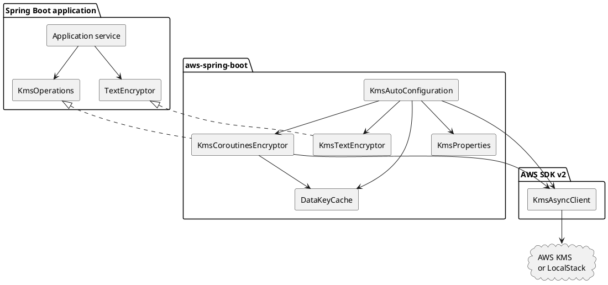
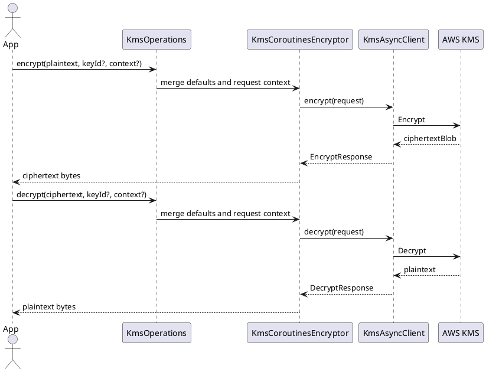
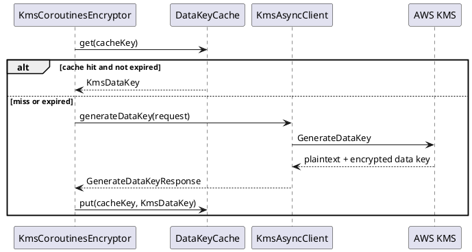

# 이슈 #5 KMS Spring Boot 지원 설계

날짜: 2026-05-13
이슈: https://github.com/bluetape4k/bluetape4k-aws/issues/5
브랜치: `issue-5-kms-spring-boot`

## 목표

애플리케이션 코드가 `KmsAsyncClient`와 AWS SDK request builder를 직접 연결하지 않고 coroutine 친화적인 encryptor를 주입할 수 있도록 AWS KMS용 Spring Boot 4 자동 설정을 추가한다.

## 사용자 계약

- `software.amazon.awssdk:kms`가 있으면 `KmsAutoConfiguration`이 `KmsAsyncClient`를 생성한다.
- `KmsProperties`는 `bluetape4k.aws.kms`를 binding한다.
- `KmsCoroutinesEncryptor`는 다음 작업의 suspend 함수를 노출한다.
  - KMS `Encrypt` 작업
  - KMS `Decrypt` 작업
  - KMS `GenerateDataKey` 작업
- `DataKeyCache`는 envelope encryption을 수행하는 호출자에게 크기가 제한되고 TTL에 기반한 plaintext data key 재사용 기능을 제공한다.
- `KmsTextEncryptor`는 coroutine encryptor를 Spring Security Crypto `TextEncryptor`에 맞게 조정한다.

## 제외 범위

- 이 PR에서는 field 수준 `@KmsEncrypted` annotation을 제공하지 않는다. 직렬화, persistence lifecycle hook, 실패 의미에 관한 별도 설계가 필요하다.
- S3, DynamoDB, SQS payload의 저장 데이터 암호화를 자동화하지 않는다.
- AWS Encryption SDK 의존성을 추가하지 않는다.
- 실제 AWS 계정 통합 테스트는 실행하지 않는다. LocalStack으로 SDK 연결과 동작을 검증한다.

## 설정

```yaml
bluetape4k:
  aws:
    kms:
      enabled: true
      region: ap-northeast-2
      endpoint-override: http://localhost:4566
      key-id: alias/app-config
      encryption-context:
        service: order-api
      data-key-cache:
        enabled: true
        max-size: 64
        ttl: PT5M
```

## API 형태

```kotlin
interface KmsOperations {
    suspend fun encrypt(plaintext: ByteArray, keyId: String? = null, encryptionContext: Map<String, String> = emptyMap()): ByteArray
    suspend fun decrypt(ciphertext: ByteArray, keyId: String? = null, encryptionContext: Map<String, String> = emptyMap()): ByteArray
    suspend fun generateDataKey(keyId: String? = null, encryptionContext: Map<String, String> = emptyMap()): KmsDataKey
}
```

`KmsCoroutinesEncryptor`가 이 계약을 구현한다. `keyId`와 `encryptionContext`는 기본적으로 `KmsProperties` 값을 사용하며, 명시적인 method argument가 runtime 호출 context를 덮어쓰거나 확장한다.

## Component 모델



## Encrypt / Decrypt 흐름



## Data Key Cache 흐름



## 설계 기록

- KMS `Encrypt`에는 AWS KMS payload 크기 제한이 있다. README에서 큰 payload에는 data key/envelope encryption을 사용하라고 안내해야 한다.
- `TextEncryptor` 계약은 동기식이다. adapter는 coroutine encryptor가 끝날 때까지 block하므로 설정 값, token, 짧은 식별자 같은 작은 secret에 사용해야 한다.
- Data key caching은 process memory에 plaintext data key를 저장한다. 기본값은 보수적이어야 하며 TTL과 크기로 제한해야 한다.
- `spring-security-crypto`는 선택 사항이다. `TextEncryptor`가 classpath에 있을 때만 adapter bean이 나타난다.
- 공개 KDoc은 영어다. 내부 설계 문서는 한국어나 영어를 사용할 수 있으며, 이 문서는 API 용어를 정확하게 유지하기 위해 영어로 작성되었다.

## 검증

- `aws-spring-boot`를 compile한다.
- KMS 자동 설정 테스트를 실행한다.
- LocalStack KMS encrypt/decrypt/data-key 테스트를 실행한다.
- 전체 `:aws-spring-boot:test`를 실행한다.
- PR 전에 README API 이름을 소스와 대조해 검색한다.
