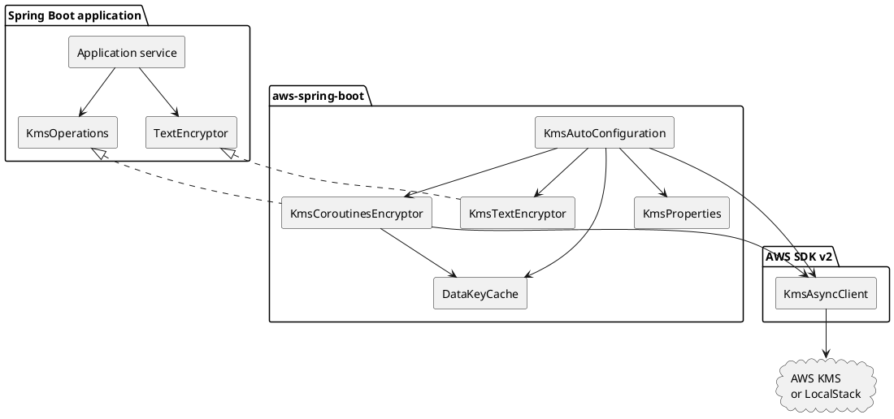
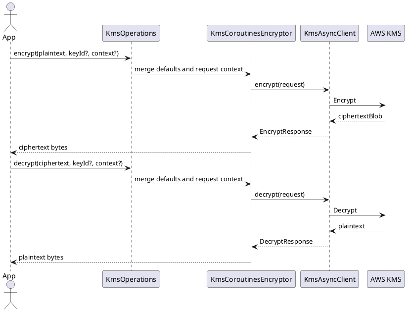
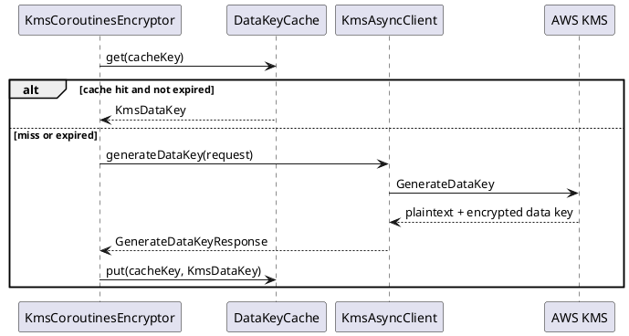

# Issue #5 KMS Spring Boot Support Design

Date: 2026-05-13
Issue: https://github.com/bluetape4k/bluetape4k-aws/issues/5
Branch: `issue-5-kms-spring-boot`

## Goal

Add Spring Boot 4 auto-configuration for AWS KMS so application code can inject a coroutine-friendly encryptor instead of wiring `KmsAsyncClient` and AWS SDK request builders by hand.

## User-Facing Contract

- `KmsAutoConfiguration` creates `KmsAsyncClient` when `software.amazon.awssdk:kms` is present.
- `KmsProperties` binds `bluetape4k.aws.kms`.
- `KmsCoroutinesEncryptor` exposes suspend functions for:
  - KMS `Encrypt`
  - KMS `Decrypt`
  - KMS `GenerateDataKey`
- `DataKeyCache` provides bounded, TTL-based plaintext data key reuse for callers that do envelope encryption.
- `KmsTextEncryptor` adapts the coroutine encryptor to Spring Security Crypto `TextEncryptor`.

## Non-Goals

- No `@KmsEncrypted` field-level annotation in this PR. That requires a separate design for serialization, persistence lifecycle hooks, and failure semantics.
- No automatic data encryption at rest for S3, DynamoDB, or SQS payloads.
- No AWS Encryption SDK dependency.
- No real AWS account integration test; LocalStack verifies SDK wiring and behavior.

## Configuration

```yaml
bluetape4k:
  aws:
    kms:
      enabled: true
      region: ap-northeast-2
      endpoint-override: http://localhost:4566
      key-id: alias/app-config
      encryption-context:
        service: order-api
      data-key-cache:
        enabled: true
        max-size: 64
        ttl: PT5M
```

## API Shape

```kotlin
interface KmsOperations {
    suspend fun encrypt(plaintext: ByteArray, keyId: String? = null, encryptionContext: Map<String, String> = emptyMap()): ByteArray
    suspend fun decrypt(ciphertext: ByteArray, keyId: String? = null, encryptionContext: Map<String, String> = emptyMap()): ByteArray
    suspend fun generateDataKey(keyId: String? = null, encryptionContext: Map<String, String> = emptyMap()): KmsDataKey
}
```

`KmsCoroutinesEncryptor` implements this contract. `keyId` and `encryptionContext` default to `KmsProperties`, while explicit method arguments override or extend runtime call context.

## Component Model



## Encrypt / Decrypt Flow



## Data Key Cache Flow



## Design Notes

- KMS `Encrypt` has AWS KMS payload-size limits. README must tell users to use data keys/envelope encryption for larger payloads.
- `TextEncryptor` is synchronous by contract; the adapter blocks on the coroutine encryptor and should be used for small secrets such as configuration values, tokens, or short identifiers.
- Data key caching stores plaintext data keys in process memory. Defaults must be conservative and bounded by TTL and size.
- `spring-security-crypto` is optional. The adapter bean appears only when `TextEncryptor` is on the classpath.
- Public KDoc is English. Internal design documents may be Korean or English; this one is English to keep API terminology precise.

## Verification

- Compile `aws-spring-boot`.
- Run KMS auto-configuration tests.
- Run LocalStack KMS encrypt/decrypt/data-key tests.
- Run full `:aws-spring-boot:test`.
- Grep README API names against source before PR.
