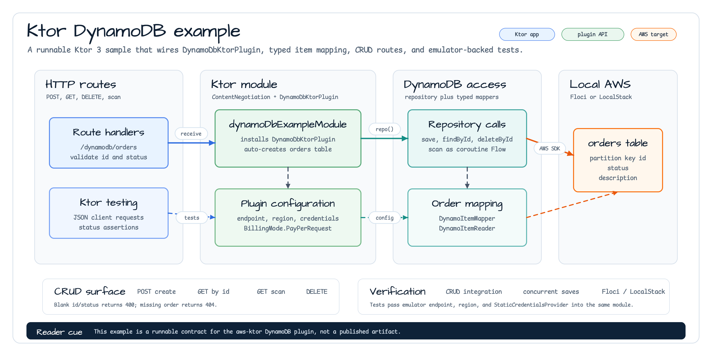

# aws-ktor-dynamodb-examples

English | [한국어](./README.ko.md)

Ktor 3 examples for the `aws-ktor` DynamoDB plugin. The module installs
`DynamoDbKtorPlugin`, creates the `orders` table at startup, and exposes CRUD
routes backed by a coroutine DynamoDB repository. It keeps the route code close
to the plugin contract so developers can copy the table setup, mapper, reader,
and test wiring into their own Ktor services.

## Architecture



## DynamoDB Model

The example stores `Order` items with an `id` partition key:

```kotlin
data class Order(
    val id: String,
    val status: String,
    val description: String = "",
)
```

`DynamoItemMapper` writes the Kotlin model as DynamoDB attributes, while
`DynamoItemReader` restores the `Order` from the returned item map. The plugin
configures the table with `BillingMode.PayPerRequest`.

## Server Routes

| Method | Path | Purpose |
|---|---|---|
| `POST` | `/dynamodb/orders` | Save an order. Blank `id` or `status` returns `400`. |
| `GET` | `/dynamodb/orders/{id}` | Find an order by partition key. Missing orders return `404`. |
| `DELETE` | `/dynamodb/orders/{id}` | Delete an order by partition key. |
| `GET` | `/dynamodb/orders` | Scan the table and return all orders. |

## Configuration

Configure the module by calling `dynamoDbExampleModule` with an endpoint, region,
and credentials provider. The tests pass the selected AWS emulator values, so
the same module runs against Floci or LocalStack:

```kotlin
application {
    dynamoDbExampleModule(
        endpointUrl = endpointUrl,
        region = localStack.regionName,
        credentialsProvider = credentialsProvider,
    )
}
```

## Test

```bash
./gradlew :aws-ktor-dynamodb-examples:test
```
