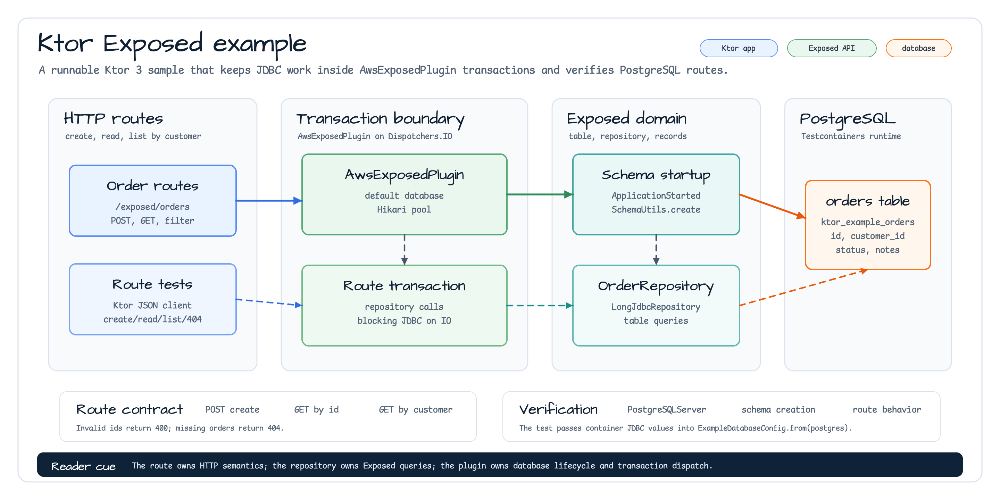

# aws-ktor-exposed-examples

[English](./README.md) | 한국어

`aws-ktor`와 `bluetape4k-aws-exposed`를 사용하는 Ktor 3 예제입니다.
`AwsExposedPlugin`을 설치하고 application start 시점에 Exposed schema를 만든 뒤,
PostgreSQL 기반 주문 route를 제공합니다. 예제는 의도적으로 작게 유지했습니다.
Route는 HTTP 의미를, repository는 Exposed query를, plugin은 database lifecycle과
transaction dispatch를 맡습니다. 로컬 테스트는 Testcontainers를 사용하며 AWS
credential이 필요하지 않습니다.

## 아키텍처



## Routes

| Method | Path | 설명 |
|---|---|---|
| `POST` | `/exposed/orders` | 주문 생성 후 `201 Created` 반환 |
| `GET` | `/exposed/orders/{id}` | 주문 조회, 없으면 `404 Not Found` 반환 |
| `GET` | `/exposed/orders?customerId={customerId}&limit={limit}&cursor={cursor}` | cursor 페이지로 주문 목록 조회, 고객별 필터 지원 |

## Cursor pagination

목록 route는 단순 배열 대신 `ExposedCursorPage<OrderRecord, Long>`을 반환합니다.

```json
{
  "content": [{ "id": 41, "customerId": "customer-1", "status": "CREATED", "notes": null }],
  "nextCursor": 41,
  "hasNext": true
}
```

- `customerId`는 선택 값이며 해당 고객으로 페이지를 필터링합니다.
- `limit`은 `1`~`100` 범위의 선택적 정수이며 기본값은 `20`입니다.
- `cursor`는 마지막으로 본 `OrdersTable.id`인 0 이상 정수입니다. 다음 페이지를
  조회할 때 응답의 `nextCursor`를 그대로 전달합니다.
- 마지막 페이지는 `hasNext: false`, `nextCursor: null`을 반환하며 전체 건수는
  계산하지 않습니다.

이 예제는 wire contract를 명확히 보여주기 위해 raw primary-key cursor를 노출합니다.
운영 호출자는 client에 전달하기 전에 cursor token을 인코딩·서명하고 tenant/권한 범위와
만료 시간을 적용해야 합니다.

## 트랜잭션 경계

Route는 repository를 `call.awsExposedTransaction { ... }` 안에서만 호출합니다.
`OrderRepository`는 Exposed query만 담고 Ktor plugin, database handle,
connection lifecycle은 소유하지 않습니다. `AwsExposedPlugin`은 route transaction을
기본값 `Dispatchers.IO`인 `transactionContext`로 실행해 blocking JDBC 작업을
분리합니다. 시작 hook도 같은 경계를 사용해 `OrdersTable`을 생성합니다.

## 설정

```kotlin
install(AwsExposedPlugin) {
    defaultDatabase {
        url = "jdbc:postgresql://localhost:5432/orders"
        driverClassName = "org.postgresql.Driver"
        username = "postgres"
        password = "postgres"
        pool {
            maximumPoolSize = 2
            minimumIdle = 0
        }
    }
}
```

운영 환경에서는 plugin 설치 전에 AWS Secrets Manager, Parameter Store, 환경 변수 등에서
설정 값을 해석합니다.

## 테스트

```bash
./gradlew :aws-ktor-exposed-examples:test
```

테스트는 공유 `PostgreSQLServer.Launcher.postgres` 컨테이너를 시작하고, 해당 JDBC
설정을 `ExampleDatabaseConfig`에 전달한 뒤 route 수준의 생성/조회/목록/404, cursor 페이지
순회, 잘못된 cursor·limit 거부를 검증합니다.
