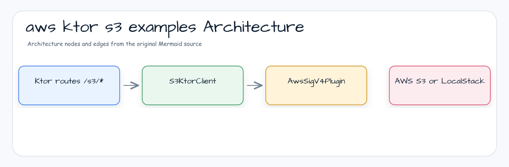

# aws-ktor-s3-examples

[English](./README.md) | 한국어

`aws-ktor` S3 REST client를 사용하는 Ktor 3 예제입니다. LocalStack용 client helper와
업로드, 다운로드, streaming 다운로드, 객체 목록, 삭제, presigned URL 엔드포인트를 제공하는
server route 예제를 포함합니다.

## 아키텍처



## 클라이언트 예제

```kotlin
S3KtorExamples.localStackClient().use { s3 ->
    s3.putObject("demo-bucket", "docs/hello.txt", "hello".encodeToByteArray())
    val text = s3.getObjectBytes("demo-bucket", "docs/hello.txt").decodeToString()
}
```

## 서버 Route

| Method | Path | 설명 |
|---|---|---|
| `PUT` | `/s3/objects/{key...}` | 요청 본문 bytes 업로드 |
| `GET` | `/s3/objects/{key...}` | 객체 bytes 다운로드 |
| `GET` | `/s3/objects/{key...}/stream` | `getObjectStream` 기반 다운로드 |
| `GET` | `/s3/objects?prefix={prefix}` | 객체 key 목록 |
| `GET` | `/s3/presigned-get/{key...}` | 다운로드용 presigned URL 생성 |
| `GET` | `/s3/presigned-put/{key...}` | 업로드용 presigned URL 생성 |
| `DELETE` | `/s3/objects/{key...}` | 객체 삭제 |

## 설정

LocalStack에서는 path-style 주소와 endpoint override를 사용합니다.

```kotlin
val s3 = s3KtorClientOf(
    region = "ap-northeast-2",
    endpointOverride = Url("http://localhost:4566"),
    addressingStyle = S3KtorAddressingStyle.Path,
)
```

## 테스트

```bash
./gradlew :aws-ktor-s3-examples:test
```

테스트는 presigned URL 생성과 Ktor `MockEngine` 기반 route 동작을 검증합니다.
