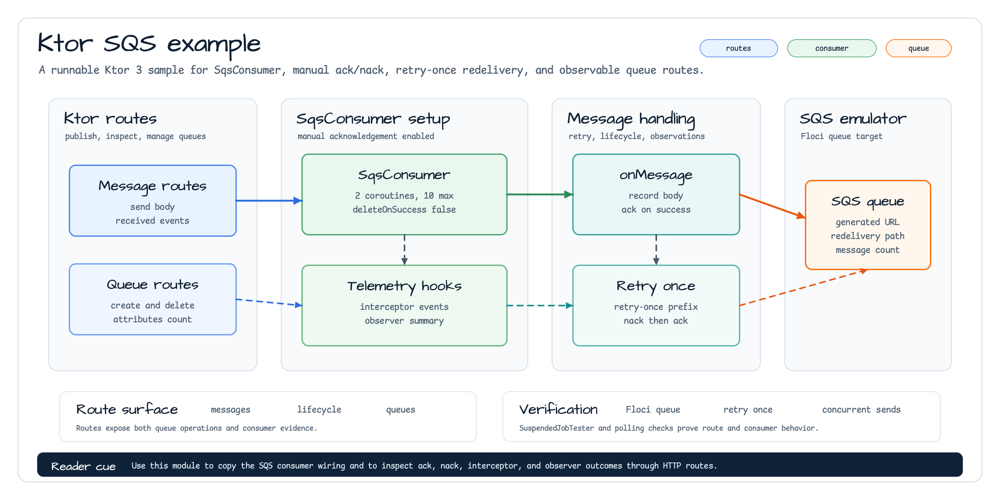

# aws-ktor-sqs-examples

English | [한국어](./README.ko.md)

Ktor 3 examples for the `aws-ktor` SQS consumer plugin. The module installs
`SqsConsumer`, publishes messages through `SqsAsyncClient`, records consumed
messages in memory, and exposes queue management routes. The interesting part is
the observable consumer contract: manual ack/nack, retry-once redelivery,
interceptor events, and observer summaries are all visible through HTTP routes.
It uses `bluetape4k-ktor-core` for shared route parameter validation and
`bluetape4k-ktor-testing` for common Ktor response assertions.

## Architecture



## Consumer Setup

`sqsExampleModule` receives an `SqsAsyncClient` and a queue URL, installs
Jackson content negotiation, and configures the consumer:

```kotlin
install(SqsConsumer) {
    sqsAsyncClient = sqsClient
    this.queueUrl = queueUrl
    coroutines = 2
    maxMessages = 10
    waitTimeSeconds = 1
    visibilityTimeoutSeconds = 30
}
```

`onMessage<String>` appends consumed message bodies to an in-memory list so tests
and sample clients can inspect listener output. Messages prefixed with
`retry-once:` are nacked once with zero visibility timeout, then acknowledged on
redelivery. `deleteOnSuccess = false` makes the acknowledgement path explicit
instead of hiding it behind automatic deletion.

## Advanced Consumer Telemetry

The example registers an interceptor and observer. Interceptor events are
available from `/sqs/messages/lifecycle-events`; observation summaries are
available from `/sqs/messages/observations`. These routes show the same hook
surface a production service would bridge to logs, Micrometer, or tracing.

## Server Routes

| Method | Path | Purpose |
|---|---|---|
| `POST` | `/sqs/messages` | Send a plain text body to the configured queue. |
| `GET` | `/sqs/messages/received` | Return message bodies consumed by `SqsConsumer`. |
| `GET` | `/sqs/messages/lifecycle-events` | Return interceptor and retry lifecycle events. |
| `GET` | `/sqs/messages/observations` | Return observer operation/outcome summaries. |
| `POST` | `/sqs/queues/{name}` | Create an SQS queue and return its URL. |
| `DELETE` | `/sqs/queues?url={queueUrl}` | Delete the query queue URL, or the configured queue when omitted. |
| `GET` | `/sqs/queues/attributes?url={queueUrl}` | Return `approximateMessageCount`. |

## Configuration

Tests create a Floci-backed `SqsAsyncClient` with `SqsClientFactory.Async`, create
a queue with a random name, and pass the generated queue URL into the Ktor
application:

```kotlin
application { sqsExampleModule(sqsClient, queueUrl) }
```

## Test

```bash
./gradlew :aws-ktor-sqs-examples:test
```

The suite covers send, queue attributes, queue creation, concurrent sends with
`SuspendedJobTester`, and the advanced ack/nack telemetry route.
