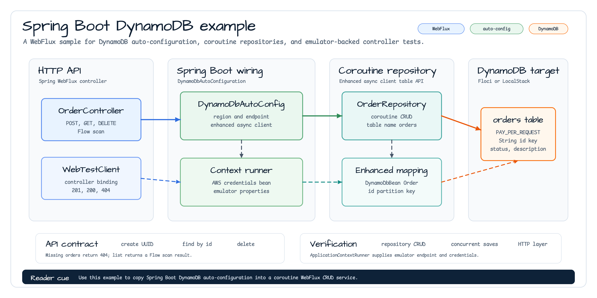

# aws-spring-boot-dynamodb-examples

[English](./README.md) | 한국어

`aws-spring-boot` DynamoDB 자동설정을 사용하는 Spring Boot 4 WebFlux 예제입니다.
`DynamoDbAutoConfiguration`을 연결하고,
`AbstractCoroutinesDynamoDbRepository` 기반 `OrderRepository`와 작은 `/orders`
REST API를 제공합니다. DynamoDB enhanced async client 위에서 coroutine CRUD를 구성할
때 복사해 쓰기 좋은 작은 예제입니다.

## 아키텍처



## Repository

`Order`는 `id`를 partition key로 사용하는 DynamoDB enhanced client bean입니다.

```kotlin
@DynamoDbBean
class Order {
    @get:DynamoDbPartitionKey
    var id: String = ""
    var status: String = ""
    var description: String = ""
}
```

`OrderRepository`는 table name을 `orders`로 해석하고, item과 id 값을 enhanced
client `Key`로 변환합니다. Repository method는 suspend 또는 `Flow` 기반으로 유지하고,
enhanced client와 table name resolver는 Spring Boot 자동설정에서 받습니다.

## API

| Method | Path | 설명 |
|---|---|---|
| `POST` | `/orders` | UUID를 생성해 주문을 저장합니다. |
| `GET` | `/orders/{id}` | id로 주문을 조회합니다. 없으면 `404`를 반환합니다. |
| `DELETE` | `/orders/{id}` | id로 주문을 삭제합니다. |
| `GET` | `/orders` | `Flow<Order>` scan 결과를 반환합니다. |

요청 본문:

```json
{
  "status": "NEW",
  "description": "first order"
}
```

## 설정

예제는 `application.yml`에서 DynamoDB 자동설정을 활성화합니다.

```yaml
bluetape4k:
  aws:
    dynamodb:
      enabled: true
```

LocalStack 또는 Floci 테스트는 `ApplicationContextRunner`로
`bluetape4k.aws.dynamodb.region`과
`bluetape4k.aws.dynamodb.endpoint-override`를 제공합니다. Runner는 emulator credential도
`AwsCredentialsProvider` bean으로 공급합니다.

## 실행

```bash
./gradlew :aws-spring-boot-dynamodb-examples:bootRun
```

## 테스트

```bash
./gradlew :aws-spring-boot-dynamodb-examples:test
```

테스트 suite는 repository CRUD, scan, `SuspendedJobTester` 기반 concurrent save/find,
그리고 `WebTestClient` 기반 controller HTTP layer를 검증합니다.

## AOT

모듈은 Spring Boot plugin을 적용하므로 native-image metadata 검증 시 표준 Boot
AOT task를 사용할 수 있습니다.

```bash
./gradlew :aws-spring-boot-dynamodb-examples:processAot
```
