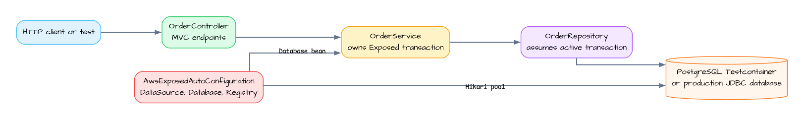

# aws-spring-boot-exposed-examples

[English](./README.md) | 한국어

`aws-spring-boot`와 `bluetape4k-aws-exposed` 자동설정 경로를 보여주는
Spring Boot 4 MVC 예제입니다. 로컬 테스트는 Testcontainers PostgreSQL을 사용하며
AWS credential이 필요하지 않습니다. 경계는 작고 명확하게 나눴습니다. Controller는
HTTP status 동작을, service는 `transaction(database) { ... }` 경계를, repository는
Exposed query를 맡습니다.

## 아키텍처



## API

| Method | Path | 설명 |
|---|---|---|
| `POST` | `/orders` | 주문 생성 후 `201 Created` 반환 |
| `GET` | `/orders/{id}` | 주문 조회, 없으면 `404 Not Found` 반환 |
| `GET` | `/orders?customerId={customerId}&limit={limit}&cursor={cursor}` | cursor 페이지로 주문 목록 조회, 고객별 필터 지원 |

## Cursor pagination

목록 route는 단순 배열 대신 `ExposedCursorPage<OrderRecord, Long>`을 반환합니다.

```json
{
  "content": [{ "id": 41, "customerId": "customer-1", "status": "CREATED", "notes": null }],
  "nextCursor": 41,
  "hasNext": true
}
```

- `customerId`는 선택 값이며 해당 고객으로 페이지를 필터링합니다.
- `limit`은 `1`~`100` 범위의 선택적 정수이며 기본값은 `20`입니다.
- `cursor`는 마지막으로 본 `OrdersTable.id`인 0 이상 정수입니다. 다음 페이지를
  조회할 때 응답의 `nextCursor`를 그대로 전달합니다.
- 마지막 페이지는 `hasNext: false`, `nextCursor: null`을 반환하며 전체 건수는
  계산하지 않습니다.

이 예제는 wire contract를 명확히 보여주기 위해 raw primary-key cursor를 노출합니다.
운영 호출자는 client에 전달하기 전에 cursor token을 인코딩·서명하고 tenant/권한 범위와
만료 시간을 적용해야 합니다.

## 트랜잭션 경계

`OrderController`는 `OrderService`에 위임하고, `OrderService`가
`transaction(database) { ... }` 경계를 소유합니다. `OrderRepository`는 활성화된
Exposed transaction 안에서만 호출됩니다. `OrderSchemaInitializer`는 자동설정된
`Database` bean을 사용할 수 있게 된 뒤 `OrdersTable`을 생성합니다.

## 설정

```yaml
bluetape4k:
  aws:
    exposed:
      default-database:
        url: jdbc:postgresql://localhost:5432/orders
        driver-class-name: org.postgresql.Driver
        username: postgres
        password: postgres
        pool:
          maximum-pool-size: 2
          minimum-idle: 0
```

운영 환경에서는 같은 값을 AWS Secrets Manager, Parameter Store, 환경 변수,
또는 Spring 설정 소스에서 제공합니다.

## 실행

```bash
./gradlew :aws-spring-boot-exposed-examples:bootRun
```

## 테스트

```bash
./gradlew :aws-spring-boot-exposed-examples:test
```

테스트는 공유 `PostgreSQLServer.Launcher.postgres` 컨테이너를 시작하고
`AwsExposedDatabaseRegistry`, `DataSource`, Exposed `Database`, HTTP 생성/조회/목록/404
동작과 cursor 페이지 순회, 잘못된 cursor·limit 거부를 random-port `SpringBootTest`로
검증합니다.
