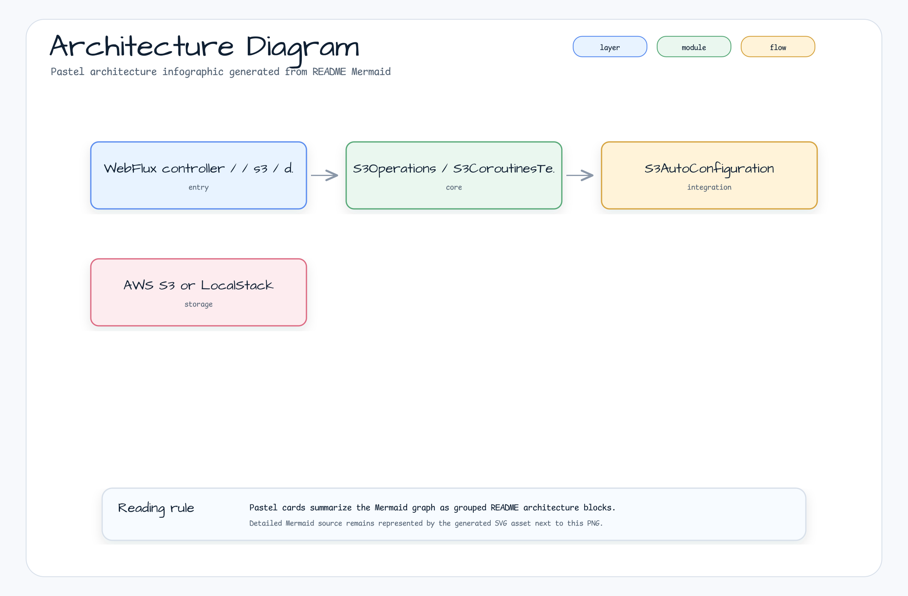

# aws-spring-boot-s3-examples

[English](./README.md) | 한국어

`aws-spring-boot` S3 자동설정을 사용하는 Spring Boot 4 WebFlux 예제입니다.
`S3Operations` 인터페이스를 통해 `S3CoroutinesTemplate` 기반 업로드, 다운로드,
객체 목록, 삭제, presigned URL API를 보여줍니다.

## 아키텍처



## API

| Method | Path | 설명 |
|---|---|---|
| `PUT` | `/s3/documents?bucket={bucket}&key={key}` | 요청 본문 bytes 업로드 |
| `GET` | `/s3/documents?bucket={bucket}&key={key}` | 객체 bytes 다운로드 |
| `GET` | `/s3/documents/objects?bucket={bucket}&prefix={prefix}` | 객체 key 스트리밍 |
| `GET` | `/s3/documents/presigned-get?bucket={bucket}&key={key}` | 다운로드용 presigned URL 생성 |
| `GET` | `/s3/documents/presigned-put?bucket={bucket}&key={key}` | 업로드용 presigned URL 생성 |
| `DELETE` | `/s3/documents?bucket={bucket}&key={key}` | 객체 삭제 |

## 설정

```yaml
bluetape4k:
  aws:
    s3:
      region: ap-northeast-2
      endpoint-override: http://localhost:4566
      path-style-access-enabled: true
      presign:
        duration: PT15M
```

`endpoint-override`와 `path-style-access-enabled`는 LocalStack에서 유용합니다.
실제 AWS S3에서는 `endpoint-override`를 생략하고 AWS SDK credential chain을 사용합니다.

## 실행

```bash
./gradlew :aws-spring-boot-s3-examples:bootRun
```

## 테스트

```bash
./gradlew :aws-spring-boot-s3-examples:test
```

테스트는 Testcontainers로 LocalStack을 시작하고 bucket을 만든 뒤 업로드, 다운로드,
목록, presigned GET/PUT URL 생성, 삭제 동작을 검증합니다.

## AOT

모든 Spring Boot 예제는 GraalVM Native Build Tools 를 통해 Spring AOT 태스크가
생성되도록 구성합니다. 이 예제는 다음 명령으로 검증합니다.

```bash
./gradlew :aws-spring-boot-s3-examples:processAot :aws-spring-boot-s3-examples:processTestAot
```
