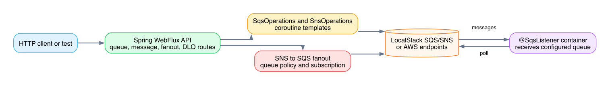

# Spring Boot SQS/SNS Example

[English](README.md) | [한국어](README.ko.md)

Runnable Spring Boot 4 example for `aws-spring-boot` SQS and SNS support. It
uses LocalStack for development and shows REST publishing, `@SqsListener`
consumption, SNS to SQS fanout, and DLQ redrive setup.

## Architecture



## Dependency Shape

```kotlin
dependencies {
    implementation(project(":aws-spring-boot"))
    implementation("org.springframework.boot:spring-boot-starter-webflux")
    implementation("software.amazon.awssdk:sqs")
    implementation("software.amazon.awssdk:sns")
}
```

`aws-spring-boot` keeps AWS service SDKs as `compileOnly`, so applications add
the SQS/SNS SDK modules they use at runtime.

## Configuration

```yaml
bluetape4k:
  aws:
    sqs:
      region: us-east-1
      endpoint-override: http://localhost:4566
      listener:
        max-messages: 1
        wait-time-seconds: 1
      queues:
        orders:
          url: http://localhost:4566/000000000000/orders
    sns:
      region: us-east-1
      endpoint-override: http://localhost:4566

example:
  aws:
    sqs:
      listener-queue: orders
```

`example.aws.sqs.listener-queue` is consumed by:

```kotlin
@SqsListener(queue = "\${example.aws.sqs.listener-queue:orders}")
fun handle(message: String) { ... }
```

## REST API

| Method | Path | Purpose |
|---|---|---|
| `POST` | `/spring/sqs/queues/{queueName}` | Create an SQS queue. |
| `POST` | `/spring/sqs/messages?queue={queueNameOrUrl}` | Send a message. |
| `GET` | `/spring/sqs/messages?queue={queueNameOrUrl}&deleteAfterReceive=true` | Receive messages, optionally deleting them. |
| `POST` | `/spring/sqs/fanout` | Create SNS topic, SQS queue, queue policy, and subscription. |
| `POST` | `/spring/sqs/topics/messages` | Publish an SNS message. |
| `POST` | `/spring/sqs/dlq` | Create a source queue with a DLQ redrive policy. |
| `GET` | `/spring/sqs/listener/messages` | Read messages handled by the listener. |

## Fanout Request

```json
{
  "topicName": "orders",
  "queueName": "orders-events"
}
```

The service creates the topic and queue, grants the topic permission to send to
the queue, and subscribes the queue to the topic.

## DLQ Request

```json
{
  "queueName": "orders",
  "dlqName": "orders-dlq",
  "maxReceiveCount": 3
}
```

The example creates the DLQ first, resolves its ARN, then creates the source
queue with `RedrivePolicy`.

## Test

```bash
./gradlew :aws-spring-boot-sqs-examples:test -Dbluetape4k.aws.emulator=localstack
```

## AOT

All Spring Boot examples are wired for Spring AOT through GraalVM Native Build
Tools. Verify this example with:

```bash
./gradlew :aws-spring-boot-sqs-examples:processAot :aws-spring-boot-sqs-examples:processTestAot
```
